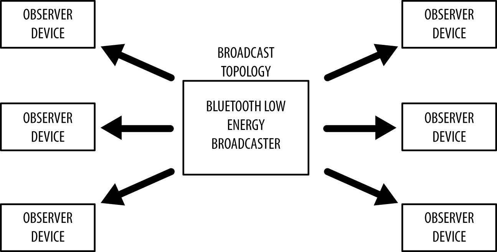

# 第一章节，介绍

低功耗蓝牙（BLE，也被推广名称为Bluetooth Smart。注：本书关于术语翻译尽可能都使用英文缩写代替）被作为蓝牙4.0核心规格书的一部分开始。很吸引人的是相对于它的老大哥——经典蓝牙，BLE是一个更灵活、高度优化的版本。但实际上，BLE有着完全不同的血统和设计目标。

在被蓝牙特殊兴趣组织（SIG）采纳之前，BLE最初是由Nokia发起设计，内部作为Wibree项目。当时作者没有尝试着为了解决各种可能的问题而计划其他的远距离无线方案。从一开始关注的就是设计一个最小功耗无线广播标准，专项优化低成本、低带宽、低功率和低复杂性。

这些设计目标通过核心规格书来看是很明显的，它尝试使BLE真正成为一个低功耗标准，成为能被硅供应商实现并且在能源和硅预算紧张下的真实世界中使用。BLE可能是第一个被广泛采纳的标准，它可以真正的宣称是可以在很长一段时间内仅靠一个小小的纽扣电池就可以持续运行，尽管其他无线技术定期也在市场宣传中声称如此。

## BLE是哪里不一样

当BLE在自己的优点上成为一个很好的技术时，是什么使BLE真正令人激动，以及是什么推动了这种如此深远和迅速的惊人接纳率？原因是BLE使用正好的技术，适当的折中，以及正确的时间。对于相对年轻的版本（从2010年被发布），BLE见证了不寻常的快速接纳率，大量包含BLE的产品出现，远远领先于其他无线技术在这个圈子出现的时间。

相比其他无线技术标准，BLE的快速成长很容易解释：BLE走的更远更快是因为它的命运已经和智能手机、平板、移动电脑的现象级爆发紧密地绑定在一起。BLE在早期并有效的被手机重量型厂商如苹果、三星采用，为BLE更广泛的使用提供了敲门砖。

苹果，特别的说，耗费了大量的努力在制造一个可信赖的BLE协议栈上，并发表了BLE相关的设计指南。此举，反过来推动了硅供应商去满足他们认为最有可能在很长一段时期内能成功或者发展的技术资源上的限制，并且苹果这个标志的认可，是一个当你需要抉择每一个研究和研发投入的一个清晰、令人信服的论证。

当手机和平板市场渐渐成熟，消费和利润逐渐减少，对于外界设备的连接的潜在需求则逐渐成长，这也给外围设备厂商一个独特的机会提供人们目前还未意识到的问题的创新解决方案。

如此多的优点集于BLE一身，对于小型、灵活的产品设计师来说这是广阔打开了一个关于特定创新型产品蓝海的潜在的巨大市场。你今天可以用每颗芯片低于2美元这样很好的价格小批量购买无线通信设备加微控制器（SOC片上系统）的多合一解决方案，这相比类似的无线技术方案如WiFi、GSM、Zigbee等总体价格还低。BLE允许你今天设计一款通过一些芯片、工具和标准轻松访问其他现代手机平台的可行产品。

也许为今天BLE的成功贡献的其中一个看不见的关键因素是，BLE是以一个可拓展的框架进行设计而交互数据。这是与专注于一系列严格的使用条件的经典蓝牙上有着根本的差别。另一方面，BLE还考虑到让那些富有想法的人和从设备中获取的大量数据无需了解一大堆底层技术，就可实现这项技术。智能手机供应商很早就深知这个提议的价值，他们就提供给手机应用开发者灵活并相对低级的API自由地用他们舒服的方式使用BLE框架。

那些和智能手机、平板对话的设备同时也提供给设备设计师另一个容易低估的优点：极其低的门槛被采纳。用户们如今已经很习惯使用手机和平板，这意味着几乎不用学习新的一套UI机制，只要我们遵守人们已经习惯使用的平台下的丰富视觉语言。

拥有一个相对容易理解的数据模型，没有破坏证书的消费，无需任何费用即可查看核心规格书，还有一个可靠的协议栈，这一切都让人很清晰的看到为什么平台设计师和手机供应商会在BLE上面看到成功。

## 规格书

在2010年六月，蓝牙SIG组织发布了BLE4.0蓝牙核心规格书。这份规格书多年来终于通过多家参与研发过程的公司对有冲突的部分和结论进行了消除和解，只剩下一小部分问题待之后的规格书更新解决。

第一个主要更新，蓝牙4.1，与2013年12月公开，是目前任何人在开发BLE产品时的主要参考手册。尽管主要基本组成要素、流程、概念原封不动，但这次公开内容仍然介绍了许多的更改和进一步改善开发者的体验。

对于所有蓝牙规格书版本，4.1是可回退兼容4.0的，以确保在已实现不同协议的设备间正确的交互操作。规格书允许开发者释放和保证产品针对任意一个版本（直到版本废弃），尽管新的规格书的公开得到市场极快的接纳，还有4.1版本标准已经标准化了设备间的许多常见交互，使得最新可用版本更受推荐。

除非有注释，本书都将使用蓝牙4.1版本规格书作为参考。当之前的4.0版本规格书没有包含一些特殊的部分时，文中无论哪里需要，何时特别提到显著的改变或者添加，我们都将明确解释。

需要取得最新被采纳的蓝牙规格书版本，请访问蓝牙SIG部门网站：[Specification Adopted Documents page](https://www.bluetooth.com/specifications/bluetooth-core-specification/).

## 构型

蓝牙规格书同时包含了经典蓝牙（已经在电子消费产品中多年司空见惯的著名的无线标准）和BLE（4.0版本中介绍的新版、高度优化的无线标准）。这两个无线通信标准互相并不兼容，并且使用4.0以及先前的版本时无法用任何方式与BLE设备进行通信。两种技术的无线传播协议、较高的协议层以及应用都是不一样、不兼容的。

### 规格书说明的支持内容

表1-1为今天市场上三个主流设备类型实现的无线协议。

| 设备                                   | BR/EDR（经典蓝牙）支持 | BLE（低功耗蓝牙）支持 |
| -------------------------------------- | ---------------------- | --------------------- |
| 4.0及先前版本                          | 是                     | 否                    |
| 4.x Single-Mode（Bluetooth Smart）     | 否                     | 是                    |
| 4.x Dual-Mode（Bluetooth Smart Ready） | 是                     | 是                    |

*表 1-1，规范书构型*

就如你看到的，蓝牙规格书（4.0及以上）定义了两种无线技术方案：

- BR/EDR（经典蓝牙）

​		此无线标准从1.0版本开始发展更新。

- BLE（低功耗蓝牙）

​		4.0版本规格书介绍的低功耗无线标准。

以下为这种构型的两种设备类型：

- Single-mode（单模）（BLE，Bluetooth Smart）设备

​		设备实现BLE功能，可以和单模、多模的设备进行通信，但仅仅不支持BR/EDR设备。

- Dual-mode（双模）（BR/EDR/LE，Bluetooth Smart Ready）设备

​		设备同时实现BR/EDR和BLE功能，可以与任何蓝牙设备进行通信。

图1-1展示了可使用的蓝牙版本及设备类型之间可能的构型。

*图1-1. 蓝牙版本和设备类型之间的构型*

越来越多BR/EDR设备也带了BLE功能进入市场，这趋势将可以展望，单模BLE传感器会越来越无所不在。那些双模设备可以将从单模BLE设备获取的数据通过GSM或者WiFi无线网络传到互联网上，这特性将随着进入市场的BLE传感器的增加而越来越普及。

## 依托于芯片数量{#test_anchor}

第二章介绍并讨论了组成蓝牙协议栈的几个协议层，目前可以将每一个蓝牙设备都划分出三大主要模块：

*应用（Application）*

​		覆盖了详细的用例的蓝牙协议栈的用户应用接口。

*主机（Host）*

​		上层蓝牙协议栈。

*控制器（Controller）*

​		底层蓝牙协议栈，包含了无线模块。

另外，规格书提供了一套在主机和控制器之间的标准的通信协议——主机控制器接口（HCI），HCI允许主机和由不同公司生产的控制器之间进行相互操作。

这几个模块层可以在一个集成电路（IC）或者芯片上实现，或者也可以分开在不同的芯片上，再通过一套通信层（UART, USB, SPI 或者其他）连接在一起。

以下是目前商用产品上最通用的构型：

SoC（片上芯片）

​		单独一颗IC上运行应用、主机和控制器。

通过HCI的双IC

​		一颗IC运行应用和主机，和第二颗运行控制器的IC通过HCI进行通信。这种方式的优点在于，因为HCI是由蓝牙规格书定义，任何主机都可以不考虑制造商，通过控制器进行连接。

通过连接设备的双IC

​		一颗IC运行应用，和第二颗同时运行主机和控制器的IC通过一个特定的协议进行通信。因为规格书并没有这种协议，应用必须接受已选择的设备厂商的特定协议。

图1-2展示了不同硬件的蓝牙协议栈构型。

图1-2. 硬件构型

简单的传感器更倾向于使用SoC构型以保证成本和印制电路板（PCB）的复杂性都降低，然而智能手机和平板通常适配通过HCI连接的双IC构型，因为已经有了一个足够强劲的CPU去运行协议栈。通过连接设备的双IC构型被用在其他场景上，其中之一大概就是配备蓝牙连接的定制化微处理器，从而无需大改整体设计的的手表。

## 关键限制

就像开发中遇到的所有事情一样，好的设计几乎都是关于正确的权衡，BLE也是如此。BLE没有尝试去成为每一个无线数据传输所需要的解决方案，经典蓝牙、WiFi、NFC和其他无线技术在它们独有的权衡和决定下的设计，显然会有他们的一份之地。

为了帮助理解什么是BLE（以及不是），识别其关键限制（蓝牙4.0及以上版本规格书中的定义）和这些限制在生活中的产品的体现是很有用的。

### 数据吞吐量

BLE无线通信的调制率由规格书定义为恒量1Mbps。这是理论上BLE可以达到的数据吞吐量的上限，但在实际中，这个上限还会因为各种因素而明显的降低，包括并不局限于双向通信量、协议开销、CPU和无线通信设备的限制，以及人工软件的限制。

为了举例说明这些在实际中的限制，我们将事先准备以下环境用于接下来的计算。

- 中心（主）设备已经初始化并与外围（从）设备建立了连接。
- 当在一个处于活动的连接内，规格书定义了两个连续连接事件的连接时间间隔（在回到闲置状态以省电的数据交换），这个间隔时间规定为7.5ms到4s之间。

本书将在后边的[“连接层”](#test_anchor)和[“角色”](#roles)部分详细讨论了在连接中不同的角色。对目前样例，我们将使用市场上被大量BLE配件使用的一颗BLE的IC：nRF51822——由Nordic半导体厂商制造的被广泛使用的SoC（片上系统）。Nordic的无线硬件模块和BLE协议栈使得下列数据的吞吐量得到限制。

- nRF51822可以传输的上限为每一个连接时间间隔6个数据包（由IC所限制）。
- 每个流出的数据包可以承载至20字节的用户数据（由规格书所定义，除非数据包大小被协商增大）。

假设最短的连接时间间隔（主机和从机交互数据包的频率，在后文["连接"](# Connections)中描述）为7.5ms，这将产生最大每秒133个连接事件（单独一个数据包在端对端之间进行交换），以及每个连接事件120字节的数据（6数据包 * 20用户数据/一个数据包）。nRF51822在持续不断的在最大数据传输率下，将有以下现实生活中的计算：

*133 连接事件/秒 * 120字节 = 15960字节/秒（或者~0.125兆比特/秒）*

这个显然已经比理论上BLE的最大值低，但是你正在推送数据的端设备（尤其是一些智能设备如智能手机和平板）会有更多的限制。

你的智能手机或平板可能也忙着和其他设备进行交流，集成BLE栈的厂商不可避免也有他们自己的局限，这意味着主设备也可能无法实际地在最大数据传输率下处理数据。更因为许多其他的原因，实际上的连接时间间隔可能更久，或者相比和你最初计划的更不规律。

因此实际上，一个典型最佳环境应该是假定在双端的局限下，一个可能的相邻最大数据吞吐量为每秒5-10KB。这数据应该会给你一个概念——关于使用BLE在推送数据到你的手机或者平板上各种的可行和不可行，并解释了为什么其他技术如WiFi和经典蓝牙还始终在世界上有着一席之位。

> ### 向着空闲而去
>
> 在如今各种事物变得越来越快，10KB/s似乎显得缓慢而做不了什么，但这个却突出了BLE的一个最主要的设计目标：低功耗！尽管使用相对如此适度的数据传输率，10KB/s仍然将迅速耗尽一块小小的硬币大小的电池电量，接着蓝牙SIG组织做了一个清晰、明确的努力：目前为止请不要再去设计任何其他的一般的无线协议，并打上*低功耗*的标签来侮辱它。相反，他们希望设计这个协议低功耗的可能性，用每一种可能的方法去优化而达到目标。最简单避免损耗珍贵电池能源的方法就是将无线通信模块尽可能经常、持久地关闭，而且这个方法已经通过使用一定速率（由连接时间间隔决定）下短暂而爆炸性的数据包（在一个连接事件中）实现。其他时间，无线通信模块都将仅仅关闭电源。
>
> 这意味着低量的数据很短暂的传输，而连接时间间隔可以尽可能的远以节省电池续航。用户可选的7.5ms-4s，这一连接时间间隔范围给产品设计者提供了一个足够宽的空间，在响应性（一个短暂的连接间隔时间）和续航时间（一个长久的连接间隔时间）之间做一个正确的权衡，而不是在BLE勉强的设计目标之下迷失自我。

### 操作距离

任何无线设备的实际距离都依赖于一系列因素（操作环境、天线设计、外壳、设备方向等），BLE则毫不吃惊专注于短距离通信。

传输功率（通常用dBm来估量）通常在一个特定的距离下是可配置的（通常在-30 ~ 0dBm之间），但对于更高的传输功率（更好的距离），电池上需要更大的要求，这也将减小电池单元的使用寿命。

创建并配置一个可以传输30米或者更远视距的BLE设备进行可靠的传输是可能的，但对于一个几乎近到2-5米的特有的操作距离，并且还要明确的在减少距离和节省电量上做努力而不管传输距离的协议，成为了终端用户的一个讨厌的东西。

## 网络拓扑结构

BLE设备可以与外界进行通信的两个方法：*广播(broadcasting)*或者*连接(connections)*。每一个机制都有它的优点和局限，并且都服从于通用访问配置文件（GAP）的准则，这一点[第三章](#chapter3)将详细说明。

### 广播（broadcasting）和观察（observing）

使用无连接的广播，你可以发送数据给任何其他扫描的设备或者处在监听范围内的接收器（receiver）。正如图1-3描述，这个机制本质上允许你 *单向的* 向其他人或者其他可以收集数据的事物进行推送数据。

*图1-3. 广播拓扑结构*

广播定义了两个分开的角色：

*广播员（broadcaster）*

​		周期性发送不可连接的广播（advertising）数据给那些愿意收到的设备。

*观察员（observer）*

​		重复性地扫描预置的频段，以接收当前正在广播的不可连接的广播（advertising）数据包。