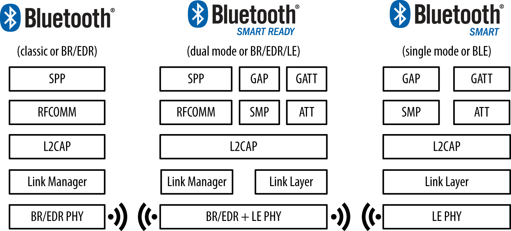
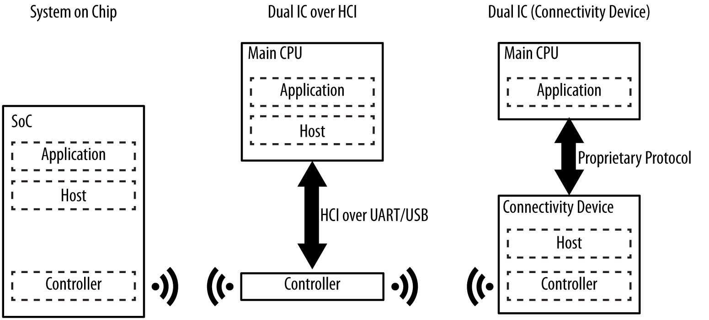
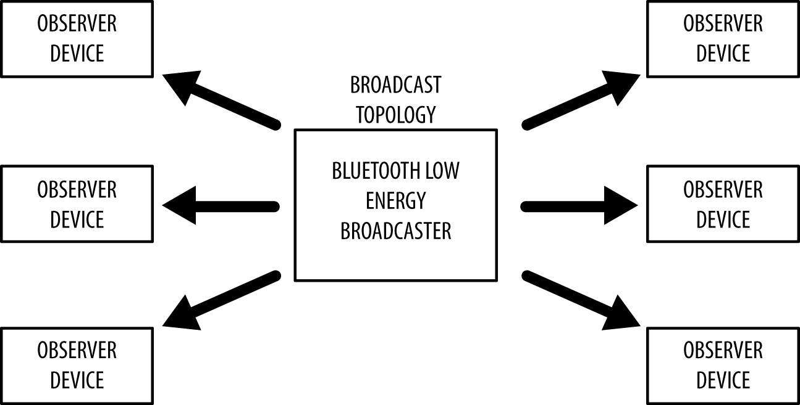
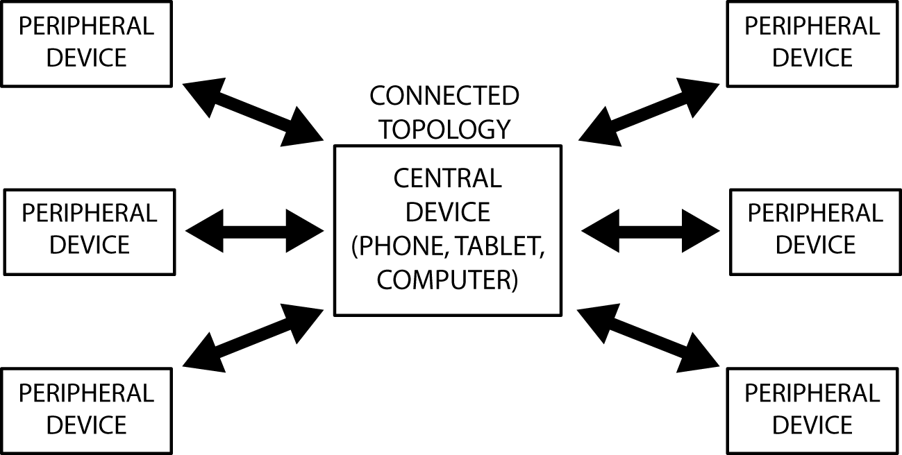
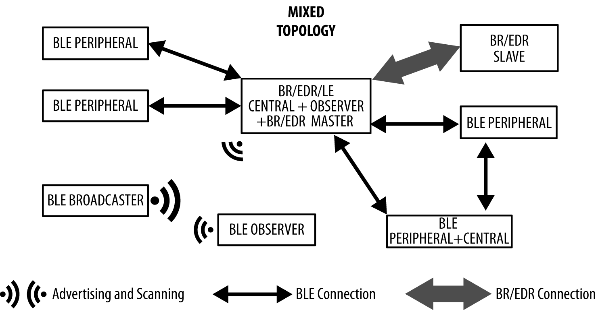

# 第一章节，介绍

低功耗蓝牙（Bluetooth Low Energy，BLE，也被推广名称为Bluetooth Smart。注：本书关于术语翻译尽可能都使用英文缩写代替）被作为蓝牙4.0核心规格书的一部分开始。相对于它的老大哥——经典蓝牙，很吸引人的是BLE是一个更灵活、高度优化的版本。但实际上，BLE有着完全不同的血统和设计目标。

在被蓝牙特殊兴趣组织（SIG）采纳之前，BLE最初是由Nokia发起设计，内部作为Wibree项目。当时作者没有尝试着为了解决各种可能的问题而计划其他的远距离无线方案。从一开始关注的就是设计一个最小功耗无线广播标准，专项优化低成本、低带宽、低功率和低复杂性。

这些设计目标通过核心规格书来看是很明显的，它尝试使BLE真正成为一个低功耗标准，成为能被硅供应商实现并且在能源和硅预算紧张下的真实世界中使用。BLE可能是第一个被广泛采纳的标准，它可以真正的宣称是可以在很长一段时间内仅靠一个小小的纽扣电池就可以持续运行，尽管其他无线技术定期也在市场宣传中声称如此。

## BLE是哪里不一样

当BLE在自己的优点上成为一个很好的技术时，是什么使BLE真正令人激动，以及是什么推动了这种如此深远和迅速的惊人接纳率？原因是BLE使用正好的技术，适当的折中，以及正确的时间。对于相对年轻的版本（从2010年被发布），BLE见证了不寻常的快速接纳率，大量包含BLE的产品出现，远远领先于其他无线技术在这个圈子出现的时间。

相比其他无线技术标准，BLE的快速成长很容易解释：BLE走的更远更快是因为它的命运已经和智能手机、平板、移动电脑的现象级爆发紧密地绑定在一起。BLE在早期并有效的被手机重量型厂商如苹果、三星采用，为BLE更广泛的使用提供了敲门砖。

苹果，特别的说，耗费了大量的努力在制造一个可信赖的BLE协议栈上，并发表了BLE相关的设计指南。此举，反过来推动了硅供应商去满足他们认为最有可能在很长一段时期内能成功或者发展的技术资源上的限制，并且苹果这个标志的认可，是一个当你需要抉择每一个研究和研发投入的一个清晰、令人信服的论证。

当手机和平板市场渐渐成熟，消费和利润逐渐减少，对于外界设备的连接的潜在需求则逐渐成长，这也给外围设备厂商一个独特的机会提供人们目前还未意识到的问题的创新解决方案。

如此多的优点集于BLE一身，对于小型、灵活的产品设计师来说这是广阔打开了一个关于特定创新型产品蓝海的潜在的巨大市场。你今天可以用每颗芯片低于2美元这样很好的价格小批量购买无线通信设备加微控制器（SOC片上系统）的多合一解决方案，这相比类似的无线技术方案如WiFi、GSM、Zigbee等总体价格还低。BLE允许你今天设计一款通过一些芯片、工具和标准轻松访问其他现代手机平台的可行产品。

也许为今天BLE的成功贡献的其中一个看不见的关键因素是，BLE是以一个可拓展的框架进行设计而交互数据。这是与专注于一系列严格的使用条件的经典蓝牙上有着根本的差别。另一方面，BLE还考虑到让那些富有想法的人和从设备中获取的大量数据无需了解一大堆底层技术，就可实现这项技术。智能手机供应商很早就深知这个提议的价值，他们就提供给手机应用开发者灵活并相对低级的API自由地用他们舒服的方式使用BLE框架。

那些和智能手机、平板对话的设备同时也提供给设备设计师另一个容易低估的优点：极其低的门槛被采纳。用户们如今已经很习惯使用手机和平板，这意味着几乎不用学习新的一套UI机制，只要我们遵守人们已经习惯使用的平台下的丰富视觉语言。

拥有一个相对容易理解的数据模型，没有破坏证书的消费，无需任何费用即可查看核心规格书，还有一个可靠的协议栈，这一切都让人很清晰的看到为什么平台设计师和手机供应商会在BLE上面看到成功。

## 规格书

在2010年六月，蓝牙SIG组织发布了BLE4.0蓝牙核心规格书。这份规格书多年来终于通过多家参与研发过程的公司对有冲突的部分和结论进行了消除和解，只剩下一小部分问题待之后的规格书更新解决。

第一个主要更新，蓝牙4.1，与2013年12月公开，是目前任何人在开发BLE产品时的主要参考手册。尽管主要基本组成要素、流程、概念原封不动，但这次公开内容仍然介绍了许多的更改和进一步改善开发者的体验。

对于所有蓝牙规格书版本，4.1是可回退兼容4.0的，以确保在已实现不同协议的设备间正确的交互操作。规格书允许开发者释放和保证产品针对任意一个版本（直到版本废弃），尽管新的规格书的公开得到市场极快的接纳，还有4.1版本标准已经标准化了设备间的许多常见交互，使得最新可用版本更受推荐。

除非有注释，本书都将使用蓝牙4.1版本规格书作为参考。当之前的4.0版本规格书没有包含一些特殊的部分时，文中无论哪里需要，何时特别提到显著的改变或者添加，我们都将明确解释。

需要取得最新被采纳的蓝牙规格书版本，请访问蓝牙SIG部门网站：[Specification Adopted Documents page](https://www.bluetooth.com/specifications/bluetooth-core-specification/).

## 构型

蓝牙规格书同时包含了经典蓝牙（已经在电子消费产品中多年司空见惯的著名的无线标准）和BLE（4.0版本中介绍的新版、高度优化的无线标准）。这两个无线通信标准互相并不兼容，并且使用4.0以及先前的版本时无法用任何方式与BLE设备进行通信。两种技术的无线传播协议、较高的协议层以及应用都是不一样、不兼容的。

### 规格书说明的支持内容

表1-1为今天市场上三个主流设备类型实现的无线协议。

| 设备                                   | BR/EDR（经典蓝牙）支持 | BLE（低功耗蓝牙）支持 |
| -------------------------------------- | ---------------------- | --------------------- |
| 4.0及先前版本                          | 是                     | 否                    |
| 4.x Single-Mode（Bluetooth Smart）     | 否                     | 是                    |
| 4.x Dual-Mode（Bluetooth Smart Ready） | 是                     | 是                    |

*表 1-1，规范书构型*

就如你看到的，蓝牙规格书（4.0及以上）定义了两种无线技术方案：

- BR/EDR（经典蓝牙）

​		此无线标准从1.0版本开始发展更新。

- BLE（低功耗蓝牙）

​		4.0版本规格书介绍的低功耗无线标准。

以下为这种构型的两种设备类型：

- Single-mode（单模）（BLE，Bluetooth Smart）设备

​		设备实现BLE功能，可以和单模、多模的设备进行通信，但仅仅不支持BR/EDR设备。

- Dual-mode（双模）（BR/EDR/LE，Bluetooth Smart Ready）设备

​		设备同时实现BR/EDR和BLE功能，可以与任何蓝牙设备进行通信。

图1-1展示了可使用的蓝牙版本及设备类型之间可能的构型。

*图1-1. 蓝牙版本和设备类型之间的构型*

越来越多BR/EDR设备进入市场，也包括BLE，并且可以展望的趋势是，单模BLE传感器会越来越无所不在。那些双模设备可以将从单模BLE设备获取的数据通过GSM或者WiFi无线网络传到互联网上，这特性将随着进入市场的BLE传感器的增加而越来越普及。

## 依托于芯片数量

第二章介绍并讨论了组成蓝牙协议栈的几个协议层，目前可以将每一个蓝牙设备都划分出三大主要模块：

*应用（Application）*

​		覆盖了特别的用例的蓝牙协议栈与用户应用的接口。

*主机（Host）*

​		上层蓝牙协议栈。

*控制器（Controller）*

​		底层蓝牙协议栈，包含了无线模块。

另外，规格书提供了一套在主机和控制器之间的标准的通信协议——主机控制器接口（HCI），HCI允许主机和由不同公司生产的控制器之间进行相互操作。

这几个模块层可以在一个集成电路（IC）或者芯片上实现，或者也可以分开在不同的芯片上，再通过一套通信层（UART, USB, SPI 或者其他）连接在一起。

以下是目前商用产品上最通用的构型：

SoC（片上芯片）

​		单独一颗IC上运行应用、主机和控制器。

通过HCI的双IC

​		一颗IC运行应用和主机，和第二颗运行控制器的IC通过HCI进行通信。这种方式的优点在于，因为HCI是由蓝牙规格书定义，任何主机都可以不考虑制造商，通过控制器进行连接。

通过连接设备的双IC

​		一颗IC运行应用，和第二颗同时运行主机和控制器的IC通过一个特定的协议进行通信。因为规格书并没有这种协议，应用必须接受已选择的设备厂商的特定协议。

图1-2展示了不同硬件的蓝牙协议栈构型。

*图1-2. 硬件构型*

简单的传感器更倾向于使用SoC构型以保证成本和印制电路板（PCB）的复杂性都降低，然而智能手机和平板通常适配通过HCI连接的双IC构型，因为已经有了一个足够强劲的CPU去运行协议栈。通过连接设备的双IC构型则被用在其他场景上，场景其中之一大概就是配备蓝牙连接的定制化微处理器从而无需大改整体设计的手表。

## 关键限制

就像开发中遇到的所有事情一样，好的设计几乎都是关于正确的权衡，BLE也是如此。BLE没有尝试去成为每一个无线数据传输所需要的解决方案，经典蓝牙、WiFi、NFC和其他无线技术在它们独有的权衡和决定下的设计，显然会有他们的一份之地。

为了帮助理解什么是BLE（以及不是），识别其关键限制（蓝牙4.0及以上版本规格书中的定义）和这些限制在生活中的产品的体现是很有用的。

### 数据吞吐量

BLE无线通信的调制率由规格书定义为恒量1Mbps。这是理论上BLE可以达到的数据吞吐量的上限，但在实际中，这个上限还会因为各种因素而明显的降低，包括并不局限于双向通信量、协议开销、CPU和无线通信设备的限制，以及人工软件的限制。

为了举例说明这些在实际中的限制，我们将事先准备以下环境用于接下来的计算。

- 中心（主）设备已经初始化并与外围（从）设备建立了连接。
- 当在一个处于活动的连接内，规格书定义了两个连续连接事件的连接时间间隔（在回到闲置状态以省电的数据交换），这个间隔时间规定为7.5ms到4s之间。

本书将在后边的[链路层](./chapter2.md#链路层)和[角色](./chapter3.md#角色)部分详细讨论了在连接中不同的角色。对目前样例，我们将使用市场上被大量BLE配件使用的一颗BLE的IC：nRF51822——由Nordic半导体厂商制造的被广泛使用的SoC（片上系统）。Nordic的无线硬件模块和BLE协议栈使得下列数据的吞吐量得到限制。

- nRF51822可以传输的上限为每一个连接时间间隔6个数据包（由IC所限制）。
- 每个流出的数据包可以承载至20字节的用户数据（由规格书所定义，除非数据包大小被协商增大）。

假设最短的连接时间间隔（主机和从机交互数据包的频率，在后文[连接](./chapter2.md#连接)中描述）为7.5ms，这将产生最大每秒133个连接事件（单独一个数据包在端对端之间进行交换），以及每个连接事件120字节的数据（6数据包 * 20用户数据/一个数据包）。nRF51822在持续不断的在最大数据传输率下，将有以下现实生活中的计算：

*133 连接事件/秒 * 120字节 = 15960字节/秒（或者~0.125兆比特/秒）*

这个显然已经比理论上BLE的最大值低，但是你正在推送数据的端设备（尤其是一些智能设备如智能手机和平板）会有更多的限制。

你的智能手机或平板可能也忙着和其他设备进行交流，集成BLE栈的厂商不可避免也有他们自己的局限，这意味着主设备也可能无法实际地在最大数据传输率下处理数据。更因为许多其他的原因，实际上的连接时间间隔可能更久，或者相比和你最初计划的更不规律。

因此实际上，一个典型最佳环境应该是假定在双端的局限下，一个可能的相邻最大数据吞吐量为每秒5-10KB。这数据应该会给你一个概念——关于使用BLE在推送数据到你的手机或者平板上各种的可行和不可行，并解释了为什么其他技术如WiFi和经典蓝牙还始终在世界上有着一席之位。

> ### 向着空闲而去
>
> 在如今各种事物变得越来越快，10KB/s似乎显得缓慢而做不了什么，但这个却突出了BLE的一个最主要的设计目标：低功耗！尽管使用相对如此适度的数据传输率，10KB/s仍然将迅速耗尽一块小小的硬币大小的电池电量，接着蓝牙SIG组织做了一个清晰、明确的努力：目前为止请不要再去设计任何其他的一般的无线协议，并打上*低功耗*的标签来侮辱它。相反，他们希望设计这个协议低功耗的可能性，用每一种可能的方法去优化而达到目标。最简单避免损耗珍贵电池能源的方法就是将无线通信模块尽可能经常、持久地关闭，而且这个方法已经通过使用一定速率（由连接时间间隔决定）下短暂而爆炸性的数据包（在一个连接事件中）实现。其他时间，无线通信模块都将仅仅关闭电源。
>
> 这意味着低量的数据很短暂的传输，而连接时间间隔可以尽可能的远以节省电池续航。用户可选的7.5ms-4s，这一连接时间间隔范围给产品设计者提供了一个足够宽的空间，在响应性（一个短暂的连接间隔时间）和续航时间（一个长久的连接间隔时间）之间做一个正确的权衡，而不是在BLE勉强的设计目标之下迷失自我。

### 操作距离

任何无线设备的实际距离都依赖于一系列因素（操作环境、天线设计、外壳、设备方向等），BLE则毫不吃惊专注于短距离通信。

传输功率（通常用dBm来估量）通常在一个特定的距离下是可配置的（通常在-30 ~ 0dBm之间），但对于更高的传输功率（更好的距离），电池上需要更大的要求，这也将减小电池单元的使用寿命。

创建并配置一个可以传输30米或者更远视距的BLE设备进行可靠的传输是可能的，但对于一个几乎近到2-5米的特有的操作距离，并且还要明确的在减少距离和节省电量上做努力而不管传输距离的协议，成为了终端用户的一个讨厌的东西。

## 网络拓扑结构

BLE设备可以与外界进行通信的两个方法：*广播(broadcasting)*或者*连接(connections)*。每一个机制都有它的优点和局限，并且都服从于通用访问配置文件（GAP）的准则，这一点[第三章](./chapter3.md)将详细说明。

### 广播（broadcasting）和观察（observing）

使用无连接的广播，你可以发送数据给任何其他扫描的设备或者处在监听范围内的接收器（receiver）。正如图1-3描述，这个机制本质上允许你 *单向的* 向其他人或者其他可以收集数据的事物进行推送数据。

*图1-3. 广播拓扑结构*

广播定义了两个分开的角色：

*广播者（broadcaster）*

​		周期性发送不可连接的广播（advertising）数据给那些愿意收到的设备。

*观察者（observer）*

​		重复性地扫描预置的频段，以接收当前正在广播的不可连接的广播（advertising）数据包。

广播对于理解BLE是非常重要的，因为这是让一个设备在同一时间传送数据给多端设备的唯一的方法。你将数据广播出去正是利用了BLE的广播特征的优点，更多内容请参考第二章[广播和扫描](./chapter2.md#广播和扫描)和第三章[广播和观察](./chapter3.md#广播和观察)。

标准的广播包包含了一个31字节的负载（payload），用于承载描述了广播发送者信息和能力的数据，而且还可以包含任何你想给其他设备广播的定制信息。如果这个标准的31字节负载数据不足以容纳需要传送的数据，BLE还可以支持可选择的第二个广播负载（称之为 *扫描回应（Scan Response）*），这可以允许设备发现一个广播中的设备并用另外的31字节的负载请求第二个广播帧（advertising frame），总共达到62字节。

广播的使用快捷、简单，当你需要按照一个固定流程推送很小量的数据或者给多个设备，这是一个很好的选择。[第九章](./chapter9.md)提供了一个实际的案例，关于BLE通过iBeacon的无连接广播。

广播的一个主要局限在于，与通常的连接相比较，广播压根儿就没有安全和隐私条款（任何观察设备（observer device）都可以接收广播中的数据），因此这可能不适用于那些敏感数据。

### 连接（Connections）

如果你需要同时双向传输数据，或者如果你有这两个广播负载所不能容纳的更多的数据，你需要使用 *连接（connection）*。一个 *连接* 是永久的，在 *两* 个设备之间定期地交换数据。因此这是固有带隐私的（数据在一个连接中通过仅有的 *两* 端之间被收发而没有其余设备，除非其余设备不加选择任意地嗅探（sniffing））。后文的[连接](./chapter2.md#连接)部分提供了更多关于在低电平下的连接的信息，后文的[角色](./chapter3.md#角色)部分讨论了相应的GAP角色。

连接包含了两种角色：

*中心设备Central（主机master）*

​		重复性地扫描预置的频段，以寻找可连接的广播（advertising）数据包，当寻找到匹配的广播包，初始化并启动连接。一旦连接建立，中心设备将控制时钟（timing）并启动定期的数据交换。

*外围设备Peripheral（从机slave）*

​		设备定期发送可链接的广播数据包，并接受到来的连接。一旦进入了活动的连接中，外围设备就将遵循中心设备的时钟并规则地交换数据。

为了启动并初始化连接，中心设备从外围设备获得可连接的广播数据包，并给外围设备发送一个在两个设备间建立专属连接的请求。一旦连接建立，外围设备将停止广播，两个设备即可开始双向交换数据，请参见图1-4.

*图1-4. 连接拓扑结构*

因此 *连接* 无非是两个参与其中的端设备在一个确定的特殊点上同一时间（连接事件connection events）定期的交换数据。有一点很重要，就是虽然中心设备控制连接建立，但是数据可以在每一个连接事件中独立发送给任一设备，并且这些角色（roles）并没有在数据吞吐量和优先级上强加限制。

初学蓝牙4.1版本的规格书，任何关于角色结合的限制都被去除，并且以下细则都是可能的：

- 一个设备可以同时当作中心设备和外围设备。
- 一个中心设备可以连接许多外围设备。
- 一个外围设备可以连接许多中心设备。

先前的规格书版本限制了外围设备只能和单一中心设备连接（虽然反之不然）以及限制了角色结合。

*连接* 最大的优势在于有能力在每一个领域或属性上，通过使用附加协议层，更准确的说是通用属性配置文件（GATT），用更精细的控制来组织数据。数据是被一些被称为 *服务（services）* 和 *特征（characteristics）* 的单元模块组织的（这部分在[第四章](./chapter4.md)中进行详细讨论）。

主要一件需要记住的事就是，你可以有许多服务和特征，通过组织而放在有意义的结构中。服务可以包含许多特征，每一个都有自己的访问权限和描述性元数据（metadata）。附带的优点还包括更高的吞吐量、能够建立安全加密的连接链路、协商用于填充数据模型的连接参数。

*连接* 允许一个更丰富、多层的数据模型。他们还有可能比广播使用更少的能耗，因为可以延长连接事件相隔的时间，或者当新的值可以获取到的时候，才去推送大量的数据，而不是在连续不断在特定的速度下发送完整的负载广播不管知不知道谁在倾听（listen）或多频繁。不仅如此，实际上双端设备都知道当连接事件在未来将可以允许无线通信模块长时间关闭，从而相比广播更可能节省功耗。

最后，这些拓扑结构都可以被自由地在BLE网络中混合，就如图1-5展示那样。一个BR/EDR/LE设备可以一起桥接BLE和BR/EDR的连接，网络中这组合和参与者的数字仅仅是由每一个参与的设备的无线通信模块和协议栈所限制。

*图1-5. 混合拓扑结构*

更多先进的双模、单模设备正在开始出现，设备将能够同时组合多种角色。这允许他们在同一时间参与多种连接，同时也可以使用广播发送数据。

## 协议与配置文件

从蓝牙的起初开始，规格书就清晰地将协议（protocols）和配置文件（profiles）的明显的概念给区分开来。

*协议*

​		这是蓝牙规格书里被所有设备一致使用的基本组成要素，协议作为各种层实现了不同数据包的格式（formats）、路径（routing）、多路传输（multiplexing）、编码（encoding）和解码（decoding），这使得数据可以高效的在端设备间进行传输。

*配置文件*

​		功能性的“垂直切片（vertical slices）”覆盖了要么所有设备（GAP，GATT）所需要的操作基本模式，要么特殊的使用条例（[临近感应配置文件Proximity Profile](https://docs.microsoft.com/zh-cn/windows-hardware/drivers/bluetooth/bluetooth-proximity-profile)， 葡萄糖谱Glucose Profile），配置文件基本定义了协议应该如何使用去获取特别的目标，无论是通用的还是特定的。

[第二章](./chapter2.md)详细地涵盖了协议，但接下来的部分将快速的介绍配置文件以及对于应用开发者而言他们的意义是什么。

### 通用配置文件

规格书中定义了通用配置文件（Generic Profiles），这对于理解GAP和GATT，这两者对于保证不同厂商的BLE设备之间相互操作性是如何根本的内容。

*通用访问配置文件Generic Access Profile(GAP)*

​		这包含了底层无线通信模块（radio）的使用模型，为了定义允许设备进行广播、发现设备、建立连接、管理连接和安全级别协商这一系列功能而产生的角色（roles）、流程（procedures）和模式（modes）。GAP本质为BLE最顶端的控制层。

*通用属性配置文件Generic Attribute Profile(GATT)*

​		为了处理BLE中的数据交换，GATT定义了一个基本数据模型和流程，允许设备进行发现、读写和在设备间推送数据元素。GATT本质为BLE最顶端的数据层。

GAP（更多详尽讨论请见[第三章](./chapter3.md)）和GATT（更多详尽讨论请见[第四章](./chapter4.md)）对于BLE来说都是非常根本的内容，这两者经常被用作为应用编程接口（API）的基础，以作为与协议栈交互的应用入口。

### 特定用例的配置文件

该部分和文中其他地方的特定用例的配置文件（Use-Case-Specific Profiles）局限于GATT基础的配置文件。这意味着所有的这种配置文件使用的流程和GATT的操作模型，都可以为各种拓展作为构件块。

在写此书的这时候还没有非GATT的配置文件存在，但4.1版本中的L2CAP有向连接方式（L2CAP connection-oriented channels）可能意味着无GATT的配置文件（GATT-less profiles）将开始在不久后出现。

#### SIG组织定义的GATT基础配置文件

蓝牙SIG组织为了BLE网络中的设备的顶层控制和数据层，超前地提出了一个可靠的参考框架。就像USB规格书一样，它也提供了一系列基于GATT的用例的配置文件（GATT-based profiles）的预定义，完全包含了需要实现广泛的特殊用例的所有流程和数据格式，包含以下内容：

*寻找我配置文件（Find Me Profile）*

​		允许设备去物理地定位其他设备（使用密钥环（keyring）去寻找手机，反之亦然）。

*临近感应配置文件（Proximity Profile）*

​		检测附近出现或者不在的设备（当正在离开房间时，如果物品被遗忘则会发出哔哔的声音）。

*使用GATT配置文件的HID（HID over GATT Profile）*

​		将HID数据通过BLE进行传送（键盘、鼠标、遥控器）。

*葡萄糖配置文件（Glucose Profile）*

​		通过BLE安全地传送葡萄糖含量。

*健康温度计配置文件（Health Thermometer Profile）*

​		通过BLE传送读取到的身体温度。

*单车速度和节奏配置文件（Cycling Speed and Cadence Profile）*

​		允许单车上的传感器给智能手机或平板传送速度和节奏数据。

SIG组织认可的全部配置文件名单可以在蓝牙SIG规格文档页看到。另外，你还可以直接在蓝牙开发者门户浏览蓝牙服务（services）和特征（characteristics），还有更明确的当前被采纳的服务（services）列表。

#### 厂商定义的配置文件

蓝牙规格书也允许厂商根据一些没有被SIG组织定义的配置文件所覆盖的用例来定义他们自己的配置文件。这些配置文件可以使两端设备在这个特殊的使用场景下保持隐私（比如，健康配件和智能手机应用），或者厂商可以发表这些配置文件，这样第三方就可以根据厂商提供的规格书去实现该配置文件。

近来的一些例子包括苹果公司的iBeacon（详细请参阅第九章[iBeacon](./chapter9.md#iBeacon)）和苹果公司的通知中心服务（Apple Notification Center Service）（请参阅第九章[带外部显示的苹果通知中心服务](./chapter9.md#带外部显示的苹果通知中心服务)）。