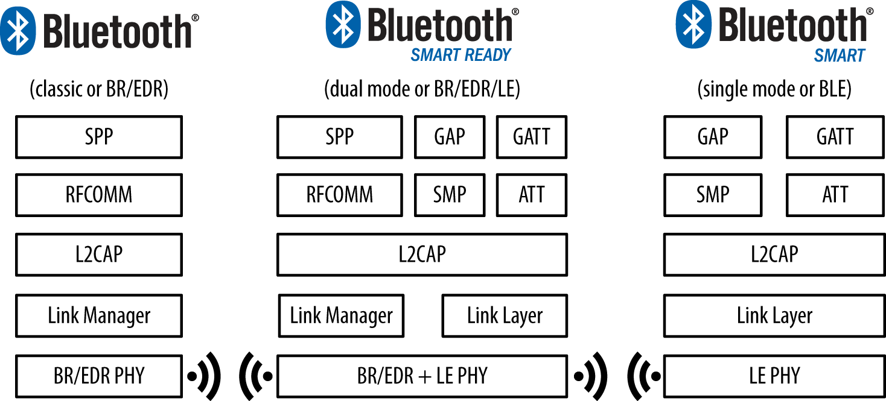
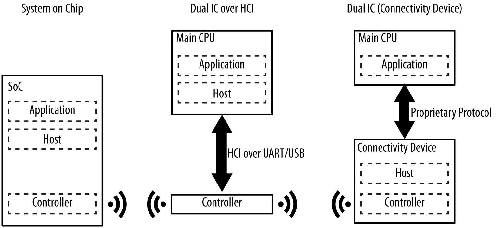
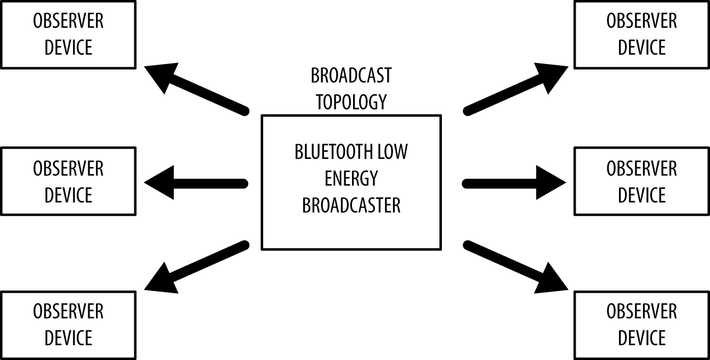
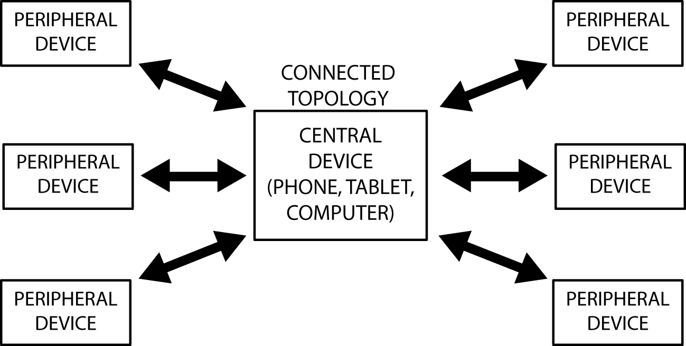
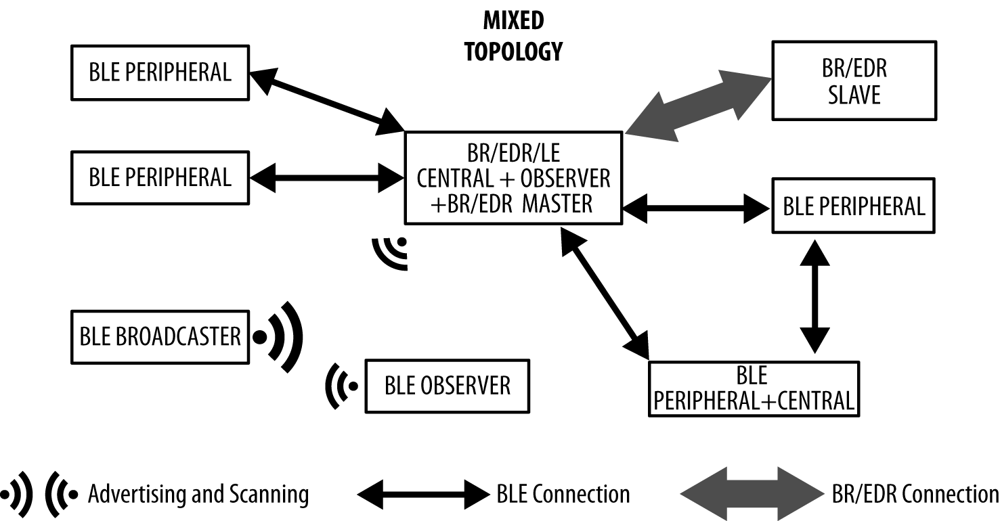

# 第一章 介绍

低功耗蓝牙（Bluetooth Low Energy，BLE，市场推广名称为 Bluetooth Smart。注：本书在术语使用上，为兼顾准确性与行业习惯，部分词汇将保留英文缩写）最初是作为蓝牙 4.0 核心规范的一部分而推出的。人们很容易把 BLE 描述成其老大哥——经典蓝牙（Classic Bluetooth）的一个更小、高度优化的版本。但实际上，BLE 有着完全不同的设计渊源和设计目标。

BLE 最初由诺基亚（Nokia）设计，内部代号为 Wibree，后来才被蓝牙技术联盟（Bluetooth SIG）采纳。当时，设计者们并没有试图提出另一个试图解决所有问题的宽泛无线方案。从一开始，他们的重心就是设计一个功耗尽可能低的无线标准，专门针对低成本、低带宽、低功耗和低复杂性进行了优化。

这些设计目标在核心规范中体现得淋漓尽致。BLE 致力于成为一个真正的低功耗标准，专为芯片厂商在实际应用中实现而设计，能够在严苛的能耗和芯片面积预算下运行。它可能是第一个被广泛采用的、真正可以宣称仅靠一颗普通的纽扣电池就能运行很长时间的无线标准，尽管许多其他无线技术在营销中也经常这样宣传。

## BLE 有何不同

就其本身而言，BLE 已经是一项很好的技术，但真正让它令人兴奋——并推动其以如此惊人的速度被广泛采用——的原因是：它在正确的时间，以恰当的取舍，成为了正确的技术。作为一个相对年轻的标准（2010 年推出），BLE 见证了非同寻常的快速普及率。大量包含 BLE 的产品设计涌现，使其在发布周期的同一时间点上，远远领先于其他无线技术。

与其他无线标准相比，BLE 的快速增长很容易解释：BLE 之所以发展得更快更远，是因为它的命运与智能手机、平板电脑和移动计算设备的爆发式增长紧密相连。苹果和三星等移动行业巨头早期积极采用 BLE，为 BLE 的更广泛实施打开了大门。

尤其是苹果，投入了大量精力来打造可靠的 BLE 协议栈，并发布了 BLE 相关的设计指南。这反过来促使芯片厂商将有限的资源投入到这项他们认为最有可能长期成功或繁荣的技术上。当你需要为每一笔研发投资辩护时，苹果的背书显然是一个令人信服的理由。

随着手机和平板市场日益成熟，成本和利润空间逐渐缩小，这些设备与外部世界连接的需求却拥有巨大的增长潜力。这也为外围设备厂商提供了一个独特的机会，去提供创新的解决方案，解决人们甚至尚未意识到的问题。

如此多的优势汇聚于 BLE，为小型、灵活的产品设计师打开了通往潜在巨大市场的大门，让他们能够以相对适中的设计预算，推出针对特定任务的、富有创意和创新的产品。如今，你可以以每颗芯片低于 2 美元的价格小批量购买到集成了射频和微控制器的多合一解决方案（SoC，片上系统），这远低于 WiFi、GSM、Zigbee 等类似无线技术的总体价格点。BLE 让你能够利用易于获取的芯片、工具和标准，设计出能够与任何现代移动平台通信的可行产品。

也许促成 BLE 成功的一个不那么显而易见的关键因素是，它被设计为一个用于数据交换的可扩展框架。这是与经典蓝牙的根本区别，后者专注于一组固定的用例。而 BLE 的构思初衷是，让任何有想法、有配件数据点的人都能实现他们的创意，而无需了解大量的底层技术。智能手机厂商很早就认识到了这一主张的价值，因此提供了灵活且相对底层的 API，让移动应用开发者可以自由地以任何他们认为合适的方式使用 BLE 框架。

能够与智能手机或平板通信的设备，为产品设计师提供了另一个容易被低估的优势：它们的用户接受门槛极低。用户已经习惯了使用手中的手机或平板，这意味着只要我们尊重用户在平台上已经习惯的丰富视觉语言，他们学习新 UI 的负担就非常有限。

拥有相对易懂的数据模型、没有强制性的授权费用、无需付费即可获取核心规范，以及精简的整体协议栈，平台设计师和移动厂商为何看好 BLE，原因已经不言而喻。

## 规范

2010 年 6 月，蓝牙 SIG 在蓝牙 4.0 核心规范中引入了低功耗蓝牙（BLE）。该规范历经数年制定，参与开发的公司最终解决了大部分有争议的章节和决策，仅剩少量问题留待后续规范更新处理。

第一次重大更新是蓝牙 4.1，于 2013 年 12 月发布，是目前开发 BLE 产品的主要参考依据。尽管基本构建块、流程和概念保持不变，但此次更新也引入了多项变更和改进，以提升用户体验。

与所有蓝牙规范一样，4.1 向后兼容 4.0，确保了实现不同规范版本的设备之间的正确互操作性。规范允许开发者根据任一版本发布和认证产品（直到该版本被废弃），尽管新规范的快速普及以及 4.1 版本标准化了设备间的许多常见实践，使得建议以最新可用版本为目标。

除非另有说明，本书均以蓝牙 4.1 规范为参考。在必要时，特别是提到值得注意的变更或新增内容时，我们会明确指出之前的 4.0 规范未涵盖的特定领域。

要获取最新采纳的蓝牙规范版本，请访问蓝牙 SIG 的规范采纳文档页面：[Specification Adopted Documents page](https://www.bluetooth.com/specifications/bluetooth-core-specification/)。

## 配置

蓝牙规范同时涵盖了经典蓝牙（多年来在许多消费设备中司空见惯的知名无线标准）和低功耗蓝牙（4.0 版本中引入的新型、高度优化的无线标准）。这两种无线通信标准并不直接兼容，且 4.0 之前版本认证的蓝牙设备无法以任何方式与 BLE 设备通信。这两种技术的空中协议、上层协议栈以及应用都是不同且不兼容的。

### 基于规范支持

表 1-1 展示了当今市场上三种主要设备类型所实现的无线技术。

| 设备                                   | BR/EDR（经典蓝牙）支持 | BLE（低功耗蓝牙）支持 |
| -------------------------------------- | ---------------------- | --------------------- |
| 4.0 之前版本蓝牙                       | 是                     | 否                    |
| 4.x 单模（Bluetooth Smart）            | 否                     | 是                    |
| 4.x 双模（Bluetooth Smart Ready）      | 是                     | 是                    |

*表 1-1，规范配置*

如你所见，蓝牙规范（4.0 及以上）定义了两种无线技术：

- BR/EDR（经典蓝牙）

  自 1.0 版本以来随蓝牙规范演进的无线标准。

- BLE（低功耗蓝牙）

  随规范 4.0 版本引入的低功耗无线标准。

以下是适用于这些配置的两种设备类型：

- 单模（Single-mode，BLE，Bluetooth Smart）设备

  实现 BLE 功能的设备，可以与单模和双模设备通信，但无法与仅支持 BR/EDR 的设备通信。

- 双模（Dual-mode，BR/EDR/LE，Bluetooth Smart Ready）设备

  同时实现 BR/EDR 和 BLE 功能的设备，可以与任何蓝牙设备通信。

图 1-1 展示了可用的蓝牙版本和设备类型之间的配置可能性，以及允许这些设备相互通信的协议栈。

*图 1-1. 蓝牙版本和设备类型之间的配置*

越来越多的 BR/EDR 设备进入市场时也包含了 BLE 功能，并且随着单模 BLE 传感器变得越来越普及，这一趋势预计将持续下去。这些双模设备可以通过 GSM 或 WiFi 射频，将从单模 BLE 设备获取的数据转发到互联网，随着更多 BLE 传感器进入市场，这一功能正变得越来越普遍。

### 基于芯片数量

第二章将介绍并讨论构成蓝牙协议栈的几个协议层，但目前只需概述每个蓝牙设备的三个主要构建块：

*应用（Application）*

  与蓝牙协议栈交互以实现特定用例的用户应用程序。

*主机（Host）*

  蓝牙协议栈的上层。

*控制器（Controller）*

  蓝牙协议栈的下层，包括射频部分。

此外，规范为主机和控制器之间提供了一种标准通信协议——主机控制器接口（HCI），以允许不同公司生产的主机和控制器之间实现互操作性。

这些层可以在单个集成电路（IC）或芯片上实现，也可以拆分到多个 IC 中，通过通信层（UART、USB、SPI 或其他）连接在一起。

以下是目前商用产品中最常见的三种配置：

SoC（片上系统）

  单颗 IC 同时运行应用、主机和控制器。

通过 HCI 的双 IC

  一颗 IC 运行应用和主机，并通过 HCI 与第二颗运行控制器的 IC 通信。这种方法的优势在于，由于 HCI 由蓝牙规范定义，因此任何主机都可以与任何控制器组合，无论制造商是谁。

带连接设备的双 IC

  一颗 IC 运行应用，并通过专有协议与第二颗同时运行主机和控制器的 IC 通信。由于规范不包含此类协议，应用必须适配所选厂商的特定协议。

图 1-2 展示了各种硬件配置及其对应的蓝牙协议栈层。

*图 1-2. 硬件配置*

简单的传感器倾向于使用 SoC 配置，以保持成本和印制电路板（PCB）复杂性最低；而智能手机和平板通常选择通过 HCI 连接的双 IC 配置，因为它们通常已经拥有强大的 CPU 来运行协议栈。带连接设备的双 IC 配置则用于其他场景，例如一款带有专用微控制器的手表，通过添加 BLE 连接而无需彻底重新设计整体架构。

## 关键限制

正如工程领域的所有事物一样，优秀的设计在于做出正确的取舍，BLE 也不例外。BLE 并非试图成为满足所有无线数据传输需求的解决方案，经典蓝牙、WiFi、NFC 和其他无线技术凭借其独特的设计取舍和决策，显然仍有其用武之地。

为了帮助理解 BLE 是什么（以及不是什么），识别其关键限制（如蓝牙 4.0 及后续规范中所定义）以及这些限制如何体现在现实世界中的产品中，是非常有用的。

### 数据吞吐量

BLE 射频的调制速率被规范固定为 1Mbps。这设定了 BLE 理论上的吞吐量上限，但在实际中，由于双向流量、协议开销、CPU 和射频限制以及软件层面的人为限制等多种因素，这一上限通常会显著降低。

为了说明这些实际限制，考虑以下用于计算的基本前提条件：

- 中心设备（主机）已发起并与外围设备（从机）配件建立了连接。
- 在活跃连接中，规范将连接间隔定义为两个连续连接事件之间的时间间隔（在返回空闲状态以省电之前进行数据交换），该间隔可设置为 7.5ms 到 4s 之间的值。

本书后文的[链路层](./chapter2.md#链路层)和[角色](./chapter3.md#角色)部分将详细讨论连接中的不同角色。对于本示例，我们将使用 nRF51822，这是由 Nordic Semiconductor 制造的一款广泛使用的 BLE SoC 芯片，被市场上各种 BLE 配件采用。Nordic 的射频硬件和 BLE 协议栈施加了以下数据吞吐量限制：

- nRF51822 每个连接间隔最多可传输 6 个数据包（受 IC 限制）。
- 每个发出的数据包最多可包含 20 字节的用户数据（由规范定义，除非协商了更高的数据包大小）。

假设最短的连接间隔（主机和从机交换数据包的频率，见后文[连接](./chapter2.md#连接)）为 7.5ms，这将提供每秒最多 133 个连接事件（两端之间的单次数据包交换），以及每个连接事件 120 字节的数据（6 个数据包 * 每包 20 字节用户数据）。以 nRF51822 的最大数据速率持续传输，可以得出以下实际计算：

*133 连接事件/秒 * 120 字节 = 15960 字节/秒*

*或 ~0.125Mbit/s (~125kbit/s)*

这已经显著低于 BLE 的理论最大值，但你推送数据的对端设备（通常是智能手机或平板等智能设备）可能会施加更多限制。

你的智能手机或平板可能正忙于与其他设备通信，且各厂商实现的 BLE 协议栈不可避免地有其自身的局限性，这意味着中心设备可能实际上也无法以最大数据速率处理数据。此外，由于多种其他因素，实际连接间隔可能会比你最初计划的更长或更不规律。

因此，在实践中，典型的最佳情况应假设潜在的最大数据吞吐量大约在每秒 5-10KB 左右，具体取决于双方的限制。这应该让你了解使用 BLE 向手机或平板推送数据时能做和不能做什么，并解释了为什么 WiFi 和经典蓝牙等其他技术仍然有其用武之地。

> ### 快速回到空闲状态（Racing to Idle）
>
> 在这个事物通常随时间变得越来越快的世界里，10KB/s 可能显得缓慢且效率低下，但这恰恰突出了 BLE 的主要设计目标：低功耗！即使以这种相对适度的数据速率传输，10KB/s 也会迅速耗尽任何小型纽扣电池的电量。蓝牙 SIG 明确且刻意地决定，不设计另一个通用的无线协议然后贴上"低功耗"的标签。相反，他们希望设计尽可能低功耗的协议，通过各种可能的方式优化以实现该目标。避免消耗宝贵电池电量最简单的方法就是尽可能频繁且长时间地关闭射频，这是通过在特定频率（由连接间隔决定）下使用短暂的数据包突发（在连接事件期间）来实现的。在此期间之外，射频直接被关闭。
>
> 这意味着以短突发传输少量数据，连接间隔尽可能拉开以节省电池寿命。用户可选的 7.5ms-4s 连接间隔为产品设计者提供了足够宽的范围，以在响应性（短连接间隔）和电池寿命（长连接间隔）之间做出正确的权衡，而不会偏离 BLE 背后明确的设计初衷太远。

### 通信距离

任何无线设备的实际距离都取决于多种因素（操作环境、天线设计、外壳、设备方向等），但 BLE 毫不意外地专注于短距离通信。

发射功率（通常以 dBm 为单位）通常可在一定范围内配置（通常在 -30 到 0dBm 之间），但发射功率越高（距离越远），对电池的要求就越高，从而缩短电池单元的使用寿命。

创建并配置一个能够可靠传输数据 30 米或更远视距的 BLE 设备是可能的，但典型的通信距离可能更接近 2 到 5 米。有意降低通信距离以节省电池寿命，同时确保传输距离不会对终端用户造成困扰。

## 网络拓扑结构

BLE 设备可以通过两种方式与外界通信：*广播（broadcasting）* 或 *连接（connections）*。每种机制都有其优点和局限性，并且都服从于通用访问配置文件（GAP）建立的准则，这一点将在[第三章](./chapter3.md)详细说明。

### 广播与观察

使用无连接广播，你可以向监听范围内的任何扫描设备或接收器发送数据。如图 1-3 所示，这种机制本质上允许你*单向地*向任何能够接收传输数据的对象推送数据。

*图 1-3. 广播拓扑结构*

广播定义了两种独立的角色：

*广播者（Broadcaster）*

  周期性地向任何愿意接收的设备发送不可连接的广播数据包。

*观察者（Observer）*

  重复扫描预设频率，以接收当前正在广播的不可连接的广播数据包。

理解广播很重要，因为这是设备一次向多个对端传输数据的唯一方式。你通过利用 BLE 的广播功能将数据广播出去，更多细节请见第二章的[广播和扫描](./chapter2.md#广播和扫描)和第三章的[广播和观察](./chapter3.md#广播和观察)。

标准广播包包含一个 31 字节的有效载荷（payload），用于包含描述广播者及其能力的数据，还可以包含你想向其他设备广播的任何自定义信息。如果这标准的 31 字节有效载荷不足以容纳所有所需数据，BLE 还支持可选的第二个广播有效载荷（称为*扫描响应 Scan Response*），这允许检测到广播设备的设备请求第二个带有另外 31 字节有效载荷的广播帧，总共达到 62 字节。

广播快速且易于使用，如果你想按固定计划推送少量数据或向多个设备推送，这是一个不错的选择。[第九章](./chapter9.md)提供了一个 BLE 通过 iBeacon 进行无连接广播的实际案例。

与常规连接相比，广播的一个主要局限性在于它完全没有安全或隐私保护条款（任何观察者设备都能接收广播的数据），因此可能不适用于敏感数据。

### 连接

如果你需要双向传输数据，或者你的数据量超过了两个广播有效载荷所能容纳的范围，你就需要使用*连接（connection）*。连接是两个设备之间永久的、周期性的数据包数据交换。因此它本质上是私密的（数据仅由连接中涉及的两端发送和接收，没有其他设备，除非它不加选择地进行嗅探）。后文的[连接](./chapter2.md#连接)部分提供了更多关于底层连接的信息，[角色](./chapter3.md#角色)部分讨论了相应的 GAP 角色。

连接涉及两种独立的角色：

*中心设备 Central（主机 master）*

  重复扫描预设频率以寻找可连接的广播数据包，并在合适时发起连接。一旦连接建立，中心设备将管理时序并发起周期性数据交换。

*外围设备 Peripheral（从机 slave）*

  定期发送可连接的广播数据包并接受传入连接的设备。一旦进入活跃连接，外围设备将遵循中心设备的时序并与其定期交换数据。

为了发起连接，中心设备从外围设备获取可连接的广播数据包，然后向外围设备发送请求，以在两个设备之间建立专属连接。一旦连接建立，外围设备将停止广播，两个设备即可开始双向交换数据，如图 1-4 所示。

*图 1-4. 连接拓扑结构*

因此，*连接*无非是两个参与的对端在特定时间点（连接事件 connection events）定期交换数据。需要注意的是，虽然中心设备控制连接建立，但数据可以在每个连接事件中独立发送给任一设备，并且这些角色并不会对数据吞吐量或优先级施加限制。

自蓝牙 4.1 起，任何关于角色组合的限制都已被移除，以下场景成为可能：

- 一个设备可以同时充当中心设备和外围设备。
- 一个中心设备可以连接多个外围设备。
- 一个外围设备可以连接多个中心设备。

先前的规范版本限制了外围设备只能与单一中心设备连接（尽管反之不然），并对角色组合施加了限制。

*连接*的最大优势在于能够使用附加协议层——更具体地说是通用属性配置文件（GATT）——以更精细的控制来组织数据。数据被组织成称为*服务（services）*和*特征（characteristics）*的模块单元（这部分在[第四章](./chapter4.md)中详细讨论）。

主要需要记住的是，你可以拥有许多服务和特征，并将它们组织成有意义的结构。服务可以包含多个特征，每个特征都有自己的访问权限和描述性元数据（metadata）。附加优势还包括更高的吞吐量、能够建立安全加密的连接链路，以及协商用于适配数据模型的连接参数。

*连接*允许更丰富、多层的数据模型。它们也可能比广播消耗更少的能量，因为连接事件可以间隔得更远，或者仅在新值可用时才推送大量数据，而不是以固定速率连续广播完整的有效载荷，不管谁在监听或频率如何。此外，由于双方都确切知道下一次连接事件何时发生，它们可以让射频长时间关闭，从而使连接可能比广播更节能。

最后，这些拓扑结构可以在 BLE 网络中自由混合搭配，如图 1-5 所示。BR/EDR/LE 设备可以桥接 BLE 和 BR/EDR 连接，网络中的组合和参与者数量仅受每个参与设备的射频和协议栈限制。

*图 1-5. 混合拓扑结构*

更多先进的双模和单模设备正在出现，能够同时组合多种角色。这允许它们同时参与多个连接，同时还可以使用广播发送数据。

## 协议与配置文件

从蓝牙诞生之初，规范就清晰地区分了协议（protocols）和配置文件（profiles）的概念。

*协议*

  这是蓝牙规范中被所有设备普遍使用的基本构建块。协议实现了处理数据包格式、路由、多路传输、编码和解码的各种层，这使得数据能够在对端之间高效传输。

*配置文件*

  功能性的"垂直切片（vertical slices）"，涵盖了所有设备所需的基本操作模式（GAP、GATT）或特定用例（[临近配置文件 Proximity Profile](https://docs.microsoft.com/zh-cn/windows-hardware/drivers/bluetooth/bluetooth-proximity-profile)，葡萄糖配置文件 Glucose Profile）。配置文件本质上定义了协议应如何使用以实现特定目标，无论是通用的还是特定的。

[第二章](./chapter2.md)详细涵盖了协议，但接下来的部分将快速介绍配置文件及其对应用开发者的意义。

### 通用配置文件

规范中定义了通用配置文件（Generic Profiles），这对于理解 GAP 和 GATT 为何对于确保不同厂商 BLE 设备间的互操作性至关重要是基础。

*通用访问配置文件 Generic Access Profile (GAP)*

  这涵盖了底层射频的使用模型，定义了允许设备进行广播、发现、建立连接、管理连接和协商安全级别的角色、流程和模式。GAP 本质上是 BLE 的顶层控制层。

*通用属性配置文件 Generic Attribute Profile (GATT)*

  为了处理 BLE 中的数据交换，GATT 定义了基本数据模型和流程，允许设备发现、读写和在设备间推送数据元素。GATT 本质上是 BLE 的顶层数据层。

GAP（详见[第三章](./chapter3.md)）和 GATT（详见[第四章](./chapter4.md)）都是 BLE 的基础，经常被用作应用编程接口（API）的基础，作为应用与协议栈交互的入口。

### 特定用例的配置文件

本节及文中其他地方的特定用例配置文件（Use-Case-Specific Profiles）局限于基于 GATT 的配置文件。这意味着所有这些配置文件都使用 GATT 的流程和数据模型作为各种扩展的构建块。

在撰写本书时，还没有非 GATT 的配置文件存在，但 4.1 版本中的 L2CAP 面向连接信道（L2CAP connection-oriented channels）可能意味着无 GATT 的配置文件（GATT-less profiles）将在不久的将来开始出现。

#### SIG 定义的基于 GATT 的配置文件

蓝牙 SIG 为 BLE 网络中设备的顶层控制和数据层提供了一个强大的参考框架。正如 USB 规范提供了一组预定义的、基于 GATT 的用例配置文件，完全包含了实现广泛特定用例所需的所有流程和数据格式，包括：

*寻找我配置文件（Find Me Profile）*

  允许设备物理定位其他设备（使用防丢器挂件寻找手机，反之亦然）。

*临近配置文件（Proximity Profile）*

  检测附近设备的存在或消失（当离开房间时，如果物品被遗忘则会发出哔哔声）。

*GATT 上的 HID 配置文件（HID over GATT Profile）*

  通过 BLE 传输 HID 数据（键盘、鼠标、遥控器）。

*葡萄糖配置文件（Glucose Profile）*

  通过 BLE 安全传输葡萄糖读数。

*健康温度计配置文件（Health Thermometer Profile）*

  通过 BLE 传输体温读数。

*骑行速度和踏频配置文件（Cycling Speed and Cadence Profile）*

  允许自行车上的传感器向智能手机或平板传输速度和踏频数据。

SIG 采纳的全部配置文件列表可以在蓝牙 SIG 规范文档页面找到。另外，你还可以直接在蓝牙开发者门户浏览蓝牙服务（services）和特征（characteristics），以及更具体的当前已采纳服务列表。

#### 厂商特定配置文件

蓝牙规范还允许厂商为 SIG 定义的配置文件未覆盖的用例定义他们自己的配置文件。这些配置文件可以在特定用例的两端设备之间保持私密（例如，健康配件和智能手机应用），或者厂商可以发布这些配置文件，以便第三方根据厂商的规范实现它。

近期的例子包括苹果的 iBeacon（详见第九章[iBeacon](./chapter9.md#iBeacon)）和苹果的通知中心服务（Apple Notification Center Service）（详见第九章[带外部显示的苹果通知中心服务](./chapter9.md#带外部显示的苹果通知中心服务)）。
