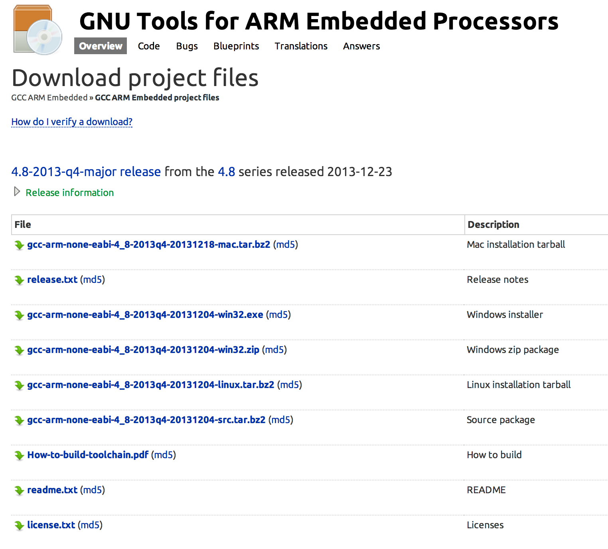
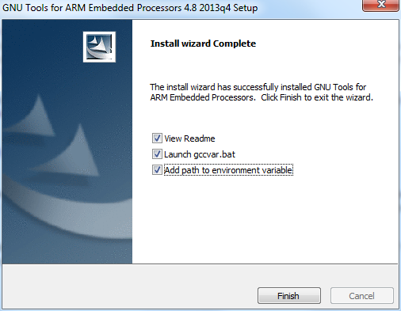
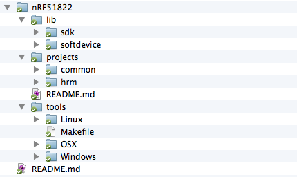
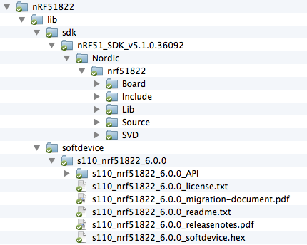
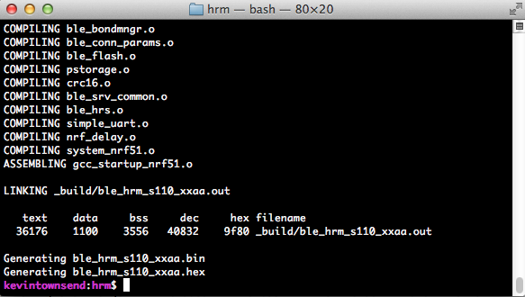
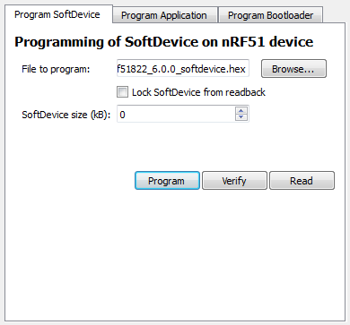
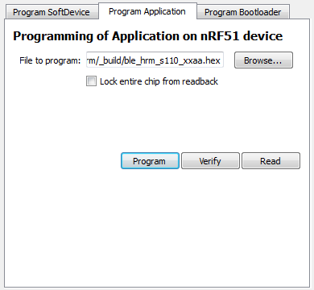

# 第十章，嵌入式应用开发

本章聚焦于现成的及开源嵌入式开发套件和平台，描述了一些给任何想定制BLE外围设备固件的用户用的工具。

本章第一部分介绍了一个高级别的BLE API，使用ARM的[mbed](http://mbed.org/)开发平台创建并维护。如果你对于嵌入式开发是新手，这是一个很好的选择，因为这不需要你熟悉配置一个嵌入式工具链，或者在底层开发嵌入式硬件。大多数复杂的固件实现问题和设置问题都被简易使用的在线工具和高级别API所掩盖。

第二个部分描述了嵌入式*工具链* ：用于转换标准源代码为运行于嵌入式处理器上的可执行二进制文件工具集。这个部分展示了如何在Windows、OS X或Linux上搭建一个交叉编译工具链环境来编译ARM二进制文件。

本章最后一部分展示实际环境中如何使用这些工具和概念，利用一个在诺迪克的nRF51822片上系统的样例项目，这个项目使用标准心跳配置文件（Heart Rate Profile，关于BLE配置文件请参见第一章[SIG定义的GATT配置文件](./chapter1.md#SIG定义的GATT配置文件)）传输心跳数据给一个iOS或者安卓设备。

 *样例项目完整代码可在本书[Github目录](http://bit.ly/1qoj8Ed)查看。*

## mbed BLE API

以使用ARM Cortex处理器开发嵌入式硬件更加容易为目标之一，ARM以及合作公司创建了一个开源开发平台[mbed](http://mbed.org/)。mbed上可以编写可移植于各种受支持的ARM处理器的代码，并可以利用运行于这些处理器之上所构建的API和组件。

你也可以免费使用mbed在线合作开发工具和各种脱机商业以及开源工具链和IDE。在定义高级别API上mbed投入了大量的努力，该API抽离了大部分底层芯片中需要花费大量开发负荷的细节。这使得被分享在社区里的开源软件组件可以重复使用，并解放了固件工程师可以更多关注于项目定制的代码，减少在底层围绕微处理器（MCU）的选择实现细节上面的花费。

与本章目标最相关的，ARM近期已经添加了BLE API到mbed平台，该API让你可以使用很少了的代码和几个小时的努力就实现一个简单的带有少量BLE服务和特征的GATT服务端（在第三章[属性和数据层级](./chapter3.md#属性和数据层级)描述），而不需要考虑任何厂商指定的关于栈或者芯片组的细节。

mbed提供了一个将概念验证阶段的产品起步的简单方法，同时可以使用之后转移去生产的平台（必要的话导出代码到脱机编译器）。围绕BLE的高级别的抽象层，意味着你不需要花费大量时间学习关于你的BLE SoC或者模组的细节。例如，一个标准BLE服务或者特征的例子只需要一行代码：

``` java
GattService hrmService(GattService::UUID_HEART_RATE_SERVICE);
GattCharacteristic hrmRate(GattCharacteristic::UUID_HEART_RATE_MEASUREMENT_CHAR,
	2, 3, GattCharacteristic::BLE_GATT_CHAR_PROPERTIES_NOTIFY);
GattCharacteristic hrmLocation
	(GattCharacteristic::UUID_BODY_SENSOR_LOCATION_CHAR,
	1, 1, GattCharacteristic::BLE_GATT_CHAR_PROPERTIES_READ );
```

本文在书写的同时，mbed的BLE API仍处于beta版本，并处于活动开发阶段，但其目前已覆盖了你所需要用于原型和概念验证产品的大多功能。关于mbed或者样例，以及BLE API更新的更多信息，请参考[mbed项目网站](http://mbed.org/)。

## 嵌入式工具链

虽然mbed被作为一个可视化嵌入式开发平台，具有从原型到生产的清晰路径，任何中间厂商的高级别API或者平台都需要在底层实现细节上面失去一些控制。通常你会在代码和驱动中为了一定的底层优化而牺牲易用性。这种权衡在很多情况下都比较合理，但是显然在嵌入式开发中没有一刀切的万全之策。

在产品设计世界中，性能和控制方面经常胜过易用性，许多工程师仍然倾向自己去处理具体的实现，编写自己的底层驱动以及建立自己的编译环境。编写自有的底层驱动很明显需要更多的开发量，但是这也可以确保代码在运行于产品上有着最大的掌控。这也强迫你更理解处理器，以便对性能和消耗进行优化，以达到更高的层次。

嵌入式产品中，在代码大小以及性能进行全面优化是非常重要的。比如，产品可能需要使用一个更小更便宜的处理器，在材料费用上节省$2或者$3花费，这在零售价上很容易转为$5到$10的费用。这种节省可以决定一款产品成功与否，就因为产品错误的定价。控制最终代码的体积和性能的最好方式，就是对编译器和编译环境有着最大掌控，在嵌入式处理器或者SoC上充分利用着每一个的时钟周期。

为小型嵌入式处理器编译需要一个叫做*工具链* 的东西，如其名，工具链是一组工具的集合，用于构建编译可执行代码，并且其中一个很重要的部分就是*交叉编译器* 。交叉编译器在一个架构上运行编译代码（比如使用一个x86指令集），但是为不同的架构生成代码（比如ARM的各种架构）。对于交叉编译器和底层嵌入式工具链，你有很多商业和开源的选择，但是本小节我们将只关注在开源解决方案上。

这些年，GCC（属于GNU项目的一部分的免费开源的编译器集）在其对ARM的支持上有着很显著的发展。大多进展都是关于ARM在移动手机和平板领域上的优势（尤其是使用ARM Cortex-A处理器），少部分在嵌入式处理器（ARM Cortex-M等）也因为相重叠的指令集，而从这巨大的投入上面得到了很大的益处。

GCC在大量的厂商中得到广泛使用，并也可在任何现代操作系统和架构中方便地使用。面向GCC的代码通常是可高度移植的，你可以在Linux、OS X、Windows下编译相同的输出，或者几乎所有其他你可以想到的环境下都不会在编译器输出上产生任何有意义的变化。

最后一点是非常重要的，一个主要的因素就是这使得GCC成为对嵌入式开发来说一个很棒的选择。GCC如今在ARM处理器上做得很好，但是一些商业编译器仍在某些任务上做得更好。GCC提供的内容，没有商业工具链能提供，虽然这也是对在重新构建固件上使用相同编译器版本和依赖的一种保证。如果需要激活的商业工具链（以及激活服务器）没有保持更新，这可能没法保证在当前这一代的操作系统或者PC上面运行。

如果你刚接触嵌入式开发，可以忽略这些细节。嵌入式设备有长达10到20年或更多的寿命，远比大多软件包更长。今天，商业工具和你使用的开发环境可能无法存在十年，厂商也可能不会在未来激活你早年投入巨大精力的淘汰产品。GCC则保证了你不会面临这种问题，因为你可以获得交叉编译器的完整代码，包括了相关库依赖，连同你的固件代码，就可以在未来任何时间点进行重新构建。

在一个非Linux的PC上搭建GNU工具链，过去是一个相当复杂的任务，但是ARM如今已经通过提供预编译文件使之变得无关紧要，并定期更新GCC的Windows、Linux、OS X版本，包括易用的安装包以覆盖了众多复杂的细节问题。

搭建ARM的开发环境的第一步，就是下载最新的[GNU预编译工具链](https://launchpad.net/gcc-arm-embedded)。如图10-1所示，你可以方便地下载OS X、Windows、Linux的安装包，以及源代码和在其他平台上自行编译工具链的指南。

网站上最新的版本可能会改变，但通常选择最新的包。ARM提供季度性的更新，经常包含了写改进到编译器和相关的库中，生成更小或者更有效率的编译代码。

### 在OS X和Linux上安装GNU工具

如果你使用OS X或者Linux，你仅需要下载对应的安装包并运行即可。任何其他开发工具（*make*，大量在makefile文件中用到的命令等）都似乎已经可以在你的开发机器使用及添加（使用OS X上的X code以及Linux上的包管理器）。

你可以使用下列命令来确认是否GCC交叉编译器被成功安装：

``` c++
arm-none-eabi-gcc --version
```



*图10-1. ARM嵌入式处理器的GNU工具的可选下载内容*

你应该得到的回应如下：

``` none
arm-none-eabi-gcc (GNU Tools for ARM Embedded Processors) 4.8.3 20131129
(release) [ARM/embedded-4_8-branch revision 205641]
Copyright (C) 2013 Free Software Foundation, Inc.
This is free software; see the source for copying conditions. There is NO
warranty; not even for MERCHANTABILITY or FITNESS FOR A PARTICULAR PURPOSE.
```

如果你看到这样的输出，这意味着你的交叉编译器已经安装成功，并且你可以在你的开发机上生成ARM二进制文件。

### 在Windows上安装GNU工具

如果你使用Windows电脑来开发，你需要下载对应的Windows安装包，并像其他安装包一样的方式运行。

在安装结束界面请确认选择了“添加路径到安装变量中”的选项（如图10-2）。这将确保工具链可以从任何位置访问，当使用多辆文件夹和文件位置的时候这将变得非常简便。



*图10.2. 选择添加路径到安装变量中，从而可从任意位置访问*

与之前展示的OS X/Linux的测试一样，如果一切搭建完毕，你将可以通过敲下下列命令看到你已经安装的GNU工具链的版本号：

``` none
arm-none-eabi-gcc --version
```

不像Linux和OS X，Windows通常没有其他的GNU工具链要求的命令行工具，比如*make* 和很多文件夹及目录上用到的命令（ls, cp等）。因此在Windows上安装这些额外的工具就很简单。Windows版的GNU [CoreUtils](http://bit.ly/1ewD5kZ)添加了预编译文件，包含了所有近乎你所需要的文件修改命令。

忽略源码，下载并运行完整的CoreUtils的Windows安装包。

你还需要*make*，这用于控制编译过程，并将你的源代码转换为可以运行在nRF51822上的内容。在下载完GNU Coreutils的Windows安装包之后，下载并安装[Windows的make](http://bit.ly/Ra2fB2)。

你可以通过敲击命令行来测试是否*make* 安装成功，这将给一个版本号作为回应：

``` none
make --version
```

一旦这两个工具都安装完毕，在你的开发电脑上就完成了ARM的交叉编译代码的所有工作。现在，你可以开始操作nRF51822代码库以及一个样例项目。

## nRF51822GNU代码库和样例项目

本文之前部分所配置的ARM工具链，是可以构建几乎所有的使用ARM处理器的嵌入式设备的二进制文件。但是为了帮助你了解实际中在底层嵌入式开发所涉及的内容，以下简单的项目例子是围绕Nordic的nRF51822-EK（参见第五章[nRF51822-EK](./chapter5.md#nRF51822-EK)）进行设计，使用了GCC和开源工具。同样的原则和设计流程也适用于任何其他嵌入式处理器，尽管你需要从你的硅供应商或者网络上找到启动代码和工具来使用不同的微处理器或者SoC。

代码库并不详尽，但对于你的项目来说这是一个不错的起点。这代码库可以在许多平台（Windows, OS X, or Linux）上编译你的固件，并且提供一个基本的项目框架，便于理解和维护。


> nRF51822 GNU代码库以及本书所有其他的样例代码，都在[本书GitHub仓库中](http://bit.ly/1qoj8Ed)。有必要查看这个仓库，以了解最新代码以及使用在本书出版后可能增加的代码库。

关于Nordic的API和BLE协议栈的详尽内容超出了本章的范围，这本身内容就值得一本书，但我们有意识保持样例代码最小、清晰而精确，并且尽量易于理解。接下来的部分包含了如何在你的电脑上搭建来开始使用这个代码库，以使用易于安装的工具来构建一个简单的[心率监控项目](http://bit.ly/1kdO3kB)。

### 获取nRF51822 GNU代码库

[nRF51822 GNU代码库](http://bit.ly/1kR2Pw9)在本书[GitHub仓库](http://bit.ly/1qoj8Ed)内,包括本书所有其他的样例代码。如果你正使用Linux或者OS X，你可能在命令行已经有了Git。为了创建这个仓库的副本，以更新任何对于这个代码库的修改，执行下面命令：

``` 
git clone git@github.com:microbuilder/IntroToBLE.git
```

为了获取最新版本的代码，请到项目根目录路径并执行下面命令：

``` 
git pull
```

如果你是使用Windows，你可以安装一个Git的预编译的二进制文件（比如[msysgit](http://msysgit.github.io/)）并运行上面的命令。

如果你不想使用Git也不想进行版本管理，你只需要去[GitHub仓库](http://bit.ly/1qoj8Ed)点击下载最新的文件包。

### nRF GNU代码库结构

一旦你有了nRF51822代码库的本地副本，你可以得到像图10-3的文件结构。



*图10-3. nRF51822代码库的纯文件目录结构*

*projects* 文件夹包含了样例项目。对于任何基于这个代码库创建的新项目，在这增加一个新目录，并使用有意义的名字来描述项目。为了帮助你快速开始，这里已经包含了一个心率监控的样例项目，在*hrm* 的目录内。这个项目实现了蓝牙SIG定义的标准的[心率服务](http://bit.ly/PXX0DD)。

*tool* 文件夹提供了一个方便的位置来保存在开发过程中使用的系统专属的工具。在这文件夹中保存了你的工具这可以确保这被添加进你的版本控制系统中，并且在之后任何时间点都可以使用。你甚至可以在这里可以添加你的GNU工具链的二进制文件，以避免当编译固件时在版本上的冲突，日后调试更为简单。

*lib* 文件夹应包含SDK，SoftDevice，以及任何其他来自Nordic的专有文件。你需要从Nordic的网站上直接下载这些文件，因为证书等问题而不能直接包含这内容。


> 为了从[Nordic半导体网站](http://www.nordicsemi.com/)下载SDK和nRF51822对应的SoftDevice，你需要创建一个MyPage账户，并对印在你的nRF51822-EK的包装上的产品识别码进行注册。产品识别码让你可以对这个芯片集的所有资源进行访问，因此请对产品识别码妥善保存，以防未来需要重新使用。

在下载文件后，添加进文件结构中的*lib* 目录，如图10-4所示：



*图10-4. Nordic的SDK和SoftDevice的文件结构*

一旦你将这些文件更新到项目中，就可以准备进行第一次程序编译。

### 编译项目

如果你已经妥善搭建好GNU工具链，包括ARM交叉编译器和任何相关的工具（如本章前面阐述），编译就仅为打开命令行，进入对应的目录（比如/projects/hrm），并执行下面命令：

```
make clean release
```

这句将会让make实体去解释*makefile* 文件，告诉编译器和工具链如何转换文件夹中的源代码为一个二进制镜像，以运行在目标硬件上。*make* 开启了makefile解释器，*clean* 告诉*make* 移除任何之前构建生成的内容，并在一个干净的代码文件内进行交叉编译，*release* 告诉*make* 针对生成环境优化代码，移除任何不使用的代码和多余的调试信息。

如果这是一个调试编译，你可以选择进入*make clean debug*，虽然这会生成比较大的可执行文件，因为二进制数据包含了大量调试信息和通常没有去除的不使用的代码。

如果如果一切配置正确，你的命令行结果应该如图10-5所示：



*图10-5. 使用GCC交叉编译并链接成功*

上图显示为所有的.c文件都已经被转换为目标文件（.o后缀的文件），所有的目标文件都被组合一起，连接器将所有的数据合并为一个单独的文件（在这个例子中为ble_hrm_s110_xxaa.out）。

后面的值用大小（byte）表示代码在编译、组装、链接后占据的空间大小：

*text*

​		这部分数据存储在flash存储器中，由可执行指令和只读数据组成。这个部分的所有内容都被写入flash存储器中。

*data*

​		这部分空间是用于初始化数据，是启动时被指定一个特殊的值的变量（比如，int16_t i = 1023，这就是被初始化为一个特定值）。

*bss*

​		这部分空间用于未初始化的数据，即没有数值赋予的变量（比如，int16_t i，这就是没有被赋值的变量）。这部分都将被分配在SRAM中。

*dec*

​		这位所有绑定的数据，包括flash和SRAM内的数据。

最后两行是来自一个叫做*arm-none-eabi-objcopy* 的很有用的工具的输出，这工具将*.out* 文件转换位其他第三方工具会更容易使用的文件格式，包括了Intel的Hex，这个文件格式对于使用嵌入式系统来说是非常常见的。

### 写入nRF51822

为了将你的编程代码写入nRF51822-EK的开发板的非易失性存储器内，你可以使用Nordic的nRFGo Studio工具，这可以在Nordic的网站上一样的MyPages处下载SDK和SoftDevice（见前文[nRF51822 GNU代码库结构](#nRF51822-GNU代码库结构)）。


> nRFGoStudio目前是一个只有Windows可用的工具，但是Roland King已经创建了一个OS X上运行的可替代选择，称为[rknrfgo](http://bit.ly/1qHOqUJ)。这是一个非官方的应用，实现了nRFGo Studio提供的功能的子集，可以在nRF51822上使用易用的GUI来编码进flash内存中。

> 你也可以直接使用[Segger’s J-Link驱动](http://bit.ly/1ehaRjo)和相关工具在Windows、OS X或者Linux的命令行上进行编码，写入nRF51822的flash内存当中。关于如何使用J-Link的文档和例子可以在[Segger’s website](http://bit.ly/1lVS3J4)查看。

如果你第一次使用你的开发板，首先你将需要写入SoftDevice .hex文件到flash。这会将Nordic的BLE协议栈写入到设备flash存储器的下半部分中。要做到这一点，需要寻找SoftDevice的*.hex* 文件（该文件属于Nordic的网站下载的SoftDevice包里的一部分），并且在nRFGoStudio的Program SoftDevice标签页选择，如图10-6所示。



*图10-6. 使用nRFGo Studio将SoftDevice编码到nRF51822中*


> SoftDevice通常只需要被写入一次，除非你希望升级到一个不同的版本。用户代码在每一次修改程序后都需要进行更新，并且用户代码不会影响SoftDevice，因为他们存储在flash的各自区域。

一旦SoftDevice被写入，你就可以写入你定制的应用程序到内存的上半部分，使用之前生成的*.hex* 文件以及相同的nRFGo Studio工具，如图10-7所示，转到Program Application标签。

到现在，你的应用代码已经被写入nRF51822 SoC内，并可自动开始执行。应用代码可以调用底层SoftDevice实现任何BLE特定的功能，并且如果运行顺畅，你可以看到在PCA10001开发板上LED0闪烁。

你可以在支持BLE的手机或者平板上通过运行应用来测试代码。首先，从[苹果应用市场](http://bit.ly/1ewDMuD)或者[Google Play](http://bit.ly/PYggkr)下载Nordic的nRF实用程序。在安装应用之后，只需要从主菜单选择HRM并点击连接，就会像图10-8所示一样。



*图10-7. 使用nRFGo Studio编译应用程序代码到nRF51822内*


*图10-8. 使用Nordic的nRF实用程序来可视化心率监测数据*

如果你希望从一个不同的视角查看你的nRF51822和应用程序实际在无线中传送什么，或者觉得有什么不对劲，你可以使用在[第六章](./chapter6.md)内讨论的任何调试工具。

## 进一步探讨

嵌入式开发是一个很大的内容，涉及了一个很广大的领域。其包括了无线信号传播和天线设计的硬件领域，硬件设计和元件选择的电子工程领域，封装和整体产品开发的机械工程和工厂设计领域，固件的嵌入式软件开发，采购零件和组装硬件的制造知识，确保不会返工的有效测试和校验策略。

本教程仅涵盖嵌入式开发的最小的一部分，聚焦于固件设计，但是如果你对设计和你自己的嵌入式开发感兴趣，请忽略自己的技术背景，现在都可能是一个最好开始的时机。成本在一直下降，硬件和软件开发的信息以及生产专有技术都已经更加容易获得，围绕这些技术存在着完整的网络生态系统。

如果你对嵌入式开发有着进一步的兴趣，请看看这些年成长起来的较大的开源硬件社区，比如[Adafruit](file:///D|/work/myCash/book/://www.adafruit.com)或者[Make](http://makezine.com/)，还有像[Hackaday](http://hackaday.com/)这样的每天都高亮一些新项目。像这样的社区可能让你自己开始思考，或者可以发现一些你过去没有接测过的想法和技术。

Nordic半导体也有一个很有帮助的[Nordic Developer Zone](http://bit.ly/1qomeI8)论坛，这是一个很好的回答使用其芯片组的常见问题的来源。