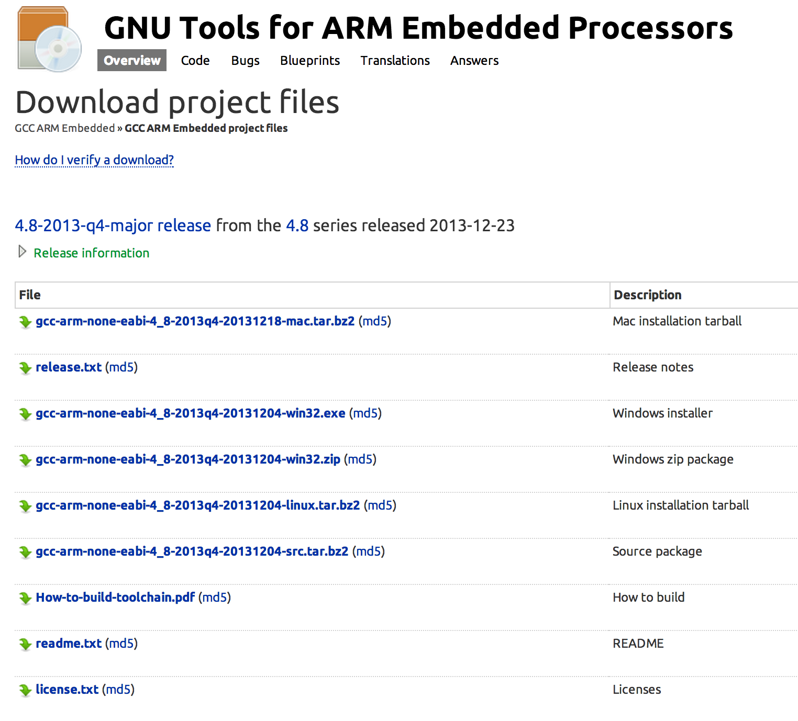
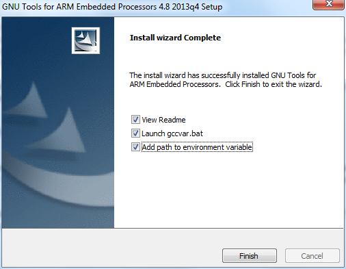
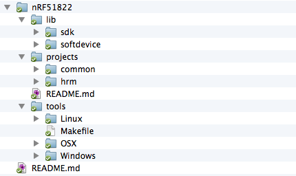
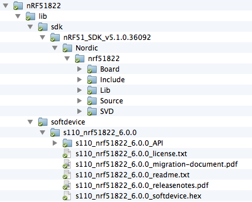
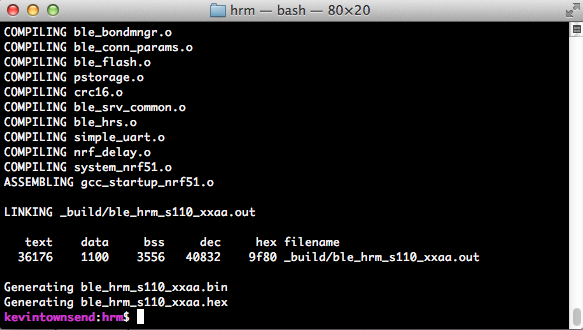
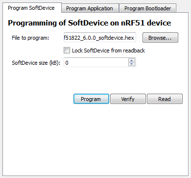
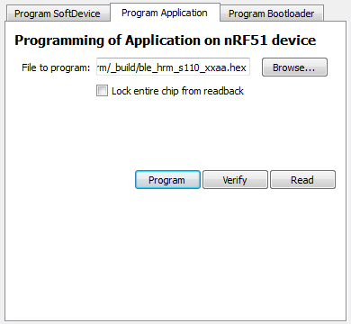

# 第十章 嵌入式应用开发

本章聚焦于现成可用的开源嵌入式开发套件和平台，描述了一些工具，适用于任何想要为蓝牙低功耗外围设备创建自定义固件的人。

本章第一部分介绍了一个高级 BLE API，它使用 ARM 创建和维护的 mbed 开发平台。如果你是嵌入式开发的新手，这是一个很好的选择，因为它不需要你熟悉配置嵌入式工具链或在最低级别处理嵌入式硬件。大多数繁琐的固件实现问题和设置问题都被方便地隐藏在易用的在线工具和高级 API 中。

第二部分描述了嵌入式工具链：一起使用将标准源代码转换为在嵌入式处理器上运行的可执行二进制文件的工具集合。本节展示了如何在 Windows、OS X 或 Linux 上设置交叉编译工具链来构建 ARM 二进制文件。

本章最后一部分展示了如何在现实世界中使用这些工具和概念，利用 Nordic 的 nRF51822 片上系统的示例项目（见第五章[nRF51822-EK](./chapter5.md#nrf51822-eknordic-semiconductors-nordic-半导体)），该项目允许你使用标准心率配置文件将心率数据传输到 iOS 或 Android 设备（有关 BLE 配置文件的更多信息，请参见第一章[SIG 定义的基于 GATT 的配置文件](./chapter1.md#sig-定义的基于-gatt-的配置文件)）。

> 注意：示例项目的完整代码可在本书的 [GitHub 仓库](https://github.com/microbuilder/Getting-Started-with-Bluetooth-Low-Energy) 中获取。

## mbed BLE API

作为使使用 ARM Cortex 处理器开发嵌入式硬件尽可能简单的目标的一部分，ARM 及其合作伙伴公司创建了一个名为 mbed 的开源开发平台。mbed 允许你编写可在各种受支持的 ARM 处理器之间移植的代码，并可以利用构建在这些处理器之上的 API 和组件。

你还可以将 mbed 与免费的在线协作开发工具以及各种离线商业和开源工具链和 IDE 一起使用。在定义高级 API 方面已经投入了大量精力，这些 API 抽象了大部分可能消耗大量整体开发预算的底层芯片细节。这使得可以重用社区中共享的开源软件组件，并使固件工程师能够更多地专注于特定于项目的代码，而更少地关注其特定微控制器（MCU）选择的底层实现细节。

与本章目的最相关的是，ARM 最近向 mbed 平台添加了 BLE API，它允许你用几十行代码和几个小时的努力实现一个简单的 GATT 服务器，带有一些 BLE 服务和特征（在第四章[属性和数据层次结构](./chapter4.md#属性和数据层次结构)中描述），而无需考虑关于协议栈或芯片组的任何供应商特定细节。

mbed 提供了一种简单的方法来启动概念验证产品，同时仍使用你以后可以转移到生产的平台（如有必要，将代码导出到离线编译器）。围绕 BLE 的高级抽象意味着你不必花大量时间了解你的 BLE SoC 或模块的具体细节。例如，实例化标准 BLE 服务或特征只需一行代码：

```cpp
GattService hrmService(GattService::UUID_HEART_RATE_SERVICE);
GattCharacteristic hrmRate(GattCharacteristic::UUID_HEART_RATE_MEASUREMENT_CHAR,
    2, 3, GattCharacteristic::BLE_GATT_CHAR_PROPERTIES_NOTIFY);
GattCharacteristic hrmLocation
    (GattCharacteristic::UUID_BODY_SENSOR_LOCATION_CHAR,
    1, 1, GattCharacteristic::BLE_GATT_CHAR_PROPERTIES_READ);
```

在撰写本文时，mbed 的 BLE API 仍处于 beta 阶段并 undergoing 积极开发，但它目前涵盖了你可能需要用于原型和概念验证产品的大多数功能。有关 mbed 或其 BLE API 的示例和更新的更多信息，请参阅 [mbed 项目网站](https://mbed.org/)。

## 嵌入式工具链

虽然 mbed  qualifies 为可行的嵌入式开发平台，具有从原型到生产的清晰路径，但任何供应商中立的高级 API 或平台必然需要对底层实现细节失去一些控制。你通常会在代码和驱动程序中为某些底层优化牺牲易用性。这种权衡在许多情况下是有意义的，但显然嵌入式开发没有一刀切的方法。

在产品设计世界中，性能和控制通常胜过易用性，许多工程师仍然喜欢自己处理所有实现细节，编写自己的底层驱动程序并设置自己的构建环境。编写自己的底层驱动程序显然需要更多的开发工作，但它也确保你对运行产品的代码拥有最大控制权。它还迫使你更亲密地了解处理器，并允许你在更大程度上优化性能和成本。

能够完全优化代码的大小和性能对于嵌入式产品极其重要。例如，优化代码大小可能允许你使用更小、更便宜的处理器，从材料成本中节省 2 或 3 美元，这可以轻松转化为零售价 5 到 10 美元或更多。这种节省可能是产品成功与因最终定价错误而失败之间的所有差异。控制最终代码大小和性能的最佳方法是完全控制你的编译器和构建环境，使你能够充分利用嵌入式处理器或 SoC 上的每个时钟周期。

为小型嵌入式处理器编译代码需要称为工具链的东西。顾名思义，工具链是用于构建可执行代码的工具集合，其中最重要的部分之一是交叉编译器。交叉编译器在一个架构上运行编译代码（例如，使用 x86 指令集），但为不同的架构生成代码（例如，ARM 的某些变体）。对于交叉编译器和底层嵌入式工具链，你有许多商业和开源选项，但我们在本节将专注于开源解决方案。

近年来，GCC（GNU 项目的一部分的免费开源编译器集合）在对 ARM 的支持方面取得了重大进展。这些进展中的大多数与 ARM 在手机和平板领域的主导地位有关（通常使用 ARM Cortex-A 处理器），但小型深度嵌入式处理器（ARM Cortex-M 等）也因指令集重叠而从这里进行的巨大投资中受益。

GCC 广泛用于各种行业，也可在任何现代操作系统和架构上方便地使用。面向 GCC 的代码通常具有高度可移植性，你可以在 Linux、OS X、Windows 或几乎任何其他你能想象的环境中构建相同的输出，而编译器输出没有任何有意义的变化。

最后一点极其重要，也是使 GCC 成为嵌入式开发优秀选择的主要因素之一。GCC 今天在 ARM 处理器上做得很好，但一些商业编译器在某些任务上仍然表现更好。然而，GCC 提供的任何商业工具链都无法提供的是，你将始终能够使用相同的编译器版本和依赖项重新构建你的固件的保证。如果需要激活的商业工具链（因此需要激活服务器）没有保持更新，它们可能无法保证它们能在当前一代的操作系统或 PC 上运行。

如果你是嵌入式开发的新手，很容易忽略这个细节。嵌入式设备的寿命可以达到 10 或 20 年或更长，远远超过大多数软件包的寿命。你今天使用的商业工具和开发环境可能在 10 年后不存在，供应商未来可能也不存在来激活你多年前大量投资的那个早已淘汰的产品。GCC 向你保证你将永远不会面临这个问题，因为你可以存档你的交叉编译器的完整源代码，包括任何库依赖项，以及你的固件代码，并知道你可以在未来的任何时候重新构建它们。

在非 Linux PC 上设置 GNU 工具链曾经是一个相当复杂的任务，但 ARM 现在通过提供预编译的、定期更新的 GCC 版本（适用于 Windows、OS X 和 Linux），包括易于使用的安装程序来处理许多繁琐的细节，使之变得微不足道。

设置 ARM 开发环境的第一步是下载最新的预构建 GNU 工具链。如图 10-1 所示，你可以下载适用于 OS X、Windows 和 Linux 的便捷安装程序，以及原始源代码和在其他平台上自行构建工具链的指南。

网站上可用的最新版本可能会有所不同，但你通常应该选择最新的包。ARM 提供季度更新，经常将改进纳入编译器和相关库中，从而生成更小或更高效的编译代码。



*图 10-1. ARM 嵌入式处理器的 GNU 工具下载选项*

### 在 OS X 和 Linux 上安装 GNU 工具

如果你使用的是 OS X 或 Linux，你只需下载相应的安装程序并运行它。任何其他开发工具（make、makefile 中使用的各种命令等）可能已经在你的开发机器上可用或易于添加（在 OS X 上使用 Xcode，在 Linux 上使用包管理器）。

你可以使用以下命令确认 GCC 交叉编译器是否已成功安装：

```bash
arm-none-eabi-gcc --version
```

你应该得到如下响应：

```
arm-none-eabi-gcc (GNU Tools for ARM Embedded Processors) 4.8.3 20131129
(release) [ARM/embedded-4_8-branch revision 205641]
Copyright (C) 2013 Free Software Foundation, Inc.
This is free software; see the source for copying conditions.  There is NO
warranty; not even for MERCHANTABILITY or FITNESS FOR A PARTICULAR PURPOSE.
```

如果你看到此输出，这意味着你的交叉编译器已成功安装，你可以在开发机器上生成 ARM 二进制文件。

### 在 Windows 上安装 GNU 工具

如果你使用 Windows 机器进行开发，你需要下载相应的 Windows 安装程序并以与任何其他安装程序包相同的方式运行它。

确保选择安装后选项"添加路径到环境变量"（如图 10-2 所示）。这将确保工具链可从任何位置访问，这通常在使用多个文件夹和文件位置时使事情更容易。



*图 10-2. 选择添加路径到环境变量以使工具链可从任何位置访问*

与前面显示的 OS X/Linux 测试类似，如果一切设置正确，你应该能够进入命令行并输入以下命令来查看你已安装的 GNU 工具链版本：

```bash
arm-none-eabi-gcc --version
```

与 Linux 和 OS X 不同，Windows 通常不会有 GNU 工具链通常需要的一些额外命令行工具，例如 make 和一些用于处理文件和目录的 *nix 命令（ls、cp 等）。幸运的是，在 Windows 上安装这些额外工具很容易。Windows 的 GNU CoreUtils 添加了你需要的所有文件编辑命令的预编译版本。

下载完整的 CoreUtils for Windows 包并运行安装程序。

你还需要 make，它用于控制编译过程并将你的源代码转换为可以在 nRF51822 上运行的内容。下载并安装 GNU Coreutils for Windows 后，下载并安装 [make for Windows](http://gnuwin32.sourceforge.net/packages/make.htm)。

你可以通过输入命令行来测试 make 是否安装成功，这将返回版本号：

```bash
make --version
```

一旦这两个工具都安装完毕，你就完成了在开发机器上为 ARM 交叉编译代码的所有工作。现在，你可以开始使用 nRF51822 代码库和示例项目。

## nRF51822 GNU 代码库和示例项目

前面配置的 ARM 工具链可用于构建几乎任何使用 ARM 处理器的嵌入式设备的二进制文件。但为了帮助你了解底层嵌入式开发实际涉及的内容，以下简单项目示例围绕 Nordic 的 nRF51822-EK（见第五章[nRF51822-EK](./chapter5.md#nrf51822-eknordic-semiconductors-nordic-半导体)）设计，使用 GCC 和开源工具。相同的原则和设计流程也适用于任何其他嵌入式处理器，尽管你需要从硅供应商或网络上找到启动代码和工具来使用不同的微处理器或 SoC。

该代码库并不详尽，但为你的项目提供了一个良好的起点。该代码库可以在许多平台（Windows、OS X 或 Linux）上编译你的固件，并提供一个基本项目框架，便于理解和维护。

> 注意：nRF51822 GNU 代码库以及本书所有其他示例代码都在[本书 GitHub 仓库](https://github.com/microbuilder/Getting-Started-with-Bluetooth-Low-Energy) 中。有必要查看该仓库以获取最新代码以及本书出版后可能添加到代码库的代码。

有关 Nordic 的 API 和 BLE 协议栈的详尽内容超出了本章的范围，这本身内容就值得一本书，但我们有意保持示例代码最小、清晰和精确，并尽可能易于理解。接下来的部分包含如何在你自己的计算机上设置以开始使用此代码库，使用易于安装的工具构建简单的[心率监控项目](https://github.com/microbuilder/nRF51822_GNU/tree/master/projects/hrm)。

### 获取 nRF51822 GNU 代码库

[nRF51822 GNU 代码库](https://github.com/microbuilder/nRF51822_GNU) 在本书的 [GitHub 仓库](https://github.com/microbuilder/Getting-Started-with-Bluetooth-Low-Energy) 中，包括本书所有其他示例代码。如果你使用的是 Linux 或 OS X，你可能在命令行上已经有 Git。要创建此仓库的副本，以获取对此代码库的任何更新，请执行以下命令：

```bash
git clone git@github.com:microbuilder/IntroToBLE.git
```

要获取最新版本的代码，请转到项目根目录并执行以下命令：

```bash
git pull
```

如果你使用的是 Windows，你可以安装 Git 的预编译二进制文件（例如 [msysgit](http://msysgit.github.io/)）并运行上述命令。

如果你不想使用 Git 或不想进行版本控制，你可以简单地转到 [GitHub 仓库](https://github.com/microbuilder/Getting-Started-with-Bluetooth-Low-Energy) 并点击下载最新文件包。

### nRF GNU 代码库结构

一旦你有了 nRF51822 代码库的本地副本，你将获得如图 10-3 所示的文件结构。



*图 10-3. nRF51822 代码库的文件目录结构*

*projects* 文件夹包含示例项目。对于基于此代码库创建的任何新项目，在此处添加新目录，并使用有意义的名称描述项目。为了帮助你快速入门，这里已经包含了一个心率监控示例项目，在 *hrm* 目录内。该项目实现了蓝牙 SIG 定义的标准[心率服务](https://developer.bluetooth.org/gatt/services/Pages/ServiceViewer.aspx?u=org.bluetooth.service.heart_rate.xml)。

*tools* 文件夹提供了一个方便的位置来保存在开发过程中使用的系统特定工具。将此文件夹中的工具保存在你的版本控制系统中可以确保它在以后的任何时间点都可用。你甚至可以在此处添加你的 GNU 工具链的二进制文件，以避免在编译固件时出现版本冲突，使日后调试更容易。

*lib* 文件夹应包含 SDK、SoftDevice 以及来自 Nordic 的任何其他专有文件。你需要直接从 Nordic 的网站下载这些文件，由于许可问题，它们不能直接包含在此处。

> 注意：要从 [Nordic 半导体网站](http://www.nordicsemi.com/) 下载 SDK 和 nRF51822 的相应 SoftDevice，你需要创建 MyPages 账户并注册印在 nRF51822-EK 包装上的产品识别码。产品识别码允许你访问该芯片组的所有资源，因此请妥善保管产品识别码，以防将来需要重新访问。

下载文件后，将它们添加到文件结构中的 *lib* 目录，如图 10-4 所示：



*图 10-4. Nordic 的 SDK 和 SoftDevice 的文件结构*

一旦你将这些文件更新到项目中，就可以准备进行第一次编译。

### 编译项目

如果你已正确设置 GNU 工具链，包括 ARM 交叉编译器和任何相关工具（如本章前面所述），编译只需打开命令行，转到相应目录（例如 /projects/hrm），并执行以下命令：

```bash
make clean release
```

这将使 make 实体解释 *makefile* 文件，告诉编译器和工具链如何将目录中的源代码转换为二进制镜像，以在目标硬件上运行。*make* 启动 makefile 解释器，*clean* 告诉 *make* 删除任何先前构建生成的内容，并在干净的代码文件上进行交叉编译，*release* 告诉 *make* 针对生产环境优化代码，删除任何未使用的代码和多余的调试信息。

如果是调试编译，你可以选择 *make clean debug*，尽管这会生成较大的可执行文件，因为二进制数据包含大量调试信息，通常未删除未使用的代码。

如果一切配置正确，你的命令行结果应如图 10-5 所示：



*图 10-5. 使用 GCC 交叉编译和链接成功*

上图显示所有 .c 文件都已转换为目标文件（.o 后缀的文件），所有目标文件都组合在一起，链接器将所有数据合并为单个文件（在此示例中为 ble_hrm_s110_xxaa.out）。

后面的值以大小（字节）表示代码在编译、组装和链接后占据的空间：

*text*

  此部分数据存储在闪存中，由可执行指令和只读数据组成。此部分的所有内容都写入闪存。

*data*

  此部分空间用于初始化数据，是启动时被指定特殊值的变量（例如，int16_t i = 1023，这是被初始化为特定值）。

*bss*

  此部分空间用于未初始化的数据，即没有赋予值的变量（例如，int16_t i，这是未赋值的变量）。此部分将分配在 SRAM 中。

*dec*

  这是所有绑定数据的总和，包括闪存和 SRAM 中的数据。

最后两行是来自名为 *arm-none-eabi-objcopy* 的有用工具的输出，该工具将 *.out* 文件转换为第三方工具更容易使用的文件格式，包括 Intel Hex，这种文件格式对于嵌入式系统非常常见。

### 写入 nRF51822

要将你的编程代码写入 nRF51822-EK 开发板的非易失性存储器，你可以使用 Nordic 的 nRFGo Studio 工具，该工具可在 Nordic 网站上与 SDK 和 SoftDevice 相同的 MyPages 处下载（见前文[nRF GNU 代码库结构](#nrf-gnu-代码库结构)）。

> 注意：nRFGo Studio 目前是一个仅限 Windows 的工具，但 Roland King 创建了一个在 OS X 上运行的替代方案，称为 [rknrfgo](http://bit.ly/1qHOqUJ)。这是一个非官方应用，实现了 nRFGo Studio 提供的功能的子集，可以在 nRF51822 上使用易用的 GUI 将代码写入闪存。

> 你也可以直接使用 [Segger 的 J-Link 驱动程序](http://bit.ly/1ehaRjo) 和相关工具在 Windows、OS X 或 Linux 的命令行上将代码写入 nRF51822 的闪存。有关如何使用 J-Link 的文档和示例可在 [Segger 的网站](http://bit.ly/1lVS3J4) 查看。

如果你第一次使用开发板，首先需要将 SoftDevice .hex 文件写入闪存。这会将 Nordic 的 BLE 协议栈写入设备闪存的下半部分。要做到这一点，找到 SoftDevice 的 *.hex* 文件（该文件是你从 Nordic 网站下载的 SoftDevice 包的一部分），并在 nRFGo Studio 的 Program SoftDevice 选项卡上选择，如图 10-6 所示。



*图 10-6. 使用 nRFGo Studio 将 SoftDevice 编程到 nRF51822 中*

> 注意：SoftDevice 通常只需编程一次，除非你希望升级到不同版本。用户代码在每次修改程序后都需要更新，并且用户代码不会影响 SoftDevice，因为它们存储在闪存的各自区域。

一旦 SoftDevice 被编程，你就可以使用之前生成的 *.hex* 文件和相同的 nRFGo Studio 工具将你的自定义应用程序写入内存的上半部分，如图 10-7 所示，转到 Program Application 选项卡。

此时，你的应用代码已写入 nRF51822 SoC，并将自动开始执行。应用代码可以调用底层 SoftDevice 来实现任何 BLE 特定功能，如果运行顺利，你应该看到 PCA10001 开发板上的 LED0 闪烁。

你可以通过在支持 BLE 的手机或平板上运行应用来测试代码。首先，从 [App Store](http://bit.ly/1ewDMuD) 或 [Google Play](http://bit.ly/PYggkr) 下载 Nordic 的 nRF 实用工具。安装应用后，只需从主菜单选择 HRM 并点击连接，结果将如图 10-8 所示。



*图 10-7. 使用 nRFGo Studio 将应用程序代码编程到 nRF51822 中*


*图 10-8. 使用 Nordic 的 nRF 实用工具可视化心率监测数据*

如果你希望从不同角度查看你的 nRF51822 和应用程序实际在无线中传输的内容，或者觉得有什么不对劲，你可以使用[第六章](./chapter6.md)中讨论的任何调试工具。

## 进一步探讨

嵌入式开发是一个庞大的主题，涉及广泛的领域。它包括无线信号传播和天线设计的硬件领域、硬件设计和组件选择的电子工程领域、封装和整体产品开发的机械工程和工厂设计领域、固件的嵌入式软件开发、采购零件和组装硬件的制造知识、确保不返工的有效测试和验证策略。

本教程仅涵盖嵌入式开发的一小部分，专注于固件设计，但如果你对设计自己的嵌入式开发感兴趣，无论你的技术背景如何，现在都可能是一个开始的最佳时机。成本一直在下降，硬件和软件开发的信息以及生产专有知识都变得更加容易获得，围绕这些技术存在着完整的网络生态系统。

如果你对嵌入式开发有进一步的兴趣，请看看这些年来成长起来的较大的开源硬件社区，例如 [Adafruit](https://www.adafruit.com) 或 [Make](http://makezine.com/)，以及像 [Hackaday](http://hackaday.com/) 这样每天突出显示新项目的社区。像这样的社区可能会让你自己开始思考，或者可以发现一些你过去没有接触过的想法和技术。

Nordic 半导体也有一个非常有帮助的 [Nordic Developer Zone](http://bit.ly/1qomeI8) 论坛，这是回答有关使用其芯片组的常见问题的良好来源。
