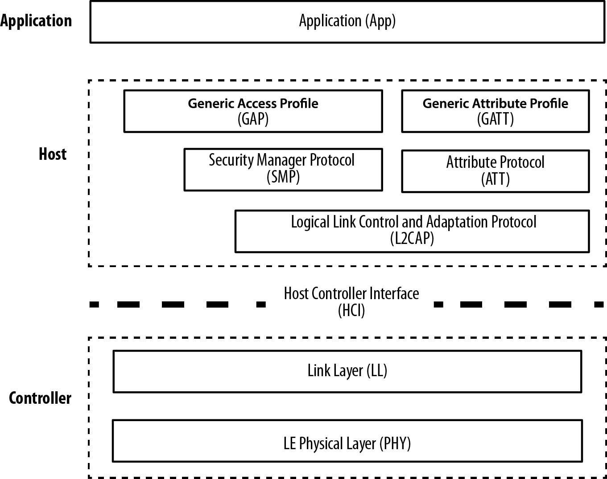
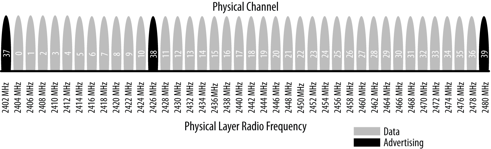
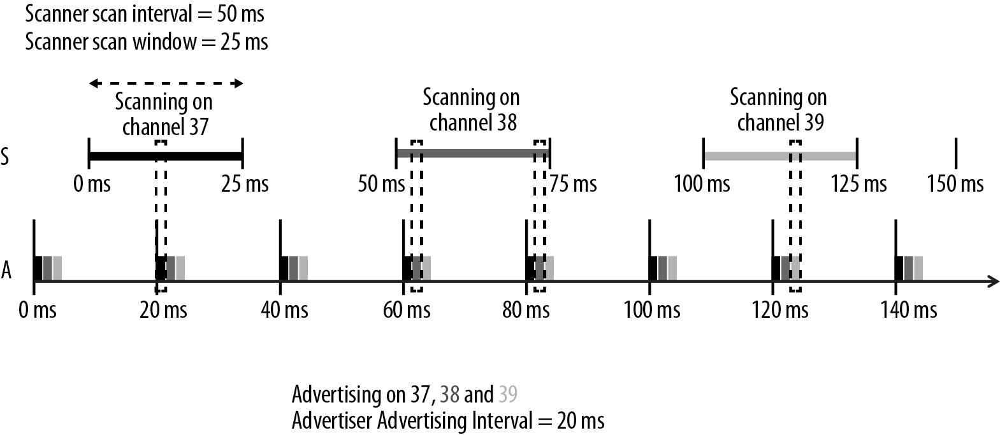
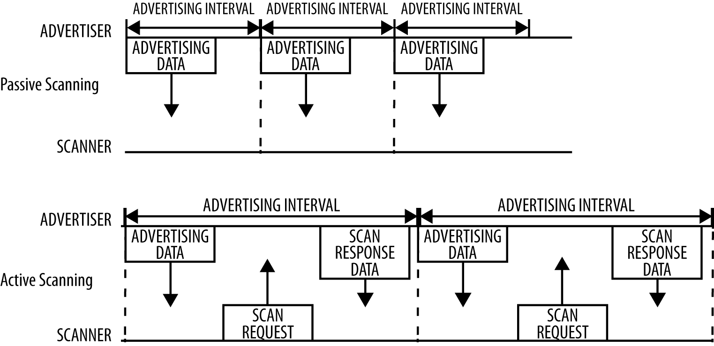
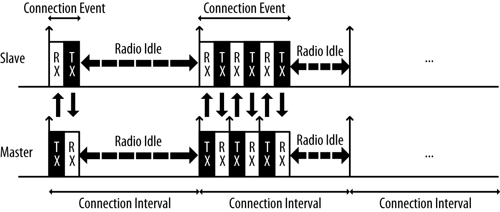
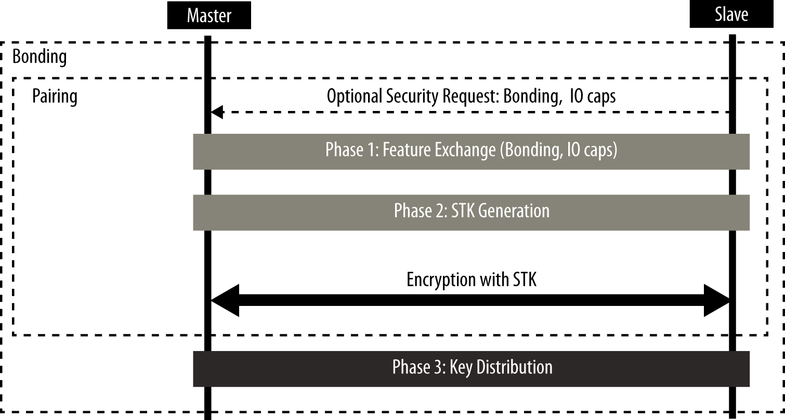

# 第二章节，基本协议

虽然用户总是仅仅直接与BLE协议栈的上层接口进行交互，但最好是对整个栈开始有一个基本的概观，了解这个栈提供了一个可靠的基础来更好理解这些东西是如何操作以及原因。

正如图2-1展示，一个完整的单模BLE设备被分为三块：控制器（controller）、主机（host）和应用（application）。

*应用*

​		就像其他类型的系统一样，应用是在最高层，负责了逻辑、用户接口，以及所有与应用实现的实际用例相关的数据处理。一个应用的结构设计高度依赖于每一个特殊的实现。

*主机*

​		包含了以下层：

- 通用访问配置文件 Generic Access Profile（GAP）
- 通用属性配置文件 Generic Attribute Profile（GATT）
- 逻辑链路控制和适配协议 Logical Link Control and Adaption Protocol （L2CAP）
- 属性协议 Attribute Protocol（ATT）
- 安全管理 Security Manager（SM）
- 主机控制器接口 Host Controller Interface（HCI），主机端

*控制器*

​		包含了以下层：

- 主机控制器接口 Host Controller Interface（HCI），控制器端
- 链路层 Link Layer（LL）
- 物理层 Physical Layer（PHY）

在这一章，各部分的顺序将会从下（天线 antenna）到上（用户接口 user interface）以介绍不同的部分的方式，来组成一个BLE设备。

*图2-1. BLE协议栈*

## 物理层

物理层（PHY）是实际包含了模拟通信电路、调制解调和转化为电信号的能力。

无线通信模块使用了2.4Ghz ISM（工业Industrial、科学Scientific和医疗Medical）频段进行交流，并将2.4000GHz到2.4835Ghz的频段分割成40个信道（channels）。如图2-2，37个信道被用作数据连接，剩下3个信道（37、38、39）被用在广播信道上，用于建立连接和发送广播数据。

*图2-2. 频段*

这个标准使用了一个技术叫做：*跳频技术 Frequency-Hopping Spread Spectrum*， 无线电使用下面的这个公式，在每一个连接事件中，在频段之间跳转：

​		*信道 = （当前信道 + 跳转）取余 37 （ 原文：channel = (curr_channel + hop) mod 37 ）*

当连接建立好之后，经过通信而取得跳变的值，因此，每一次的连接该值都是不同的。这项技术大大减小了在2.4GHz频段中，通过单独一个信道下无线电干扰的可能的影响，尤其是因为在这个波段中WiFi和经典蓝牙的流行，在接近到高传输功率的其他设备下，设备可能遇到很严重的干扰。

高斯频移键控（Gaussian Frequency Shift Keying, GFSK）是指在空中选择对码流的调制，同样的调制被使用在经典蓝牙和许多其他专有的低功耗无线协议。BLE的调制速率被固定在1Mbit/s，因此上层物理吞吐量就因为这个技术被限制。

   *实际上，正如任何其他协议栈，当说到应用数据吞吐量，永远难以实际达到上层的极限，主要就因为在不同层上的各种协议。*

## 链路层

链路层（Link Layer）是与PHY直接连接的部分，通常被作为软硬件定制的结合体实现。这个也是整个协议栈中唯一的硬实时约束层，因为对于遵守规格书中定义的所有时序要求，链路层是负责任的。因此它经常被依靠隐藏着来自其他层（参照后文[主机控制器接口（HCI）](#主机控制器接口（HCI）)）复杂、实时的需求的标准接口的高层协议栈部分所孤立。

硅厂商在硬件中通常实现从计算上来讲的昂贵、简易自动化的功能，以避免在运行栈中所有的软件层CPU会过载。这些功能通常包括：

- 前同步码（Preamble），访问地址（Access Address）和空中协议框架（air protocol framing）
- CRC生成和校验（CRC generation and verification）
- 数据白化（Data whitening）
- 随机码生成（Random number generation）
- AES加密（AES encryption）

链路层的一半软件部分管理着无线模块的链路状态，即设备如何与其他设备连接。一个BLE设备可以根据使用场景和要求作为一个主机（master），一个从机（slave），或者同时作为主机从机。启动连接的设备将成为主机和从机，对他们的可获得性进行广播，接受连接的将成为从机。

一个主机可以与大量从机进行连接，一个从机也可以与许多主机进行连接。通常，如智能手机或者平板的设备更趋于作为主机，而较小、简单、容量受限的设备，如独立运行的传感器常作为从机角色。

BLE在主机从机间，较低的层固有一个不对称性，因为主机需要更多的资源。这个不对称性与USB相似，USB主机相比USB设备需要更多的资源。这种结构上不对称性的类型允许廉价的外围设备在便宜的微控制器上运行，而底层协议的多数复杂性则出现在有更多资源的设备上，如智能手机和平板。

链路层定义了以下角色：

*广播者（Advertiser）*

​		发送广播数据包的设备。

*扫描者（Scanner）*

​		扫描广播数据包的设备。

*主机（Master）*

​		启动连接并且之后进行管理的设备。

*从机（Slave）*

​		接受连接请求并遵循主机时序的设备。

这些角色被有条理地组织成为两对：广播者和扫描者（当没有处在一个活动连接）以及主机和从机（当处在一个连接中）。

### 蓝牙设备地址

与以太网媒体访问控制 Ethernet Media Access Control（MAC）地址相似，蓝牙设备的基本标识符叫做 *蓝牙设备地址 Bluetooth device address*。这个48-bit（6-byte）数字唯一地标识了端中的一个设备。有两种类型的设备地址，其中一个或者两者都可以设置为特殊设备：

*公共设备地址（Public device address）*

​		相对来说这个是固定的，BR/EDR，工厂预编入的设备地址。它是必须通过IEEE注册授权认证的，在整个设备的试用期内都不会改变。

*随机设备地址（Random device address）*

​		这个地址是可以被预编入设备，或者也可以在使用期内动态产生。在BLE内这有许多实际的应用，更多请见后文[地址类型](#地址类型（Address Types）)。

每一个步骤都必须使用这两个的其中一个地址，为了能够被主机标识。

### 广播和扫描

广播和扫描（Advertising and Scanning）。BLE只有一个数据包格式以及两种类型的数据包（广播和数据包），这极大简化了蓝牙协议栈的实现。广播包有两种目的：

- 给应用广播那些不需要通过建立一个完整的连接的数据。
- 发现从机并连接。

每一个广播包都可以携带31字节的广播数据负载，连同基本头部信息（包括蓝牙设备地址）。这种数据包简单地在空中无目的地广播，而不需要实现了解有任何扫描到的设备的存在。数据包按照固定的一个速率发送，这个是由广播时间间隔所限定，范围从20ms到10.24s。越短的时间间隔，有着越高的广播发送频率，并使扫描者（scanner）接收到的数据的机率增加，然而这样较高的数据包传输也将转变为较高的能耗。

因为广播使用了最大极限即三个频率信道，广播者（advertiser）和扫描者（scanner）无论怎样都无法同步，仅当他们随机出现交叠了，一个广播包才可以被扫描者接收。如图2-3.

*图2-3. 广播和扫描*

扫描间隔（scan interval）和扫描窗口（scan window）参数限定了扫描设备（scanner device）将如何频繁和多久去监听一个潜在的广播数据包。广播时间间隔的数值将对功耗有一个很深的影响，因为这和无线通信模块开启的时间有着直接的关系。

规格书定义了两种类型的扫描步骤：

*被动扫描（Passive scanning）*

​		扫描者仅仅监听广播数据包，广播者从未意识到一个或者多个数据包实际上已经被扫描者接收的这个事实。

*主动扫描（Active scanning）*

​		扫描者在收到一个广播包之后发出一个扫描请求包（Scan Request packet）。广播者接收到该请求并回应一个扫描回应包（Scan Response packet）。这个额外的加倍了实际的广播者发送给扫描者负载大小，但要知道很重要的一点是，这个将不再给所有的扫描者提供，也不再发送任何用户数据给广播者。

图2-4描述了主动和被动扫描的不同之处。

*图2-4. 主动和被动扫描*

广播包类型可以根据三个不同的属性进行区分。第一个是 *可连接性 connectability*：

*可连接的（Connectable）*

​		可以根据一种广播接收包来启动连接的扫描者（scanner）。

*不可连接的（Non-connectable）*

​		不可以启动连接的扫描者（这个包仅用于广播）。

第二种属性为 *可扫描性 scannability*：

*直连（Directed）*

​		这种类型的数据包在负载中，仅包含了广播者和目标扫描者的蓝牙地址，没有用户数据。因此所有直连广播包都是可连接的。

*非直连（Undirected）*

​		这种类型的数据包不指定任何个别的扫描者，并且在负载中有包含了用户数据。

表2-1展示了不同广播包类型和他们的属性。

*表2-1. 广播包类型（Advertising Packet Types）*

| 广播包类型      | 可连接的 | 扫描的 | 直连 | GAP 名字           |
| --------------- | -------- | ------ | ---- | ------------------ |
| ADV_IND         | 是       | 是     | 否   | 可连接非直连广播   |
| ADV_DIRECT_IND  | 是       | 否     | 是   | 可连接直连广播     |
| ADV_NONCONN_IND | 否       | 否     | 否   | 不可连接非直连广播 |
| ADV_SCAN_IND    | 否       | 是     | 否   | 可扫描非直连广播   |

广播包类型被用在上层，更准确的说，GAP是区分操作模式以及定义步骤。因此后文的[模式和流程（Modes and Procedures）](#模式和流程（Modes and Procedures）)在核心部分大量使用该内容。

### 连接

要建立一个连接(Connections)，主机首先要开始扫描去寻找当前接收连接请求的广播者。广播包可以通过蓝牙地址或者广播自己的数据过滤。当一个匹配的广播从机被检测到，主机会发送一个连接请求包给从机，得到从机响应，建立这个连接。连接请求数据包包括频率跳转增量（frequency hop increment），这个确定了在连接的生命期内，主机和从机同时遵循的跳转顺序。

*连接 (Connections)* 简而言之，就是主机与从机在预定的时间下数据有序交换。如图2-5，每一个交换都被称为一个*连接事件（connection event)*。

*图2-5. 连接事件*

以下三个 *连接参数（connection parameters）*是在建立连接的时候主机通信的一组关键变量：

*连接时间间隔（Connection interval）*

​		指两个开始连续连接事件之间的时间。该值的范围从7.5ms（高吞吐量）到4s（最低吞吐量但同时最少功耗）。

*从机时延（Slave latency）*

​		指从机可以选择跳过而不用担心断开连接的连接事件的数量。

*连接监测超时（Connection supervision timeout）*

​		在连接被认为丢失之前，两个接收到的无效数据包之间的最大时间。

因为在给定的区域内可能存在许多BLE设备，或者仅仅因为安全性的原因（主机或从机可能只对一组预先知道的设备感兴趣），链接层（Link Layer）实现了一个 *白名单(white list)* 功能，给广播者或扫描者明确了那些感兴趣的设备地址。任何收到的不在白名单里出现的蓝牙地址的广播（扫描者收到）或者连接请求（广播者收到）数据包都将简单地丢弃。

> ### 白名单
>
> 这是BLE控制器（controller）中使用的一个很重要的功能，当广播（advertising）、扫描（scanning）、在两端建立连接（connection）时，白名单（White Lists）允许主机进行设备过滤。列表内为简单的蓝牙设备地址的数组，由主机和后期储存所组成，被控制器使用。
>
> 设备进行扫描或者启动连接都可以使用白名单来限制将被检测或可连接的设备的数量，广播设备可以使用白名单去明确哪个端可以接收到来的连接。决定白名单是否使用的设置被称为 *过滤策略（filter policy）*。本质上动作就是作为一个开关，去开启和关闭白名单的过滤功能。

协议的主力为数据包，并被用来在主从机之间双向传输用户数据。这些包由一个27字节的可用数据负载，但是协议栈附带的协议内容进一步限制了实际的用户数据量为每包（packet）20字节，尽管逻辑上时由被使用的协议所决定。

很重要的一点是，链接层是作为数据的可靠承载端。所有接收到的包通过24比特的CRC进行校验，当在一个失败传输中检测到错误，链接层会要求重传。对于重传，没有上层的限制，链接层将会重新发送包，直到接收端最终确认收到。

除了广播、扫描、建立（和销毁）连接、传输和接收数据，链接层还负责一些控制流程，包括这两个关键的进程：

*改变连接参数*

​		每一个连接都由一组主机给定的连接参数来建立，但在连接的生命期内，条件和要求都可能会改变。从机可能为了一个短时的爆炸量数据突然要求一个更高的吞吐量，或者可能检测到在不久的时间，一个较长的连接时间间隔也将满足以保持连接活跃而做相反的要求。链接层允许主从机请求新的连接参数，假如主机随时单边的设置了参数。这样，每一个连接都可以被很好的调节并在吞吐量和功耗之间达到最好平衡。

*加密*

​		安全性对于BLE来说是至关重要的，链接层通过加密链路，提供了这种安全性地交换数据。这个关键点是由主机生成和管理，链接层做好实际的数据加密和解密，并对上层透明。

这两个流程是密切相关的，因为它们每一个都要求主机两端都参与执行。链接层还处理另外的交换版本信息和内部性能的流程，因此对于主机和应用开发者来说都是透明的。

## 主机控制器接口 (Host Controller Interface, HCI)

正如[第一章](./chapter1.md)所介绍，蓝牙规格书基于芯片数量允许多种可能的配置，主机控制器接口（HCI）就是这样的标准协议，允许主机和控制器通过一系列接口进行通信。在这层画一条界限是很合理的，正如本章先前提到，因为控制器是唯一有着硬实时要求以及与硬件层联系的模块。这意味着将其从主机中分离出来，这是经常实用的，虽然增加了一点复杂度但减少了协议栈时序的紧缩，这样更适合更多高级的CPU。

通常这种配置的例子包含了大多数智能手机、平板和个人电脑，其中主机（和应用）在主CPU中运行，控制器则在不同的硬件芯片上通过UART或USB连接。这与其他技术用到的模型相似，如WiFi或者以太网：TCP/IP协议栈运行在主处理器上，而底层则在不同的IC上实现。

蓝牙规格书定义了HCI作为一组命令（commands）和事件（events）来使主机和控制器彼此交流，也包括数据包格式和一组流程控制和其他的步骤。此外，规格书还定义了一些*传输*，每一个都为特定的物理传输（UART、USB、SDIO等）扩大了HCI的协议。

半导体技术已经变得足够便宜，允许单颗芯片包含了控制器、主机和应用，都集中在一个封装（片上系统a system-on-chip, 或者SoC）内。在许多嵌入式设备应用上，大量的集成更可取，这可以在最终的设备上减少成本和体积。就BLE来说，在低功耗CPU上使用单一芯片同时运行所有的三层内容以实现传感器，这已经司空见惯。

## 逻辑链路控制和适配协议 (Logical Link Control and Adaption Protocol, L2CAP)

逻辑链路控制和适配协议，这个相当神秘的名字，提供了两个主要的功能性。首先，它作为多路转接器（multiplexer）将上层的多种协议封装成标准蓝牙数据包格式（反之亦然）。

它也实现分裂和重组，这个进程将大量来自上层的数据包分解成块，填入传输端中最高27字节的BLE数据包负载内。在接收侧，它接收已被分解的多种数据包并重组成一个单独的大数据包，该包将被往上层发送至一个合适的主机上层实体。作一个简单的对比，L2CAP与TCP就很相似，都允许很大范围的协议在可以在单独的物理链路中无缝地共存，而每一个协议都有着不同的数据包大小和要求。

对于BLE来说，L2CAP层掌管或路由选择两个主要的协议：属性协议(Attribute Protocol, ATT)和安全管理协议(Security Manager Protocol, SMP)。ATT（在后文[属性协议（Attribute Protocol, ATT）](#属性协议(Attribute Protocol, ATT)及进行讨论）在BLE应用中形成数据交换的基础，而SMP（在后文[安全管理协议(Security Manager Protocol, SMP)](#安全管理协议(Security Manager Protocol, SMP))及进行讨论）在端之间提供了生成和分发安全钥匙的框架。

此外，因为规格书4.1的版本，L2CAP可以为了高吞吐量的数据传输而不要求ATT增加的额外的复杂度，去创建自己定义的信道。最初这是为文件传输设计的，这个特性被称为LE基于信用的流量控制模式（LE Credit Based Flow Control Mode），这打开了因应用需求而通过BLE连接建立低功耗、大容量的信道的可能性。

从一个应用开发者的角度看，很重要的一点是，无论什么时候使用仅有默认数据包，L2CAP的数据包头（header）都占据4个字节，这意味着有效的用户数据负载（payload）为27 - 4 = 24字节（27字节为链路层的负载大小，前文[连接](#连接)有进行描述）。

## 属性协议

属性协议（Attribute Protocol, ATT）为基于设备上出现的*属性(attributes)* 的简单的一个客户端/服务端（client/server， CS）的无状态协议。BLE中，每一个设备都是一个客户端（client）、一个服务端（server），或者同时为两者，不用考虑是否主机或者从机。客户端要求服务端的数据，服务端发送数据给客户端。当遇到自身时序问题时候，协议是严苛的：如果一个请求一直挂起（请求被接收却无相应），没有更进一步的请求可以被发送，直到接收到相应并处理。这在两端同时作为服务端和客户端的情况下，两个方向都独立生效。

每一个服务端都包含了按照属性格式组织的数据，每一个都被分配了16比特的属性句柄(attribute handle)、通用唯一标识符(universally unique identifier, UUID)、一组权限，当然还有数值。*属性句柄* 简单来说就是一个用于访问属性数值的标识符。UUID明确了数值中数据的类型和性质。更多信息，请见后文[UUIDs](#UUIDs)和[属性（Attributes）](#属性（Attributes）)。

当客户端尝试从服务端或给服务端读/写属性数值时，服务端会通过句柄（handle）发送一个读/写请求。服务端将回应这个属性数值或给一个回执（acknowledgement）。就读的操作过程，需要客户端解析数值并根据属性的UUID弄清数据类型。另一方面，在写的操作中，客户端提供由属性类型组成的数据，服务端可以根据是否需要而决定是否拒绝。

### ATT 运作

ATT上的一组运作(operations)包含以下类别：

*错误处理（Error Handling）*

​		当错误发生时，服务器相应任一请求而使用，这仅包括：

*错误响应（Error Response）*

​		无论什么时候当一个错误阻止在服务器上正在被执行的请求，错误相应机制将给该请求发送一个回应，以代替相应的操作响应。

*服务器配置（Server Configuration）*

​		用来配置ATT自身协议，这仅包括：

​		*交换MTU请求/响应（Exchange MTU Request/Response）*

​		交换客户端和服务端间各自最大的传输单元（MTU或最大可接受的包大小）。

*查找信息（Find Information）*

​		客户端用于获取关于服务器属性布局（layout of the server’s attributes）的信息，包括：

​		*查找信息请求/响应*

​				在制定的处理范围（handle range）内获取所有的属性列表。

​		*由类型数值查找*

​				在由其UUID和数值识别的属性和下一组定界符（delimiter）之间获取处理范围。

*读取操作（Read Operation）*

​		客户端用于获取一个或多个的属性值，包括：

​		*根据类型读取的请求/响应*

​				使用UUID获取一个或多个属性值。

​		*读取请求/响应*

​				使用一个句柄（handle）获取属性值。

​		*读取二进制大对象（Blob）的请求/响应*

​				使用句柄获取一个长属性值。

​		*读取多种请求/响应*

​				使用多种句柄获取一个或多个属性值。

​		*根据组类别读取的请求/响应*

​				与根据类型的读取相似，但是UUID必须为组的类别。

*写入操作（Write Operation）*

​		客户端用于设置一个或多个属性值，包括：

​		*写请求/响应*

​				写入属性值，并期待从服务端得到响应。

​		*写入命令*

​				写入属性值，无需任何响应或告知收到（acknowledgement）。这个操作不遵循请求/响应的机制，可以随时发送。

​		*带符号的写入命令*

​				与写入命令相似，但是使用了一个被描述在后文[安全管理](#安全管理)的签名。这个操作不遵循请求/响应机制，可以随时发送。

*排队写入*

​		客户端用于写入那些比单独一个数据包更长的属性值，包括：

​		*准备写入请求/回应*

​				服务端上为一个特定的句柄（handle）将一个写入操作排入队列，当完成后服务端会收到成功排入队列的告知。

​		*执行写入请求/回应*

​				执行所有已挂起排队的写入操作，服务端之后发送成功或失败报告给客户端。

*服务端发起*

​		服务端用来异步*推送（push）*属性值给客户端，包括：

​		*句柄值指示/证明（Handle Value Indication/Confirmation）*

​				异步的服务端通过自己的句柄标识实现属性值的升级，并希望从客户端得到一个证明形式的告知。

​		*句柄值通知*

​				异步的服务端通过自己的句柄标识实现属性值的升级，无需得到告知。这个操作不遵循请求/响应机制，可以随时发送。

所有的操作都希望那些在服务端发起的类别中的都被组为请求/响应的成对。请求总由客户端发送，服务端作为对请求的应答发出响应包。

[第四章](#./chapter4.md)提供了关于ATT自身的更多信息，以及如何使能通用属性配置协议(GATT)。

## 安全管理

安全管理（Security Manager, SM）是一个协议，也是一系列提供给蓝牙协议栈生成和交换安全钥匙（security keys）而设计的安全算法，该安全钥匙允许端间通过一个加密链路进行安全地交流，并信任远程设备的身份，以及最后，如果有避免恶意端追踪指定的设备的需求，则隐藏公开蓝牙地址。

安全管理定义了两个角色：

*发起端*

​		总是对链路层主机作出响应，因此为GAP中心。

*响应端*

​		总是对链路层从机作出响应，因此为GAP外围设备。

虽然总是由发起端启动流程，响应端可以异步地对“[安全流程](#安全流程)”这个列表中的任一流程发出开始的请求。对于响应端，并没有任何保证发起端能留意该请求，更多认为这是一个暗示，而不是实际的、有约束力的请求。这个*安全请求* 按照逻辑可以在连接的最后被从机或者外围设备发出。

### 安全流程

安全管理提供支持以下流程：

*匹配（Pairing）*

​		该流程为开启一个安全、加密的链路临时生成一个普通的安全加密钥匙。该临时钥匙不保存，因此在往后的连接中无法重新使用。

*绑定（Bonding）*

​		绑定的顺序遵循生成和交换永久安全钥匙，旨在存入非易失性存储器，因此在两端设备间建立永久的绑定，浙江允许他们在往后的连接中快速建立安全链路而不需要再次进行一个绑定的流程。

*加密重建（Encryption Re-establishment）*

​		在绑定流程完成之后，在连接的两端都已经可能保存了钥匙。如果加密钥匙已经被储存，该流程定义了如何用这钥匙在往后的连接中重新建立一个安全、加密的连接，而不需要再进行一次匹配（或绑定）的流程。

匹配可以创建仅维持一个连接的生命期的一个加密链路，而绑定实际上创建了一个永久的关联（association，也成为*绑定（bond）*），以共享安全钥匙的形式用于之后的连接，知道任意一方决定删除该钥匙。某些的API和他们的文档使用话述*匹配以及绑定* 而不是仅仅*绑定*，因为一个绑定的流程总是包括了一开始的匹配阶段。

图2-6展示了匹配流程的两种阶段和额外的请求一个绑定流程的阶段。

一开始（第一阶段），所有的请求生成临时钥匙的信息再两个设备间进行交互。接着，（第二阶段）实际的临时加密钥匙（短时钥匙Short Term Key或者STK）在两端独自生成，并被用在加密连接。一旦连接被加密保护，并仅完成绑定下，永久钥匙将为存储所分发，便于之后使用。

*图2-6. 匹配和绑定流程*

### 匹配算法

一个匹配的流程包括安全管理协议（Security Manager Protocol，SMP）数据包的交换，以在两端生成被称为短时钥匙（Short Term Key, STK）的临时加密钥匙。匹配流程的最后一步（不管是否会延续到交换安全钥匙即绑定流程）是使用之前产生的STK加密链路。在数据包交互期间，两端协商其中一个遵循STK生成方法：

*仅工作（Just Works）*

​		基于数据包在纯文本下交换，STK在两边都生成。这导致针对*中间的人（man-in-the-middle, MITM）*攻击没有安全保障。

*口令显示（Passkey Display）*

​		其中一端显示一个随机生成的六位口令，并且另一端要求输入该口令（或者在某种情况下两边都需要输入口令，当没有显示可用的情况下）。这中方式提供了针对MITM攻击的保护措施，不论何时都会被使用。

*在波段外（Out of Band，OOB）*

​		当使用这种方式的时候，附带信息将不是通过BLE无线通信传送，如其他的无线技术：NFC。这个方式同样提供针对MITM攻击的保护措施。

安全管理制定了以下三种安全机制，当在一个连接中或者在广播流程中时，这三种机制被用来加强各种级别的安全性：

*加密（Encryption）*

​		这个机制由所有通过已建立的连接中传送的完全加密的数据包组成。

*隐私（Privacy）*

​		隐私功能允许广播者隐藏自身的公共蓝牙地址，通过使用临时、随机生成的可以被扫描者发现的地址与设备进行绑定。

*签名（Signing）*

​		设备可以通过一个已建立的连接发送一个无加密的数字签名包（即，来源可以被验证）。

这三个机制的每一个都可以单独被使用，与主机结合的应用可以同时选择这几个进行使用。

### 安全钥匙

每一个安全机制的三种类型都要求建立一个或者一组钥匙。以下是对于安全机制来说，交换和存储的钥匙需要遵守的：

*加密信息（长期钥匙Long Term Key，LTK）和主机识别（Master Identification，EDIV，Rand）*

​		这是由两端（LTK）同时分享的128位的加密钥匙，连同（EDIV, Rand）这两个值作为自身的标识符，因为设备可能已与多个其他端绑定。

*身份信息（身份解析钥匙，Identity Resolving Key, IRK）和身份地址信息（地址类型和蓝牙设备地址）*

​		IRK被用在实现隐私方面：它可以产生和解析可解析的地址（请见后文[地址类型](#地址类型)），保护广播设备不被不法设备端所追踪。设备实际的公共地址或静态随机地址分发的时候也包括了IRK。

*签名信息（连接签名解析钥匙，Connection Signature Resolving Key, CSRK）*

​		用来对非加密数据数字化签名。

每一组钥匙都是*非对称的* 和*单向的* ：只有当处于同种的初始的角色配置下才可以被使用。如果设备希望在后续连接中转变链接层的角色，那么为了每一种钥匙类型，两边都必须分发自有的钥匙组。设备与每一个方向分发的钥匙沟通，这些包括每个方向上从零到三种钥匙类型，总共六种钥匙在两端之间进行分发（三种为从机到主机，三种从主机到从机）。

  *如果在绑定流程中没有任何钥匙交换，那设备间的绑定就是无效的，设备间无论怎样都没有安全流程。*

因为每一个钥匙都是非对称的（因此钥匙的分发过程也是非对称的），从而每一个设备间存储的绑定信息都至少包含两个钥匙的实例（每一端已经分发了自己的钥匙），很重要的一点是，钥匙如何分发，以让在后续连接中能被使用。表2-2说明了在绑定流程中，基于分发者（distributor）和接受者（acceptor）的的详细用途。

*表2-2. 安全管理钥匙用法*

| 钥匙                    | 分发者用法               | 接收者用法               |
| ----------------------- | ------------------------ | ------------------------ |
| LTK, EDIV, Rand（加密） | 当为从机时用于加密链路   | 当为主机时用于加密链路   |
| IRK, BD_ADDR（隐私）    | 用于生成可解析的私有地址 | 用于解析可解析的私有地址 |
| CSRK（签名）            | 用于签名数据             | 用于校验签名             |

作为使用钥匙分布绑定的例子，假设两个设备，一个平板电脑作为主机，一个手表作为从机，执行绑定流程并且在两端都交换了加密钥匙。手表将以加密信息和主机识别（称之为LTK_EDIV_Rand_watch）的方式分发自有的加密钥匙，平板则在连接相反的方向作同样的事情（LTK_EDRV_Rand_tablet）。

在绑定完成之后，链路可以被断开连接，那两个设备就会尝试重新连接，并重新使用这些钥匙去重建一个安全、加密的连接，而不需要再走一遍绑定的流程。如果设备使用之前相同的配置重新连接，平板作为主机，两端都将使用LTK_EDIV_Rand_watch 进行加密链路。或者后来，设备用转换后的角色进行重新连接（如，手表这时作为主机，平板作为从机），LTK_EDRV_Rand_tablet则被用来加密链路。

[第三章](./chapter3.md)对这些概念进行详细拓展。

## 通用属性配置文件（GATT）

通用属性配置文件（GATT）以属性配置文件（ATT）为基础构造，在上层增加了一个层级和数据抽象层模型。某种程度上说，这可以被认为时BLE数据传输的主干，因为GATT定义了数据在应用间如何被组织和交换。

GATT定义了可使用及可以被各种应用配置文件（众所周知如*基于GATT配置文件*）使用通用数据对象。GATT保留了ATT中出现的相同的CS架构，但是数据被压缩在*服务（services）*中，这包含了一个或多个*特征（characteristics）*。每一个特征都可以被认为用户数据的集合，包括*元数据（metadata）*（关于如属性、用户可见名字、单位等描述性信息）。

[第四章](./chapter4.md)更详细讨论了GATT。连同GAP，GATT是一个作为BLE协议栈的主要接口的上层实体。

## 通用访问配置文件（GAP）

通用访问配置文件（GAP）制定了设备与其他设备在相对底层、实际协议栈外如何交互。GAP被认为定义了BLE的顶层控制层， 详细描述了设备如何执行控制流程，如设备发现、连接、安全建立以及其他保证相互操作以进行数据在不同厂商的设备间进行交换数据。

GAP为了规范化和标准化设备底层操作，建立了一系列不同的规则和概念：

- 设备间角色和交互
- 可操作模型和转换
- 达成一致、相互操作的通信的可操作流程
- 安全方面，包括安全模式和流程
- 对于非协议数据额外的数据格式

[第三章](./chapter3.md)详细讨论了GAP。