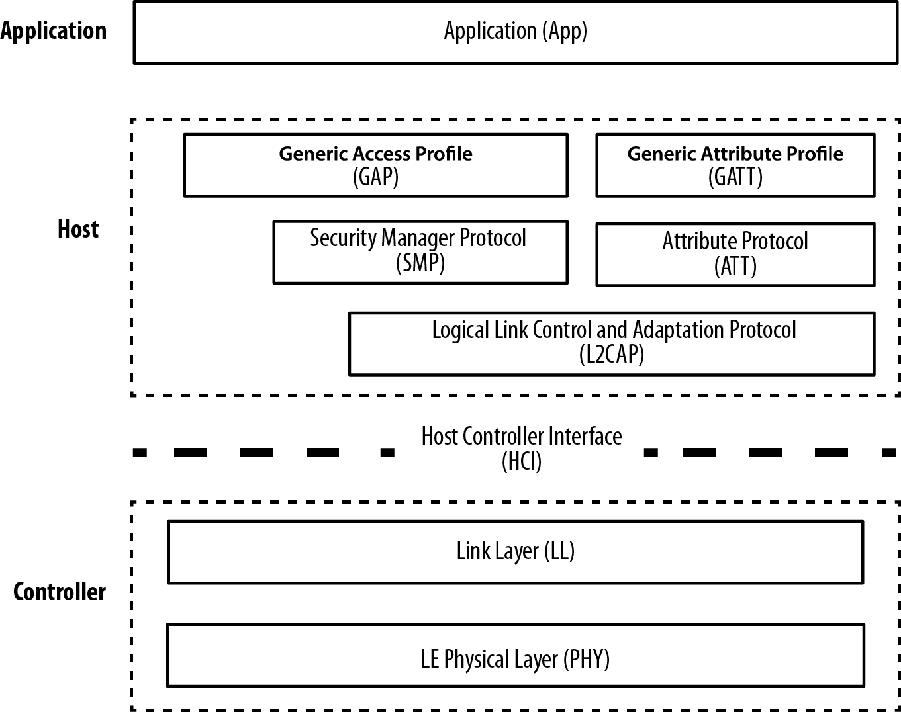
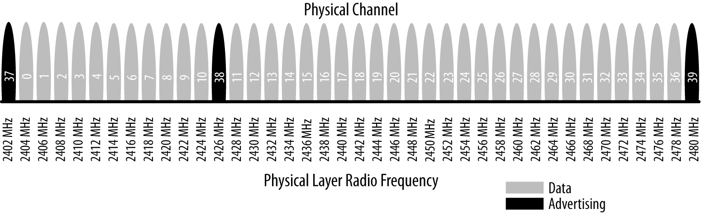
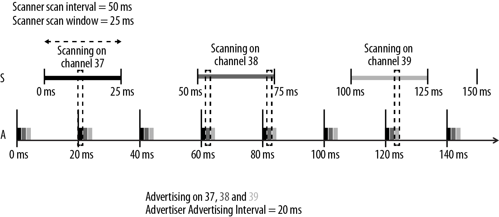
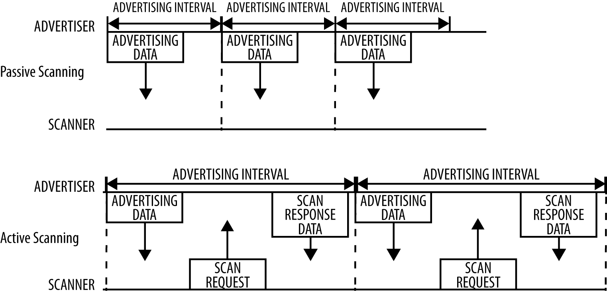
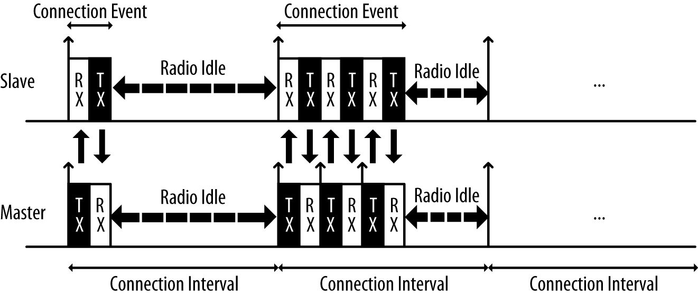
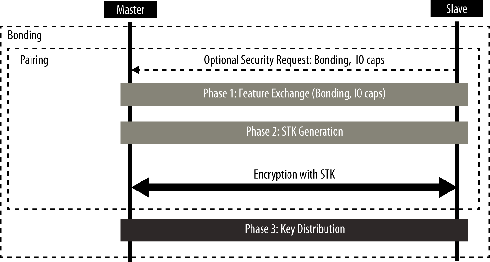

# 第二章 协议基础

尽管用户通常只直接与蓝牙低功耗（BLE）协议栈的上层交互，但最好还是从整个协议栈的基本概述开始，这将为理解 BLE 如何工作以及为何如此工作奠定坚实的基础。

如图 2-1 所示，一个完整的单模 BLE 设备分为三个部分：控制器（Controller）、主机（Host）和应用（Application）。

协议栈的每个基本构建块又分为多个提供所需功能的层：

*应用（Application）*

  与所有其他类型的系统一样，应用是最高层，负责包含与应用实现的实际用例相关的所有逻辑、用户界面和数据处理。应用的架构高度依赖于每个具体的实现。

*主机（Host）*

  包含以下层：

- 通用访问配置文件 Generic Access Profile（GAP）
- 通用属性配置文件 Generic Attribute Profile（GATT）
- 逻辑链路控制和适配协议 Logical Link Control and Adaptation Protocol（L2CAP）
- 属性协议 Attribute Protocol（ATT）
- 安全管理器 Security Manager（SM）
- 主机控制器接口 Host Controller Interface（HCI），主机端

*控制器（Controller）*

  包含以下层：

- 主机控制器接口 Host Controller Interface（HCI），控制器端
- 链路层 Link Layer（LL）
- 物理层 Physical Layer（PHY）

在本章中，各节的顺序将从下（天线）到上（用户界面）描述构成 BLE 设备的不同部分。

*图 2-1. BLE 协议栈*

## 物理层

物理层（PHY）是实际包含模拟通信电路的部分，能够调制和解调模拟信号并将其转换为数字符号。

射频使用 2.4 GHz ISM（工业、科学和医疗）频段进行通信，并将该频段从 2.4000 GHz 到 2.4835 GHz 划分为 40 个信道。如图 2-2 所示，其中 37 个信道用于连接数据，最后三个信道（37、38 和 39）用作广播信道，用于建立连接和发送广播数据。

*图 2-2. 频率信道*

该标准使用一种称为跳频扩频（Frequency-Hopping Spread Spectrum）的技术，射频在每个连接事件期间使用以下公式在信道之间跳变：

*信道 = (当前信道 + 跳频值) 取余 37 （ 原文：channel = (curr_channel + hop) mod 37 ）*

跳频值在连接建立时进行通信，因此每个新建立的连接都不同。这种技术最大限度地减少了 2.4 GHz 频段中任何单信道上可能存在的无线电干扰的影响，尤其是因为 WiFi 和经典蓝牙在该频段中非常普遍，设备在靠近强发射功率的设备时可能会遇到严重干扰。

选择用于在空中编码比特流的调制方式是高斯频移键控（Gaussian Frequency Shift Keying, GFSK），与经典蓝牙和几种其他专有低功耗无线协议使用的调制方式相同。BLE 的调制速率固定为 1 Mbit/s，因此这是该技术理论上的物理吞吐量上限。

> 注：实际上，正如任何其他协议栈，当谈到应用吞吐量时，由于各层的协议开销，这个上限实际上永远无法达到。

## 链路层

链路层是直接与 PHY 接口的部分，通常作为定制硬件和软件的组合实现。它也是整个协议栈中唯一具有硬实时约束的层，因为它负责遵守规范定义的所有时序要求。因此，它通常通过标准接口与协议栈的更高层保持隔离，该接口向其他层隐藏了复杂性和实时要求（参见后文[主机控制器接口（HCI）](#主机控制器接口-host-controller-interface-hci)）。

计算密集且易于自动化的功能通常由芯片厂商在硬件中实现，以避免使运行协议栈中所有软件层的中央处理器过载。这些功能通常包括：

- 前导码（Preamble）、访问地址（Access Address）和空中协议帧（air protocol framing）
- CRC 生成和校验
- 数据白化（Data whitening）
- 随机数生成
- AES 加密

链路层的软件部分管理射频的链路状态，即设备如何与其他设备连接。BLE 设备可以根据用例和需求充当主机（Master）、从机（Slave）或同时充当两者。发起连接的设备将成为主机，广播其可用性并接受连接的设备将成为从机。

一个主机可以连接多个从机，一个从机也可以连接多个主机。通常，智能手机或平板等设备倾向于充当主机，而更小、更简单且内存受限的设备（如独立传感器）通常采用从机角色。

BLE 在主机和从机设备的底层之间存在固有的不对称性，因为充当主机需要更多资源。这种不对称性与 USB 类似，USB 主机比 USB 设备需要更多资源。这种架构上的不对称性允许低成本的外围设备在廉价的微控制器和射频上运行，而大部分底层协议复杂性出现在具有更多资源的设备（如智能手机和平板）上。

链路层定义了以下角色：

*广播者（Advertiser）*

  发送广播数据包的设备。

*扫描者（Scanner）*

  扫描广播数据包的设备。

*主机（Master）*

  发起连接并在之后进行管理的设备。

*从机（Slave）*

  接受连接请求并遵循主机时序的设备。

这些角色可以逻辑地分为两对：广播者和扫描者（当未处于活跃连接时）以及主机和从机（当处于连接中时）。

### 蓝牙设备地址

蓝牙设备的基本标识符（类似于以太网媒体访问控制 MAC 地址）是蓝牙设备地址。这个 48 位（6 字节）的数字在对等设备中唯一标识一个设备。设备地址有两种类型，可以在特定设备上设置其中一种或两种：

*公共设备地址（Public device address）*

  这相当于固定的、BR/EDR 工厂预编程的设备地址。它必须在 IEEE 注册机构注册，并且在设备的整个生命周期内永远不会改变。

*随机设备地址（Random device address）*

  该地址可以在设备上预编程，也可以在运行时动态生成。它在 BLE 中有许多实际用途，更多细节请见后文[地址类型](#地址类型-address-types)。

每个过程必须使用这两种地址之一，由主机指定。

### 广播和扫描

BLE 只有一种数据包格式和两种类型的数据包（广播和数据包），这极大地简化了协议栈的实现。广播数据包有两个用途：

- 为不需要完整连接建立开销的应用广播数据
- 发现从机并连接到它们

每个广播数据包最多可携带 31 字节的广播数据有效载荷，以及基本头部信息（包括蓝牙设备地址）。此类数据包由广播者盲目地在空中广播，而无需事先知道是否有任何扫描设备存在。它们以由广播间隔定义的固定速率发送，范围从 20 ms 到 10.24 s。间隔越短，广播数据包广播的频率越高，扫描者接收到这些数据包的几率就越大，但传输的数据包越多也意味着功耗越高。

由于广播最多使用三个频率信道，且广播者和扫描者没有任何方式的同步，因此只有当它们随机重叠时，扫描者才能成功接收到广播数据包，如图 2-3 所示。

*图 2-3. 广播和扫描*

扫描间隔（scan interval）和扫描窗口（scan window）参数定义了扫描设备监听潜在广播数据包的频率和时长。与广播间隔一样，这些值对功耗有深远影响，因为它们直接关系到射频必须开启的时间量。

规范定义了两种基本的扫描过程：

*被动扫描（Passive scanning）*

  扫描者仅监听广播数据包，广播者永远不知道一个或多个数据包实际上已被扫描者接收。

*主动扫描（Active scanning）*

  扫描者在收到广播数据包后发出扫描请求（Scan Request）数据包。广播者收到后以扫描响应（Scan Response）数据包回应。这个额外的数据包使广播者能够发送给扫描者的有效载荷翻倍，但需要注意的是，这并不为扫描者提供任何向广播者发送用户数据的手段。

图 2-4 说明了被动扫描和主动扫描之间的区别。

*图 2-4. 主动和被动扫描*

广播数据包类型可以根据三种不同的属性进行分类。第一种是可连接性（connectability）：

*可连接的（Connectable）*

  扫描者可以在收到此类广播数据包后发起连接。

*不可连接的（Non-connectable）*

  扫描者无法发起连接（此数据包仅用于广播）。

第二种属性是可扫描性（scannability）：

*可扫描的（Scannable）*

  扫描者可以在收到此类广播数据包后发出扫描请求。

*不可扫描的（Non-scannable）*

  扫描者无法在收到此类广播数据包后发出扫描请求。

第三种是可定向性（directability）：

*定向的（Directed）*

  此类数据包的有效载荷中仅包含广播者和目标扫描者的蓝牙地址。不允许包含用户数据。因此所有定向广播数据包都是可连接的。

*非定向的（Undirected）*

  此类数据包不针对任何特定扫描者，并且其有效载荷中可以包含用户数据。

表 2-1 展示了不同的广播数据包类型及其属性。

*表 2-1. 广播数据包类型*

| 广播数据包类型   | 可连接的 | 可扫描的 | 定向的 | GAP 名称             |
| ---------------- | -------- | -------- | ------ | -------------------- |
| ADV_IND          | 是       | 是       | 否     | 可连接非定向广播     |
| ADV_DIRECT_IND   | 是       | 否       | 是     | 可连接定向广播       |
| ADV_NONCONN_IND  | 否       | 否       | 否     | 不可连接非定向广播   |
| ADV_SCAN_IND     | 否       | 是       | 否     | 可扫描非定向广播     |

广播数据包类型被上层（更具体地说是 GAP）用于区分操作模式和定义过程。因此，后文[模式和过程](#模式和过程-modes-and-procedures)在其核心部分大量使用它们。

### 连接

要建立连接，主机首先开始扫描以寻找当前接受连接请求的广播者。广播数据包可以根据蓝牙地址或广播数据本身进行过滤。当检测到合适的广播从机时，主机向从机发送连接请求数据包，如果从机响应，则建立连接。连接请求数据包包括频率跳频增量，这决定了主机和从机在连接生命周期内将遵循的跳频序列。

连接只是从机和主机在预定时间的数据交换序列。如图 2-5 所示，每次交换称为一个连接事件。

*图 2-5. 连接事件*

以下三个连接参数是主机在建立连接期间通信的另一组关键变量：

*连接间隔（Connection interval）*

  两个连续连接事件开始之间的时间。该值范围从 7.5 ms（高吞吐量）到 4 s（最低吞吐量但功耗也最低）。

*从机延迟（Slave latency）*

  从机可以选择跳过而不会导致断开的连接事件数量。

*连接监控超时（Connection supervision timeout）*

  在两个接收到的有效数据包之间的最大时间，超过此时间则认为连接已丢失。

由于给定区域内可能存在许多 BLE 设备，或者仅出于安全原因（主机或从机可能只对一小部分预知的设备感兴趣），链路层实现了白名单（white list）功能，指定广播者或扫描者感兴趣的设备地址。任何来自蓝牙地址不在白名单中的设备的广播（如果是扫描者）或连接请求（如果是广播者）数据包都将被简单地丢弃。

> ### 白名单
>
> 白名单是 BLE 控制器中提供的一个重要功能，允许主机在广播、扫描和建立连接时过滤设备。白名单只是由主机填充并存储在控制器中使用的蓝牙设备地址数组。
>
> 扫描或发起连接的设备可以使用白名单来限制将被检测或可连接的设备数量，广播设备可以使用白名单来指定它将接受来自哪些对端的传入连接。定义是否使用白名单的设置称为过滤策略（filter policy）。这本质上充当打开和关闭白名单过滤的开关。

数据包是协议的主力，用于在主机和从机之间双向传输用户数据。这些数据包的可用数据有效载荷为 27 字节，但协议栈中更上层的附加协议通常将实际用户数据量限制为每包 20 字节，尽管这在逻辑上取决于使用的协议。

需要注意的是，链路层充当可靠的数据承载体。所有接收到的数据包都会针对 24 位 CRC 进行检查，当错误检测发现传输失败时，会请求重传。重传没有上限；链路层将重新发送数据包，直到最终被接收方确认。

除了广播、扫描、建立（和拆除）连接以及发送和接收数据外，链路层还负责几个控制过程，包括这两个关键过程：

*更改连接参数*

  每个连接都以主机设定的一组连接参数建立，但条件和要求可能会在连接的生命周期内发生变化。从机可能会突然需要更高的吞吐量来进行短暂的数据突发，或者相反，它可能会检测到在不久的将来更长的连接间隔就足以保持连接活跃。链路层允许主机和从机请求新的连接参数，并且在主机的情况下，可以随时单方面设置它们。这样，每个连接都可以进行微调，以在吞吐量和功耗之间提供最佳平衡。

*加密*

  安全性在 BLE 中至关重要，链路层提供了通过加密链路安全交换数据的手段。密钥由主机生成和管理，但链路层对上层透明地执行实际的数据加密和解密。

这两个过程特别重要，因为它们都需要双方主机的参与才能执行。链路层还处理额外的内部交换版本信息和能力的过程，因此它们对主机和应用开发者都是透明的。

## 主机控制器接口（Host Controller Interface, HCI）

如第一章所述，蓝牙规范允许基于芯片数量的多种配置，主机控制器接口（HCI）是一种标准协议，允许主机和控制器通过串行接口进行通信。在这一级别划清界限是有意义的，因为如本章前面所述，控制器是唯一具有硬实时要求并与物理层接触的模块。这意味着将它与主机分开通常是实用的，主机实现了更复杂但对时序要求不那么严格的协议栈，更适合更高级的 CPU。

这种配置的典型例子包括大多数智能手机、平板和个人电脑，其中主机（和应用）在主 CPU 中运行，而控制器位于通过 UART 或 USB 连接的单独硬件芯片中。这与其他技术（如 WiFi 或以太网）使用的模型类似：TCP/IP 协议栈在主处理器上运行，而较低层在单独的 IC 中执行。

蓝牙规范将 HCI 定义为一组命令和事件，供主机和控制器相互交互，以及数据包格式和一组流量控制和其他过程的规则。此外，规范还定义了几种传输方式，每种都针对特定的物理传输（UART、USB、SDIO 等）增强了 HCI 协议。

半导体技术已经变得足够便宜，允许单颗芯片将完整的控制器、主机和应用集成在一个封装中（片上系统，或 SoC）。在许多嵌入式设备应用中，高度集成更可取，以降低最终设备的成本和尺寸。对于 BLE 来说，使用单颗芯片在低功耗 CPU 上同时运行所有三层来实现传感器是很常见的。

## 逻辑链路控制和适配协议（Logical Link Control and Adaptation Protocol, L2CAP）

这个名称相当神秘的逻辑链路控制和适配协议（L2CAP）提供两项主要功能。首先，它作为协议多路复用器，将来自上层的多个协议封装到标准 BLE 数据包格式中（反之亦然）。

它还执行分段和重组，这是一个将来自上层的大数据包分解为适合 BLE 数据包最大 27 字节有效载荷大小的块的过程（在发送端）。在接收端，它接收已分段的多个数据包并将它们重组为单个大数据包，然后将其发送到主机上层的适当实体。做一个简单的比较，L2CAP 类似于 TCP，它允许广泛的协议通过单个物理链路无缝共存，每个协议具有不同的数据包大小和要求。

对于 BLE，L2CAP 层负责路由两个主要协议：属性协议（ATT）和安全管理器协议（SMP）。ATT（参见后文[属性协议（ATT）](#属性协议-attribute-protocol-att)）构成了 BLE 应用中数据交换的基础，而 SMP（参见后文[安全管理器（SM）](#安全管理器-security-manager-sm)）提供了在对等方之间生成和分发安全密钥的框架。

此外，自规范 4.1 版本以来，L2CAP 可以创建自己的用户定义信道，用于高吞吐量数据传输，而无需 ATT 带来的额外复杂性。该功能最初为文件传输设计，称为 LE 基于信用的流量控制模式（LE Credit Based Flow Control Mode），为需要它的应用开辟了通过 BLE 连接建立低延迟、大容量数据信道的可能性。

从应用开发者的角度来看，需要注意的是，只要使用默认数据包大小，L2CAP 数据包头部就会占用 4 个字节，这意味着有效用户有效载荷长度为 27 - 4 = 23 字节（其中 27 字节是链路层的有效载荷大小，如前文[连接](#连接)中所述）。

## 属性协议（Attribute Protocol, ATT）

属性协议（ATT）是一个简单的客户端/服务器无状态协议，基于设备呈现的属性。在 BLE 中，每个设备都是客户端、服务器或两者兼有，无论它是主机还是从机。客户端向服务器请求数据，服务器向客户端发送数据。该协议在排序方面很严格：如果请求仍在挂起（尚未收到响应），则在收到并处理响应之前无法发送进一步的请求。在两个对等方同时充当客户端和服务器的情况下，这独立地适用于两个方向。

每个服务器包含以属性形式组织的数据，每个属性都分配了一个 16 位属性句柄（attribute handle）、一个通用唯一标识符（UUID）、一组权限，当然还有一个值。属性句柄只是用于访问属性值的标识符。UUID 指定值中包含的数据的类型和性质。更多信息，请见后文[UUID](#uuids)和[属性](#attributes)。

当客户端想要从服务器读取或写入属性值时，它会向服务器发出带有句柄的读取或写入请求。服务器将响应属性值或确认。在读取操作的情况下，由客户端解析值并根据属性的 UUID 理解数据类型。另一方面，在写入操作期间，客户端应提供与属性类型一致的数据，如果不是这样，服务器可以自由拒绝该操作。

### ATT 操作

ATT 上可能的操作属于以下类别：

*错误处理（Error Handling）*

  当发生错误时，服务器用于响应任何请求，仅包括：

  *错误响应（Error Response）*

    当错误阻止请求在服务器上执行时，作为对请求的响应发送，代替相应的操作响应。

*服务器配置（Server Configuration）*

  用于配置 ATT 协议本身，仅包括：

  *交换 MTU 请求/响应（Exchange MTU Request/Response）*

    客户端和服务器交换各自的最大传输单元（MTU 或最大可接受数据包大小）。

*查找信息（Find Information）*

  客户端用于获取有关服务器属性布局的信息，包括：

  *查找信息请求/响应（Find Information Request/Response）*

    获取特定句柄范围内的所有属性列表。

  *按类型值查找（Find by Type Value）*

    获取由其 UUID 和值标识的属性与下一个组分隔符之间的句柄范围。

*读取操作（Read Operations）*

  客户端用于获取一个或多个属性的值，包括：

  *按类型读取请求/响应（Read by Type Request/Response）*

    使用 UUID 获取一个或多个属性的值。

  *读取请求/响应（Read Request/Response）*

    使用句柄获取属性的值。

  *读取 Blob 请求/响应（Read Blob Request/Response）*

    使用句柄获取长属性值的一部分。

  *读取多个请求/响应（Read Multiple Request/Response）*

    使用多个句柄获取一个或多个属性的值。

  *按组类型读取请求/响应（Read by Group Type Request/Response）*

    与按类型读取类似，但 UUID 必须是分组类型。

*写入操作（Write Operations）*

  客户端用于设置一个或多个属性的值，包括：

  *写入请求/响应（Write Request/Response）*

    写入属性的值并期望从服务器得到响应。

  *写入命令（Write Command）*

    写入属性的值，无需任何响应或确认。此操作不遵循请求/响应排序，可以随时发送。

  *带签名的写入命令（Signed Write Command）*

    与写入命令类似，但使用如后文[安全管理器（SM）](#安全管理器-security-manager-sm)中所述的签名。此操作不遵循请求/响应排序，可以随时发送。

*排队写入（Queued Writes）*

  客户端用于写入比单个数据包能容纳的更长的属性值，包括：

  *准备写入请求/响应（Prepare Write Request/Response）*

    在服务器上为特定句柄排队写入操作，之后服务器确认排队成功。

  *执行写入请求/响应（Execute Write Request/Response）*

    执行所有挂起的排队写入操作，然后服务器向客户端报告成功或失败。

*服务器发起（Server Initiated）*

  服务器用于异步向客户端推送属性值，包括：

  *句柄值指示/确认（Handle Value Indication/Confirmation）*

    服务器异步更新属性的值并通过其句柄标识，期望从客户端获得确认形式的确认。

  *句柄值通知（Handle Value Notification）*

    服务器异步更新属性的值并通过其句柄标识，无需确认。此操作不遵循请求/响应排序，可以随时发送。

除服务器发起类别中的操作（以及其他一些特定操作）外，所有操作都分为请求/响应对。请求始终由客户端发送，响应由服务器作为对请求的回复发出。

[第四章](./chapter4.md)提供了有关 ATT 本身及其如何使能通用属性配置文件（GATT）的更多信息。

## 安全管理器（Security Manager, SM）

安全管理器（SM）既是一种协议，也是一系列安全算法，旨在为蓝牙协议栈提供生成和交换安全密钥的能力，从而使对等方能够通过加密链路安全通信，信任远程设备的身份，最后，如果需要避免恶意对等方跟踪特定设备，则可以隐藏公共蓝牙地址。

安全管理器定义了两个角色：

*发起方（Initiator）*

  始终对应链路层主机，因此也是 GAP 中心设备。

*响应方（Responder）*

  始终对应链路层从机，因此也是 GAP 外围设备。

虽然始终由发起方触发过程的开始，但响应方可以异步请求启动[安全过程](#安全过程-security-procedures)中列出的任何过程。对于响应方而言，没有保证发起方会实际注意该请求，这更像是一个提示而不是真正的、有约束力的请求。此安全请求在逻辑上只能由连接的从机或外围设备端发出。

### 安全过程（Security Procedures）

安全管理器支持以下三个过程：

*配对（Pairing）*

  生成临时公共安全加密密钥以切换到安全加密链路的过程。此临时密钥不存储，因此在后续连接中不可重用。

*绑定（Bonding）*

  配对后跟生成和交换永久安全密钥的序列，旨在存储在非易失性存储器中，因此在两个设备之间创建永久绑定，这将允许它们在后续连接中快速建立安全链路，而无需再次执行绑定过程。

*加密重新建立（Encryption Re-establishment）*

  绑定过程完成后，密钥可能已存储在连接的两端。如果已存储加密密钥，此过程定义如何在后续连接中使用这些密钥重新建立安全加密连接，而无需再次经过配对（或绑定）过程。

因此，配对可以创建仅持续连接生命周期的安全链路，而绑定实际上以共享安全密钥的形式创建了永久关联（也称为 bond），将用于后续连接，直到任一方决定删除它们。某些 API 及其文档有时使用术语*配对并绑定（pairing with bonding）*而不仅仅是*绑定*，因为绑定过程始终首先包括配对阶段。

图 2-6 展示了配对过程的两个阶段以及绑定过程所需的额外阶段。

最初（第一阶段），生成临时密钥所需的所有信息在两个设备之间交换。接下来（第二阶段），实际的临时加密密钥（短期密钥 Short Term Key 或 STK）在两端独立生成，然后用于加密连接。一旦连接通过加密得到保护，并且仅在执行绑定时，才可以分发永久密钥以供存储和以后重用。

*图 2-6. 配对和绑定序列*

### 配对算法

配对过程涉及安全管理器协议（SMP）数据包的交换，以在两端生成称为短期密钥（STK）的临时加密密钥。配对过程的最后一步（无论之后是否继续进行安全密钥交换即绑定过程）是使用之前生成的 STK 加密链路。在数据包交换期间，两个对等方协商以下 STK 生成方法之一：

*简单配对（Just Works）*

  STK 在两端基于明文交换的数据包生成。这不能防止中间人（MITM）攻击。

*口令显示（Passkey Display）*

  其中一个对等方显示随机生成的六位口令，另一方被要求输入它（或者在某些情况下，如果都没有显示器，则双方都输入密钥）。这提供了针对 MITM 攻击的保护，并在可能时使用。

*带外（Out Of Band, OOB）*

  使用此方法时，额外数据通过 BLE 射频以外的方式传输，例如另一种无线技术如 NFC。此方法也提供针对 MITM 攻击的保护。

SM 指定了以下三种类型的安全机制，可用于在连接期间或广播过程中强制执行不同级别的安全性：

*加密（Encryption）*

  此机制包括对通过已建立连接传输的所有数据包进行完整加密。

*隐私（Privacy）*

  隐私功能允许广播者通过使用与广播设备绑定的扫描者可识别的临时随机生成地址来隐藏其公共蓝牙地址。

*签名（Signing）*

  使用此机制，设备可以通过已建立的连接发送数字签名的未加密数据包（即，其来源可以验证）。

这三种机制中的每一种都可以独立于其他机制使用，应用与主机结合可以选择同时强制执行其中任何一种。

### 安全密钥

三种类型的安全机制中的每一种都需要建立一个密钥或一组密钥。以下是为执行安全机制而交换和存储的密钥：

*加密信息（长期密钥 Long Term Key 或 LTK）和主设备标识（Master Identification, EDIV, Rand）*

  这是双方共享的 128 位加密密钥（LTK）以及两个值（EDIV、Rand）作为其标识符，因为设备可能与多个其他对等方绑定。

*身份信息（身份解析密钥 Identity Resolving Key 或 IRK）和身份地址信息（地址类型和蓝牙设备地址）*

  IRK 用于实现隐私：它可以生成和解析可解析地址（参见后文[地址类型](#地址类型-address-types)），保护广播设备不被恶意对等方跟踪。分发 IRK 的设备的实际公共或静态随机地址与 IRK 一起包含。

*签名信息（连接签名解析密钥 Connection Signature Resolving Key 或 CSRK）*

  用于对未加密数据进行数字签名的密钥。

这些密钥或密钥集中的每一个都是非对称的和单向的：它只能在最初生成它们的相同角色配置中使用。如果设备希望在后续连接中切换链路层角色（主机和从机），则每方必须为每种密钥类型分发自有的密钥集。设备协商每个方向分发的密钥数量，每个方向可以从零到所有三种密钥类型不等，总共在对等方之间分发六个密钥（从从机到主机三个，从主机到从机三个）。

> 注：如果在绑定过程中根本没有交换密钥，两个设备之间的绑定仍然有效，但它们之间将没有任何安全过程可用。

由于每个密钥都是非对称的（因此密钥分发过程是对称的），并且两个设备之间存储的每个绑定信息最多可以包含每个密钥的两个实例（每方已分发自己的密钥），因此需要注意的是每方分发的密钥如何在后续连接中使用。表 2-2 根据绑定过程中的分发者和接受者详细说明了此用法。

*表 2-2. 安全管理器密钥用法*

| 密钥                    | 分发者用法               | 接受者用法               |
| ----------------------- | ------------------------ | ------------------------ |
| LTK, EDIV, Rand（加密） | 当为从机时用于加密链路   | 当为主机时用于加密链路   |
| IRK, BD_ADDR（隐私）    | 用于生成可解析的私有地址 | 用于解析可解析的私有地址 |
| CSRK（签名）            | 用于签名数据             | 用于验证签名             |

作为带密钥分发的绑定的例子，假设两个设备，一个充当主机的平板和一个充当从机的手表，执行绑定过程并在两个方向上交换加密密钥。手表将以其加密信息和主设备标识的形式分发自己的加密密钥（我们称之为 LTK_EDIV_Rand_watch），平板将在相反方向做同样的事情（LTK_EDIV_Rand_tablet）。

绑定完成后，链路可以断开连接，然后两个设备可能想要重新连接并重用这些密钥来重新建立安全加密连接，而无需再次经过绑定过程。如果设备以与之前相同的配置重新连接，平板充当主机，则双方都将使用 LTK_EDIV_Rand_watch 来加密链路。如果稍后两个设备以切换的角色重新连接（即，手表这次充当主机，平板充当从机），则可以使用 LTK_EDIV_Rand_tablet 来加密链路。

[第三章](./chapter3.md)将更详细地扩展这些概念。

## 通用属性配置文件（Generic Attribute Profile, GATT）

通用属性配置文件（GATT）建立在属性协议（ATT）之上，并在其之上添加了层次结构和数据抽象模型。在某种程度上，它可以被视为 BLE 数据传输的主干，因为它定义了数据如何在应用之间组织和交换。

它定义了可由各种应用配置文件（称为基于 GATT 的配置文件）使用和重用的通用数据对象。它保留了 ATT 中存在的相同客户端/服务器架构，但现在数据封装在服务中，服务由一个或多个特征组成。每个特征可以被视为用户数据与元数据（关于该值的描述性信息，如属性、用户可见名称、单位等）的结合。

[第四章](./chapter4.md)更详细地讨论了 GATT。与 GAP 一起，GATT 是充当蓝牙低功耗协议栈主要接口的上层实体。

## 通用访问配置文件（Generic Access Profile, GAP）

通用访问配置文件（GAP）规定了设备在实际协议栈之外的较低级别如何相互交互。GAP 可以被视为定义了 BLE 的顶层控制层，因为它指定了设备如何执行设备发现、连接、安全建立等控制过程，以确保互操作性并允许来自不同厂商的设备之间进行数据交换。

GAP 建立了一系列不同的规则和概念来规范和标准化设备的低级操作：

- 角色及其之间的交互
- 操作模式及在这些模式之间的转换
- 实现一致和互操作通信的操作过程
- 安全方面，包括安全模式和过程
- 非协议数据的额外数据格式

[第三章](./chapter3.md)更详细地讨论了 GAP。
