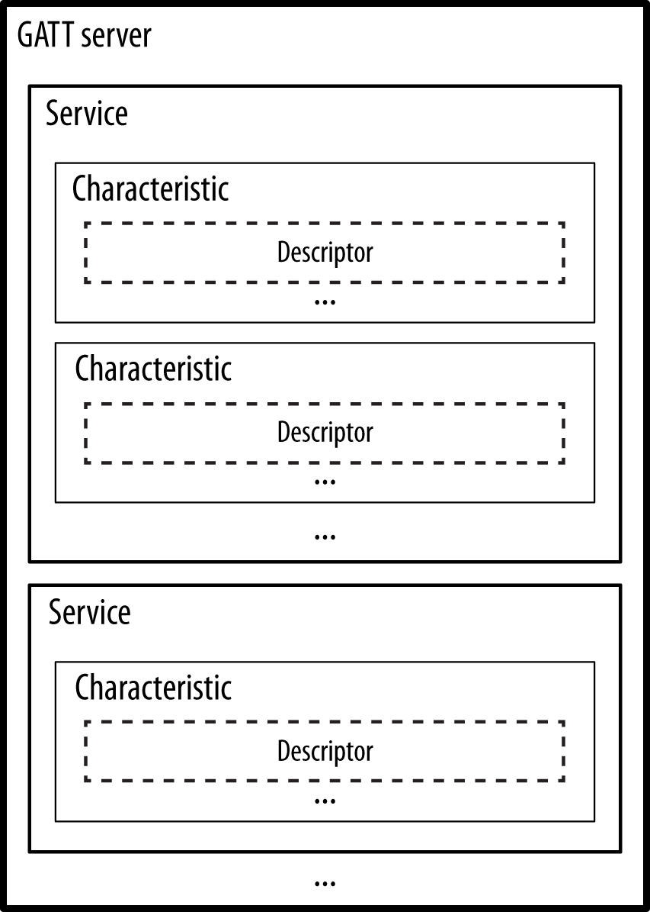
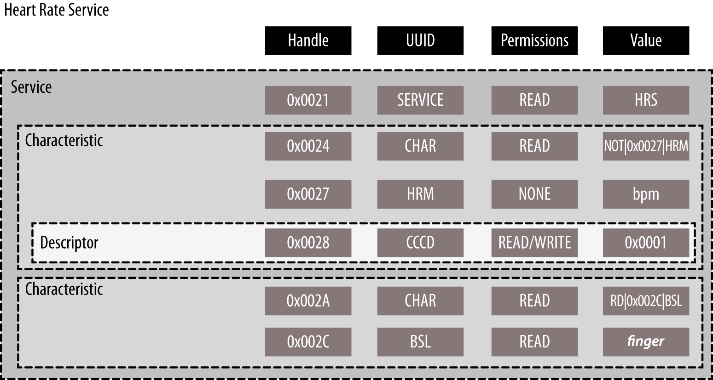

# 第四章 GATT（服务和特征）

通用属性配置文件（Generic Attribute Profile, GATT）详细规定了如何通过 BLE 连接交换所有配置文件和用户数据。与定义设备底层交互的 GAP（第三章）不同，GATT 仅处理实际的数据传输过程和格式。

GATT 还为所有基于 GATT 的配置文件（见第一章[SIG 定义的基于 GATT 的配置文件](./chapter1.md#sig-定义的基于-gatt-的配置文件)）提供了参考框架，这些配置文件涵盖了具体的用例并确保来自不同供应商的设备之间的互操作性。因此，所有标准 BLE 配置文件都基于 GATT 并且必须遵守它才能正确运行。这使得 GATT 成为 BLE 规范中的关键部分，因为与应用程序和用户相关的每一项数据都必须根据其规则进行格式化、打包和发送。

GATT 使用属性协议（详见第二章[属性协议（ATT）](./chapter2.md#属性协议-attribute-protocol-att)）作为其传输协议来交换设备之间的数据。这些数据按层次结构组织成称为服务（services）的部分，这些服务将概念上相关的用户数据分组为特征（characteristics）。这决定了本章讨论的 GATT 的许多基本方面。

## 角色

与蓝牙规范中的任何其他协议或配置文件一样，GATT 首先定义交互设备可以采用的角色：

*客户端（Client）*

  GATT 客户端对应于第二章[属性协议（ATT）](./chapter2.md#属性协议-attribute-protocol-att)中讨论的 ATT 客户端。它向服务器发送请求并从中接收响应（以及服务器发起的更新）。GATT 客户端事先对服务器的属性一无所知，因此它必须首先通过执行服务发现来查询这些属性的存在和性质。完成服务发现后，它可以开始读取和写入服务器中找到的属性，以及接收服务器发起的更新。

*服务器（Server）*

  GATT 服务器对应于第二章[属性协议（ATT）](./chapter2.md#属性协议-attribute-protocol-att)中讨论的 ATT 服务器。它接收来自客户端的请求并发送响应。它还在配置时发送服务器发起的更新，并且负责存储用户数据并以属性形式组织，使其对客户端可用。每个出售的 BLE 设备都必须包含至少一个基本的 GATT 服务器，可以响应客户端请求，即使只是返回错误响应。

值得再次提及的是，GATT 角色既完全独立于 GAP 角色（见第三章[角色](./chapter3.md#角色)），又彼此兼容。这意味着 GAP 中心设备和 GAP 外围设备都可以充当 GATT 客户端或服务器，甚至同时充当两者。

## UUID

通用唯一标识符（Universally Unique Identifier, UUID）是一个 128 位（16 字节）的数字，保证（或有很高概率）在全球范围内唯一。UUID 被用于蓝牙之外的许多协议和应用程序中，其格式、使用和生成在 ITU-T Rec. X.667（也称为 ISO/IEC 9834-8:2005）中指定。

为了提高效率，也因为 16 字节会占用链路层 27 字节数据有效载荷的很大一部分，BLE 规范增加了两种额外的 UUID 格式：16 位和 32 位 UUID。这些缩短的格式只能用于蓝牙规范中定义的 UUID（即由蓝牙 SIG 列为标准蓝牙 UUID 的 UUID）。

要从缩短版本重建完整的 128 位 UUID，请将 16 位或 32 位短值（用 xxxxxxxx 表示，包括前导零）插入蓝牙基础 UUID：

*xxxxxxxx-0000-1000-8000-00805F9B34FB*

SIG 为其定义和指定的所有类型、服务和配置文件提供（缩短的）UUID。但如果你的应用程序需要自己的 UUID，无论是因为 SIG 提供的 UUID 不满足你的需求，还是因为你想实现配置文件规范中之前未考虑的新用例，你可以使用 ITU 的 UUID 生成页面生成它们。

对于不是从蓝牙基础 UUID 派生的 UUID（通常称为供应商特定 UUID），不提供缩短功能。在这些情况下，你需要始终使用完整的 128 位 UUID 值。

## 属性

属性（Attributes）是 GATT（和 ATT）定义的最小数据实体。它们是可寻址的信息片段，可以包含有关服务器中包含的不同属性的结构和分组的相关用户数据（或元数据）。GATT 和 ATT 只能使用属性工作，因此为了使客户端和服务器交互，所有信息都必须以这种形式组织。

从概念上讲，属性始终位于服务器上并由客户端访问（并可能修改）。规范仅在概念上定义属性，并不强制 ATT 和 GATT 实现使用特定的内部存储格式或机制。因为属性包含不变性质的静态定义以及实际的用户（通常是传感器）数据，这些数据必然会随时间快速变化（如[属性和数据层次结构](#属性和数据层次结构)中所述），属性通常存储在非易失性存储器和 RAM 的混合中。

每个属性都包含有关属性本身的信息，然后是实际数据，在以下各节中描述的字段中。

### 句柄（Handle）

属性句柄是特定 GATT 服务器上每个属性的唯一 16 位标识符。它是使每个属性可寻址的部分，并保证在事务之间（对于绑定设备，甚至跨连接）不会改变（如[属性缓存](#属性缓存)中所述的例外情况）。因为值 0x0000 表示无效句柄，每个 GATT 服务器可用的句柄数量为 0xFFFE（65535），尽管实际上服务器中的属性数量通常接近几十个。

> 注意：每当在属性句柄的上下文中使用时，术语"句柄范围"指的是句柄包含在两个给定边界之间的所有属性。例如，句柄范围 0x0100-0x010A 将引用句柄在 0x0100 和 0x010A 之间的任何属性。

在 GATT 服务器内，句柄的增长值决定了客户端可以访问的属性的有序序列。但允许句柄之间存在间隙，因此客户端不能依赖连续序列来猜测下一个属性的位置。相反，客户端必须使用发现功能（[服务和特征发现](#服务和特征发现)）来获取它感兴趣的属性的句柄。

### 类型（Type）

属性类型无非是一个 UUID（见[UUID](#uuid)）。这可以是 16 位、32 位或 128 位 UUID，分别占用 2、4 或 16 字节。类型决定了属性值中存在的数据类型，并且有机制可以仅基于类型发现属性（见[服务和特征发现](#服务和特征发现)）。

虽然属性类型始终是 UUID，但可以使用多种类型的 UUID 来填充类型。它们可以是确定 GATT 服务器属性层次结构布局的标准 UUID（如[属性和数据层次结构](#属性和数据层次结构)中进一步讨论的），例如服务或特征 UUID，指定属性中包含的数据类型的配置文件 UUID，如心率测量或温度，甚至是专有的供应商特定 UUID，其含义由供应商分配并取决于实现。

### 权限（Permissions）

权限是指定可以在每个特定属性上执行哪些 ATT 操作（见第二章[ATT 操作](./chapter2.md#att-操作)）以及具有哪些特定安全要求的元数据。

ATT 和 GATT 定义以下权限：

*访问权限（Access Permissions）*

  类似于文件权限，访问权限确定客户端是否可以读取或写入（或两者）属性值（在[值](#值-value)中介绍）。每个属性可以具有以下访问权限之一：

  *无（None）*

    属性既不能被客户端读取也不能被写入。

  *可读（Readable）*

    属性可以被客户端读取。

  *可写（Writable）*

    属性可以被客户端写入。

  *可读可写（Readable and writable）*

    属性可以被客户端读取和写入。

*加密（Encryption）*

  确定客户端访问此属性是否需要一定级别的加密。（有关认证和加密的更多信息，请参见第三章[认证](./chapter3.md#认证)、[安全模式和过程](./chapter3.md#安全模式和过程)和[安全模式](./chapter3.md#安全模式)）。以下是 GATT 定义的允许的加密权限：

  *不需要加密（安全模式 1，级别 1）*

    属性可以在明文、未加密的连接上访问。

  *需要未认证加密（安全模式 1，级别 2）*

    连接必须加密才能访问此属性，但加密密钥不需要认证（尽管可以认证）。

  *需要已认证加密（安全模式 1，级别 3）*

    连接必须使用已认证密钥加密才能访问此属性。

*授权（Authorization）*

  确定访问此属性是否需要用户权限（也称为授权，如第三章[安全模式和过程](./chapter3.md#安全模式和过程)中所述）。属性只能在需要或不需要授权之间选择：

  *不需要授权*

    访问此属性不需要授权。

  *需要授权*

    访问此属性需要授权。

所有权限彼此独立，服务器可以自由组合，并按每个属性存储它们。

### 值（Value）

属性值包含属性的实际数据内容。对其可以包含的数据类型没有限制（你可以将其想象为一个无类型缓冲区，可以根据属性类型转换为任何实际类型），尽管其最大长度被规范限制为 512 字节。

如[属性和数据层次结构](#属性和数据层次结构)中所述，根据属性类型，值可以包含有关属性本身的额外信息或实际的、有用的、用户定义的应用数据。这是客户端可以自由访问（在适当权限允许的情况下）读取和写入的属性部分。所有其他实体构成属性的结构，客户端无法直接修改或访问（尽管客户端在与服务器的大多数交互中间接使用句柄和 UUID）。

你可以将 GATT 服务器中包含的整个属性集视为一个表（如表 4-1），每行代表单个属性，每列代表实际构成属性的不同部分。

*表 4-1. 以表形式表示的属性*

| 句柄   | 类型          | 权限                   | 值                    | 值长度 |
| ------ | ------------- | ---------------------- | --------------------- | ------ |
| 0x0201 | UUID1 (16 位) | 只读，无安全要求       | 0x180A                | 2      |
| 0x0202 | UUID2 (16 位) | 只读，无安全要求       | 0x2A29                | 2      |
| 0x0215 | UUID3 (16 位) | 读/写，需要授权        | "a readable UTF-8 string" | 23   |
| 0x030C | UUID4 (128 位)| 只写，无安全要求       | {0xFF, 0xFF, 0x00, 0x00} | 4   |
| 0x030D | UUID5 (128 位)| 读/写，需要已认证加密  | 36.43                 | 8      |
| 0x031A | UUID1 (16 位) | 只读，无安全要求       | 0x1801                | 2      |

在这个虚构的 GATT 服务器中，它包含的属性被表示为简单表的行。这个特定的 GATT 服务器恰好只托管五个属性（与实际设备相比数量相当少）。请注意，如本节前面所述，不同属性的句柄不需要立即连续，但顺序序列必须递增，如本例所示。

表的值列旨在反映不同基于 GATT 的配置文件中属性值可以包含的高度多样化的格式。句柄为 0x0201、0x0202 和 0x031A 的属性在其各自的值字段中包含 16 位整数。句柄为 0x0215 的属性包含 UTF-8 字符串，0x030C 包含 4 字节缓冲区，0x030D 在其值字段中保存 IEEE-754 64 位浮点数。

## 属性和数据层次结构

虽然蓝牙规范在 ATT 部分定义了属性，但 ATT 在属性方面仅此而已。ATT 以属性术语运行，并依赖于[属性](#属性)中介绍的所有概念，提供一系列精确的协议数据单元（PDU，通常称为数据包），允许客户端访问服务器上的属性。

GATT 进一步建立了严格的层次结构，以可重用和实用的方式组织属性，允许客户端和服务器之间的信息访问和检索遵循一组简洁的规则，这些规则共同构成了所有基于 GATT 的配置文件使用的框架。

图 4-1 说明了 GATT 引入的数据层次结构。

*图 4-1. GATT 数据层次结构*

GATT 服务器中的属性被分组为服务，每个服务可以包含零个或多个特征。这些特征又可以包含零个或多个描述符。对于任何声称 GATT 兼容性的设备（本质上，所有出售的 BLE 设备），此层次结构都被严格执行，这意味着 GATT 服务器中的所有属性都包含在这三个类别之一，没有例外。没有悬空的属性可以存在于这个层次结构之外，因为 BLE 设备之间的数据交换依赖于它。

对于 GATT 层次结构中的大多数数据类型，区分它们的定义（构成它的整个属性组）和声明非常重要。声明是始终放在定义内第一个（按句柄递增顺序）的单个属性，并引入了有关后续数据的大部分元数据。所有声明都具有只读权限，不需要安全要求，因为它们不能包含敏感数据。它们只是结构属性，允许客户端找出并发现服务器上属性的布局和性质。

### 服务（Services）

GATT 服务将概念上相关的属性分组到 GATT 服务器中属性信息集的一个公共部分。规范将单个服务内的所有属性称为服务定义（service definition）。因此，GATT 服务器的属性实际上是一系列服务定义，每个定义都以标记服务开始的单个属性开始（恰当地命名为服务声明）。此属性的类型和值格式在 GATT 中严格指定，如表 4-2 所示。

*表 4-2. 服务声明属性*

| 句柄   | 类型                              | 权限 | 值        | 值长度        |
| ------ | --------------------------------- | ---- | --------- | ------------- |
| 0xNNNN | UUID_primary_service 或 UUID_secondary_service | 只读 | 服务 UUID | 2、4 或 16 字节 |

在表 4-2 所示的声明中，UUID_primary_service（0x2800）和 UUID_secondary_service（0x2801）指的是标准的、SIG 分配的 UUID，用作引入服务的专用类型。它们自然是 16 位 UUID（因为它们是规范定义的基本 UUID）。

主要服务和次要服务之间的区别很重要。主要服务（primary service）是 GATT 服务的标准类型，包括 GATT 服务器公开的相关标准功能。另一方面，次要服务（secondary service）旨在仅包含在其他主要服务中，并且仅作为其修饰符才有意义，本身没有实际意义。实际上，次要服务很少使用。

服务声明属性本身的值包含一个 UUID（如[值](#值-value)中所述，属性的值可以是任何数据类型），这次对应于此声明引入的实际服务的 UUID。

虽然服务声明必须始终是服务的第一个属性，但在下一个服务声明之前可以跟随许多其他属性，通常以特征和描述符的形式。

从概念上讲，你可以将 GATT 服务视为任何现代面向对象语言中的类，包括实例化，因为服务可以在单个 GATT 服务器内多次实例化（然而，这并不常见，大多数服务因此类似于单例）。

在服务定义内部（也就是说，在服务内部），你可以使用包含定义（include definitions）添加对一个或多个其他服务的引用。包含定义由单个属性（包含声明）组成，其中包含客户端引用被包含服务所需的所有详细信息。

被包含的服务有助于避免在 GATT 服务器中复制数据。如果服务将被其他服务引用，你可以使用此机制来节省内存并简化 GATT 服务器的布局。在与类和对象的先前类比中，你可以将包含定义视为指向现有对象实例的指针或引用。

表 4-3 显示了包含声明属性及其所有字段。

*表 4-3. 包含声明属性*

| 句柄   | 类型         | 权限 | 值                                    | 值长度       |
| ------ | ------------ | ---- | ------------------------------------- | ------------ |
| 0xNNNN | UUID_include | 只读 | 被包含服务句柄、结束组句柄、被包含服务 UUID | 6、8 或 20 字节 |

同样，UUID_include（0x2802）是 SIG 分配的特殊 UUID，专门用于包含声明，此情况下的值字段包含被包含服务的起始和结束句柄，以及其 UUID。

### 特征（Characteristics）

你可以将特征理解为用户数据的容器。它们始终包含至少两个属性：特征声明（提供有关实际用户数据的元数据）和特征值（包含值字段中用户数据的完整属性）。

此外，特征值后面可以跟随描述符，这些描述符进一步扩展了特征声明中包含的元数据。声明、值和任何描述符一起形成特征定义（characteristic definition），这是构成单个特征的属性束。

表 4-4 显示了每个特征的前两个属性的结构。

*表 4-4. 特征声明和特征值属性*

| 句柄   | 类型           | 权限 | 值                               | 值长度       |
| ------ | -------------- | ---- | -------------------------------- | ------------ |
| 0xNNNN | UUID_characteristic | 只读 | 属性、值句柄（0xMMMM）、特征 UUID | 5、7 或 19 字节 |
| 0xMMMM | 特征 UUID      | 任意 | 实际值                           | 可变         |

所有 GATT 特征始终是服务的一部分，因此始终可以在服务中找到它们。

#### 特征声明属性

同样，特征声明属性的类型 UUID（0x2803）是标准化的、唯一的 UUID，专门用于表示特征的开始。与所有其他声明（如服务和包含）一样，此属性具有只读权限，因为客户端只允许检索其值，但在任何情况下都不能修改它。

表 4-5 列出了特征声明属性值中连接的不同项。

*表 4-5. 特征声明属性值*

| 名称                | 长度（字节） | 描述                           |
| ------------------- | ------------ | ------------------------------ |
| 特征属性            | 1            | 列出此特征允许的操作的位字段   |
| 特征值句柄          | 2            | 包含特征值的属性的句柄         |
| 特征 UUID           | 2、4 或 16   | 此特定特征的 UUID              |

这三个字段包含在特征声明属性值中：

*特征属性（Characteristic Properties）*

  这个 8 位位字段，加上扩展属性描述符中的额外两位（在[扩展属性描述符](#扩展属性描述符)中讨论），包含可以与此特征一起使用的操作和过程。表 4-6 中显示的位字段上，每个属性被编码为单个位。

*表 4-6. 特征属性*

| 属性           | 位置     | 描述                                                         |
| -------------- | -------- | ------------------------------------------------------------ |
| 广播           | 属性     | 如果设置，允许将此特征值放入广播数据包中，使用服务数据 AD 类型（见[GATT 属性数据在广播数据包中](#gatt-属性数据在广播数据包中)） |
| 读             | 属性     | 如果设置，允许客户端使用[ATT 操作](./chapter2.md#att-操作)中列出的任何 ATT 读操作读取此特征 |
| 写入无响应     | 属性     | 如果设置，允许客户端对此特征使用写入命令 ATT 操作（见[ATT 操作](./chapter2.md#att-操作)） |
| 写入           | 属性     | 如果设置，允许客户端对此特征使用写入请求/响应 ATT 操作（见[ATT 操作](./chapter2.md#att-操作)） |
| 通知           | 属性     | 如果设置，允许服务器对此特征使用句柄值通知 ATT 操作（见[ATT 操作](./chapter2.md#att-操作)） |
| 指示           | 属性     | 如果设置，允许服务器对此特征使用句柄值指示/确认 ATT 操作（见[ATT 操作](./chapter2.md#att-操作)） |
| 带签名写入命令 | 属性     | 如果设置，允许客户端对此特征使用带签名写入命令 ATT 操作（见[ATT 操作](./chapter2.md#att-操作)） |
| 队列写入       | 扩展属性 | 如果设置，允许客户端对此特征使用队列写入 ATT 操作（见[ATT 操作](./chapter2.md#att-操作)） |
| 可写辅助项     | 扩展属性 | 如果设置，客户端可以写入[特征用户描述描述符](#特征用户描述描述符)中描述的描述符 |

客户端可以读取这些属性以找出允许对特征执行哪些操作。这对于通知和指示属性特别重要，因为这些操作由服务器发起（在[服务器发起的更新](#服务器发起的更新)中进一步详细说明），但要求客户端首先使用[客户端特征配置描述符](#客户端特征配置描述符)中描述的描述符启用它们。

*特征值句柄（Characteristic Value Handle）*

  这两个字节包含包含特征实际值的属性的句柄。虽然经常如此，但你不应该假设这个句柄将与包含声明的句柄连续（即 0xNNNN+1）。

*特征 UUID（Characteristic UUID）*

  特定特征的 UUID，这可以是 SIG 批准的 UUID（在使用标准配置文件中包含的数十种特征类型时），否则是 128 位供应商特定 UUID。

继续使用类和面向对象的类比，特征就像该类中的单个字段或属性，而配置文件就像为特定需求或目的使用一个或多个类的应用程序。

#### 特征值属性

最后，特征值属性包含客户端可以读取和写入的实际用户数据，用于实际信息交换。此属性的类型始终与特征声明值字段中找到的相同 UUID（如[特征声明属性](#特征声明属性)中所示）。因此，特征值属性不再有服务或特征的类型，而是具体的、特定的 UUID，可以指传感器的读数或键盘上的按键。

特征值属性的值可以包含任何可以想象的数据类型，从摄氏温度到按键扫描码再到显示字符串再到英里每小时的速度——任何可以通过两个 BLE 设备有效传输的内容都可以填充该值的内容。

### 特征描述符

GATT 特征描述符（通常简称为描述符）主要用于为客户端提供元数据（关于特征及其值的额外信息）。它们始终放在特征定义内，在特征值属性之后。描述符始终由单个属性组成，即特征描述符声明，其 UUID 始终是描述符类型，其值包含该特定描述符类型定义的内容。

你可以在不同的 GATT 特征中找到两种类型的描述符：

*GATT 定义的描述符*

  这些是基础的、广泛使用的描述符类型，仅添加有关特征的元信息。以下各节描述了最常见的描述符。

*配置文件或供应商定义的描述符*

  无论配置文件是由 SIG 还是特定供应商指定和发布，这些描述符都可以包含所有类型的数据，包括有关特征值的额外信息，如用于从传感器获取值的编码或补充读取本身的任何其他细节。

以下各节描述了 GATT 定义的一些最常用的描述符。

#### 扩展属性描述符

此描述符（如果存在）仅包含两个额外的属性位，在[特征声明属性](#特征声明属性)中介绍，并列在表 4-6 中。

#### 特征用户描述描述符

顾名思义，此描述符包含其所在特征的用户可读描述。这是一个 UTF-8 字符串，例如可以读取"客厅的温度"。

#### 客户端特征配置描述符

此描述符类型（通常缩写为 CCCD）无疑是最重要和最常用的，对于大多数配置文件和用例的操作至关重要。其功能很简单：它充当开关，启用或禁用服务器发起的更新（在[服务器发起的更新](#服务器发起的更新)中更详细地介绍），但仅适用于其所在的特征。

> #### 为什么提供通知开关？
>
> 如前所述，客户端事先对服务器的属性一无所知，因此它需要执行发现以找出服务器上存在哪些服务、特征和描述符。只要特征值发生变化，服务器就会异步发送服务器发起的更新（句柄值通知和句柄值指示，在第二章[ATT 操作](./chapter2.md#att-操作)中介绍），格式化为仅包含属性句柄和带有值的字节数组的数据包。
>
> 如果客户端尚未发现服务器上的所有特征和描述符句柄，它可能还无法将那些通知和指示中接收到的数据与特定类型关联起来，使这些空中事务变得无用。此外，即使客户端可以识别所有句柄及其对应的服务和特征，也可能有时候（也许因为应用程序不可见，也许因为客户端仅使用服务器中的许多服务和特征之一）客户端根本不希望接收更新。这就是 CCCD 发挥作用的地方，允许对所有支持它们的特征进行细粒度的通知和指示启用和禁用。

CCCD 的值只是一个两位位字段，一位对应通知，另一位对应指示。客户端可以随时设置和清除这些位，服务器将在包含它们的特征值发生变化且可能需要进行空中更新时每次检查它们。

每次客户端想要为支持它们的特定特征启用通知或指示时，它只需使用写入请求 ATT 数据包将相应位设置为 1。然后服务器将回复写入响应，并在想要提醒客户端值变化时开始发送适当的数据包。

此外，CCCD 有两个特殊属性使它们与其他属性不同：

*它们的值在每个连接中是唯一的*

  在多连接场景中，中心设备连接到多个外围设备并充当 GATT 服务器，每个外围设备在使用 ATT 读取时将收到自己的 CCCD 值副本。

*它们的值在与绑定设备的连接中保留*

  [属性缓存](#属性缓存)更详细地讨论了属性缓存，但这仅涉及属性句柄。值通常不按设备存储，GATT 服务器可以在连接之间重置它们。绑定设备之间的 CCCD 不是这种情况：客户端写入服务器上 CCCD 的最后一个值保证在重新连接时恢复，无论连接之间经过的时间如何。

许多协议栈都有特殊的机制来处理 CCCD，无论是从客户端还是服务器的角度，因为它们对正确操作和保证对等方之间的及时数据更新至关重要。

#### 特征呈现格式描述符

当存在时，此描述符类型在其七字节属性值中包含所包围特征值的实际格式。可用的格式列表包括布尔值、字符串、整数、浮点数，甚至是通用的无类型缓冲区。

### 服务示例

本节介绍了当今许多商业产品中发现的特定服务的示例。心率服务（Heart Rate Service, HRS）向监测设备暴露用户的心率。

图 4-2 展示了虚构服务器上的 HRS 实例。这不是服务器中包含的唯一服务，因此你可以将其视为客户端可以访问的完整属性集的部分切片。

*图 4-2. GATT 心率服务*

以下是图 4-2 所示 HRS 服务的逐句柄描述：

*句柄 0x0021*

  此属性包含心率服务的服务声明（见[服务](#服务)）。以下是服务声明属性的字段：

  *UUID*

    UUID 是主要服务声明的标准 16 位 UUID，UUID_primary_service（0x2800）。

  *值*

    该值是心率服务的 16 位 UUID，由 SIG 分配（0x180D）。

*句柄 0x0024*

  此属性包含心率测量特征的特征声明（见[特征声明属性](#特征声明属性)）。以下是特征声明属性的字段：

  *UUID*

    UUID 是特征声明的标准 16 位 UUID，UUID_characteristic（0x2803）。

  *值*

    此特征的特征属性仅为通知，特征值句柄为 0x0027，特征值 UUID 是心率测量的 UUID（0x2A37）。

*句柄 0x0027*

  此属性包含特征值（见[特征值属性](#特征值属性)），在这种情况下为心率测量本身。以下是特征值属性的字段：

  *UUID*

    与特征定义属性值最后两个字节中存在的相同 UUID。

  *权限*

    此属性的值既不可读也不可写：客户端只能通过服务器发送的通知获取其值。

  *值*

    实际的心率测量（为清楚起见，以每分钟心跳次数虚拟表示）。

*句柄 0x0028*

  此属性包含 CCCD（[客户端特征配置描述符](#客户端特征配置描述符)中描述的关键描述符）。以下是 CCCD 属性的字段：

  *UUID*

    任何 CCCD 的 UUID 始终是标准的 16 位 UUID_CCCD（0x2902）。

  *权限*

    CCCD 必须始终可读可写。执行这些操作所需的安全级别由配置文件或应用程序定义。

  *值*

    如前所述，CCCD 的值是一个位字段，在这种情况下为 0x0001，表示此特定 HRM 特征的通知已启用。

*句柄 0x002A*

  此属性包含另一个特征声明（见[特征声明属性](#特征声明属性)），这次是身体传感器位置特征。以下是特征声明属性的字段：

  *UUID*

    UUID 是特征声明的标准 16 位 UUID，UUID_characteristic（0x2803）。

  *值*

    此特征的特征属性仅为只读，特征值句柄为 0x002C，特征值 UUID 是身体传感器位置的 UUID（0x2A38）。

*句柄 0x002C*

  此属性包含特征值（见[特征值属性](#特征值属性)），在这种情况下为身体传感器位置。以下是特征值属性的字段：

  *UUID*

    与特征定义属性值最后两个字节中存在的相同 UUID。

  *权限*

    此属性的值是只读的：客户端只能检查传感器的位置，但不能修改其位置（这由服务器决定）。

  *值*

    实际的身体传感器位置（为清楚起见，虚拟表示为"手指"）。

存在许多工具可以发现并以类似于图 4-2 的格式显示服务器上的不同服务，这在应用程序开发期间很有用。第六章有更多关于这些工具的信息。

## 高级属性概念

本节介绍了与使用属性相关的额外概念，这些概念也值得一提，因为对于许多类型的 BLE 应用程序，经常需要理解它们。

### 属性缓存

[属性](#属性)讨论了属性句柄如何允许客户端单独寻址服务器上的所有可用属性。发现可用句柄列表及其各自属性内容的过程可能很耗时（且耗电），在[服务和特征发现](#服务和特征发现)中进一步详细说明。但现在，本节描述了客户端可以避免每次重新连接到服务器时执行发现过程可以做什么，以及在什么情况下可以这样做。

服务器通常倾向于维护稳定的属性集，并且它们的基本结构在大多数情况下在服务器设备的生命周期内不会改变。但实现对此没有强加严格的限制，服务器确实可以随时完全修改其属性，甚至用全新的集合替换它们（例如，通过固件更新或在服务器设备上安装应用程序）。因此需要某些规则和约束，以便客户端可以依赖先前发现的句柄的有效性，而不用担心它们已在服务器上更改从而不再有效。

作为一般规则，规范建议客户端缓存（即存储用于后续事务甚至连接）它们感兴趣的属性的句柄。属性值，尤其是在它们对应实际用户数据的情况下，是高度易变的，因此通常将它们本地存储在客户端中以供将来使用几乎没有意义。

规范提供了服务改变特征（Service Changed characteristic，在[GATT 服务](#gatt-服务)中更详细讨论）供服务器向客户端传达其属性信息内容的任何潜在更改。这是一个可选特征，因此它在服务器上的存在本身就充当关于属性结构更改实际可能性的警报。

客户端可以通过观察以下条件来确定发现的结果是否可以缓存供将来使用：

*服务器上不存在服务改变特征*

  客户端可以自由且永久地缓存找到的所有句柄，没有任何限制。服务器保证它们在设备的生命周期内不会改变。

*服务器上存在服务改变特征*

  在这种情况下，客户端需要通过写入服务改变特征内包含的相应 CCCD 来订阅服务器发起的更新（见[特征描述符](#特征描述符)）。这将允许服务器提醒客户端任何结构更改。如果客户端和服务器如第三章[安全模式和过程](./chapter3.md#安全模式和过程)中所述绑定，客户端可以跨连接缓存属性句柄，并期望它们保持相同。如果设备未绑定，客户端每次重新连接到服务器时都需要执行发现。

[GATT 服务](#gatt-服务)提供了有关使用服务改变特征的更多详细信息。

### GATT 属性数据在广播数据包中

虽然 GATT 主要依赖于中心设备和外围设备之间建立的连接（如第三章[角色](./chapter3.md#角色)中所述），但也可以将服务器托管的属性信息的一部分包含在广播数据包中，使一个或多个服务器属性对扫描时的任何观察者或中心设备可用。

[表 3-3](./chapter3.md#表-33-ad-类型)讨论了服务数据 AD 类型，但该部分没有描述用于在广播数据包内封装服务器属性的格式。已采用规范文档页面上的核心规范补充指定了 GATT 服务器必须在广播数据包的有效载荷中插入的字段，以使特定服务的数据对扫描器可用。

如表 4-7 所示，为了能够广播服务数据，GATT 服务器必须在广播数据包的服务数据部分中包含两个不同的字段。

*表 4-7. 服务数据 AD 类型*

| 字段     | 长度（字节） | 描述                         |
| -------- | ------------ | ---------------------------- |
| UUID     | 2、4 或 16   | 标识数据的实际 UUID          |
| 服务数据 | 可变         | 与 UUID 标识的服务关联的数据 |

服务数据字段的内容可以对应于相应服务内特定特征或描述符的完整或部分值。由每个配置文件规范定义哪个，因为只有配置文件对数据有足够的了解，可以决定哪些信息片段最适合广播。

## 特性

GATT 特性是严格定义的过程，允许进行基于 GATT 的数据交换。它们都基于 ATT 提供的不同操作（在第二章[ATT 操作](./chapter2.md#att-操作)中介绍）。

在某种程度上，本章列出的大多数特性都以一种或另一种方式在大多数 GATT API 中公开。GATT 服务器 API 添加了用属性填充实际服务器的能力，但这严重依赖于实现，超出了本章的范围。

### 交换 MTU

这个简洁的两个数据包过程允许每个 ATT 对等方让另一端知道它可以在其缓冲区中容纳并因此可以接受的最大传输单元（MTU，或实际上最大数据包长度）。

仅当客户端或服务器（或两者）可以处理比默认 ATT_MTU 23 字节更长的 MTU（见第二章[逻辑链路控制和适配协议（L2CAP）](./chapter2.md#逻辑链路控制和适配协议-logical-link-control-and-adaptation-protocol-l2cap)）并想要通知另一端它可以发送比规范要求的默认值更长的数据包时，才使用此过程。然后 L2CAP 将这些更大的数据包分段为小的链路层数据包，并从小链路层数据包重新组合它们。

### 服务和特征发现

如本章其他地方所述，客户端在首次连接到 GATT 服务器时对服务器中可能存在的属性一无所知。因此，客户端必须首先执行一系列数据包交换以确定所有可能感兴趣的属性的数量、位置和性质。如[属性缓存](#属性缓存)中所述，在某些情况下，此类别中的过程可以随后跳过。

对于主要服务发现，GATT 提供以下两个选项：

*发现所有主要服务*

  使用此特性，客户端可以从远程服务器检索所有主要服务的完整列表（无论服务 UUID 如何）。当客户端支持多个服务并因此想要找出服务器端的完整服务支持时，这通常被使用。因为客户端可以在发出所需请求时指定句柄范围，它必须将 0x0001-0xFFFF 设置为句柄范围来实现此特性，覆盖服务器的完整属性范围。

*通过服务 UUID 发现主要服务*

  只要客户端知道它正在寻找哪个服务（通常因为它本身只支持该单个服务），它就可以简单地使用此特性查找特定服务的所有实例，同样需要将句柄范围设置为 0x0001-0xFFFF。

这些过程中的每一个都产生引用属于单个服务的属性的句柄范围。发现所有主要服务特性还获取单独的服务 UUID。

当客户端已经在服务器上找到服务时，它可以继续执行关系发现（发现任何被包含的服务），使用以下特性：

*发现被包含的服务*

  这允许客户端查询服务器关于服务内的任何被包含服务。在此类查询中提供的句柄范围指的是先前使用服务发现获得的现有服务的边界。与服务发现一样，客户端还会收到一组句柄范围，以及适用时的 UUID。

在特征发现方面，GATT 提供以下选项：

*发现服务的所有特征*

  一旦客户端获得了它可能感兴趣的服务的句柄范围，它就可以继续检索其特征的完整列表。唯一的输入是句柄范围，作为交换，服务器返回该服务内包含的所有特征声明属性的句柄和值（见[特征声明属性](#特征声明属性)）。

*通过 UUID 发现特征*

  此过程与前一个相同，只是客户端丢弃所有不匹配其目标的特定特征 UUID 的响应。

一旦目标特征的边界（就句柄而言）建立，客户端可以继续进行特征描述符发现：

*发现所有特征描述符*

  现在拥有服务中部分或所有特征的一组句柄范围和 UUID，客户端可以使用此特性检索特定特征内的所有描述符。服务器回复不同描述符声明的 UUID 和句柄对列表（见[特征描述符](#特征描述符)）。

本节中的所有特性都可以在开放、未保护的连接上执行，因为发现允许所有客户端没有任何限制。

### 读取特征和描述符

要获取特征值或描述符的当前值，客户端有以下选择：

*读取特征值或描述符*

  此特性可用于通过使用其句柄简单读取特征值或描述符的内容。只能读取内容的前 ATT_MTU-1 字节，因为这是可以容纳在响应数据包中的最大字节数（1 字节保留给 ATT 操作码）。

*读取长特征值或描述符*

  如果值太长而无法使用前面的特性读取，此特性在请求中包含偏移量以及句柄，因此可以连续块读取特征值或描述符内容。可能需要多个请求/响应对，具体取决于正在读取的属性值的长度。

此外，仅适用于特征值，这些特性可用：

*使用特征 UUID 读取特征值*

  只要客户端不知道它可能感兴趣的特征的特定句柄，它就可以读取特定类型的所有特征的值。客户端只需提供句柄范围和 UUID，并接收该范围内包含的特征值数组。

*读取多个特征值*

  相反，如果客户端已经拥有它想要获取值的一组特征的句柄，它可以发送带有这组句柄的请求，并随后接收所有相应特征的值。

读取特征和描述符受安全权限的约束，如果连接的安全级别不符合既定要求，服务器可以拒绝权限（见[安全](#安全)）。

### 写入特征和描述符

要写入特征值或描述符的值，客户端有以下选择：

*写入特征值或描述符*

  此特性用于写入特征值或描述符。客户端提供句柄和值的内容（最多 ATT_MTU-3 字节，因为句柄和 ATT 操作码包含在带有数据的数据包中），服务器将用响应确认写入操作。

*写入长特征值或描述符*

  类似于读取长特征值或描述符特性，这允许客户端将超过 ATT_MTU-3 字节的数据写入服务器的特征值或描述符。它通过排队多个准备写入操作来工作，每个操作包括偏移量和数据本身，然后最终通过执行写入操作原子地写入它们所有。

此外，仅适用于特征值，这些特性可用：

*写入无响应*

  此特性是通知的对等物（详见[服务器发起的更新](#服务器发起的更新)），并使用写入命令数据包。写入命令是未确认的数据包，包括句柄和值，可以随时发送任意数量，而不会触发任何流控制机制（当然，除了本机链路层流控制，因为所有流量都受其约束）。如果服务器无法处理它们，或者属性权限阻止它接受它们，服务器可以自由地静默丢弃它们。客户端永远不会知道，但这是双方协议。客户端找出值是否被写入的唯一方法是在事后读取它。

*可靠写入*

  类似于读取多个特征值特性，当客户端想要将写入操作排队到多个特征值时，它会发出最终数据包来提交挂起的写入操作并执行它们。

写入特征和描述符受安全权限的约束，如果连接的安全级别不符合既定要求，服务器可以拒绝权限（见[安全](#安全)）。

### 服务器发起的更新

服务器发起的更新是唯一可以从服务器流向客户端的异步数据包（即，不作为对客户端请求的响应）。这些更新发送特征值变化的及时警报，而无需客户端定期轮询它们，从而节省功率和带宽。

有两种类型的服务器发起的更新：

*特征值通知（Characteristic Value Notification）*

  通知是包括特征值属性句柄及其当前值的数据包。客户端接收它们并可以选择对其采取行动，但它不会向服务器发送任何确认以确认接收。与写入无响应一起，这是不遵守 ATT 中标准请求/响应流控制机制的另一个数据包，因为服务器可以随时发送任意数量的这些通知。此特性使用句柄值通知（HVN）ATT 数据包。

*特征值指示（Characteristic Value Indication）*

  另一方面，指示遵循相同的句柄/值格式，但需要客户端以确认形式的明确确认。请注意，虽然服务器在从客户端收到确认之前无法发送进一步的指示（即使对于不同的特征也是如此，因为这与通常的请求/应对方向相反），但未完成的确认不会影响客户端在此期间可能发送的潜在请求。此特性使用句柄值指示（HVI）和句柄值确认（HVC）ATT 数据包。

客户端必须在服务器可以开始发送它们之前通过写入相应的 CCCD 来启用这两种类型的服务器发起的更新。[客户端特征配置描述符](#客户端特征配置描述符)广泛描述了此过程。

## 安全

第三章[安全模式和过程](./chapter3.md#安全模式和过程)讨论了如何使用 GAP 认证过程通过使用安全管理器和 GAP 中可用的不同手段从一个安全模式转换到更高、更安全的模式。GATT 事务可以充当此类认证过程的触发器。如[权限](#权限-permissions)中所述，GATT 服务器内的每个属性对于读取和写入都有细粒度的独立权限，这些权限在 ATT 级别强制执行。

一般来说，作为声明的属性不需要特殊的安全要求即可访问。这对于服务和特征声明都是如此，但对于描述符声明则不然，描述符声明直接在它们中包含相关数据，而不是在单独的属性中。这样做是为了使尚未与服务器配对或绑定的客户端至少可以执行基本的服务和特征发现，而无需求助于执行安全过程。服务器的属性布局和数据层次结构不被视为敏感信息，因此对所有客户端免费开放。

但是，当访问特征值或描述符声明（也称为服务请求）时，客户端可能会收到错误响应 ATT 数据包（见第二章[ATT 操作](./chapter2.md#att-操作)），表明连接的当前安全级别不足以执行请求。以下两个错误代码通常用于此目的并放置在错误响应数据包中：

*认证不足（Insufficient Authentication）*

  表示链路未加密，并且服务器没有长期密钥（LTK，首次在第二章[安全密钥](./chapter2.md#安全密钥)中介绍）可用于加密链路，或者链路确实已加密，但用于执行加密过程的 LTK 未经认证（使用中间人保护生成；见第三章[认证](./chapter3.md#认证)），而权限需要已认证加密。

*加密不足（Insufficient Encryption）*

  表示链路未加密，但有合适的 LTK 可用。

GAP 和 GATT 角色没有任何链接，可以自由混合和匹配，但安全过程始终由 GAP 中心设备发起（见第二章[安全管理器（SM）](./chapter2.md#安全管理器-security-manager-sm)）。因此，根据哪个对等方充当中心设备，哪个充当外围设备，可以由 GATT 客户端或 GATT 服务器发起配对、绑定或加密过程以提高连接的安全级别。一旦安全级别与属性权限要求的级别匹配，客户端可以再次发送请求以在服务器上执行。

## GATT 服务

正如 GAP 有自己的 SIG 指定服务，对所有设备都是强制性的（在第三章[GAP 服务](./chapter3.md#gap-服务)中广泛描述），GATT 也有自己的服务（包含最多一个特征），必须包含在所有 GATT 服务器中。可选的服务改变特征（在[属性缓存](#属性缓存)中简要介绍），不能读取或写入，其值仅通过特征值指示传达给客户端。

如表 4-8 所示，该值仅由句柄范围组成，该范围划定了服务器中特定属性区域。这是受结构更改影响且需要客户端重新发现的区域。客户端必须在该区域执行服务和特征发现，因为它可能已缓存的属性可能不再有效。

*表 4-8. 服务改变特征值*

| 句柄   | 类型               | 权限 | 值         | 值长度 |
| ------ | ------------------ | ---- | ---------- | ------ |
| 0xNNNN | UUID_service_changed | 无   | 受影响的句柄范围 | 4      |

客户端必须在执行任何其他操作之前为此特征的相应 CCCD 启用指示，以便它可以意识到服务器属性结构的任何更改。

如果服务器在属性布局中遭受结构更改，它将立即向客户端发送句柄值指示并等待相应的确认。通过这种方式，它可以确保客户端了解该范围内的缓存属性句柄可能不再有效。如果属性在与绑定设备的连接的生命周期之外更改，服务器将在连接设置后立即发送指示，以便客户端有机会重新发现受影响的区域。
