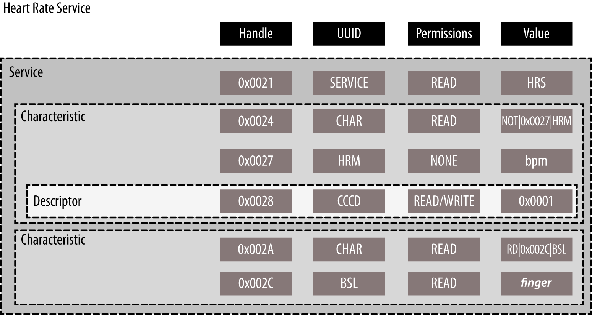

# 第四章，GATT（Services and Characteristics）

通用属性配置文件（The Generic Attribuite Profile, GATT）建立在如何通过一个蓝牙连接交换所有的配置文件以及用户数据。与定义了设备间底层交互的[GAP](./chapter3.md)对比，GATT仅处理实际数据传输流程和格式。

GATT也为GATT为基础的配置文件（在第一章的[SIG组织定义的GATT基础配置文件](./chapter1.md#SIG组织定义的GATT基础配置文件)）提供了参照框架，这覆盖了明确的用例和确保来自不同厂商的设备的交互操作性。所有标准BLE配置文件都是基于GATT，并必须基于其进行准确地操作。这使得GATT作为BLE规格书中一个关键的章节，因为每一个关于应用和用户的数据项都必须格式化、打包化、以及根据自身的规则发送。

GATT使用属性协议（详尽参阅第二章[属性协议(ATT)](./chapter2.md#属性协议)）作为自身传输协议来交换设备间的数据。这数据被有层级地按区块组织，并成为*服务（services）*，概念上与用户数据相关联的组称为*特征（characteristics）*。这决定了本章中许多GATT的基础形态。

## 角色

正如蓝牙规格书中任意其他协议或者配置文件，GATT由定义相互交互的设备的角色开始：

*客户端（Client）*

​		GATT客户端与第二章[属性协议(ATT)](./chapter2.md#属性协议)中讨论的ATT客户端相对应。GATT客户端发送请求给服务器并接收其响应包（已启动服务的更新）。GATT客户端起初不知道任何关于服务器的属性，因此必须执行服务发现流程来询问关于这些属性的存在和性质。在完成服务发现流程之后，GATT客户端就可以开始读取已发现的服务中的属性，包括收取已启动服务的更新。

*服务端（server）*

​		GATT服务端与第二章[属性协议(ATT)](./chapter2.md#属性协议)中讨论的ATT服务端相对应。GATT服务端能接受来自客户端的请求并发送应答响应包。在做一些配置情况下，GATT服务端也会发送已启动服务的更新，并且需要作为一个角色负责存储和使客户端能使用用户数据，在属性内组织。每一个已出售的BLE设备都必须包含一个基本的可以响应客户端请求的GATT服务端，甚至仅返回一个错误响应。

值得再次一提的是GATT角色完全不依赖于GAP角色（参见第三章[角色](./chapter3.md#角色)），两者间也同时兼容。这意味着一个GAP中心设备和一个GAP外围设备可以都作为GATT客户端或者服务端，甚至或者同时作为两者存在。

## UUIDs

通用唯一标识符（universally unique identifier, UUID）是一个128位（16字节）确保为（或者很大可能上）全球唯一的数字。除了蓝牙，UUID被用于许多协议和应用，其格式、用法、和产生都在[ITU-T Rec. X.667](bit.ly/1gScfna)被指定，或者是著名的[ISO/IEC 9834-8:2005](bit.ly/1es3R3t)。

为了效率，也因为16字节会占据链路层27字节数据负载的很大一部分，BLE规格书增加了两个额外的UUID格式：16位和32位UUID。这个大大缩短的格式仅用于蓝牙规格书中定义的UUID（也就是，这个是由蓝牙SIG罗列作为标准蓝牙UUID）。

从缩短的UUID版本重建位完整的128位UUID，需要插入蓝牙基本UUID内16或者32位值（由xxxxxxxx表示，包括其实的0）：

​	xxxxxxxx-0000-1000-8000-00805F9B34FB

SIG提供给所有的类型、服务和其定义指定的配置文件一些UUID。但是如果应用需要自己的UUID，不是因为SIG提供的没有满足其需求就是因为想要实现一个之前未在配置配置文件规格书中考虑到的新的用力，可以依照[ITU’s UUID generation page](https://www.itu.int/en/ITU-T/asn1/Pages/UUID/uuids.aspx)生成。

对于不是源自蓝牙基本的UUID（通常称为*厂商指定 vendor-specific* 的UUID），这种缩短的格式是不可以使用的。在这种情况下，你需要从始至终使用完整的128位的UUID。

## 属性

属性（Attributes）为GATT（和ATT）定义的最小的数据实体。他们是可寻址的一些信息，可以包含关于结构的相关用户数据（或者元数据metadata），以及服务端内包含的各种不同的属性。GATT和ATT都可以使用属性进行工作，因此对于客户端和服务端交互，所有的信息都必须按照格式组织。

概念上说，属性总是位于服务端，并由客户端访问（以及修改）。规格书仅概念上定义了属性，并没有强制ATT和GATT使用指定的内部存储格式或者机制执行。因为属性包含了不变性的定义和快速变化的实际用户（通常为传感器）数据（见后文[属性和数据层级](#属性和数据层级)，其内容通常存储在非易失存储器和RAM内。

### 句柄

属性句柄（handle）模块为特定的GATT服务端上的每一个属性的一个唯一16位识别符。其作为每一个属性的一部分使其可寻址，并保证对于绑定的设备在传输、穿越连接中不会改变（在后文[属性缓存](#属性缓存)进行警示）。因为0x0000值表示一个无效的句柄，对于所有的GATT服务端可用的句柄地址为0xFFFE(65535)，尽管实际上服务端上的句柄的数量通常为很小的一打。

​		无论何时在属性句柄的环境下使用，*句柄范围*这个术语指包含在两个给定的范围值内所有包含的属性句柄。比如，0x0100-0x010A的句柄范围就指在0x0100-0x010A区间内有句柄的任意一个属性。

在GATT服务端内，句柄增大的值决定了属性可以被客户端访问的排列顺序。但因为在句柄间的间隔空间是允许的，客户端就不能依赖一个连续的序列来猜测下一个属性的位置。相反，哭护短必须使用一个发现特性（在后文[服务和特征发现](#服务和特征发现)）去获得自身感兴趣的属性的句柄。

### 类型

属性类型（type）就仅仅为一个UUID（见前文[UUIDs](#UUIDs)）。这可以是一个16、32、128位的UUID，即分别为2、4、15字节。这类型决定了在属性的数值中的数据，以及基于这些类型各自的发现属性的机制（参照后文[服务和特征发现](#服务和特征发现)）。

### 权限

权限（Permission）是一组指定哪一个ATT操作（见第二章[ATT运作](./chapter2.md#ATT运作)）可以在执行于每一个特定的属性以及指定安全需求的元数据（metadata）。

ATT和GATT定义了以下权限：

*访问权限*

​		与文件权限相似，访问权限（Access Permission）决定了客户端是否可以读或写（或读写）一个*属性值* （参见后文[数值](#数值)）。每一个属性都可以有以下访问权限之一：

​		*无（None）*

​		属性不可被客户端读写。

​		*可读*

​		属性可被客户端读取。

​		*可写*

​		属性可被客户端写入。

​		*可读写*

​		属性可被客户端读写。

*加密*

​		加密（Encryption）个决定了对于被客户端访问的属性是否有一些加密等级的需求。（在认证和加密方面参考第三章[认证](./chapter3.md#认证)、[安全模式和流程](./chapter3.md#安全模式和流程)和[安全模式](./chapter3.md#安全模式)).这些都为允许的加密权限，如GATT定义：

​		*无加密需求（安全模式1，等级1）*

​				这个属性以纯文本、无加密连接的方式访问。

​		*未认证加密需求（安全模式1， 等级2）*

​				该连接必须加密以访问此属性，但是加密钥匙无需认证（虽然也可以认证）。

​		*已认证加密需求（安全模式1， 等级3）*

​				连接必须使用已认证钥匙进行加密，方能访问属性。

*认证*

​		认证（Authorization）决定了访问属性是否需要用户权限（也被理解为认证，见第三章讨论的[安全模式和流程](./chapter3.md#安全模式和流程)）。一个属性仅能需要或不需要认证间作选择：

​		*未加密需求*

​				无需认证访问属性。

​		*加密需求*

​				需认证访问属性。

所有权限都各自独立，并可以由以每一个属性为基础进行储存的服务端自由捆绑。

### 数值

​		属性数值（Value）包含了属性的实际数据内容。对于装载的数据类型没有严格限制（你可以想象其作为一个可以转化成基于属性类型的任意类型的无类型缓存），虽然其最大长度在规格书中被限定为512字节。

后文[属性和数据层级](#属性和数据层级)讨论了，依据属性类型，该数值可以包含关于属性自身或者实际有用的、用户自定义应用数据的额外的数据。这个是客户端可以自由访问进行读写的属性的一部分（在合适的权限请求下）。所有其他的实体组成了属性的结构体，并无法直接被客户端修改或访问（虽然客户端在大多数与服务端交互中间接使用了句柄和UUID）。

你可以视作整个属性为一个表（如[表4-1](#表4-1)）被装载在一个GATT服务端内，每一行表示一个单独的属性，每一列表示实际组成属性的不同部分。

#### 表4-1. 属性表

| 句柄（Handle） | 类型（Type）    | 权限（Permissions）   | 数值（Value）            | 数值长度（Value length） |
| -------------- | --------------- | --------------------- | ------------------------ | ------------------------ |
| 0x0201         | UUID1 (16-bit)  | 可读，无安全性        | 0x180A                   | 2                        |
| 0x0202         | UUID2 (16-bit)  | 可读，无安全性        | 0x2A29                   | 2                        |
| 0x0215         | UUID3 (16-bit)  | 可读/写，需要认证     | 可读UTF-8字符串          | 23                       |
| 0x030C         | UUID4 (128-bit) | 可写，五安全性        | {0xFF, 0xFF, 0x00, 0x00} | 4                        |
| 0x030D         | UUID5 (128-bit) | 可读/写，需要认证加密 | 36.43                    | 8                        |
| 0x031A         | UUID1 (16-bit)  | 可读，无安全性        | 0x1801                   | 2                        |

在这个虚构的GATT服务端中，其装载的属性作为一个表格呈现。这个特殊的GATT服务端掌管了五个属性（相比实际中的设备数量是很少的）。要注意的是，在本章节前文提到，不同属性的句柄为非连续的，但是这个例子还是按照增长排列。

表中的数值的列反映了格式的多样性，这个为在不同GATT配置文件内装载的属性值。0x0201, 0x0202,和0x031A的属性句柄包含了16位其在各自数值区域中的整数。0x0215的属性句柄包含了一个UTF-8的字符串，0x030C包含了一个4字节的缓存数据，0x030D包含了一个IEEE-754 64位的在其数值区域中的浮点数字。

## 属性和数据层级

虽然蓝牙规格书在ATT章节定义了属性，但这是目前为止ATT所能做到的。ATT用属性进行运作，依赖于所有前文[属性](#属性)揭露的一些概念，来提供一系列明确的协议数据单元（PDUs，通常被称为*包 packet*）来允许客户端访问服务器上的属性。

GATT以一个可重复使用和实际的方式进一步建立了一个严格的层级来组织属性，允许客户端和服务端间的信息访问和获取遵循一套简明的规则，其一同组成了由GATT为基础的配置文件使用的框架。

图4-1展示了GATT引入的数据层级。

*图4-1. GATT数据层级*

GATT服务端的属性被划分进入*服务（services）*，每一个都包含了零或者更多*特征（characteristics）*。这些特征，依次包含了零或者更多*描述符（descriptors）*。

该层级被任何声称与GATT兼容的设备（实质上，是所有售出的BLE设备）严格执行，这意味着GATT服务器中的所有属性都被包含在这三个类别的其中之一，无一例外。没有一个属性可以在这个层次结构外生存，因为BLE设备间的数据交互都得依赖它。

对于更多在GATT层级中的数据类型，区分它们的*定义（definition）*（组成该层级的所有属性组）和*声明（declaration）*是非常重要的。该声明指的是一个单独的属性，在定义范围内总被列为第一个（在增长的句柄顺序下），这引进了大多的关于其遵循数据的元数据（metadata）。所有的声明都有不需要安全要求的可读权限，因为其不可以包含敏感数据。声明为结构型的属性，允许客户端寻找并发现服务器上属性的布局和性质。

### 服务

GATT服务组概念上与GATT服务端内的属性在属性信息集的一个普通部分相关联。规格书提到在一个单独的服务内的所有属性作为*服务定义（service definition）*。因此，一个GATT服务属性实际上是一连串服务定义，每一个都有一个单独的属性开始，该属性标志了一个服务的开始（恰如命名：*服务声明 a service declaration*）。该属性类型和数值格式在GATT中严格定义，如表4-2展示。

##### 表4-2. 服务声明属性

| 句柄（Handle） | 类型                             | 权限 | 数值     | 数值长度         |
| -------------- | -------------------------------- | ---- | -------- | ---------------- |
| 0xNNNN         | UUID（首服务）或UUID（第二服务） | 只读 | UUID服务 | 2，4，或者16字节 |

在表4-2中展示的声明，UUID（主服务，0x2800）和UUID（第二服务，0x2801）指标准的、SIG指定的作为单独的类型来用于引进一个服务的UUID。其原始形态为16位的UUID（因为这个是由规格书定义的一个基础内容）。

首服务和第二服务间的差别需要重点记录。*首服务（primary service）*是GATT服务的标准类型，包括相关的、标准的由GATT服务端展露的功能。另一方面，*第二服务（secondary service）*是意指为其他首服务包含的内容，进作为其修改器（modifier）方才生效，而自身并没有真正的意义。实际上，第二服务很少被用到。

声明属性服务的内容值自身包含了一个UUID（如前文[数值](#数值)提到，该属性值可以为任何数据类型），与实际的这个声明引进的服务的UUID相绑定。

虽然服务声明必须为该服务的第一个属性，但许多其他的服务也可以在下一个服务声明前跟从，通常使用特征和描述符的格式。

概念上你可以认为一个GATT服务是作为任意现代化面向对象的语言的一个类，连同实例化，因为一个服务可以在一个单独的GATT服务端内被多次实例化（然而，这并不常出现，大部分服务都类似单例模式）。

在一个服务定义内部（就是说，在一个服务里边），你可以使用*包含定义（include definitions）*添加一个或多个引用给其他服务。包含定义由一个单独的属性（包含声明include declaration）组成，包含了所有详尽的关于客户端引用被包含的服务的需求。

被包含的服务（included services）可以帮助避免在GATT服务端中复制数据。如果一个服务将会被其他服务引用，你可以使用这个机制来节省内存空间，并简化GATT服务器的布局。如先前的类和对象的类比，你可以认为包含定义作为现有对象实例的一个指针或者引用。

表4-3展示了包含声明所有自身的属性。

##### 表4-3. 包含声明属性

| 句柄   | 类型       | 权限 | 值                                         | 值长度         |
| ------ | ---------- | ---- | ------------------------------------------ | -------------- |
| 0xNNNN | UUID(包含) | 只读 | 包含了服务句柄，结尾组句柄，包含的服务UUID | 6，8，或20字节 |

UUID(包含，0x2802)同样是一个SIG指定的特殊UUID，单独用于包含声明，其值域同时涵盖了包含声明的开始和结尾句柄，正如其UUID一样。

### 特征

你可以理解特征为用户数据的容器。这总是包含了至少两个属性：*特征声明*（characteristic declaration，提供了关于实际用户数据的元数据metadata）和*特征值*（characteristic value，包含了其值域的用户数据的一个完整属性）。

另外，描述符可以跟在特征值后面，这进一步拓展了在特征声明中的元数据。该声明，值和任何描述符一同形成了*特征定义（characteristic definition）*，特征定义是组成一个单独特征的一组属性。

表4-4展示了每一个单独的特征最开始的两个属性的结构。

##### 表4-4. 特征声明和特征值属性

| 句柄   | 类型       | 权限 | 值                               | 值长度         |
| ------ | ---------- | ---- | -------------------------------- | -------------- |
| 0xNNNN | UUID(特征) | 只读 | 特性，值句柄（0xMMMM），特征UUID | 5，7，或19字节 |
| 0xMMMM | 特征UUID   | 任意 | 实际值                           | 可变           |

所有的GATT特征都总是为服务的一部分，因此，其总可以在一个服务中找到。

#### 属性声明属性

同样，特征声明属性的类型UUID（0x2803）是一个标准化、唯一的UUID，单独用于表示特征的开始。正如所有其他声明一样（如作为服务和包含），该属性只有只读权限，因为客户端仅被允许接收他的值而无法进行修改。

表4-5列出了特征声明属性值内并置的不同项。

##### 表4-5. 特征声明属性值

| 名称                                      | 长度（字节） | 描述                           |
| ----------------------------------------- | ------------ | ------------------------------ |
| 特征属性（characteristic properties）     | 1            | 列出此特征可进行的操作的位字段 |
| 特诊值句柄（characteristic value handle） | 2            | 包含了特征值的属性句柄         |
| 特征UUID（characteristic UUID）           | 2，4，16     | 该特定特征的UUID               |

这三个被包含在特征声明属性值内：

*特征属性*

​		该8位的位字段，包括其他在拓展属性描述符的2个位（在后文[拓展属性描述符](#拓展属性描述符)介绍），包含了与该特征一同被使用的操作和流程。每10个属性被编码作为一个单独的bit在位字段上，如表4-6展示：

##### 表4-6. 特征属性

| 属性                                   | 位置               | 描述                                                         |
| -------------------------------------- | ------------------ | ------------------------------------------------------------ |
| 广播（broadcast）                      | 属性（properties） | 如果设置，允许特征值取代广播包，使用服务数据AD类型（参考后文[在广播包中的GATT属性数据](#在广播包中的GATT属性数据)） |
| 读                                     | 属性               | 如果设置，允许客户端使用任意在[ATT操作](./chapter2.md#ATT操作)列表中的ATT读操作读该特征 |
| 无需回应的写                           | 属性               | 如果设置，允许客户端使用这个特征上的写命令ATT操作（详见[ATT操作](./chapter2.md#ATT操作)） |
| 写                                     | 属性               | 如果设置，允许客户端使用这个特征上的写请求/回应ATT操作（详见[ATT操作](./chapter2.md#ATT操作)） |
| 通知（notify）                         | 属性               | 如果设置，允许服务端使用这个特征上的句柄值通知ATT操作（详见[ATT操作](./chapter2.md#ATT操作)） |
| 指示（indicate）                       | 属性               | 如果设置，允许服务端使用这个特征上的句柄值指示/确定ATT操作（详见[ATT操作](./chapter2.md#ATT操作)） |
| 带符号的写命令（Signed Write Command） | 属性               | 如果设置，允许客户端使用这个特征上的带符号的写命令（详见[ATT操作](./chapter2.md#ATT操作)） |
| 队列写（Queued Write）                 | 拓展的属性         | 如果设置，允许客户端使用这个特征上的队列写ATT操作（详见[ATT操作](./chapter2.md#ATT操作)） |
| 可写辅助器（Writable Auxiliaries)      | 拓展的属性         | 如果设置，一个客户端可以写入描述符，如[特征用户描述描述符](#特征用户描述描述符)描述 |

客户端可以读取那些属性，去寻找在这特征上可以执行的一些操作。这对通知和指示（Notify and Indicate）属性是很重要的，因为这些操作是被服务端启动（进一步深究可见后文[服务启动升级](#服务启动升级)），但要求客户端先使用在[客户端特征配置描述符](#客户端特征配置描述符)中介绍的描述符进行初始使能。

*特征值句柄*

​		这两个字节包含了实际特征值的属性的句柄。虽然经常是，你不应该假设这句柄到下一个包含声明的句柄将会连续（比如0xNNNN+1）。

*特征UUID*

​		指定特征的UUID，可以或者是SIG认定的UUID（当使用十几个包含在标准配置文件中的特征类型）或者就是一个128位的厂家指定UUID。

##### 特征值属性

最后，特征值属性包含了客户端可以对实际信息交换进行读写的实际用户数据。该属性的类型总是为在特征声明值区域（如前文[特征声明属性](#特征声明属性)）发现的同一个UUID。因此特征值属性不再有*服务端*或*特征* 的类型。但更具体的是，指定的UUID可以指一个传感器上的读取或者一个键盘上的按键。

特征值属性的值可以包含可能的数据类型，从以摄氏度单位的温度，到显示文字的扫描码，到每小时的公里速度，任何可以在两个BLE设备间有效传递的内容都可以装在这个值里边。

#### 特征描述符

GATT特征描述符（通常简称为*描述符descriptors*）大部分情况用于提供客户端元数据（metadata，附带的关于特征和其值的信息）。他们总是处于特征定义范围内，在特征值属性之后。描述符总有一个单独属性生成，*特征描述符声明（characteristic descriptor declaration）*，其UUID总为描述符类型，并且其值包含了是否被指定描述符类型定义。

你可以在不同的GATT特征中找到两个不同的描述符类型：

*GATT定义的描述符*

​		这些为基础、广泛使用的描述符类型，仅仅增加关于特征的元信息。以下部分描述了大多一般的GATT定义的描述符。

*配置文件或者厂家定义的描述符*

​		不论一个配置文件是被SIG或指定厂商指定还是发布，这些描述符都包含了数据的所有类型，包含附带的视为特征值的信息，如从传感器或任意其他执行读取自身数据的设备获取数值作为编码使用。

以下部分描述了一些SIG定义的大部分通用的描述符。

##### 拓展属性描述符

这个描述符，当出现的时候，仅包含两个附带的属性位，在前文[特征声明属性](#特征声明属性)和[表4-6](#表4-6)阐述。

##### 特征用户描述描述符

正如名字寓意，该描述符包含了一个在其范围内用户可读的特征描述。这个是一个UTF-8的可读字符串，如“在客厅中的温度”。

##### 客户端特征配置描述符

这个描述符类型（经常简写为CCCD，Client Characteristic Configuration Descriptor）毫无怀疑为最重要、最通用的，对于大部分配置文件的操作和使用场景都是最重要的。其功能非常简单：作为一个开关，使能或使无效服务启动升级（server-initiated updates，更多请键后文[服务启动升级](#服务启动升级)），但仅为自身内的特征使用。

> #### 为什么提供一个通知开关？
>
> 先前部分有进行讨论，客户端事先不知道任何关于服务端的属性，因此需要执行发现去寻找是哪一个服务、特征和描述符出现在服务端上。无论什么时候特征值改变，服务端异步发送服务启动升级（句柄值通知和句柄值指示，在第二章[ATT操作](#ATT操作)介绍），组成一个仅包含一个属性句柄和一个其值的数组的包发送。
>
> 如果客户端在服务端上还未发现所有的特征和描述符句柄，可能客户端时还未与从那些指定类型的通知和指示中接收到的数据关联，使那些无线传输变得无用。进一步说，即使当一个客户端可以识别所有与之相对应的服务和特征的句柄，当客户端不希望接收升级那这过程也需要好几次（也许因为应用是不可见的，又或许因为客户端仅使用服务端上的许多服务和特征的其中之一）。这就是CCCD引入的地方，对于开启和关闭所有其支持特征的通知和指示精准把控。

一个CCCD的值不超过一个2bit的位域，一个比特与通知相关，一个比特与指示相关。客户端可以在任何时候设置、清除这些位，每一次被装入的特征有改变值以及可能受到无线升级的影响，服务端都将会进行核实。

每一次客户端希望对他们支持的个别特征使能通知或者指示，就简单使用一个写请求ATT包去设置相应的比特为1。服务端之后会回应一个写回应包，并不论何时当希望提醒客户端改变数值的时候，开始发送适当的包。

另外，CCCD有两个特殊的属性让他们与众不同：

*他们的值在每一个连接中都是唯一的*

​		在多连接场景下，即一个中心设备连接到多个外围设备，并作为一个GATT服务端，当读取ATT时，每一个外围设备都将接收到自身CCCD的值的拷贝。

*他们的数值在与绑定设备连接中被保留*

​		后文[属性缓存](#属性缓存)具体讨论了属性缓存，但是仅仅关系到属性*句柄*。*数值* 通常没有在每个设备上进行保存，GATT服务端可以在连接间进行重置。这不仅是在绑定的设备间的CCCD的情况是这样：客户端在服务端写入CCCD的最后一个数值保证是在重连中储存，而不管连接的时间流逝。

许多协议栈都有特殊的机制来处理CCCD，从客户端和服务端来看都有，因为对于正确的操作和两端间保证及时的数据升级，两端都是对其比较苛刻的。

##### 特征呈现格式描述符

当呈现的时候，描述符类型包含了实际装入其7字节属性值的特征值的格式。可用的格式包含了Booleans, strings, integers, floating-point, 以及每一个通用的无类型缓冲。

### 服务样例

本节介绍一个在许多当前商用产品中可以看到的指定的服务的例子。心率服务（The Heart Rate Service, HRS）获取用户心率给一个监测设备。

图4-2展示了在一个虚构的服务端，HRS的例子。这并不是该服务端上唯一的服务，因此你可以看到其是作为客户端可以访问的一组完整属性的一个部分。

*图4-2. GATT心率服务*

这里是一个图4-2展示的心率服务的连续句柄介绍。

*句柄0x0021*

​		该属性包含了心率服务的服务声明（见前文[服务](#服务)）。以下是服务声明属性的字段：

​		*UUID*

​				这个UUID是一个服务声明的主要的16比特UUID，UUID(主要服务，0x2800)。

​		*数值*

​				该值为心率服务的16比特UUID，由SIG指定（0x180D）。

*句柄0x0024*

​		该属性包含了心率监测特征的特征声明（见前文[特征声明属性](#特征声明属性)）。以下为该特征声明属性的字段：

​		*UUID*

​				这个UUID是一个特征声明的标准的16比特UUID，UUID(特征，0x2803）。

​		*数值*

​				该特征属性仅通知，特征值句柄为0x0027，特征值UUID就是心率监测UUID（0x2A37）。

*句柄0x0027*

​		该属性包含了特征值（见前文[特征值属性](#特征值属性)），在这个条件下为心率监测。以下为该特征声明属性的字段：

​		*UUID*

​				在最后两个字节与特征定义的属性值相同的UUID。

​		*权限*

​				属性值不可读写：客户端仅通过服务端发送的通知来获取其值。

​		*数值*

​				实际的心率监测（每分钟跳动下虚拟的展示）。

*句柄0x0028*

​		该属性包含了CCCD（见前文[客户端特征配置描述符](#客户端特征配置描述符)。以下为该CCCD属性的字段：

​		*UUID*

​				对于任何的CCCD的UUID都是标准的16bit的UUID（CCCD, 0x2902）。

​		*权限*

​				CCCD必须为可读写。执行这些操作的安全等级需求由配置文件或者应用定义。

​		*数值*

​				正如已经建立的，CCCD的值是一个位域，在0x0001情况，指示了对于指定的HRM特征，通知是可以使用的。

*句柄0x002A*

​		该属性包含了其他特征声明（见前文[特征声明属性](#特征声明属性)），这个为身体传感器位置特征。以下为该特征声明属性的字段：

​		*UUID*

​				对于一个特征声明，该UUID为一个标准16bit的UUID（特征, 0x2803）。

​		*数值*

​				该特征的特征属性仅可读，特征值句柄为0x002C，特征值UUID是身体传感器位置的UUID（0x2A38）。

*句柄0x002C*

​		该属性包含了特征值（见前文[特征值属性](#特征值属性)），为身体传感器位置。以下为该特征值属性的字段：

​		*UUID*

​				在最后两个字节与特征定义的属性值相同的UUID。

​		*权限*

​				该特征的特征属性仅可读：客户端仅核实传感器是在哪里定位的，但是不修改其定位数值（这根据服务端）。

​		*数值*

​				此实际的身体传感器位置（作为“手指”而虚拟展示）。

由许多工具可以发现并显示一个服务端上如[图4-2](#图4-2)类似的格式的不同的服务，在应用开发中比较实用。[第六章](./chapter6.md)对于这些工具有更详细的信息。

### 领先的属性概念

该小节介绍了一些其他概念，即关于使用那些值得提到的属性进行工作，因为他们的指令是被许多BLE应用类型频繁要求。

#### 属性缓存

[属性](./chapter3.md#属性)讨论了属性句柄是如何允许一个客户端分别对一个服务器上所有的可使用属性进行寻址。发现各自属性的可用的句柄列表和内容是十分耗时（以及功耗）的一个进程，具体请见后文[服务和特征发现](#服务和特征发现)。弹道目前为止，该部分介绍了客户端为避免每一次重连服务器的时候进行连接过程，而可以做的事情，以及在这种情况下还可以做的事情。

服务端通常去维护一组稳定的属性，并且是服务端架构没有的，大部分情况下在一个服务端设备的生命期内改变。就这一点而言实现中并没有增加严格的限制，服务端是真正的自由去完全修复其属性，甚至用一个彻底全新的一组随时取代属性（比如，通过固件升级或者服务端设备的应用安装）。因此某些规则和约束被要求，为了客户端可以依赖先前发现的句柄的有效性，而不需要承担他们在服务端改变或者不再有效的风险。

作为一个通用规则，规格书推荐客户端将他们感兴趣的属性的句柄进行缓存（比如，保存随后的交易甚至连接）。属性值，尤其是与实际用户数据相一致的情况，是极容易改变的，因此经常为了以后的使用本地保存在客户端几乎没什么意义。

规格书给服务端提供了“服务改变特征”（Service Changed characteristic，在后文[GATT服务](#GATT服务)详细介绍），为了与客户端就其属性信息内容的任何潜在的改变进行交流。这是一个可选的特征，因此在服务端其很少出现，这已经被视作一个警告：一个结构上的属性的改变的可能。

客户端可以通过观察以下条件来确定，是否发现的结果可以被缓存用于以后的使用：

*没有服务改变服务端出现的特征*

​		客户端可以自由并永久缓存所有发现的没有限制的句柄。服务端保证其在设备生命期内不作改变。

*服务改变服务端出现的特征*

​		在这种情况下，客户端需要通过写入包含在服务改变特征内相应的CCCD来订阅服务端发起的升级（参见前文[特征描述符](#特征描述符)。这将会允许服务端警示客户端的任何结构上的改变。如果客户端和服务端如第二章[安全模式和流程](./chapter2.md#安全模式和流程)描述被绑定在一起，客户端会通过连接缓存句柄，并希望他们保持相同。如果设备间没有绑定， 客户端会需要每一次重连时候执行发现。

后文[GATT服务](#GATT服务)对使用服务改变特征进行了更详细的介绍。

#### 在广播包中的GATT属性数据

虽然GATT主要依赖于中心设备和外围设备间建立的连接（如第二章[角色](./chapter2.md#角色)介绍），但GATT也可能包含了托管在服务端广播包内的部分属性信息，将一个或者多个服务端属性给到任意的观察者或者在扫描的中心设备。

[表3-3](./chapter3.md#表3-3)讨论了服务数据AD类型，但是那小节并没有描述在一个广播包内用于装入服务属性的格式。[规格书采纳文献论文](http://bit.ly/1gg4UhU)上的核心规格书增刊指定了GATT服务端为让一个指定的服务数据对扫描者可用，必须在一个广播包负载内插入的字段。

如表4-7展示，为了能够广播服务数据，GATT服务端必须包含两个在广播包的服务数据部分中的不同的字段。

##### 表4-7. 服务数据AD类型

| 字段     | 长度（字节） | 描述                         |
| -------- | ------------ | ---------------------------- |
| UUID     | 2，4，16     | 实际UUID识别数据             |
| 服务数据 | 可变         | 与UUID识别的服务相联系的数据 |

服务数据字段的内容可以与相对应的服务内的特殊特征或描述符的值完全或部分一致。这根据每一个配置文件规格书去定义，因为仅配置文件有足够的信息关于决定哪一个内容数据用于发送广播是最有关系的。

## 特性

GATT的特性严格定义了流程是GATT允许GATT基础的数据进行交换。这些都依赖于ATT提供的不同的操作（再第二章[ATT 运作](./chapter2.md#ATT-运作)中介绍）。

在某种程度上，本章罗列的大多特性用一种方式呈现，或者其余的一些在GATT API中呈现。GATT服务端API增加产生实际有着属性的服务的能力，但该部分内容繁多，超出了本章节的范围。

### 交换MTU

这个简明的两个包的流程，允许每一个ATT端让另一端知道其可以在自身缓冲里可以承载并接收的传输最大单元（maximum transmission unit, MTU，或者称：有效最大包长度，effectively maximum packet length）。

该过程仅在一下情况使用：无论客户端还是服务端（或者双方）处理比默认ATT_MTU的23字节更长的MTU的时候（参见第二章[逻辑链路控制和适配协议（L2CAP）](./chapter2.md#逻辑链路控制和适配协议（L2CAP）)以及想要通知另一端可以发送比规格书定义的默认值更长的包的时候。L2CAP会拆分这些较大的数据包为小份的链路层数据包，以及将其重新组合。

### 服务和特征发现

正如本章其他地方提到的，当第一次连接时，客户端并不知道可能出现在GATT服务端的属性。因此对于客户端通过完成一系列数据包交换作为开始去决定数量、位置和所有可能感兴趣的属性的原始信息，这是非常重要的。正如前面[属性缓存](#属性缓存)讨论的，在某种情况下，在这个类别下的流程后续是被跳过的。

对于*主要服务发现*，GATT提供了以下两种选项：

*发现所有主要服务*

​		使用这个特性，客户端可以从远程服务端接收一个完整的主要服务列表（忽略服务UUID）。客户端支持超过一个服务并因此希望找到这个服务侧所有支持的服务的情形，这被广泛使用。当发出了需求的请求，因为客户端可以明确一个句柄范围，客户端就必须设置0x0001-0xFFFF作为句柄范围去实现该功能，这范围覆盖了服务器上所有属性的范围。

*通过服务UUID发现主要服务*

​		无论客户端什么时候知道其寻找的哪一个服务（通常因为仅支持自身单独的服务），其仅简单的寻找*所有使用该特性的一个特殊服务的所有实例*，同时有着设置句柄范围为0x0001-0xFFFF的请求。

这些流程的每一个都设定句柄范围去参考属于一个单独服务的属性。发现*所有主要服务* 的特性同时也获取了个体的服务UUID。

当客户端在服务端已经有找到了服务，其可以依以下特性继续去完成*关系发现*（relationship discovery，发现任何包含的服务）：

*发现包含服务*

​		这特性允许一个客户端在一个服务内询问服务器任何关于包含的服务。提供在这样的一个询问中的句柄范围指的是一个现存服务的边界范围，在先前使用服务发现中获得。正如服务发现，客户端也接收一系列句柄范围，当可用时UUID也接收。

在*特征发现* 方面，GATT提供以下选项：

*发现一个服务的所有特征*

​		一旦一个客户端你获得了其可能感兴趣的服务的句柄范围，客户端可以继续获取其所有的特征表。输入仅为句柄范围，作为交换，服务同时返回句柄和在服务内的所有特征声明属性值（参照前文[特征声明属性](#特征声明属性)）。

*通过UUID发现特征*

​		该流程与上一个完全一样，除了客户端抛弃了所有不匹配其目标的特殊特征UUID的响应。

一旦目标特征的边界（换句话说就是句柄）简历，客户端可以继续进行*特征描述符发现*：

*发现所有特征描述符*：

​		如今拥有一组句柄范围和一个服务内一些或者所有的特征的UUID，客户端就可以使用该特性去获取所有指定特征内的描述符。服务端回应一个UUID的列表和与不同描述符声明匹配的句柄（参见前文[特征描述符](#特征描述符)）。

本节所有特性都可以在开放、非加密的连接中执行，因为发现是允许所有客户端无需任何限制条件的。

### 读取特征和描述符

为获取当前特征值或者一个描述符，客户端有着以下集中选择：

*读取特征值或者描述符*

​		该特性可以用于通过使用自身句柄简单读取特征值的内容或者描述符。仅内容的第一个ATT_MTU-1字节可读，因为这是其在响应包内可以容纳的最大字节数（一字节为ATT操作代码保留）。

*读取长特征值或者描述符*

​		如果使用上一个特性却数值太长，该特性包含一个请求内句柄的偏移值，因此特征值或者描述符内容就可以在连续的块中被读取。多个请求/响应对可能被要求，依赖于正在读取的属性值的长度。

另外，仅适用的特征值，特性是可以使用的：

*使用特征UUID读取特征值*

​		当一个客户端对于其感兴趣的特征却不知道明确的句柄，客户端可以读取所有指定类型的所有特征。客户端简单提供一个句柄范围和一个UUID，并接收一组在其范围内的特征数组。

*读取多个特征值*

​		相反，如果一个客户端已经拥有一组其希望获取数值的特征的句柄，客户端就可以发送一个带着该句柄的请求并紧接着接收所有相符合的特征的数值。

读取特征和描述符从属于安全许可，并且如果连接安全等级没有达到建立时候的要求，服务端有拒绝的权限（参见后文[安全](#安全)）。

### 写入特征和描述符

为了写入特征值或者描述符的值，客户端有以下选项：

*写入特征值或者描述符*

​		该特性用于写入特征值或者描述符。客户端提供一个句柄和值的内容（至多ATT_MTU-3字节，因为该句柄和ATT操作代码是被包含在数据包内），服务端会对写入操作进行回应。

*写入长字节特征值或者描述符*

​		与*读取长字节特征值与描述符* 特性相同，该特性允许一个客户端写入超过ATT_MTU-3字节的数据到服务端的特征值或者描述符中。通过将许多*准备写入* 的操作排入队列，每一个操作都包含一个偏移量以及数据本身，最终将通过一个*执行写入* 的操作全部自动写入。

另外，以下特性仅可对特征值有用：

*无需回应的写入*

​		该特性和通知（详尽参阅后文[服务端启动的升级](#服务端启动的升级)）完全相反，并使用写入命令包。写入命令是一个包含一个句柄和数值的无需确认的包，可以在任何时候发送任意的数量而无需任何流程机制介入（除非是本地的链路层[native Link Layer]流程控制，因为所有的通信都受它管制）。如果服务端无法处理这些包，或者如果属性权限阻止接收这些包，服务端可以自由地默默抛弃它们。客户端将不会知道，这是通过共同的协议认定的。让客户端得知数值是否被写入的唯一方法就是事后再读取以确认数值。

*可信赖的写入*

​		与*读取多种特征值* 特性相同，当一个客户端想要将写入操作排入多种特征值的队列中，其会发动一个最终的数据包去提交挂起的写入操作并执行。

写入特征和描述符受安全权限的管制，如果连接安全等级没有达到已建立的要求，服务端可以拒绝许可（参见后文[安全](#安全)）。

### 服务端启动的升级

服务端启动的升级（Server-initiated updates）为唯一一种可以从服务端到客户端流动的异步数据包。该升级发送适时的改变提示在特征值内，而不需要客户端常规的进行等待，同时节省了电量和带宽。

以下为两种服务端启动升级的类型：

*特征值通知（Characteristic Value Notification）*

​		通知（Notification）是一组包含了特征值属性句柄连同当前数值的数据包。客户端接收该通知，并可以依据通知选择执行，并且客户端不回应确认接收给服务端。连同*无回应的写入*，这个是另一个不遵循ATT中标准的请求/回应流程控制机制的数据包，因为服务端可以在任意时间发送任意数量的这种通知。该特性使用了*句柄值通知（handle value notification, HVN）*ATT数据包。

*特征值指示（Characteristic Value Indication）*

​		在另一方面，指示（Indications）遵循了相同的句柄/数值格式，但是要求从客户端用一个*确定（confirmation）*的格式回应一个明确收到。注意到虽然服务端直到其从客户端接收了确定包前（因为该流程与常见的请求/回应是完全相反的方向）都无法发送更进一步的指示（即使是不同的特征），一个未兑现的确认包是不会影响到客户端于此期间发送可能的请求。该特性使用*句柄值指示（handle value indication, HVI）*和*句柄值确认（handle value confirmation, HVC）* ATT数据包。

客户端必须在服务端可以开始发送前通过写入相应的CCCD来同时使能这两种类型的服务启动升级。前文的[客户端特征配置描述符](#客户端特征配置描述符)大量描述了该流程。

## 安全

第三章[安全模式和流程](./chapter3.md#安全模式和流程)讨论了GAT认证流程是如何被用于从一个安全模式到另一个更高级进行转换的，通过使用不同的更多安全内容都在安全管理和GAP内可适用。GATT交易可以看作一个认证流程的触发器。正如前文讨论的[权限](#权限)部分，每一个GATT服务端范围内的属性对于读写都有详细、独立的权限，这些权限在ATT等级上被执行。

通常地说，被声明的属性被访问是没有特别的安全要求的。对于服务端你和特征声明都是如此，但对于描述符声明却不是，其直接包含了相关的数据，而不是在一个不同的属性内。因此尚未匹配活着绑定服务端的客户端可以执行基本服务和特征发现，而不需要依赖执行安全流程。该属性布局和服务端的数据层级不考虑一些敏感数据，因此对所有客户端任意开放。

*不完全的认证*

​		此为链接非加密，服务端也没有长期钥匙（LTK，在第二章[安全钥匙](./chapter2.md#安全钥匙)中首次提及）用于加密链路，或者链路实际上加密了，但是当权限要求认证加密时，用于执行加密流程的长期钥匙是没有认证的（中间人保护下产生；参见第三章[认证](./chapter3.md/认证)）。

*不完全加密*

​		指的是链路未加密，但是一个合适的长期钥匙是可用的。

GAP和GATT角色在任何情况下都没相连，可以混合在一起，自由匹配，但是安全流程总会由GAP中心设备发起（参考第二章[安全管理](./chapter2.md#安全管理)）。因此考虑到哪一端要作为中心设备，哪一端要作为从设备，这可以依据GATT客户端或者GATT服务端去启动匹配、绑定或者加密流程以提高连接的安全等级。一旦安全等级匹配上由属性权限要求的等级，客户端就再次发送请求在服务端上执行。

## GATT服务

正如GAP有自有的SIG指定服务，义务提供给所有的设备（在第三章[GAP服务](./chapter3.md#GAP服务)中大量介绍），GATT也有两个自有的必须包含在所有GATT服务端内的服务（包含至多一个特征）。可选的服务改变特征（在前文[属性缓存](#属性缓存)中简要介绍）不可读写，其值仅通过*特征值指示* 与客户端进行交流。

如[图4-8](#图4-8)，数值仅由一个句柄范围组成，其在服务端划了一个属性的区域界限。这个区域由结构改变影响，需要被客户端再次发现。客户端需要在这个区域执行服务和特征发现，因为其可以缓存的属性可能不再有效。

| 句柄   | 类型           | 权限 | 数值           | 数值长度 |
| ------ | -------------- | ---- | -------------- | -------- |
| 0xNNNN | UUID(服务改变) | 无   | 由句柄范围影响 | 4        |

在做任何事情之前，客户端必须在该特征相应的CCCD使能指示，因此客户端可以知道服务端属性结构的任何改变。

如果服务端在属性布局内遭受一个结构性的改变，服务端将会立即发送一个句柄值指示给客户端，并且等待响应的接收答复。这样，就可以确认客户端知道缓存属性句柄在那范围可能不再有效。如果属性改变外部已绑定设备的连接的生命时长，服务端将会在连接建立后发送一个指示，因此客户端由一个机会重新发现被影响的区域。