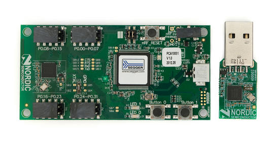
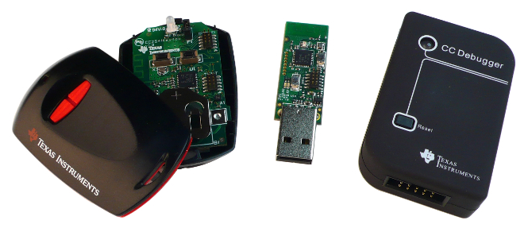

# 硬件平台

大多数对于BLE可用的产品的商业用例包含了从设备，而不是你可能设计与之交互的主设备（手机、平板或者个人电脑）。如上，本章将介绍一些特定的开发平台用于设计和制作BLE从设备的原型。

本章讨论的内容假设了一个熟悉嵌入式系统设计（[第十章](#./chapter10.md)），并主要目标是给产品设计师指出一个便宜、与他们的产品合适且易于使用的平台。

## nRF51822-EK(Nordic Semiconductor，诺迪克半导体公司)

诺迪克半导体多年来一直致力于低功耗无线解决方案，并作为蓝牙SIG组织的董事会成员，自BLE起初开始就帮助进行BLE标准的制定和完型。众所周知，在无线市场中诺迪克的流行是因为通用无线射频（RF）硅芯片解决方案，这是市面上第一个将BLE从机模式的硅芯片引入市场并使其可负担得起的公司。诺迪克最新的nRF51家族代表了一个从以往多种单芯片RF产品的完整再设计方案，集成了一个带着现代32位ARM微处理器的无线模块在一颗单独的芯片当中。

### 技术规格书

诺迪克的nRF51系列使一个高度整合的片上系统，集成了一个BLE无线模块和一个现代ARM处理器以及下列特征在单独一颗低成本套装中：

- ARMCortex-M0核，运行在16Mhz的频率
- 128或者256KB flash内存（在80到90KB间被用于作S110 BLE栈）
- 16KB SRAM（8KB可供应用包括S110 BLE栈使用）

对于不同产品设计师，作为一个完全以flash为基础的设备是一个区分nRF51822的关键因素。这意味着BLE栈被写入到可修改的flash内存中，并可以作为核心规格书更新内容，而不需要新的硅芯片升级。

这种方式的不利因素为增加了许多附带的制造成本，相比一个以ROM为基础的解决方案。但是蓝牙核心规格书给的这个快捷开发方式，在长期看是利大于弊，因为这种方式让诺迪克相比其他选择了耕地成本的ROM为基础的芯片的硅厂商，能用最新的规格书用更快的速度更新推向市场。

### 软设备架构

为了在其芯片实现BLE支持（芯片也可以给非BLE标准使用，如作为ANT+和4.2GHz协议），诺迪克使用了一个叫做*软设备（SoftDevice, SD）*的东西。软设备本质上就是一个位于flash内存的底部的黑盒子，实现如BLE协议栈和从设备角色支持的特性。用户（应用）代码位于flash内存的一个更高的地址位，这样调用低层次的软设备更合适。

许多BLE产品使用S110软设备，该软设备仅为从机解决方案。该设备架构也包括一个支持主设备角色的S120软设备，但因为对于BLE方面用例很少相同，本小节的讨论就将专注于S110。

诺迪克的软设备设计处理有自身的优缺点。有点为，有一个以软设备形式存在的分离的、认证的、可信赖的BLE协议栈允许固件开发工程师用更多精力专注于应用层的代码。他们可以用尽量少的API、如GAP（[第三章](./chapter3.md)）和GATT（[第四章](./chapter4.md)）的更高层级概念进行处理，而不用管底层软设备的细节（安全实现、信息校验等）。

软设备也允许固件开发工程师避免处理自身的无线配置，这个是在大多RF产品中，固件开发流程中很重要的一个部分。将这些细节放入黑盒子中可以保护固件开发工程师免于受到底层错误的干扰，并先煮简化了产品核验的流程，因为底层BLE代码要依照蓝牙核心规格书才能保证进行功能实现。

软设备其他的优点为，其允许了一个硬件设计为支持多种无线协议或者用例，包括设计为一个通用协议的能力，这将大大减小了公司内部基于同一个PCB设计的多个相似产品的生产成本。

最后，软设备的架构对于应用开发者是没有干扰的。因为软设备独立运行并且应用不需要链接任何库，包括SD和应用升级都可以单独无依赖条件下进行，在很大程度上，可以独立地升级一个Linux内核或者用户空间的库，而不需要担心另一方面被升级影响。

缺点方面，软设备要求的系统资源将不可以被自有应用使用。S110软设备分配了flash底部80KB和SRAM8KB的大小空间，留下176KB的flash空间和8KB的SRAM空间给应用使用（假设正在使用256KB版本的nRF51822）。

软设备设计也引入了延迟和架构限制，比如高层代码需要调用底层软色号被的代码，这需要通过ARM核的软件中断来进行。

作为任何大的开发任务，软设备带来的大量有点也带来了一些牺牲，大多数围绕时序和硬实时需求。

### 用nRF51822-EK工作

如果你对nRF51822的评估感兴趣，最好的开始的平台就是诺迪克的nRF51822-EK，如图5-1所示，该评估套件包含了两个开发板：PCA10001（如图左）和PCA10000（如图右）。

*图5-1. 诺迪克半导体的nRF51822-EK*

PCA10000是一个很小的USB适配器（USB dongle），主要用于调试，通过诺迪克主控制平台或者一个嗅探器（sniffer）模拟一个中心设备去推送数据到Wireshark软件（在[第七章](./chapter7.md)进行介绍）。但这也是一个完整功能的开发板，整合了一个可以通过大量开发工具进行编程和调试固件的Segger的J-Link。

比较大的PCA10001是一个套件中的主开发板。其将nRF51822上可用的pin脚都分离出来，你可以连接I2C或SPI的传感器或者从设备，通过UART于其他设备进行交互等。开发板上也包含了一个J-Link用于编程和调试MCU，还有一些其余的电路去测量功耗，这使得调试和制作原型更为简单。比如UART输出可通过USB直连出去，因此可以更直观调试信息或者发送简单的命令给MCU。开发板还有一个CR2032的电池口，使开发板可以由一个很小的电池驱动。

### 例子和工具链

诺迪克提供了基于该开发套件的大量例子（在注册玩你的套件之后，见本段的提示），如果刚开始进行你所知道的事物进行开发，这是一个很容易的选择。大多演示代码使用Keil's vVision（IAR工具链作为第二选项），这对于一个ARM的非商业的使用在小于32KB的项目上面是自由使用的（32KB实际上只包括了项目的范围，因为软设备不包含在这32KB的限制中，只有应用代码）。

 *你需要在[诺迪克半导体网站](http://www.nordicsemi.com/)上创建一个我的页面账户，并在你可以访问最新的演示代码和该芯片组的开发工具前，给你的nRF51822-EK注册一个序列号。*

一些支持的工具和样例项目也可以给GNU类的工具使用，虽然GNU（以及Eclipse）支持不如Keil uVision强大。但是在GNU/Linux和Mac OS X上开发完整的应用而不需要凭借Windows是没意义的。

为提供一个开源的选项，本书也包括了一个基本代码放在了[GitHub](https://github.com/microbuilder/nRF51822_GNU)上。该代码基于一个自由可用的GNU工具链，包括了makefiles, 启动代码和一些基本工具用板子上的J-Link调试器来编程写入flash中。

## CC2541DK-MINI(Texas Instruments，德州仪器)

这是在低功耗RF领域拥有一个很长历史的另一家公司，德州仪器已经瞄准了从设备市场设计了大量BLE片上系统（system-on-chips, SoCs），并且作为市面上第一家公司给出了BLE从设备方案。

CC2541有以下特性：

- 带有一个2.4GHz无线模块的9051核
- 128或256KB用户可编程flash内存
- 8KB SRAM

TI的较其他竞争对手一个最大的优势是其BLE协议栈功能完善，基本包含了整个4.0版本的蓝牙核心规格书。一些厂商已经选择不去实现一些不常用的可选功能，然而TI却在其功能覆盖方面做着进一步的努力。

CC2541管脚也兼容CC2540，这个在SoC上增加了USB支持。这个兼容仅用最小的设计功夫就延展了任意围绕这芯片家族的设计的寿命，因为你可以很容易地移植你的设计到一个通过USB连接台式机或者平板电脑的从设备。

TI对待设计和测试非常严苛，其RF芯片家族有一个很长的设计线条。这使得可靠的芯片使用着精心设计的无线模块，并提供给硬件设计师和固件开发工程师一些围绕着这些芯片很好的设计资源。对于一些没有内部RF或者嵌入式固件设计经验的小公司，这个是一个很重要的考虑的因素。

CC2541的一个大的缺点为，其相对过时的8051核驱动自身的SoC，这不仅需要一个昂贵的商业编译器和IDE来使用（IAR Emedded Workbench，嵌入式工作台），相比更多根据现代的ARM Cortex-M核以各种形态做成的SoC，在蓝牙方面CC2541都显得更耗时。这个可能在不久的未来会得到改变，因为SoC厂商对于推动到最新核感到了更大的压力，TI毫无疑问也在此趋势下意识到了什么。很好奇接下来这些公司将怎么向前发展。

在许多TI的CC254x家族开发套件中，低成本的CC2541DK-MINI（图5-2）平台可以使从设备设计师彻底的评估这个开发平台核SoC。

该套件包含了所有你需要用到CC2541的硬件，包括了一个硬件调试器，一个可以插在电脑上作为BLE主设备的USB软件狗，还有一个关键的可以运行用户自定义BLE代码的开发板。

该开发套件的一个亮眼的元素为其非常接近于一个真实的产品，带着一个注塑的外壳，以及两个大面积的实体按键在初期研发核调试进程中提供了真实的回馈。在早期产品开发时时很容易忽略这些类型的细节，但是这可以帮助给BLE设备一个实际中表现的想法，尽管类型（如操作范围）从一个产品设计到另一个是多种多样的。

*图5-2. 德州仪器的CC2541 MINI-DK开发套件*

简单地将一个低功耗设备持有在手上经常会减弱信号，这个相对于一个裸板PCB直接毫无障碍的放在桌子离电脑几英尺远是一个非常不同的体验。实际中也很容易就将供电设备放入外壳内，并远离工作台进行操作，比如贴在一些事物或者人身上。这是很小的一个细节，但可以给你节省大量时间，以及在早起设计过程中你没有将你的开发套件提前远离你的工作台，这就是一个潜在的惊喜。

对于更多该开发套件的信息，包括购买具体信息，参见德州网站的[CC2541产品页面](http://www.ti.com/tool/cc2541dk-mini)。

## 其他硬件平台和模组

如果你不愿意从头打造自己的RF设备和电路板，*模组* 提供了一个可替代的方案。模组的一个关键优势在于模组通常都是通过各种监管机构作为插件预先认证的，比如FCC或者CE/ETSI，并似乎通过了各种协议机构建立的任何测试程序，比如蓝牙SIG组织。FCC或者CE认证需要每个产品$10,000费用，对于相对低量的产品生产，这成为了模组的一个很吸引人的点。

使用模组的其他优点是RF已经为你完成了设计，而通常RF硬件设计都要求专业的知识、工具和测试流程。合适的天线设计或者产品上RF前端都是一个很重要的任务，糟糕的设计会很大程度上影响到产品的工作范围和效率。模组的设计人员已经答题解决了这些问题，提供了一个恰当的设计，并调试了RF前端和天线或者一个常见的连接器，让你很容易增加一个外置天线让产品不用担心传输线路上的阻抗（通过无线传输的金属走线）。

其他优点为，一些模组（比如，Bluegiga模组或者Laird模组，这些在后小节阐述）是源自高级开发脚本语言，这显著减少了开发时间，避免了与落后的编程环境如诺迪克的nRF51822-EK的Keil's uVision环境或者德州仪器的CC2541MINI-DK的IAR环境。

当然，使用模组的优点来自于成本。每一个模组的价格显著高于你自己用单独的整合电路板设计的硬件（比如用nRF51822或者CC2541）。模组设计人员进行了大量设计认证，这些用于大量产品的认证费用和要让这些低量的产品达到售卖的价格，但在某些点上（可能上达1万个），设计和认证自有硬件可能才更划算。

本章剩余部分描述了目前可以使用的三个BLE模组。

### Laird的BL600模组

Laird的BL600模组是基于诺迪克半导体的nRF51822。除了包含在nRF51822里边的原生功能外，这些模组增加了一个事件驱动的smartBASIC编程语言，可以不需要了解或者研究昂贵的商业IDE和编译器或者去用低级语言如C或C++编程，就能轻松创建基本应用。

你可以用标准的C代码和给诺迪克的nRF51822的SDK、工具链去编译模组，但是smartBASIC的选项对于简单的用例会更加实用，你仅需要用最小的开发力度增加一个无线连接到你的产品，完全不需要去了解一个新的协议栈和深层技术。

该模组已得到一些监管机构认证，如CE/ETSI（欧洲），FCC，加拿大工业，日本和NCC（台湾），还有蓝牙SIG品质组织。该模组可以从许多网上主要的器件经销商处都可以进行购买。

### Bluegiga的BLE112/BLE113模组

Bluegiga的BLE112/BLE113模组是基于德州仪器的CC2540/CC2541。这包含了BGScript，这个可以使用简单的XML文件编译一些类型的应用。Bluegiga提供了一个C语言的API来使用一颗另外的MCU与这些模组进行协同工作，通过UART进行交互。

BLE112和BLE113的主要区别是较新的BLE113模组有微微更低的功耗，并增加了一个硬件I2C端口，这个可以用于与大量不同的低成本传感器通信（温度传感器、加速度传感器、陀螺仪、压力传感器等）。

这些模组已得到如CE/ETSI（欧洲），FCC，加拿大工业，日本和韩国的认证，并可以从大部分器件经销商处购买得到（Digikey，Mouser，Farnell等）。

### RFDuino

RFDuino是一个小型BLE模组，可以使用流行的Arduino IED和开发平台创建BLE设备。如果你已经很熟悉Arduino，RFDuino是体验BLE的一个很棒的设备，因为这个显著减少了在初创一个原型和运行上所走的弯路。

这些模组已得到如CE/ETSI（欧洲），FCC，加拿大工业的认证，并可以从大部分器件经销商处购买得到，包括Mouser，Arrow。