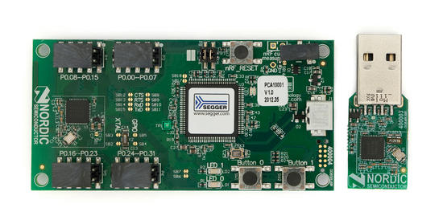
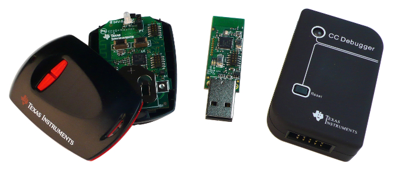

# 第五章 硬件平台

大多数 BLE 产品的商业用例涉及外围设备（peripherals），而不是你设计产品来与之交互的中心设备（手机、平板或个人电脑）。因此，本章介绍了一些用于设计和原型制作 BLE 外围设备的特定开发平台。

本章的讨论假设你对嵌入式系统设计有基本的了解（第十章），主要目标是为产品设计师指出可能适合其产品的廉价且易于获取的平台。

## nRF51822-EK（Nordic Semiconductors， Nordic 半导体）

Nordic Semiconductor 多年来一直致力于低功耗无线解决方案，作为蓝牙 SIG 的董事会成员，自 BLE 诞生以来就帮助定义和塑造核心 BLE 标准。Nordic 在无线市场以其流行的通用射频（RF）硅解决方案而闻名，是最早将价格实惠的 BLE 外围模式硅芯片推向市场的公司之一（nRF8001）。其最新的 nRF51 系列代表了对其先前许多单芯片 RF 产品的完全重新设计，将射频与现代 32 位 ARM 微处理器结合在单个芯片中。

### 技术规格

Nordic 的 nRF51 系列是高度集成的片上系统，将兼容 BLE 的射频和现代 ARM 处理器结合在单个低成本封装中，具有以下特性：

- ARM Cortex-M0 内核，运行频率为 16 MHz
- 128 或 256 KB 闪存（S110 BLE 协议栈需要 80 到 90 KB）
- 16 KB SRAM（使用 S110 BLE 协议栈时，应用可使用 8 KB）

作为完全基于闪存的设备是 nRF51822 对于产品设计师的一个关键区分因素。这意味着 BLE 协议栈被写入可修改的闪存中，并且可以随着核心规范的演进而更新，而不一定需要新的硅芯片修订。

这种选择的缺点是，与基于 ROM 的解决方案相比，它增加了每个设备的制造成本。但鉴于蓝牙核心规范的快速发展，从长远来看，这种赌博可能会有回报，因为它使 Nordic 有可能比选择更低成本基于 ROM 芯片的其他芯片供应商更快地将支持最新规范的产品推向市场。

### SoftDevice 架构

为了在其芯片上实现 BLE 支持（这些芯片也可用于非 BLE 标准，如 ANT+ 和专有 2.4GHz 协议），Nordic 使用了它称为 SoftDevice（SD）的东西。SoftDevice 本质上是一个位于闪存底部的黑盒子，实现了 BLE 协议栈和外围角色支持等功能。用户（应用）代码位于闪存的更高地址，并根据需要调用这个较低层的 SoftDevice。

大多数 BLE 产品使用 S110 SoftDevice，这是一个仅外围设备的解决方案。设备架构还包括支持中心角色的 S120 SoftDevice，但由于该用例在 BLE 中不太常见，本节的讨论将集中在 S110 上。

Nordic 的 SoftDevice 设计方法有其优点和缺点。积极的一面是，以 SoftDevice 形式拥有独立的、经过验证的、可靠的 BLE 协议栈，使固件工程师能够将更多精力集中在应用层代码上。他们可以处理更小的 API 和更高级的概念，如 GAP（第三章）和 GATT（第四章），将最低层的细节留给 SoftDevice（安全实现、消息验证等）。

SoftDevice 还使固件开发人员避免自己处理射频配置，这在大多数 RF 产品中可能是固件开发过程的重要组成部分。将这些细节变成黑盒子可以保护固件工程师免于犯低级错误，并且可以显著简化产品验证过程，因为低级 BLE 代码保证按照蓝牙核心规范运行。

SoftDevice 方法的另一个优点是它允许一个硬件设计支持多种射频协议或用例，包括设计自定义协议的能力，这可能会降低拥有基于单个 PCB 设计的多个类似内部产品的公司的产品成本。

最后，SoftDevice 的架构对应用开发人员是非侵入性的。因为它独立运行，应用不需要链接任何库集，SD 和应用更新都可以独立进行，没有依赖关系，就像人们可以独立更新 Linux 内核或用户空间库而不担心另一方被更新影响一样。

不利的一面是，SoftDevice 需要系统资源，这些资源将无法供你自己的应用使用。S110 SoftDevice 分配了底部 80 KB 闪存和 8 KB SRAM，给你留下 176 KB 闪存和 8 KB SRAM 供你自己的应用使用（假设使用的是 nRF51822 的 256 KB 版本）。

SoftDevice 设计还引入了延迟和架构限制，因为较高层代码需要通过 ARM 内核上的软件中断从你的较高层代码调用 SoftDevice。

与任何大型工程任务一样，SoftDevice 带来的众多好处需要一些牺牲，主要是围绕时序和硬实时要求。

### 使用 nRF51822-EK

如果你有兴趣评估 nRF51822，最好的入门平台是 Nordic 的 nRF51822-EK。如图 5-1 所示，该评估套件包括两个开发板：PCA10001（左）和 PCA10000（右）。

*图 5-1. Nordic Semiconductor 的 nRF51822-EK*

PCA10000 是一个小型 USB 加密狗，主要用于调试，可以通过 Nordic 的 Master Control Panel 模拟中心设备，或作为嗅探器将数据推送到 Wireshark（两者都在第七章讨论）。但它本身也是一个功能齐全的开发板，带有集成的 Segger J-Link，允许你使用各种开发工具对固件进行编程和调试。

较大的 PCA10001 是套件中的主要开发板。它引出了 nRF51822 上所有可用的引脚，使你可以连接 I2C 或 SPI 传感器或外围设备，通过 UART 与其他设备通信等。该板还包括板载 J-Link 用于编程和调试 MCU，以及一些额外的电路来测量功耗，使原型制作和调试更容易。例如，UART 输出可以选择通过 USB 输出，因此你可以轻松地可视化调试消息或向 MCU 发送简单命令。它还具有 CR2032 电池座，允许板子由小型电池供电。

### 示例和工具链

Nordic 提供了大量基于此开发套件的示例（在注册你的套件后，见下文注释），如果你只想从你知道会工作的东西开始，这是一个简单的选择。大多数演示代码使用 Keil 的 uVision（IAR 工具链作为第二选项），ARM 免费提供用于小于 32 KB 的非商业项目（这实际上应该涵盖广泛的项目，因为 SoftDevice 不包含在 32 KB 限制中，只有应用代码）。

> 注意：你需要在 Nordic Semiconductor 网站上创建 MyPages 账户并注册你的 nRF51822-EK 的序列号，然后才能访问此芯片组的最新演示代码和开发工具。

一些支持材料和示例项目也可用于基于 GNU 的工具，尽管 GNU（和 Eclipse）支持不如 Keil uVision 广泛。然而，值得注意的是，目前可以在 GNU/Linux 和 Mac OS X 上开发完整的应用，而无需借助 Windows。

为了提供开源选项，我们还在本书的 GitHub 仓库中包含了一个基本代码库。该代码基于免费可用的 GNU 工具链，包括 makefile、启动代码和一些基本工具，用于使用板载 J-Link 调试器对闪存进行编程。

## CC2541DK-MINI（Texas Instruments，德州仪器）

另一家在低功耗射频领域拥有悠久历史的公司，德州仪器设计了大量针对外围设备市场的 BLE 片上系统（SoC），并且是第一个将外围 BLE 解决方案推向市场的公司。

CC2541 结合了以下特性：

- 带 2.4 GHz 射频的 8051 内核
- 128 或 256 KB 用户可编程闪存
- 8 KB SRAM

TI 相对于一些竞争对手的最大优势之一是其 BLE 协议栈功能完整，基本涵盖了蓝牙核心规范的整个 4.0 版本。一些供应商选择不实现某些不常用的可选功能，而 TI 有意努力在其功能覆盖范围上更进一步。

CC2541 还与 CC2540 引脚兼容，后者在 SoC 中增加了 USB 支持。这可能会延长围绕此芯片家族的任何设计工作的寿命，只需最小的额外设计工作，因为你可以轻松地将设计转移到通过 USB 连接到台式机或笔记本电脑的外围设备。

TI 认真对待设计和测试，其射频芯片家族拥有悠久的设计传承。它使用精心设计的射频制造可靠的芯片，并为这些芯片提供大量的设计资源，面向硬件设计师和固件工程师。对于没有太多内部射频或嵌入式固件设计专业知识的小公司来说，这可能是一个重要的考虑因素。

CC2541 的一个大弱点是驱动其 SoC 的相对过时的 8051 内核，这不仅需要昂贵的商业编译器和 IDE 才能使用（IAR Embedded Workbench），而且与进入许多其他 SoC 的现代 ARM Cortex-M 内核相比，感觉相当陈旧。这可能在不久的将来会改变，因为 SoC 供应商感受到转向更新内核的更大压力，TI 无疑清楚这一趋势。看看公司未来如何应对将很有趣。

在 TI 的 CC254x 家族的众多开发套件中，低成本的 CC2541DK-MINI（图 5-2）平台应该使外围设备设计师能够彻底评估开发平台和 SoC。

该套件包含开始使用 CC2541 所需的所有硬件，包括硬件调试器、可以在你的 PC 上充当 BLE 主设备的 USB 加密狗，以及可以运行你的自定义 BLE 代码的密钥扣开发板。

这个开发套件的一个吸引人的元素是它非常接近真实产品，带有注塑外壳和两个大型物理按钮，在初始开发和调试过程中提供真实反馈。在产品开发的早期阶段很容易忽略这些类型的细节，但它们可以帮助了解 BLE 设备的实际性能，即使某些具体细节（如操作范围）当然会因设备设计而异。

*图 5-2. 德州仪器的 CC2541MINI-DK 开发套件*

简单地将低功耗设备握在手中通常会衰减信号，提供与几英尺外桌子上毫无阻碍的裸 PCB 完全不同的体验。也更容易将外壳中的电池供电设备带离工作台，在现实世界中做一些事情，比如将其附加到其他物体或人身上。这是一个小细节，但如果你在设计过程的早期没有将开发套件带离办公桌，它可以为你节省时间并避免潜在的意外。

有关此开发套件的更多信息，包括订购详情，请参阅德州仪器网站上的 CC2541 产品页面。

## 其他硬件平台和模块

如果你不想从头开始构建自己的射频设备和电路板，模块提供了一种替代方法。模块的一个关键优势是它们通常已经通过各种监管机构（如 FCC 或 CE/ETSI）作为有意发射器进行了预认证，并且很可能通过各种协议机构（如蓝牙 SIG）设置的任何测试程序。FCC 或 CE 认证每个产品很容易花费 10,000 美元，这使得模块成为产量相对较低的产品的一个有吸引力的选择。

使用模块的另一个优点是射频设计已经为你完成，而定制射频硬件设计需要专业知识、工具和测试。在产品设计合适的天线或射频前端是一项非同小可的任务，糟糕的设计会显著影响产品的操作范围和效率。模块制造商通常通过提供经过适当设计和调谐的射频前端和天线，或允许你轻松添加外部天线的通用连接器来解决这个问题，而无需担心传输线上的阻抗匹配（将能量传输到射频和从射频传输的金属走线）。

作为另一个优势，一些模块（例如本节后面讨论的 Bluegiga 模块或 Laird 模块）带有高级开发脚本语言，可以显著减少开发时间，并避免使用低级编程环境（如 Nordic 的 nRF51822-EK 的 Keil uVision 或德州仪器的 CC2541MINI-DK 的 IAR）的一些困难。它们只需要一个文本编辑器进行代码开发。

当然，使用模块的好处是有代价的。模块的单价显著高于使用单个集成电路（如 nRF51822 或 CC2541）设计自己的硬件。模块制造商将设计、验证和认证成本分摊到多个产品上，并允许低产量产品达到他们自己无法达到的价格点，但在某个点（可能超过 10,000 个单元），设计和认证自己的硬件可能更具成本效益。

本节其余部分描述了撰写本文时可用的三个 BLE 模块。

### Laird 的 BL600 模块

Laird 的 BL600 模块基于 Nordic Semiconductor 的 nRF51822。除了 nRF51822 中包含的所有原始功能外，这些模块还添加了事件驱动的 smartBASIC 编程语言，使你可以轻松创建基本应用，而无需学习或投资昂贵的商业 IDE 和编译器，也无需使用 C 或 C++ 等低级语言进行编程。

你可以使用标准 C 代码和 Nordic 的 nRF51822 SDK 和工具链直接对模块进行编程，但 smartBASIC 选项对于简单的用例可能很有用，你只需要以最小的开发工作量为你的产品添加无线链接，而无需深入学习新的协议栈和技术。

该模块具有 CE/ETSI（欧洲）、FCC、加拿大工业部、日本和 NCC（台湾）的监管认证，以及蓝牙 SIG 认证，也可以从许多主要的在线元件经销商处购买。

### Bluegiga 的 BLE112/BLE113 模块

Bluegiga 的 BLE112 和 BLE113 模块基于德州仪器的 CC2540/CC2541。它们支持 BGScript，允许你使用简单的 XML 文件对某些类型的应用进行编程。Bluegiga 还提供 C API，使用外部 MCU 通过这些模块工作，通过 UART 与模块通信。

BLE112 和 BLE113 之间的主要区别是较新的 BLE113 模块功耗略低，并添加了硬件 I2C 端口，可用于与各种低成本传感器（温度传感器、加速度计、陀螺仪、压力传感器等）通信。

这些模块具有 CE/ETSI（欧洲）、FCC、加拿大工业部、日本和韩国的监管认证，可以从大多数主要元件经销商（Digikey、Mouser、Farnell 等）购买。

### RFduino

RFduino 是一个小型 BLE 模块，允许你使用流行的 Arduino IDE 和开发平台创建 BLE 设备。如果你已经熟悉 Arduino，RFduino 是尝试 BLE 的绝佳入门点，因为它可以显著降低让初始原型启动和运行的学习曲线。

这些模块具有 CE/ETSI（欧洲）、FCC 和加拿大工业部的监管认证，可以从多个元件经销商处购买，包括 Mouser 和 Arrow。
