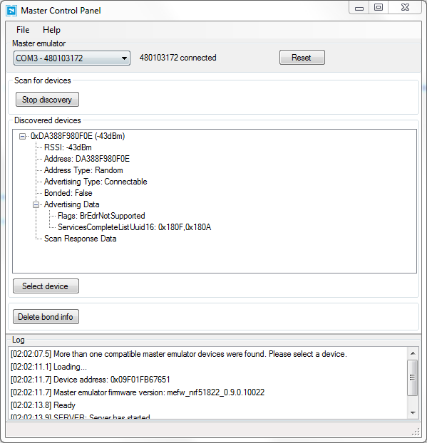
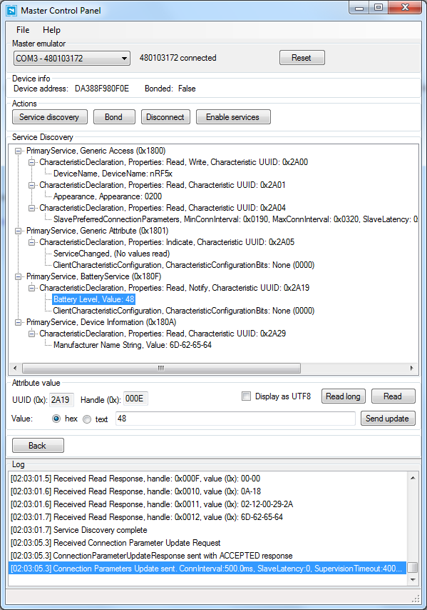
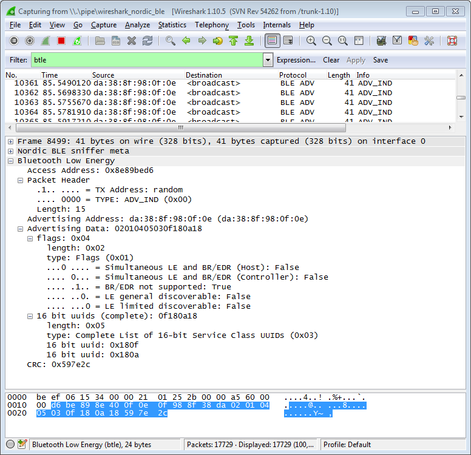
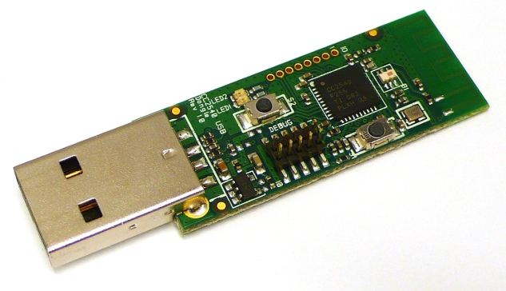
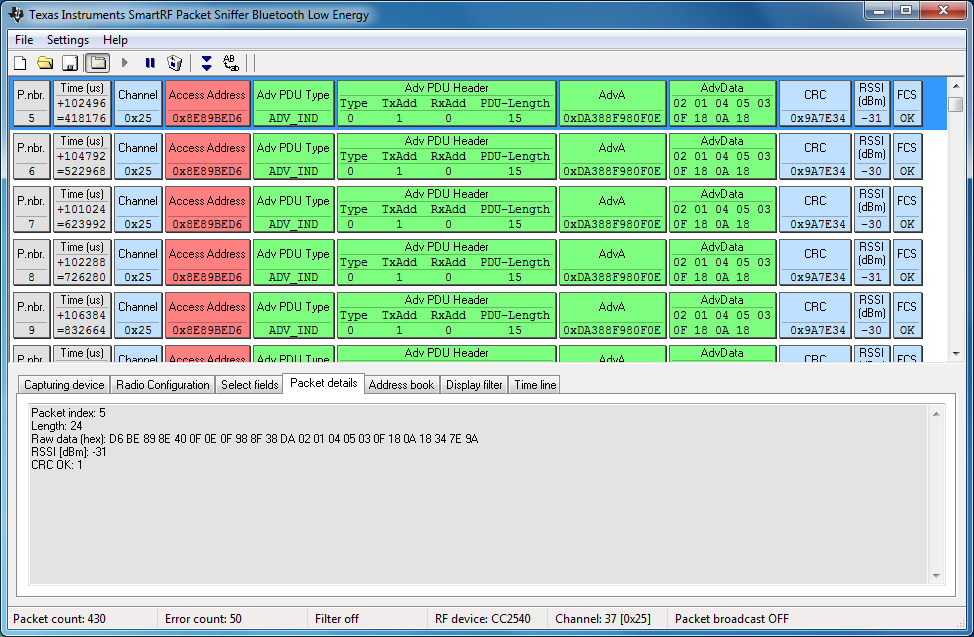

# 第六章，调试工具

本章介绍了用于BLE的一些有用的调试和开发工具。这包含了硬件工具，如无线协议分析工具（wireless protocol analyzers）或者*嗅探器*（sniffers，嗅探空中的传输数据，将获取到的数据现实在一个UI上并之后进行分析），还有在调试期间与BLE从设备直接交互的工具。

## PCA10000 USB Dongle和Master Control Panel

PCA10000是一个USB电子狗，是诺迪克半导体的nRF51822-EK套件的一部分（参见第五章[用nRF51822-EK工作](./chapter5.md#用nRF51822-EK工作)），这个是nRF51822片上系统（SoC）的一个低成本评估套件。当这个套件被正在设计自有的BLE从设备的嵌入式硬件工程师设计时，即使你只开发手机应用，购买该套件也会比较划算，因为套件包含了许多非常有用和价格合理的调试工具。

Master Control Panel (MCP)是其中的一个调试工具，这是一个Windows界面的程序，可以将PCA10000 USB Dongle模拟成为一个BLE中心设备。该工具的有一个易操作的界面，你可以看到范围内任何BLE从设备的数据，或者给任何你已连接的从设备发送数据。这在没有包含BLE本地支持的Windows 7上也非常适用（Windows 8上支持BLE，但操作系统没有包含一个用于测试和调试的类似应用）。

诺迪克也给Android提供了一个主控平台（Master Control Panel）应用，包含了一些相同的功能却不需要任何硬件的需求，虽然截止目前，适用PCA10000的独立工具支持大量工具集。

如果你在编写一个现有从设备的应用程序，你也可以使用MCP去逆向还原BLE设备，显示设备自有数据结构和配置设置信息，然后在你的手机应用中使用发现服务和特征UUID来访问它们。

MCP使用一个制定的包含了工具安装包的固件镜像来和PCA10000交流。使用诺迪克的nRFGo Studio（在诺迪克的网站注册你的nRF51822-EK套件后即可看到使用，第五章[例子和工具链](./chapter5.md#例子和工具链)有相关信息），你可以更新USB dongle来使用该固件镜像。

一旦PCA10000已经升级成合适的固件，你可以打开MCP与从设备通过一个简单的UI交互进行交流，这可以几乎完成一个普通中心设备的任何功能。其包含了绑定、打开或者关闭一个连接，读写GATT特征等。

图6-1展示了一个单独的从设备广播自己的结果。

一旦你连接从设备，并发送一个服务发现请求，你就会看到设备上一组服务和特征（见图6-2），同样你也可以用这样的方式读取任意常规BLE中心设备。

你可以通过选择一个合适的特征进行更新值，在文本编辑框馁修改数值，并点击“发送更新”。你也可以通过选择特征并点击读取键来获取最新的特征值，对于特征的通知和指示都未使能的情况下，这是非常有用的。



*图6-1. 主控制面板（MCP）显示广播数据*

在早期硬件开发过程中，MCP是一个极其脆弱的工具，当你可能没有一个手机应用给你BLE从设备进行交流的时候。主控制面板可以模拟几乎任何你的应用执行的动作，包括校验通信中进出的数据。

MCP也包括了一组C#库，被用于自动提供其任意的功能，允许应用开发者创建一个拥有简单但完整的一组中心设备的API的桌面应用或者命令行应用。这对于这对于自动化复原测试或者产品测试可以说是非常有用的。



*图6-2. 主控制面板展示服务和特征数据*

## PCA10000 USB Dongle和Wireshark

前文的主控制面板（Master Control Panel）似乎是与BLE从设备交互最简单的方式，但是一些用例需求访问BLE的底层数据。对于这些情况，诺迪克也提供给给PCA10000或者PCA10001一个通用的固件镜像和工具（这两个都包含在nRF51822-EK开发套件内），可以从一个单独的从设备嗅探通信数据并推送到[Wireshark](http://www.wireshark.org/)内。

Wireshark是一个成熟而功能强大的开源数据获取和分析的软件，该软件可以将包和字节级别的数据轻松可视化。诺迪克的Wireshark插件（见图6-3，可在[诺迪克官网](http://www.nordicsemi.com/)注册nRF51822-EK套件后使用）通过nRF51822-EK开发板获取数据，并增加有用的描述帮助理解这些原始的数据。



*图6-3. 诺迪克半导体的PCA10000在Wireshark插件的数据*

如果你仅对设计与已有的BLE从设备通信的应用感兴趣，你将几乎不需要到达底下这一层。但是对于从事从设备设计、编码或者尝试调试一个制定的时延、吞吐量的硬件设计师或者固件工程师来说，这个就非常的实用。

## CC2540 USB Dongle和SmartRF Sniffer

作为围绕CC254x芯片家族的开发生态系统的一部分，德州仪器设计了[CC2540EMK-USB](http://www.ti.com/tool/cc2540emk-usb)（图6-4），一个低成本的以CC2540芯片的USB dongle，可以使用它们免费的[SmartRF软件](http://www.ti.com/tool/packet-sniffer)（图6-5）来将开发板转换为一个BLE的嗅探器。这结合让你在最低等级上，可以看到你周围所有无线传输的BLE数据。



*图6-4. CC2540EMK-USB*

这完成了一个于PCA10000/Wireshark结合相似的功能（见前文）,但是其提供了一个不同的UI，更易于在一种特定的情境之下工作。该套件可能在一些地区更易于获取。

## SmartRF-to-Wireshark Converter

如果你更喜欢Wireshark（见前文[PCA10000 USB Dongle和Wireshark](PCA10000 USB Dongle和Wireshark))）作为数据分析工具，并且能够使用CC2540 USB dongle（见前文[CC2540 USB Dongle和SmartRF Sniffer](#CC2540 USB Dongle和SmartRF Sniffer)），你会很高兴发现[smartRFtoPcap](https://github.com/mikeryan/smartRFtoPcap)，这是一个免费的工具，可以将保存的SmartRF数据转换为一个Wireshark可以理解的文件格式。

你不需要使用PCA10000和诺迪克的Wireshark插件将在线数据流导入Wireshark，而是可以选择转化之前获取的可能依然有用的文件，因为Wireshark包含了大量的过滤、搜索你记录的数据的工具。



*图6-5. 德州仪器的SmartRF Sniffer应用*

## Bluez hcitool和gatttool

如果你正在使用一个Linux工作站，你可以利用Bluez蓝牙协议栈中的两个有用的工具：hcitool和gattool，这可以从命令行与BLE设备进行交互。

 *如果你不能使用一个专业的Linux工作站，Bluez也可以很好地运行在一个不昂贵的Linux设备上，比如树莓派或者BeagleBone Black，这两都可以转变为非常有用且移动方便的BLE调试工具。*

hcitool可以扫描、连接范围内的BLE从设备，或者视需要，使用任何可支持BLE4.0的USB dongle模拟为一个BLE设备。为了扫描范围内的BLE设备，你可以执行下列命令（假设我们的USB dongle已经作为hci0）：

```shell
sudo hcitool -i hci0 lescan
```

一旦你有了设备地址（通过之前扫描命令获取而得），你可以使用下列命令进行连接从设备（假设从设备的地址为6C:60:B3:6E:7C:B1）：

```shell
sudo hcitool lecc 6C:60:B3:6E:7C:B1
```

gatttool可以与GATT服务交互，如读写设备特征值。

这些内容都可以使用命令行操作，意味着你可以将一些特定重复的动作或者测试条件写成脚本，并在多终硬件设备上可靠而持续地运行这些相同的测验。