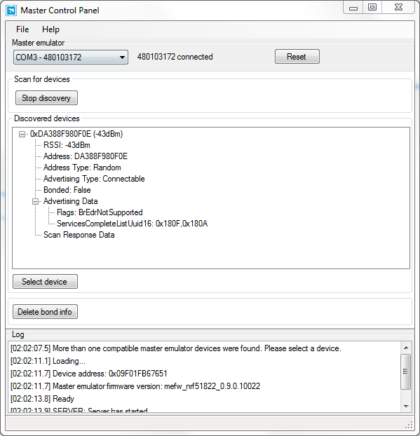
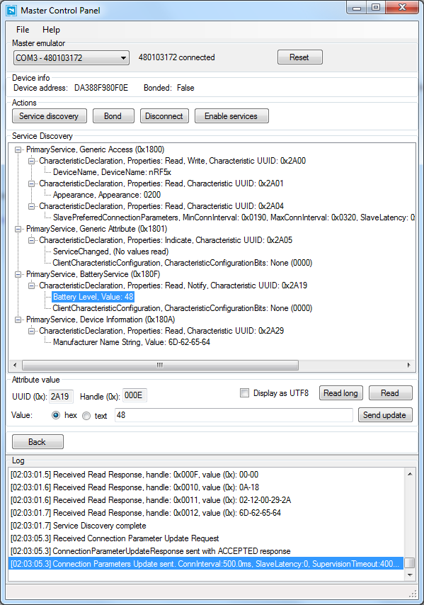
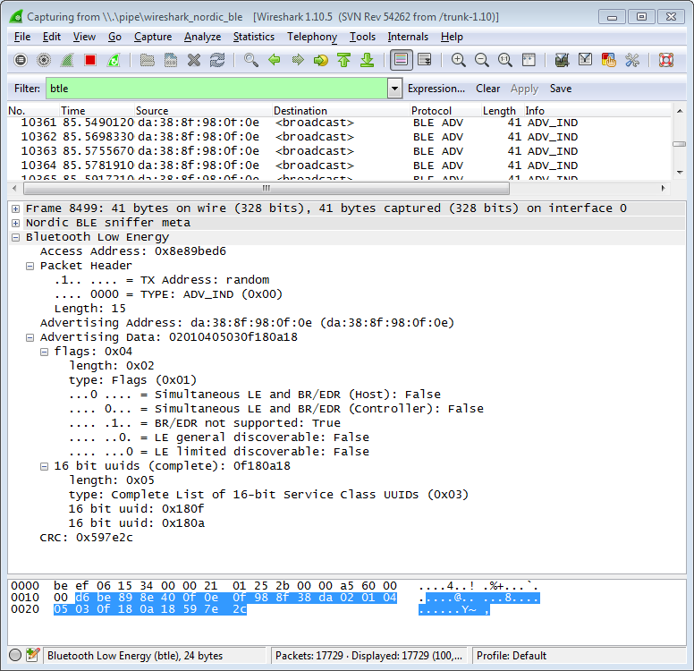
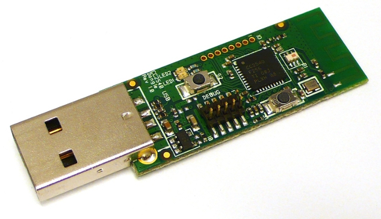
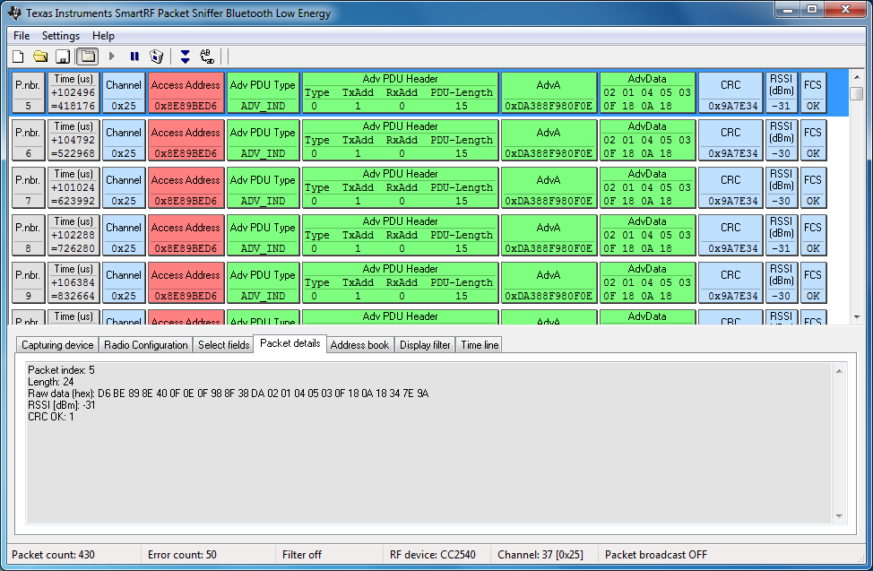

# 第六章 调试工具

本章介绍了一些用于蓝牙低功耗的有用调试和开发工具。它包括硬件工具，如无线协议分析器或嗅探器（这些工具嗅探空中传输的数据，在 UI 中显示捕获的数据以供后续分析），以及在调试过程中直接与 BLE 外围设备交互的工具。

为了让小型初创企业或刚开始接触 BLE 的工程师和开发人员也能使用，本章重点关注廉价工具，而不是价格高达数千或数万美元的高端产品。

## PCA10000 USB 加密狗和 Master Control Panel

PCA10000 是一个 USB 加密狗，包含在 Nordic Semiconductor 的 nRF51822-EK（第五章[使用 nRF51822-EK](./chapter5.md#使用-nrf51822-ek)）中，这是 nRF51822 片上系统（SoC）的低成本评估套件。虽然该套件是为设计自己的 BLE 外围设备的嵌入式硬件工程师设计的，但即使你只开发移动应用，购买该套件也是值得的，因为它以相对适中的价格包含了许多极其有用的调试工具。

这些工具之一是 Master Control Panel（MCP），这是一个基于 Windows 的实用程序，可以将 PCA10000 USB 加密狗变成可以模拟 BLE 中心设备的工具。它具有易于使用的界面，允许你查看范围内 BLE 外围设备上可用的任何数据，或向你连接的任何外围设备发送数据。这在 Windows 7 上特别有用，因为它不包含蓝牙低功耗的原生支持（Windows 8 引入了 BLE 支持，但该操作系统没有包含用于测试和调试的类似应用）。

> 注意：Nordic 还为 Android 提供了 Master Control Panel 应用，包含一些相同的功能，无需任何额外的硬件要求，尽管在撰写本文时，使用 PCA10000 的独立工具支持更大的命令集。

如果你正在为现有的外围设备编写应用，你还可以使用 MCP 快速逆向工程 BLE 配件，显示它们各自的数据结构和配置设置，然后使用发现的服务和特征 UUID 在移动应用中访问它们。

MCP 使用工具安装程序中包含的特殊固件镜像与 PCA10000 通信。使用 Nordic 的 nRFGo Studio（在 Nordic 网站注册你的 nRF51822-EK 后也可用，见第五章[示例和工具链](./chapter5.md#示例和工具链)中的说明），你可以更新 USB 加密狗以使用此固件镜像。

一旦 PCA10000 已更新为适当的固件，你可以打开 MCP 并通过易于导航的 UI 与你的外围设备交互，这允许你执行正常中心设备的几乎任何功能。这包括绑定、打开或关闭连接、读写 GATT 特征等。

图 6-1 显示了单个外围设备广播自身的结果。



*图 6-1. Master Control Panel 显示广播数据*

一旦你连接到外围设备并发送服务发现请求，你可以看到设备上可用的服务和特征列表（如图 6-2 所示），此时你可以像使用任何常规 BLE 中心设备一样读取或写入它们。

你可以通过选择适当的特征、在值文本框中修改值，然后点击"发送更新"来更新值。你还可以通过选择任何特征并点击读取按钮来检索其最新值，这对于尚未启用通知或指示的特征很有用。



*图 6-2. Master Control Panel 显示服务和特征数据*

MCP 在硬件开发过程早期是一个极其有价值的工具，那时你可能还没有移动应用与你的 BLE 外围设备通信。Master Control Panel 可以模拟你的应用将执行的几乎任何操作，包括验证传入和传出数据的通信。

MCP 还包括一组 C# 库，可用于自动化它提供的任何功能，允许应用开发人员创建桌面或命令行应用，这些应用可以访问简单但完整的中心 API 集。这对于自动化回归测试或生产测试非常有用。

## PCA10000 USB 加密狗和 Wireshark

Master Control Panel（[PCA10000 USB 加密狗和 Master Control Panel](#pca10000-usb-加密狗和-master-control-panel)）可能是与 BLE 外围设备交互的最简单方式，但某些用例需要更低级别地访问 BLE 数据。对于这些情况，Nordic 还为 PCA10000 或 PCA10001（两者都包含在其 nRF51822-EK 开发套件中）提供了自定义固件镜像和工具，可以从单个外围设备嗅探流量并将其推送到 Wireshark。

Wireshark 是一个成熟且强大的开源数据捕获和分析工具，允许你轻松地将数据可视化到数据包和字节级别。Nordic 的 Wireshark 插件（如图 6-3 所示，在 Nordic 支持网站注册你的 nRF51822-EK 套件后可用），通过 nRF51822-EK 板捕获数据，并添加有用的描述以帮助理解这些原始数据。



*图 6-3. Nordic Semiconductor 的 PCA10000 与 Wireshark 插件*

如果你只对设计与现有 BLE 外围设备通信的应用感兴趣，你几乎不需要深入到这个级别。但这对从事自己的外围设备设计和代码的硬件设计师或固件工程师，或尝试调试特定时延或吞吐量问题的人来说，这可能非常有用。

## CC2540 USB 加密狗和 SmartRF Sniffer

作为其 CC254x 系列 IC 开发生态系统的一部分，德州仪器设计了 CC2540EMK-USB（图 6-4），这是一个基于 CC2540 的低成本 USB 加密狗，可以与其免费的 SmartRF 软件（图 6-5）一起使用，将板子转换为 BLE 嗅探器。这种组合允许你在最低级别查看周围空中传输的所有 BLE 数据。



*图 6-4. CC2540EMK-USB*

这执行了与 PCA10000/Wireshark 组合（[PCA10000 USB 加密狗和 Wireshark](#pca10000-usb-加密狗和-wireshark)）类似的功能，但它提供了不同的 UI，在某些情况下可能更容易使用。在某些地区，这些套件可能更容易采购。



*图 6-5. 德州仪器的 SmartRF Sniffer 应用*

### SmartRF 到 Wireshark 转换器

如果你更喜欢 Wireshark（[PCA10000 USB 加密狗和 Wireshark](#pca10000-usb-加密狗和-wireshark)）作为数据分析工具，并且可以使用 CC2540 USB 加密狗（[CC2540 USB 加密狗和 SmartRF Sniffer](#cc2540-usb-加密狗和-smartrf-sniffer)），你会很高兴发现 smartRFtoPcap，这是一个免费可用的工具，可以将保存的 SmartRF 数据转换为 Wireshark 可以理解的文件格式。

你将无法像使用 PCA10000 和 Nordic 的 Wireshark 插件那样将实时数据流式传输到 Wireshark，但能够转换之前捕获的文件可能仍然很有用，因为 Wireshark 包含许多实用程序来过滤和搜索你记录的数据。

## Bluez hcitool 和 gatttool

如果你使用的是 Linux 工作站，你可以利用 Bluez 蓝牙协议栈中的两个有用实用程序，hcitool 和 gatttool，它们允许你从命令行与 BLE 设备交互。

> 注意：如果你无法使用专用的 Linux 工作站，Bluez 也可以在廉价的 Linux 设备（如 Raspberry Pi 或 BeagleBone Black）上正常运行，这将它们变成极其有用且便携的 BLE 调试工具。

hcitool 允许你扫描范围内的 BLE 外围设备、连接到它们，或使用任何受支持的 BLE 4.0 USB 加密狗可选地模拟 BLE 设备。要扫描范围内的 BLE 设备，你可以发出以下命令（假设我们的 USB 加密狗枚举为 hci0）：

```shell
sudo hcitool -i hci0 lescan
```

一旦你有了设备的地址（通过先前的扫描命令检索），你可以使用以下命令连接到外围设备（假设外围设备地址为 6C:60:B3:6E:7C:B1）：

```shell
sudo hcitool lecc 6C:60:B3:6E:7C:B1
```

gatttool 允许你与 GATT 服务交互，例如读取或写入设备上的特征。

能够从命令行执行此操作意味着你可以轻松地为某些重复操作或测试用例编写脚本，并在多个硬件设备上一致且可靠地运行相同的测试。
