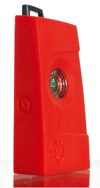
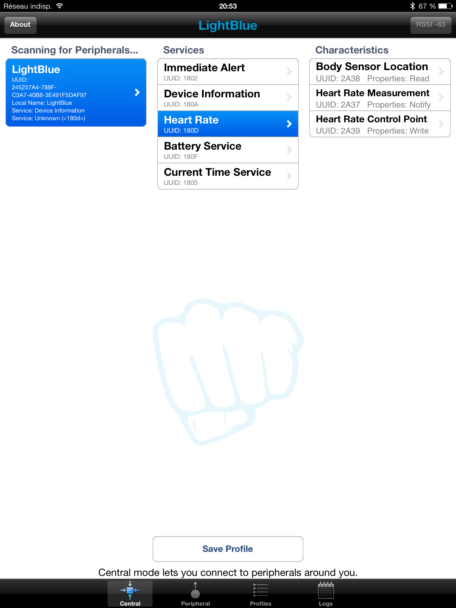
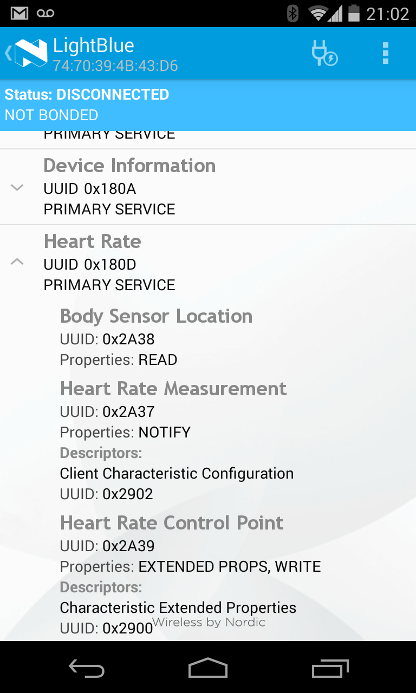

# 第七章 应用设计工具

本章为移动应用开发者介绍了有用的工具，包括适用于常见移动操作系统的代码模板、可用于模拟物理 BLE 设备的廉价硬件平台（如果你在应用开发早期阶段没有自己的硬件，这将非常有用），以及一些纯软件工具，可以帮助调试和开发你的应用。

## 蓝牙应用加速器

蓝牙低功耗主要集中在移动计算领域，特别是手机和平板，在传统台式电脑和笔记本电脑上也有一定的采用——尤其是在人机接口设备（HID）类别中，主要用于鼠标和键盘。鉴于此，蓝牙 SIG 推出了蓝牙应用加速器（Bluetooth Application Accelerator）计划，使应用设计师更容易采用蓝牙低功耗。

应用加速器本质上是一组软件模板，使在 iOS、Android 和 Windows RT 8.1 平台上创建基本 BLE 应用相对轻松。它还包括简单的示例代码，展示如何连接和使用 GATT 服务和特征。

当然，需要对特定平台有一定的了解，但模板应该使相对容易地掌握与目标外围设备交互所需的 BLE 特定调用。该计划需要注册，但无需费用。更多详情，请参阅蓝牙开发者门户。

## SensorTag

虽然大多数人会将德州仪器（TI）与硬件设计联系在一起，但作为其 BLE 开发生态系统的一部分，TI 发布了一个有趣且低成本的 BLE 开发工具，称为 SensorTag（图 7-1），这对移动应用开发者非常有用。

*图 7-1. 德州仪器的 SensorTag BLE 设备*

对于大多数 BLE 用例，移动应用显然只是问题的一半，你通常需要硬件供你的应用与之交互。但在开发过程的早期阶段，硬件可能不可用，或者如果你只是有兴趣学习在移动平台上使用 BLE API，你可能不知道从哪里开始寻找设备来通信。

SensorTag 通过在一个相对便宜且易于订购的设备中提供令人印象深刻的传感器集合来解决这个问题，并为 iOS 和 Android 提供了示例应用，展示如何与这些传感器交互。

电池供电的蓝牙低功耗 SensorTag 平台包括以下传感器：

- 温度传感器
- 湿度传感器
- 压力传感器
- 加速度计
- 陀螺仪
- 磁力计

这种传感器组合为数据采集和丰富的用户交互提供了许多独特的机会。加速度计和磁力计可以结合使用来收集相当准确的三轴旋转数据，压力传感器可以在设备上下移动时测量海拔变化，等等。

最重要的是，SensorTag 平台允许应用开发者与真实硬件通信，以最小的麻烦获取真实的传感器数据，而无需学习如何自己设计外围设备，或在等待项目中其他专家提供可用硬件的同时继续应用开发。

有关更多详情或订购设备，请访问 TI 的 SensorTag 产品页面。

## iOS 上的 LightBlue

许多移动应用开发者可能对设计自己的 BLE 硬件不感兴趣，而是希望与市场上已有的 BLE 外围设备通信。

虽然第六章讨论的一些调试工具无疑对应用设计师有用，但任何拥有较新 iOS 设备的人都可以使用 Punch Through Design 提供的极其有用的工具，称为 LightBlue。这个免费应用在 App Store 中可用，可用于从 iPhone 或 iPad 逆向工程甚至模拟任何 BLE 外围设备。

你可以使用 LightBlue 与设备公开的服务和特征交互——例如，读取或写入单个值。你还可以使用它捕获现有 BLE 外围设备的唯一签名，然后回放该签名用于开发目的，本质上模拟你可能无法日常访问的设备。

如果你知道设备应该是什么样子，但实际硬件不可用，你还可以创建配置文件来模仿你的外围设备，然后创建一个设备，一旦硬件可用，它将看起来与硬件完全相同，如图 7-2 所示。

LightBlue 的版本也可在 Apple 的 App Store 中用于 OS X，尽管在撰写本文时，iOS 版本提供更多功能。

应用开发者还可以在开发 BLE 外围设备但相应的 iOS 或 Android 应用尚未完成时使用 LightBlue。你可以模拟中心和外围之间的空中交互，允许你在中心设备上尚未开发自定义应用的情况下调试外围设备的固件。

*图 7-2. LightBlue 显示在另一个 LightBlue 实例上模拟的 BLE 设备*

## Android 上的 nRF Master Control Panel

如果你在支持蓝牙低功耗的设备上运行 Android 4.3 或更高版本，Nordic 的 Master Control Panel 的 Android 版本允许你在易于使用的 UI 中调试、逆向工程或与现有 BLE 硬件交互。

你可以从 Google 的 Play Store 下载这个免费工具，并找到附近 BLE 外围设备上存在的任何服务或特征的 UUID，订阅特征发送的通知，或向外围设备写入值，类似于 LightBlue（[iOS 上的 LightBlue](#ios-上的-lightblue)）和基于 PC 的 Master Control Panel 应用（[PCA10000 USB 加密狗和 Master Control Panel](../../chapter6.md#pca10000-usb-加密狗和-master-control-panel)）的工作方式。

图 7-3 显示了心率监测器服务的结果，其中身体传感器位置和心率测量都可见。

*图 7-3. nRF Master Control Panel 显示心率监测器服务*

有关 Master Control Panel 应用和 Nordic Semiconductor 的其他 Android 应用的更多信息，可在其支持页面上找到。
