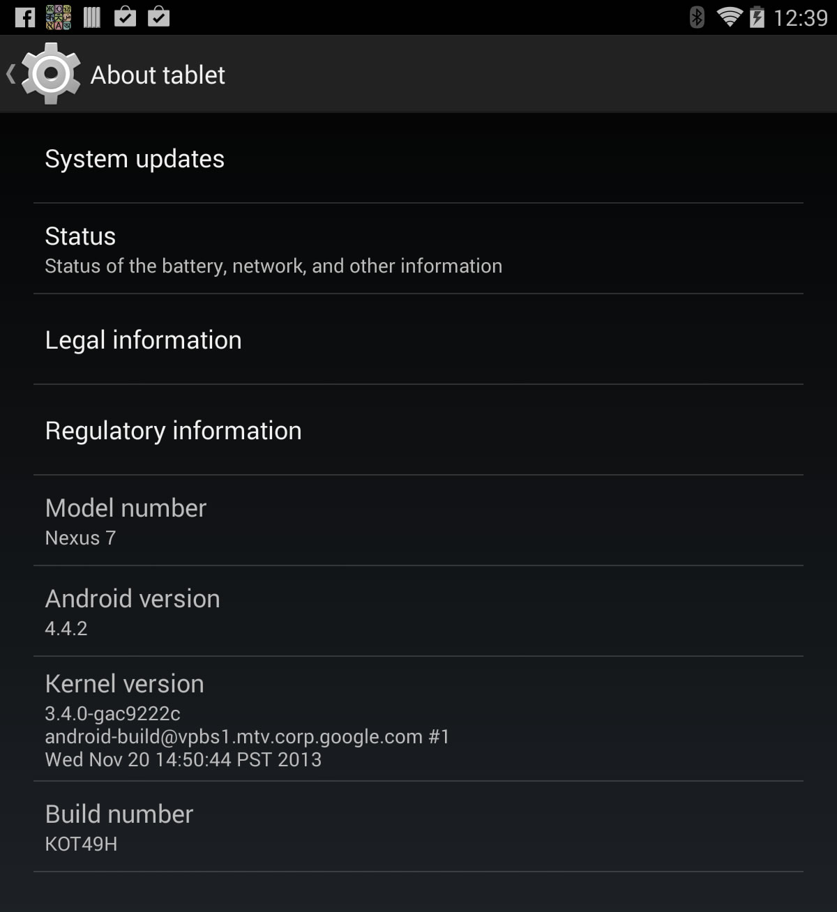
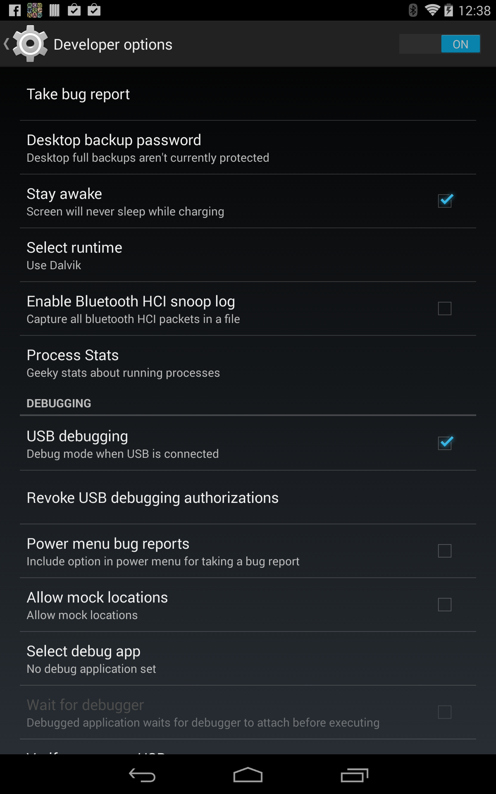
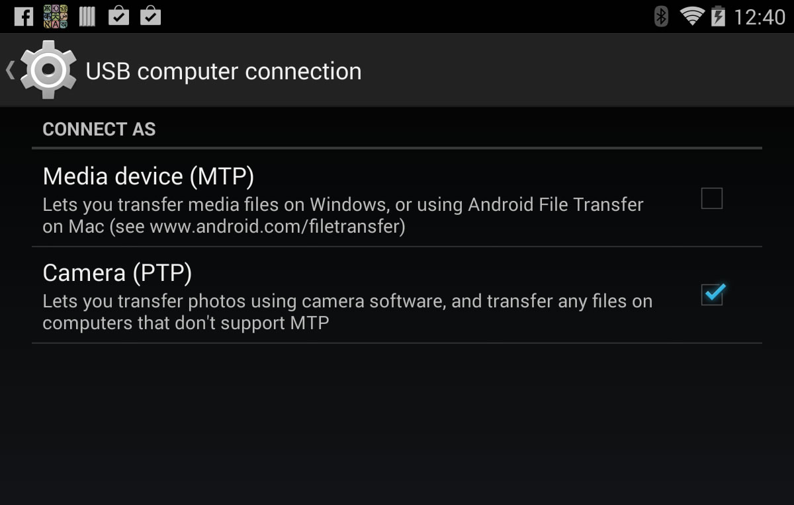
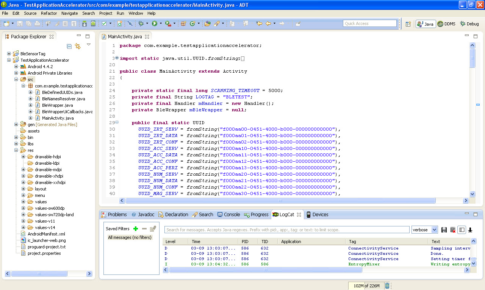
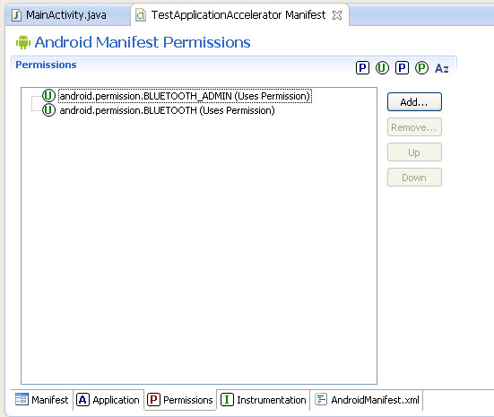
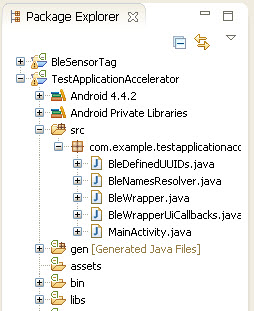
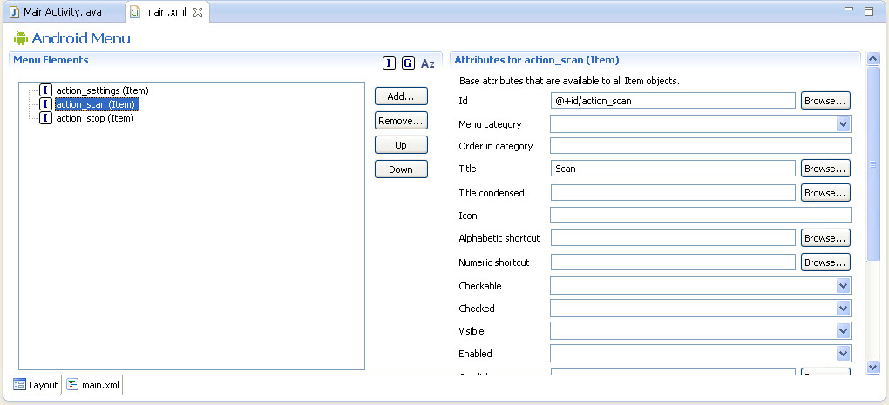
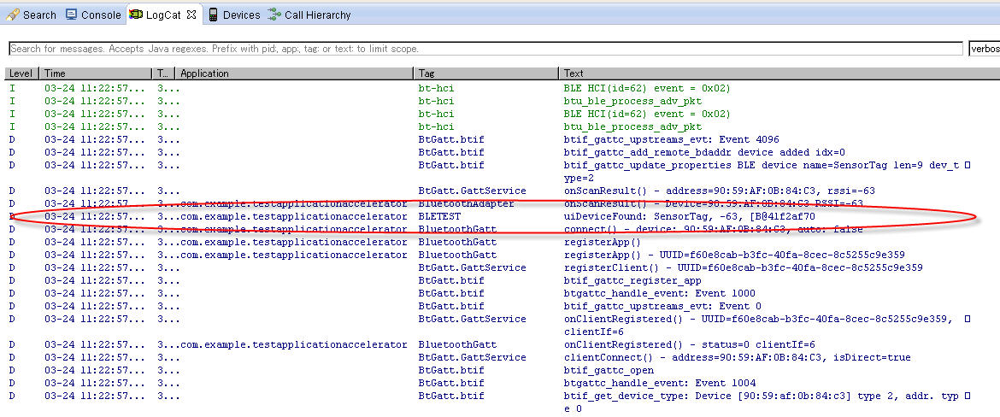
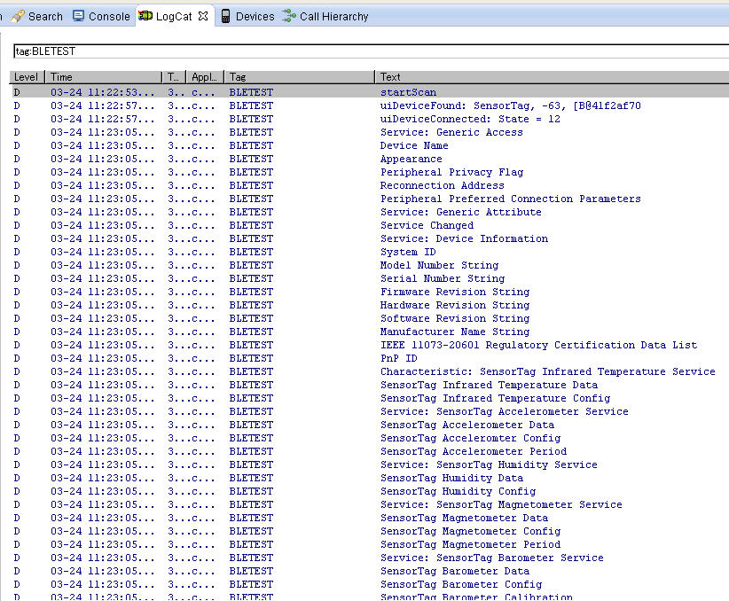

# 第八章，安卓编程

使用一个像BLE的无线标准的其中一个好处是其对各种广泛的智能手机和平板的支持。无线标准打开了一个新的与嵌入式硬件项目相沟通的维度，如今已经可以用廉价的硬件和大量接口进行设计。

在接口之外，你可以使用手机作为进入更大的互联网的入口，或者结合其他应用或者API创建一个与你自己创建的嵌入式硬件混合的程序。这使得一个新的类型的便宜设备可以使用，还提供大量的功能。

本章介绍了软硬件，以及在安卓操作系统上加入BLE功能的流程需求的一个基本概括。

## 开始

本章的安卓项目开发范例基于德州仪器（TI）制造的低成本的SensorTag（见第七章[SensorTag](./chapter7.md#SensorTsag)）设备。SensorTag提供了许多传感器，是一个可以提供大量信息进行处理和可视化的很好的复杂传感器设备的例子。

因为安卓的GUI端会有一点复杂，超过本书介绍的范围，本章将聚焦于你将从SensorTag的哪里提取以及通过BLE获取数据。在一点上，许多其他可用的资源可以来证明展示数据。

### 获取硬件

对于硬件，你需要一个安卓设备运行安卓4.3或更高的版本。安卓开始支持BLE的版本为4.3，但我们建议设备至少运行的是安卓4.4版本，这包含了一个已经升级的并且更稳定的BLE协议栈的版本。你也需要确认硬件是否支持BLE。这里的样例项目使用的是运行安卓4.4的谷歌Nexus7。

 *为了确认设备是否支持BLE，参见蓝牙的[智能设备列表](http://bit.ly/1iDPs0M)。*

你也需要选一个TI的SensorTag，在这个项目中作为从设备服务。更多关于SensorTag设备请参见第七章[SensorTag](./chapter7.md#SensorTag)。

## 获取软件

对于这个项目，你需要三款软件：

*Eclipse安卓开发工具（ADT）*

​	可在[安卓开发网站](http://bit.ly/PYcBmE)使用。

*蓝牙应用加速器*

​	可在[蓝牙SIG网站](http://bit.ly/1kQPQuv)使用。

*TI SensorTag安卓应用资源代码*

​	可在[TI网站](http://bit.ly/1kR0aTd)使用。

安装过程中最重要、最耗时的部分是安装安卓开发工具，这需要懂一点如何使用Eclipse IDE。你最好去[安卓开发网站](http://bit.ly/PYcBmE)得到更多关于设置开发环境的指示。你将需要下载最新的SDK以及进行所有的安卓开发工具的更新。

## 配置硬件

在可以使用作为开发设备前，安卓设备需要一些配置。首先，你需要激活开发者模式，如果该模式并没有被开启。进入设置菜单，滑倒底部，并选择关于。在关于的界面上（见图8-1），快速点击“编译版本”7次开启开发者模式。



*图8-1. 从关于界面开启开发者模式*

你应该可以在设置菜单中看到一个新的“开发者选项”条目。现在，你将需要开启“USB调试”和“保持唤醒”选项，如图8-2所示。



*图8-2. 在”开发者选项“中开启“USB调试”和保持唤醒“选项*

最后，前往设置菜单，选择 保存→选项→“USB电脑连接”，并使能相机选项（如图8-3）去允许进行文件传输。



*图8-3. 配置安卓作为一个相机进行传输文件*

这听起来似乎反人类，但是设备需要进入相机模式才可以作为开发工具进行工作。

### 开始一个新的项目

为了开启一个新的项目，你需要导入蓝牙应用加速器（Bluetooth Application Accelerator）的安卓文件到这个项目。打开Eclipse ADT，选择文件/导入，导航到含有应用加速器的文件目录，选择安卓/BLE范例的文件夹。点击OK导入项目到工作空间。

在这一点上，你可能希望粗略看下应用加速器文件是怎么布局的。如果这个对于你来说看起来比较陌生，不用担心。相比花大量时间在应用加速器里面，你只需要将BLE库主要的类文件移到自己项目中即可。

现在是时候创建自有的安卓项目了。在Eclipse内，选择文件→新建→安卓应用项目。对于应用名字，使用BleSensorTag。最小SDK需求的版本，指定安卓4.3版本。这个是安卓支持BLE的最低版本。对于目标SDK和编译，使用设备所支持的最新安卓版本。接收默认，点击剩余窗口的下一步。最后，项目向导（project wizard）会创建一个新的称为BleSensorTag的安卓项目。

如图8-4所示（该图在左边展示了项目目录结构，左边为主代码窗口），一个安卓项目含了许多文件夹和文件，但是你只需要在里面的一部分进行工作。主要的源程序文件时位于 /src 目录。



*图8-4. Eclipse中主要的Java窗口*

每一个项目都包含了一个清单（manifest），为AndroidManifest.xml，展现了该应用对于安卓系统的具体要素信息。安卓在系统内运行任何程序之前需要一些信息。除此之外，你也将用到 /res 文件夹，这包含了XML的文件，掌控了一些将会用到的布局和菜单。

 *安卓程序是一个大型的内容，远超过本章的范围，本章只关注于整合BLE到安卓应用的部分。对于更多复杂的GUI部分，我们推荐你咨询其他安卓编程文章。*

在你开始任何实际的编写代码之前，你需要给与安卓清单（manifest）BLUETOOTH和BLUETOOTH_ADMIN权限。双击AndroidManifest.xml文件，选择权限标签（Permissions tab，见图8-5）.选择“增加...”→“用户权限”，将android.permission.BLUETOOTH 输入进名称框里。在另一个“用户权限”里面重复一遍动作，这回写上android.permission.BLUETOOTH_ADMIN。当应用安装好后，这两个条目会要求用户访问该名字服务的权限。



*图8-5. 安卓清单文件权限窗口*

现在，你需要从蓝牙应用加速器内移入一些类的文件到项目中。这将会使类文件和方法为自己所用，让BLE编程变得更为简便。选择和复制以下文件：

- BleWrapper.java
- BleWrapperUiCallbacks.java
- BleNamesResolver.java
- BleDefinedUUIDs.java

将文件复制到BleSensorTag项目的 /src 目录（或者拖放到该目录）。一旦你增加了这些文件，/src 目录就如图8-6。



*图8-6. 安卓 /src 目录*

BleWrapper是由蓝牙SIG组织发布的应用加速器库的主要部分。这是安卓BLE库的一个简化封装，使访问和使用库都更简便，因为其掌管了大量复杂的处理流程。

这就完成了项目的前期工作。现在你已经创建了这个项目，配置了清单文件，安装了类的库文件，你已经准备好安卓代码的大餐了。

## 初始化BLE库

是时候开始实作了。第一步（强调BLE的编码中心，而不是过多在GUI的一侧），范例将会主要打印出BLE收到的信息。之后，你将增加一些GUI特性来将BLE的数据展示出来。

在你开始之前，你需要创建一个已导入的BleWrapper库的实例。这文件是来自蓝牙SIG组织的蓝牙应用加速器：

```java
public class MainActivity extends Activity {
    // add this line to instantiate the BLE wrapper
    private BleWrapper mBleWrapper = null;
    
    @Override
    protected void onCreate(Bundle savedInstanceState) {
        super.onCreate(savedInstanceState);
        setContentView(R.layout.activity_main);
	}
```

文件中增加的这行为创建BleWrapper类的实例，这包含了你将用于访问底层安卓BLE库的方法。在指导手册中，你还需增加一些回调函数（callback），这是来自安卓BLE库内的一些处理事件。

在之前的代码段中，可以注意到自动生成的一个函数叫做onCreate()。当应用初始启动时该函数被调用，你将在开始阶段使用该函数进行一些初始化，有且只执行一次。这函数包含的是，如果设备进入睡眠或者context丢失之后再重新返回的情况下，不需要再重新初始化的内容。

安卓的文献中都由概括出“activity生命周期”的概念，描述了应用在其自身“生命”过程中不同的阶段的方法。如当应用开启时，三个独立的生命周期方法将被调用：onCreate(), onStart(), 和onResume()。当仅需要初始化一次就初始化应用onCreate()的类，当设备进入睡眠或者context丢失的情况下需要重新初始化则初始化onResume()的类。

文献中提供了在这个activity生命周期内更多的信息，这是需要理解的很重要的概念，因为你将初始例行程序的一部分做在onCreate()里面，一部分做在onResume()里面。当关机时你也将需要处理一些收尾部分，这将在onPause()或者onStop()完成。

在onCreate()方法里面，你将看到部分由项目向导（project wizard）生成的样板（boilerplate）代码。在这之后，你将增加更多的代码去初始化你的mBleWrapper对象以及完成其他初始任务：

```java
@Override
protected void onCreate(Bundle savedInstanceState)
{
    super.onCreate(savedInstanceState);
    setContentView(R.layout.activity_main);
    
    mBleWrapper = new BleWrapper(this, new BleWrapperUiCallbacks.Null()
    {
    });
    
    if (mBleWrapper.checkBleHardwareAvailable() == false)
    {
        Toast.makeText(this, "No BLE-compatible hardware detected",
        Toast.LENGTH_SHORT).show();
        finish();
    }
}
```

这部分代码通过将其实例化并调用自身构造函数（constructor），分配了一个新BleWrapper对象到mBleWrapper成员变量中（上一段为空）。当进行该封装器(wrapper)的实例化时，你还需要增加一个BLE回调函数作为该构造函数的一个参数。这里就是增加处理一些来自BLE协议栈的通知事件代码的地方。

在软件编程中，*回调函数（callback）*作为一个可执行代码的引用，作为一个参数被传入函数中，当函数完成执行完毕之后将回调这段代码。对于现在，我们对这个构造函数不增加任何回调，之后再回来看这部分。

在完成构造函数之后，代码执行一个检查，确认BLE硬件是否在这个系统上可用。如果为否，一个称为“Toast”的弹出信息框会提示用户缺失BLE硬件，并关闭app。

这里就完成了应用启动时需要在onCreate()方法内执行的代码。现在看onResume()方法，该方法在应用启动以及应用在任何时候从睡眠中恢复时执行代码：

```java
@Override
protected void onResume() {
    super.onResume();
    
	// check for Bluetooth enabled on each resume
    if (mBleWrapper.isBtEnabled() == false)
    {
        // Bluetooth is not enabled. Request to user to turn it on
        Intent enableBtIntent = new Intent(BluetoothAdapter.
        ACTION_REQUEST_ENABLE);
        startActivity(enableBtIntent);
        finish();
    }
    
    // init ble wrapper
    mBleWrapper.initialize();
    }
}
```

 *Eclipse提供一个快速建立这些函数的捷径。只需要敲方法名字的一开头部分的几个字母，之后按Ctrl+Spacebar。从弹出的自动完成列表中选择函数，让Eclipse为你建造函数。*

这里的样板代码为super.onResume()。你需要在这后边加入自有代码。在这个案例中，你需要检查蓝牙在每一次从一个不同的context或者睡眠中恢复后，是否是可以用的。当其他程序使用在用时，蓝牙可能已经被关闭了。不去捕获状态改变仅仅假设蓝牙一直时开启的，这将会最终导致一些故障发生，或者软件的异常。为处理这种状况，如果程序发现蓝牙是关闭的，就将使用Android intent发送给用户一个请求，去打开蓝牙并退出应用。下一次应用重新打开的时候，如果蓝牙是开启的，程序就将继续进行。

一旦代码通过前面的检查，就将开始初始化BleWrapper，这将打开蓝牙界面并从安卓蓝牙适配器（Android Bluetooth adapter）内获取一个实例。一旦你得到该实例，你就可以访问BLE无线模块和协议的函数。

最后，你需要处理安卓生命周期的最后一个方法，onPause()。在任何context丢失、设备进入睡眠状态、或者应用关闭的时候，该方法都被调用：

```java
@Override
protected void onPause() {
    super.onPause();
    
    mBleWrapper.diconnect();
    mBleWrapper.close();
}
```

在我们的范例中，安卓设备将作为一个GAP中心设备和一个GATT客户端，并且SensorTag设备将会作为一个GAP从设备和一个GATT服务端（参见第三章[角色](./chapter3.md#角色)和第四章[角色](./chapter4.md#角色)）。

还是一样，样板代码保持在顶部。在这之后，程序调用两个封装器的方法。第一个方法让你去与远端设备“断开连接”。这个实际上是与远端从设备断开连接，并执行uiDeviceDisconnected()的回调方法。如果你需要在与从设备断开连接之后处理一些事情，你需要复写uiDeviceDisconnected()回调函数。最后，关闭BleWrapper，即完全关闭本地GATT客户端和中心设备。

## 连接到远端设备

现在初始化和结束清除都已经完成，可以关注到代码真正的部分了。与你需要控制的BLE的主要任务就是扫描和连接远端设备、通信和执行任何必要的管理或者安全任务。

当初始化一个扫描过程（参见第二章[广播和扫描](./chapter2.md#广播和扫描)），你可以让BLE库知道，你希望被通知到任何其从远端设备接收到的广播包。无论何时设备被找寻到，BleWrapper都会带着该设备信息去调用uiDeviceFound()回调函数。你可以使用设备信息来决定是否连接该设备。

对于扫描，你需要创建两个按键：第一个开启扫描，第二个停止。要创建这个按键，你需要到项目 /res/menu 目录中并编辑main.xml文件。如果你双击该文件，Eclipse会用GUI界面来引导你使用去增加菜单项。任何在main.xml文件的菜单项都将作为一个按键在选项菜单中存在。你将创建两个项，一个称为开始，一个称为结束，各自用于开始和结束扫描。

在安卓菜单GUI中，选择增加→项目，并使用“扫描动作”（action_scan）和“扫描结束”（ac
tion_stop）作为名字，如图8-7。这将作为按键的ID，当你为菜单按键写入点击处理的时候，你可以使用该ID。在菜单项的标题区域，各自敲击扫描（Scan）和停止（Stop），以在菜单项上显示文字。



*图8-7. 在安卓ADT菜单中增加按键*

一旦菜单项创建，你将需要处理按键点击事件。默认下，安卓样例代码会使用在*main.xml*中的内容作为菜单按键。样例代码没有点击处理，因此你需要增加进来。

在Eclipse中，如果敲击onOptionsItemSelected并按下Ctrl+Spacebar，软件回自动填充该函数，包含了@Override的关键字。这将为点击事件实现自有的处理而复写onOptionsItemSelected()函数。当点击菜单栏的任何项，onOptionsItemSelected()方法都将被调用。一旦你进入该方法，你需要有一个switch声明用于处理哪一个菜单项被点击的事件。虚拟代码看起来如下：

```java
@Override
public boolean onOptionsItemSelected(MenuItem item) {
    switch (item.getItemId())
    {
        case R.id.action_scan:
            mBleWrapper.startScanning();
            break;
        case R.id.action_stop:
            mBleWrapper.stopScanning();
            break;
        default:
            break;
    }
    return super.onOptionsItemSelected(item);
}
```

该代码覆写了OptionsItemSelected()函数以使用自有的处理。该方法仅在处理关于选项菜单的时候方才调用。在switch声明中，可以根据被点击的按键选项ID来决定进入哪一个处理。该项ID基于之前你创建的按键的ID。R.id这个前缀意味着来自内部安卓项目资源目录的ID，并不是安卓自身命名空间的一部分。

在新的处理的两个动作中，获将开启扫描流程，或将停止，正如你在BleWrapper中看到的两个方法一样。实际上，开启和停止扫描流程可能是整个按键功能中最简单的一个部分。

下一个步骤是当远端设备被检测到的动作。远端设备将发出“它在这儿”和“准备连接”的广播。当程序进入扫描模式，其将在BLE无线模块中开启扫描，并让安卓系统知道如果接受到广播其希望被通知到。安卓蓝牙库将通过回调函数通知程序。

为了使用回调函数，你需要重新看下在onCreate()方法内写的代码。在该方法内，你初始化了BleWrapper.。在BleWrapper.的构建函数内，其希望你提供一列回调函数。之前在这边留空了，但是现在需要填充该部分内容。首先要覆写uiDeviceFound()回调函数，这函数将在设备在扫描过程中被发现的时候被调用：

``` java
mBleWrapper = new BleWrapper(this, new BleWrapperUiCallbacks.Null()
{
    @Override
    public void uiDeviceFound(final BluetoothDevice device,
    final int rssi,
    final byte[] record
    )
    {
        String msg = "uiDeviceFound: "+device.getName()+", "+rssi+","+rssi.toString();
        Toast.makeText(this, msg, Toast.LENGTH_SHORT).show();
        Log.d("DEBUG", "uiDeviceFound: " + msg);
    }
}
```

当发现一个设备的时候，这段代码将弹出一个toast消息窗。这并没有什么有效，但是是最简单的一种方式，当设备被发现并显示关于设备的信息。在真实用户使用中，你将输出任何设备的信息到设备列表中，这样用户就可以点击去初始化一个连接。

toast弹出信息显示两个来自广播包的内容：设备名字（参见第三章[广播数据格式](./chapter3.md#广播数据格式)）和RSSI。RSSI（代表*信号强度指标* 的一个无线术语）是表示接收的信号（在这情况下为，在广播包内所有比特的平均值）有多强。在一些情况下，RSSI可以用作提供一个大致的距离数据。另一条重要的有用的信息大概就是设备地址（这个在每一个广播包内都包含），但目前单独设备名字也足够了。

代码不仅在toast消息窗输出相同的信息，也通过Log命令输出日志信息，Log时一个安卓库。在Eclipse IDE使用logcat工具调试中，Log信息会进行显示（见图8-8）。当你使用Log命令，你可以指定一个标签（tag）。使用这个很棒的工具，你可以用标签过滤掉大量的信息。



*图8-8. 来自Log命令的消息在完整的logcat堆放的信息高亮显示*

目前，代码应该有能力去验证检测一个远端设备发送广播包。一旦有能力做这些事情，就有能力去连接。通常，应该要保存所有检测到的设备并以列表的形式显示给用户，如第三章[连接建立流程](./chapter3.md#连接建立流程)。用户就可以点击他试图连接的设备。为了避免GUI的复杂性，我们通过做假设来简化用例。

我们假设希望连接到一个SensorTag设备。以下代码使用“SensorTag”检测广播包，并用自动初始化任何用这名字的设备：

``` java
@Override
public void uiDeviceFound(final BluetoothDevice device,
                            final int rssi,
                            final byte[] record)
{
    String msg = "uiDeviceFound: "+device.getName()+", "+rssi+", "+ \
    rssi.toString();
    Log.d("DEBUG", "uiDeviceFound: " + msg);
    if (device.getName().equals("SensorTag") == true)
    {
        bool status;
        status = mBleWrapper.connect(device.getAddress().toString());
        if (status == false)
        {
        	Log.d("DEBUG", "uiDeviceFound: Connection problem");
        }
    }
}
```

自动连接进程避免进入安卓复杂的GUI，只关注在我们从事的BLE库上面。

之前给uiDeviceFound()的回调函数代码已经去掉了弹出消息框。在找到一个和“SensorTag”名字相同的设备之后，代码回让BleWrapper连接设备，并以字符串格式传入设备地址（在第二章[蓝牙设备地址](./chapter2.md#蓝牙设备地址)介绍）。BleWrapper回使用地址向设备发送一个单播连接请求。接着当连接成功后，会通过uiDeviceConnected()回调函数进行提示。

你将需要覆写回调函数，增加处理代码。如果连接因为某种原因失败，该方法会返回失败。你可以使用logcat控制台去进行日志记录来进行调试。

## 与远端设备进行通信

一旦你成功连接一个远端设备，BleWrapper将自动为新的设备开启发现服务（如第四章[服务与特征发现](./chapter4.md#服务与特征发现)描述）。这意味着BleWrapper将要求新的设备列出所有的服务和特征，并保存在列表中。

如果连接到GATT服务端和服务发现成功了，其他回调函数就开始了。这回，uiAvailableServices()的回调函数和其中一个列出所有的蓝牙GATT服务的服务列表（service list）（更多关于服务和特征信息请参见第四章[服务](./chapter4.md#服务)）这个参数在远端设备就可以使用了。为了与设备进行通信，我们需要进入服务以及在服务内的特征。

这时候，可以循环列表并将所有的服务打印出来，但是这是不易读的格式。服务通过128bitUUID列出（参见第四章[UUID](./chapter4.md#UUID)）。早期时候从蓝牙应用加速器妇之的库包含了一个称为BleNamesResolver的类。这个类有很多方法可以将UUID解析为BLE的名字。其可以解析包括服务和特征的名字，因此这个库是相当有用的。

已知的UUID列表位域BleDefinedUUIDs.java文件中，你之后需要增加一些合适的服务的UUID进该列表中。目前，仅遍历该服务列表并打印出所有的服务UUID，就可以转化出可读的名字和相关信息（对于目前logcat来说）。下面代码是另一个覆写的回调函数，并在onCreate方法中走到，并在mBleWrapper的构造函数中：

``` java
@Override
public void uiAvailableServices(BluetoothGatt gatt,
                                BluetoothDevice device,
                                List<BluetoothGattService> services)
{
    for (BluetoothGattService service : services)
    {
        String serviceName = BleNamesResolver.resolveUuid
        (service.getUuid().\toString());
        Log.d("DEBUG", serviceName);
    }
}
```

该代码遍历了每一个服务列表中的元素。对于每一个服务，其将UUID转换为一个字符串值并传给BleNamesResolverBleNamesResolver.resolveUuid()方法。该方法查找已知的UUID列表，当找到一个匹配的UUID，就返回相关的可读的UUID名字。代码将通过logcat打印出名字到Eclipse IDE中。正如图8-9所示。这也可以导出信息到文本框中，但是这就稍微麻烦了点。



*图8-9. Eclipse中，logcat显示了服务和特征*

可以看到，有一些UUID是未知的。这通常意味着含有厂家指定的128bit UUID，如果需要解析清楚，就需要将其加入UUID列表中。在这个例子中，TI给自己的设备使用一些厂家指定的服务UUID，因为这部分不需要适配到一个标准的设备配置文件中。这是一个很大的UUID地址空间，因此在处理不同BLE地址时候，可能会遇到很多厂家指定的UUID。你需要增加TI厂家制定UUID到列表中并重新运行这段程序。

目前，你走完BLE应用的大部分开发过程，并可以运行。你已经检测了远端设备，连接并打印了其可用的所有服务。下一步是读取关联设备传感器的特征值（在第四章[特征](./chapter4.md#特征)介绍）。

属于传感器的特征值携带了传感器的数据，因此通过读取可获得传感器数据。一旦从传感器获取了数据，你可以进行整理并处理这些数据，并用吸引人的方式来显示给用户。在这例子中，我们将关注于获取数据，并让用户决定如何处理、展示。

当使用SensorTag时候有一个需要注意的是这是一个移动设备。设备被设计为低功耗，因此传感器默认是关闭的。为了读取每一个传感器，你需要写入特征值去开启。一旦传感器可以使用，你就可以读取数据。

正如第四章[特征](./chapter4.md#特征)讨论的，所有与用户数据相关联的操作都通过特征执行。为了开启一个传感器，首先要找到包含相符合的特征的服务和其特征（参见第四章[服务和特征发现](./chapter4.md#服务和特征发现)），然后接收其数值（参见第四章[读取特征和描述符](./chapter4.md#读取特征和描述符)）。接着你需要修改特征值以开启传感器，并用合理的方式写入到设备，这参见第四章[写入特征和描述符](./chapter4.md#写入特征和描述符)。这称作一个*读取-修改-写入*流程。

现在已经连接了外围设备，并有BluetoothGatt对象可以使用。为了获得服务，你需要使用gatt对象内的一个叫做getService()的方法。这个带有一个UUID的参数，这意味着你将要提供一个指定的服务UUID。这些事所有TI指定的UUID，但是幸运的是，TI在SensorTag源码中以Java格式提供了完整的服务列表和特征的UUID。

你可以复制粘贴完整的UUID列表到你的源代码中，并让其称为常量。以下为一个这应该展现的样子的例子：

``` java
private static final UUID
    UUID_IRT_SERV = fromString("f000aa00-0451-4000-b000-000000000000"),
    UUID_IRT_DATA = fromString("f000aa01-0451-4000-b000-000000000000"),
    UUID_IRT_CONF = fromString("f000aa02-0451-4000-b000-000000000000"),
    UUID_ACC_SERV = fromString("f000aa10-0451-4000-b000-000000000000"),
    UUID_ACC_DATA = fromString("f000aa11-0451-4000-b000-000000000000"),
    UUID_ACC_CONF = fromString("f000aa12-0451-4000-b000-000000000000"),
    UUID_ACC_PERI = fromString("f000aa13-0451-4000-b000-000000000000");
...
```

服务UUID有SERV的后缀。否则其他的UUID就是特征。一旦你有了这个定义，你可以写入代码去访问指定的传感器服务和特征。

与远端设备通信不像读取一个特征以及有一个方法返回值那样简单。你实际是需要发送给设备ATT读写请求，GATT服务端接着会回应请求（更近一步概念请见第二章[ATT操作](./chpater2.md#ATT操作)）。在同一时间仅有一个请求会被处理，此时其他接收的请求将被静默丢弃。这看起来似乎很糟糕，因为似乎像设备没有回应。

正确的操作顺序是发送一个请求，并等待对应的回调函数。你将发送一个读请求到远端设备去读取一个指定的特征。在设备回应之后，BleWrapper将带着特征信息发出一个回调函数给uiNewValueForCharacteristic。通过如此，你可以执行*读取特征值* 的GATT特征，详细在第四章[读取特征和描述符](./chapter4.md#读取特征和描述符)提到。

下面这段代码请求了读取一个加速度传感器的配置特征：

``` java
BluetoothGatt gatt;
BluetoothGattCharacteristic c;
gatt = mBleWrapper.getGatt();
c = gatt.getService(UUID_ACC_SERV).getCharacteristic(UUID_ACC_CONF);
mBleWrapper.requestCharacteristicValue(c);
```

一旦请求发出，设备就会带着特征数据回应。在这个例子中，你将导出特征原始数据的每一个字节到logcat中：

``` java
@Override
public void uiNewValueForCharacteristic(BluetoothGatt gatt,
                                        BluetoothDevice device,
                                        BluetoothGattService service,
                                        BluetoothGattCharacteristic ch,
                                        String strValue,
                                        int intValue,
                                        byte[] rawValue,
                                        String timestamp)
{
    super.uiNewValueForCharacteristic( gatt, device, service,
    ch, strValue, intValue,
    rawValue, timestamp);
    Log.d(LOGTAG, "uiNewValueForCharacteristic");
    for (byte b:rawValue)
    {
    	Log.d(LOGTAG, "Val: " + b);
    }
}
```

很重要一点是，读、写都必须进行请求。在安卓BLE库中有很多函数可以得到和设置特征值。这些操作仅在本地保存的数值上，不能再远端设备。在大多情况下，任何与远端设备交互都将需要使用回调函数。

在你读取传感器的任何数值之前，你先要开启传感器。因此你先要写入配置特征值（传感器都有自有的特征来开启，不要与CCCD相混淆）。在大多数情况下，你可以写入0x01到特征中开启。如之前提到的，你实际发送一个写请求（*写入特征值* 请见第四章[写入特征和描述符](./chapter4.md#写入特征和描述符)，操作列表在第二章[ATT操作](./chapter2.md#ATT操作)）给端设备，并等待回调函数。

下面这段代码通过在远端设备写入0x01到加速度传感器配置特征中，开启了加速度传感器：

``` java
BluetoothGattCharacteristic c;
c = gatt.getService(UUID_ACC_SERV).getCharacteristic(UUID_ACC_CONF);
mBleWrapper.writeDataToCharacteristic(c, new byte[] {0x01});
mState = ACC_ENABLE; // keep state context for callback
```

如之前一样，你需要等待回调函数来确认是否写入操作成功。对于代码在哪里等待这个事情发生的问题，最好就是使用单独一个现成或者一个状态机来确定。一个单独的线程可以在线程阻塞时等待回调函数而不需要耽搁系统继续运行。状态机则可以在相同的线程中维持，并保持跟踪当前的context以执行操作。

对于一个写操作，应用加速器已经有两个很有用的回调函数：

``` java
@Override
public void uiSuccessfulWrite( BluetoothGatt gatt,
                                BluetoothDevice device,
                                BluetoothGattService service,
                                BluetoothGattCharacteristic ch,
                                String description)
{
    BluetoothGattCharacteristic c;
    super.uiSuccessfulWrite(gatt, device, service, ch, description);
    switch (mState)
    {
        case ACC_ENABLE:
        Log.d(LOGTAG, "uiSuccessfulWrite: Successfully enabled accelerometer");
        break;
    }
}
      
@Override
public void uiFailedWrite( BluetoothGatt gatt,
                            BluetoothDevice device,
                            BluetoothGattService service,
                            BluetoothGattCharacteristic ch,
                            String description)
{
	super.uiFailedWrite(gatt, device, service, ch, description);
    switch (mState)
    {
        case ACC_ENABLE:
        Log.d(LOGTAG, "uiFailedWrite: Failed to enable accelerometer");
        break;
    }
}
```

为了开启所有的传感器，你可以直接拓展这个例子来开启所有的传感器。在执行写入操作开启第一个传感器后，你可以开启在回调函数中其他的传感器：

``` java
@Override
public void uiSuccessfulWrite( BluetoothGatt gatt,
                                BluetoothDevice device,
                                BluetoothGattService service,
                                BluetoothGattCharacteristic ch,
                                String description)
{
    BluetoothGattCharacteristic c;
    super.uiSuccessfulWrite(gatt, device, service, ch, description);
    switch (mState)
    {
        case ACC_ENABLE:
        Log.d(LOGTAG, "uiSuccessfulWrite: Successfully enabled accelerometer");

        // enable next sensor
        c = gatt.getService(UUID_IRT_SERV).getCharacteristic(UUID_IRT_CONF);
        mBleWrapper.writeDataToCharacteristic(c, new byte[] {0x01});
        mState = IRT_ENABLE; // keep state context for callback
        break;
            
        case IRT_ENABLE:
        Log.d(LOGTAG, "uiSuccessfulWrite: Successfully enabled IR temp sensor");
        // enable next sensor
        c = gatt.getService(UUID_HUM_SERV).getCharacteristic(UUID_HUM_CONF);
        mBleWrapper.writeDataToCharacteristic(c, new byte[] {0x01});
        mState = HUM_ENABLE; // keep state context for callback
        break;

        case HUM_ENABLE:
        ....
        mState = MAG_ENABLE;
        break;
        ...
    }
}
```

一旦传感器开启后，就可以读取传感器。手动读取，你将发送一个读请求到你想要读取的特征中，并在回调函数中进行等待（参见第二章[ATT操作](./chpater2.md#ATT操作)和第四章[读取特征和描述符](./chapter4.md#读取特征和描述符)）。读取可以由一个事件发动，如按键或者一个时钟轮询传感器。在这个例子中，在选项菜单的一个测试按键发动事件。按键的onClick方法调用以下函数来产生一个读请求：

``` java
// Start the read request
private void testButton()
{
    BluetoothGatt gatt;
    BluetoothGattCharacteristic c;
    if (!mBleWrapper.isConnected()) {
        return;
    }
    
    Log.d(LOGTAG, "testButton: Reading acc");
    gatt = mBleWrapper.getGatt();
    c = gatt.getService(UUID_ACC_SERV).getCharacteristic(UUID_ACC_DATA);
    mBleWrapper.requestCharacteristicValue(c);
    mState = ACC_READ;
}

// Get the read response inside this callback
@Override
public void uiNewValueForCharacteristic(BluetoothGatt gatt,
                                        BluetoothDevice device,
                                        BluetoothGattService service,
                                        BluetoothGattCharacteristic ch,
                                        String strValue,
                                        int intValue,
                                        byte[] rawValue,
                                        String timestamp)
{
    super.uiNewValueForCharacteristic( gatt, device, service,
                                        ch, strValue, intValue,
                                        rawValue, timestamp);
    
    // decode current read operation
    switch (mState)
    {
        case (ACC_READ):
        Log.d(LOGTAG, "uiNewValueForCharacteristic: Accelerometer data:");
        break;
    }
    
    // dump data byte array
    for (byte b:rawValue)
    {
    	Log.d(LOGTAG, "Val: " + b);
    }
}
```

一旦传感器数据被请求，就需要进行一系列步骤来处理数据。数据处理每一个传感器的代码可以在SensorTag安卓库的例子中或者在[SensorTag在线使用指南](http://bit.ly/1kQHyTq)找到。

你可以复制/粘贴加速度传感器的处理算法到之前代码段中，通常在代码的ACC_READ状态部分。其他传感器也是如此。

轮询远端传感器是周期获取数据的一种方式，但却对于两端设备都不是节能的。远端设备需要持续保持接收读请求，手机需要保持唤醒去发送轮询请求。一个更节能的方式就是用设备发送通知取代（在第四章[服务初始化更新](./chapter4.md#服务初始化更新)详细描述）。你可以手动设置一些传感器通知的周期。

应用加速器有一个专门的方法来开启通知。在安卓上开启通知，你通常要为你感兴趣的特定特征开启局部通知。

一旦完成这事，你还需要通过写入设备的客户端特征配置描述符（CCCD）在开启远端设备开启通知，如第四章[客户端特征配置描述符](./chapter4.md#客户端特征配置描述符)描述）。幸运的是，这都已经被抽取了出来，两个操作过程都可以通过一个单独的方法调用来处理。

当测试按键被按下，下面的代码即为加速度传感器开启了通知：

``` java
private void testButton()
{
    BluetoothGatt gatt;
    BluetoothGattCharacteristic c;
    if (!mBleWrapper.isConnected()) {
    	return;
    }
    
    // set notification on characteristic
    Log.d(LOGTAG, "Setting notification");
    gatt = mBleWrapper.getGatt();
    c = gatt.getService(UUID_IRT_SERV).getCharacteristic(UUID_IRT_DATA);
    mBleWrapper.setNotificationForCharacteristic(c, true);
    mState = ACC_NOTIFy_ENB;
}
```

有一点要注意的是，这里没有执行onDescriptorWrite()回调函数。去得知通知在远端设备被成功开启的时间的最可靠的方式，就是在CCCD已经被修改以及GATT服务器已经应答了写请求之后，去获取onDescriptorWrite()回调函数。这里的范例增加了onDescriptorWrite()回调函数到BleWrapper类中的应用加速器中执行，这里执行了BluetoothGattCallback代码：

``` java
/* callbacks called for any action on particular Ble Device */
private final BluetoothGattCallback mBleCallback = new BluetoothGattCallback()
{
    ...
        
    // Added by Akiba
    @Override
    public void onDescriptorWrite( BluetoothGatt gatt,
                                    BluetoothGattDescriptor descriptor,
                                    int status)
    {
        String deviceName = gatt.getDevice().getName();
        String serviceName = BleNamesResolver.resolveServiceName( \
            descriptor.getCharacteristic().getService().getUuid().\
            toString().toLowerCase(Locale.getDefault()));
        String charName = BleNamesResolver.resolveCharacteristicName(\
            descriptor.getCharacteristic().getUuid().toString().\
            toLowerCase(Locale.getDefault()));
        String description = "Device: " + deviceName + " Service: " \
        	+ serviceName + " Characteristic: " + charName;
        
        // we got response regarding our request to write new value to
        // the characteristic, let's see if it failed or not
        if(status == BluetoothGatt.GATT_SUCCESS) {
            mUiCallback.uiSuccessfulWrite( mBluetoothGatt, mBluetoothDevice,
                                            mBluetoothSelectedService,
                                            descriptor.getCharacteristic(),
                                            description);
        }
        else {
            mUiCallback.uiFailedWrite( mBluetoothGatt, mBluetoothDevice,
                                        mBluetoothSelectedService,
                                        descriptor.getCharacteristic(),
                                        description + " STATUS = " + status);
        }
    };
    ...
}
```

如果通知被正确写入，onDescriptorWrite()方法将调用应用加速器的uiSuccessfulWrite()方法。

你可以用你开启自身传感器一样的方式为所有的传感器特征开启通知，使用一个状态机来排成队列一一处理。对于通知，要始终知道对于安卓4.4（KitKat），只有4个特征可以在同一时间被开启。这是当前安卓BLE库的一个限制，尽管可能在未来的版本中被改变。

本章的代码大多以片段方式呈现，你可以从本书[GitHub库](http://bit.ly/1qoj8Ed)中获取到完整的代码。