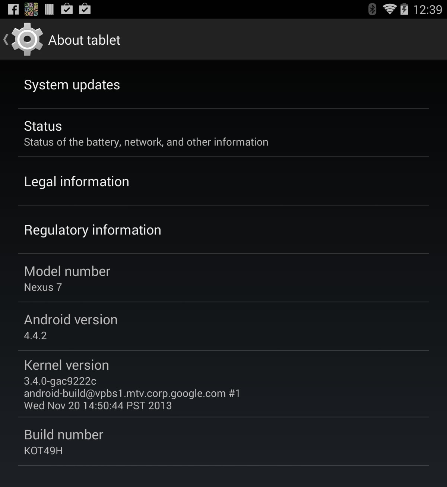
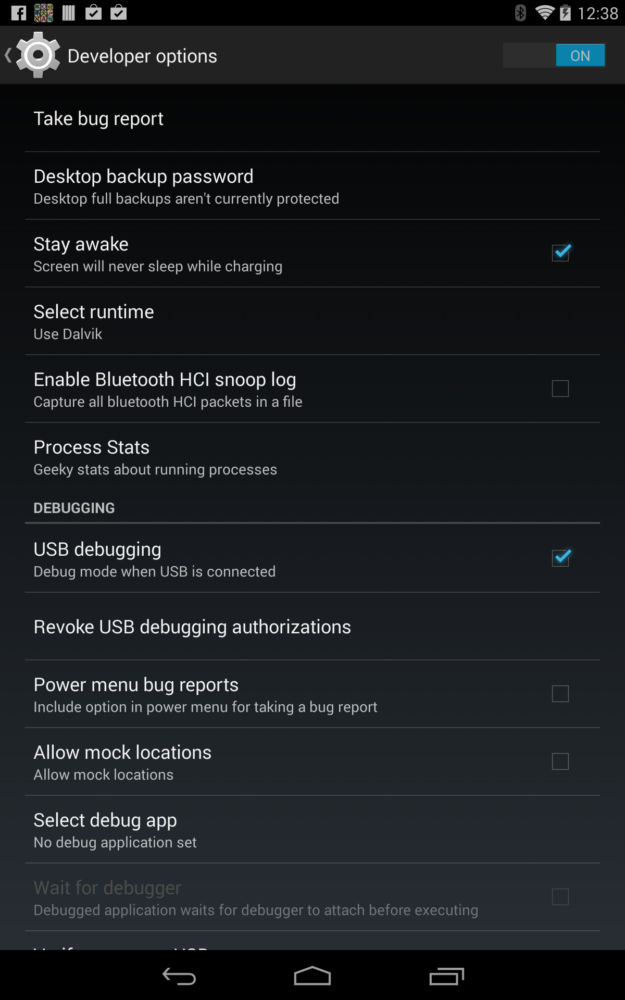
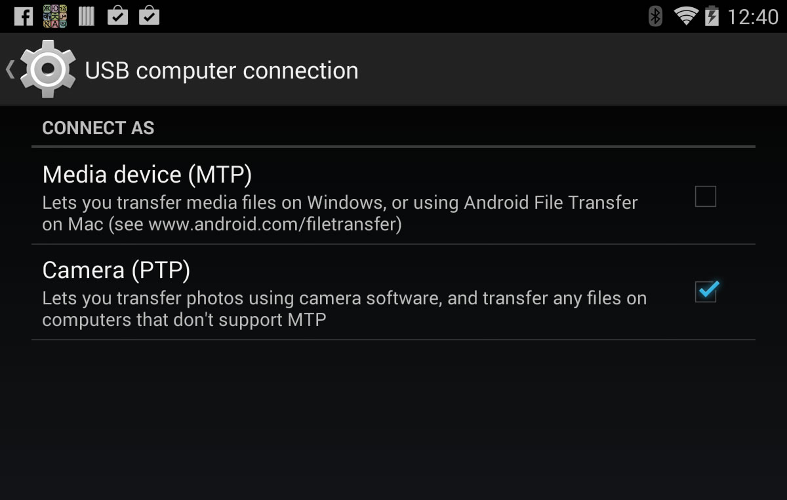
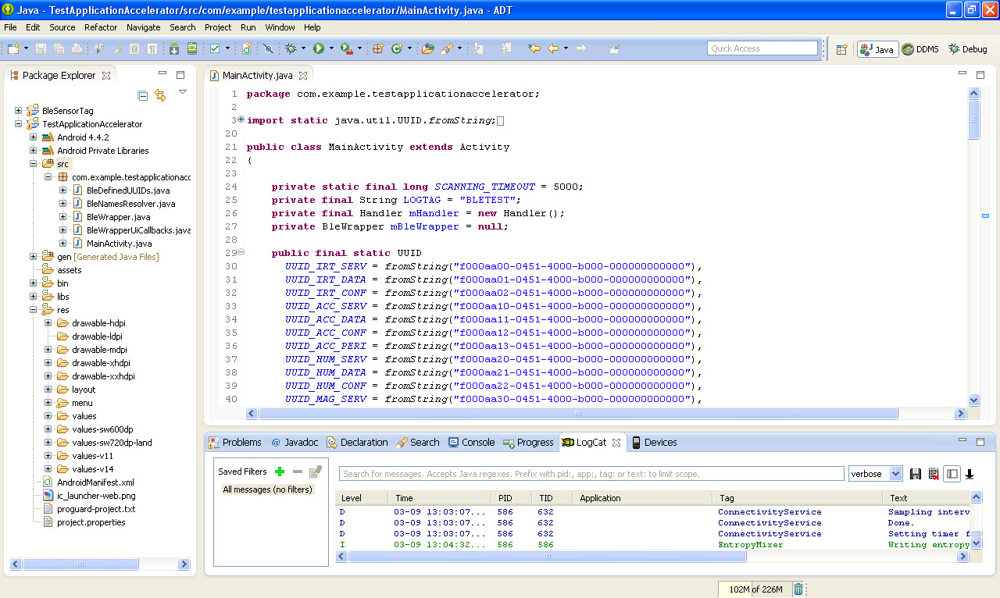
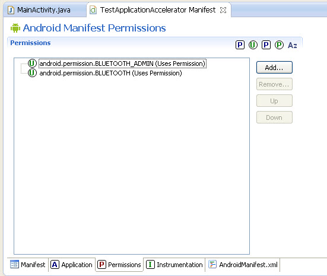
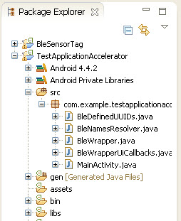
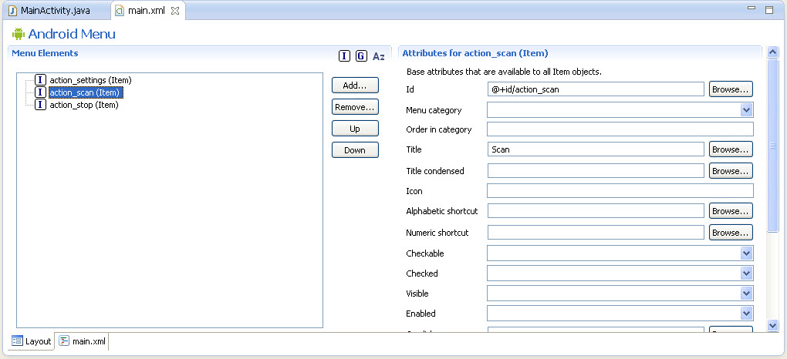
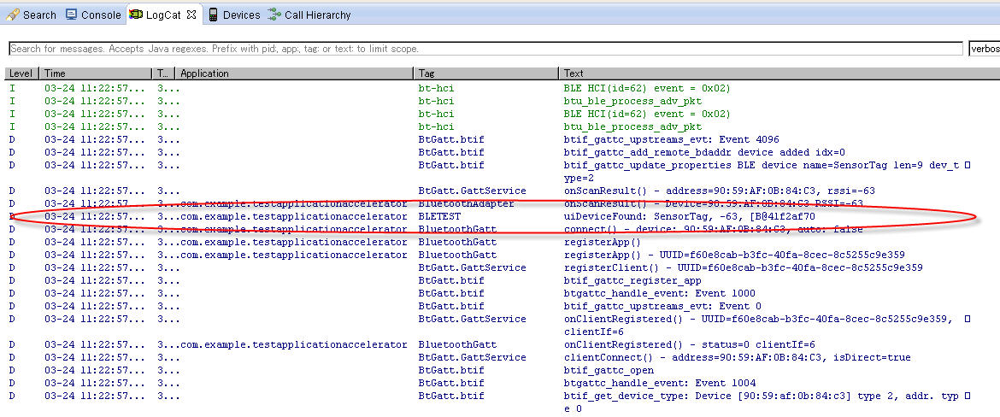
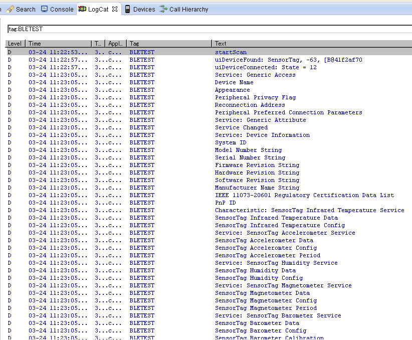

# 第八章 Android 编程

使用蓝牙低功耗这样的无线标准的主要好处之一是它支持各种各样的智能手机和平板。这为嵌入式硬件项目打开了一个新的交互维度，现在可以使用廉价的硬件和丰富的界面进行设计。

除了界面之外，你还可以将手机用作通往更广阔互联网的网关，或与其他应用或 API 结合，与你创建的嵌入式硬件创建自定义的混搭应用。这使一整类新型廉价设备能够提供丰富的功能。

本章简要概述了在 Android 操作系统上实现蓝牙低功耗所需的硬件、软件和流程。

## 入门

本章开发的 Android 示例项目与德州仪器（TI）制造的低成本 SensorTag 设备（第七章[SensorTag](./chapter7.md#sensortag)）进行交互。SensorTag 提供了许多传感器，是一个很好的复杂传感器设备示例，可以提供大量信息进行处理和可视化。

因为 Android 的 GUI 方面可能有点复杂，通常超出本书的范围，本章重点介绍如何从 SensorTag 提取数据并通过蓝牙低功耗接收它。在那之后，许多其他可用资源可以展示呈现数据的方法。

### 获取硬件

对于硬件，你需要一个运行 Android 4.3 或更高版本的 Android 设备。虽然 Android 从 4.3 版本开始支持 BLE，但我们建议至少使用运行 4.4 版本的设备，其中包含更新且更稳定的 BLE 协议栈版本。你还需要确保硬件支持蓝牙低功耗。本示例项目使用运行 Android 4.4 的 Google Nexus 7。

> 注意：要确认你的设备是否支持 BLE，请参阅蓝牙的[智能设备列表](http://bit.ly/1iDPs0M)。

你还需要购买一个 TI SensorTag，它将作为本项目中的外围设备。有关 SensorTag 设备的更多信息，请参见第七章[SensorTag](./chapter7.md#sensortag)。

### 获取软件

对于本项目，你需要三个主要软件：

*Eclipse Android 开发工具（ADT）*

  可在 [Android 开发者网站](http://bit.ly/PYcBmE) 获取。

*蓝牙应用加速器*

  可在 [蓝牙 SIG 网站](http://bit.ly/1kQPQuv) 获取。

*TI SensorTag Android 应用源代码*

  可在 [TI 网站](http://bit.ly/1kR0aTd) 获取。

设置过程中最重要且最耗时的部分是安装 Android 开发工具，这也需要了解一些如何使用 Eclipse IDE 的知识。你最好前往 [Android 开发者网站](http://bit.ly/PYcBmE) 获取有关设置工作环境的详细说明。你需要下载最新的 SDK 以及 Android 开发者工具的任何更新。

### 配置硬件

Android 设备在用作开发设备之前需要进行一些配置。首先，如果尚未启用，你需要启用开发者模式。进入设置菜单，滚动到底部，选择"关于"。在"关于"屏幕上（如图 8-1 所示），快速连续点击"版本号"七次以启用开发者模式。



*图 8-1. 从"关于"屏幕启用开发者模式*

你现在应该在设置菜单中看到一个新的"开发者选项"条目。现在，你需要启用"USB 调试"和"保持唤醒"选项，如图 8-2 所示。



*图 8-2. 在"开发者选项"屏幕上启用"USB 调试"和"保持唤醒"选项*

最后，进入设置菜单，选择存储→选项→"USB 计算机连接"，并启用相机选项（如图 8-3 所示）以允许你传输文件。



*图 8-3. 将 Android 配置为相机以传输文件*

这听起来可能违反直觉，但设备需要处于相机模式才能使开发工具正常工作。

### 开始新项目

要开始新应用，你首先需要将蓝牙应用加速器的 Android 文件导入项目。打开 Eclipse ADT，选择文件/导入，导航到包含应用加速器的目录，选择 Android/BLEDemo 文件夹。按确定将项目导入工作区。

此时，你可能想浏览一下应用加速器文件，了解代码的布局方式。如果看起来陌生，不用担心。与其花太多时间在应用加速器内部，不如将 BLE 库的主要类文件移动到你自己的项目中。

现在是时候创建你自己的 Android 项目了。在 Eclipse 中，转到文件→新建→Android 应用项目。对于应用名称，使用 BleSensorTag。对于最低所需 SDK，指定 Android 4.3。这是支持蓝牙低功耗的 Android 最低版本。对于目标 SDK和编译版本，使用设备支持的最新 Android 版本。点击下一步接受其余窗口的默认值。最后，项目向导应该为你创建一个名为 BleSensorTag 的新 Android 项目。

如图 8-4 所示（左侧显示项目目录结构，右侧显示主代码窗口），Android 项目包含许多文件夹和文件，但你只在其中少数几个中工作。主要源代码文件位于 /src 目录中。



*图 8-4. Eclipse 中的主 Java 窗口*

每个项目还包括一个清单文件 AndroidManifest.xml，它向 Android 系统详细说明应用的基本信息。Android 在系统上运行任何代码之前需要此信息。除此之外，你还将在 /res 文件夹中工作，其中包含处理你将使用的布局和菜单的 XML 文件。

> 注意：Android 编程本身是一个庞大的主题，远超本章范围，本章仅关注将蓝牙低功耗集成到 Android 应用的上下文。对于更复杂的 GUI 应用，我们建议查阅其他 Android 编程书籍。

在开始任何实际编码之前，你需要在 Android 清单中启用 BLUETOOTH 和 BLUETOOTH_ADMIN 权限。双击 AndroidManifest.xml 文件并选择权限选项卡（如图 8-5 所示）。选择"添加..."→"Uses Permission"，在名称字段中输入 android.permission.BLUETOOTH。同样添加另一个"Uses Permission"，这次命名为 android.permission.BLUETOOTH_ADMIN。这两个条目在应用安装时请求用户访问命名服务的权限。



*图 8-5. Android 清单权限窗口*

现在，你需要将类文件从蓝牙应用加速器移动到项目中。这将使类和方法对你可用，其中许多方法使 BLE 编程变得容易得多。选择并复制以下文件：

- BleWrapper.java
- BleWrapperUiCallbacks.java
- BleNamesResolver.java
- BleDefinedUUIDs.java

将文件粘贴到 BleSensorTag 项目的 /src 目录中（或拖放到该目录）。添加这些文件后，/src 目录应如图 8-6 所示。



*图 8-6. Android /src 目录*

BleWrapper 是蓝牙 SIG 发布的应用加速器库的主要部分。它是 Android 蓝牙低功耗库的简化封装，使访问和使用库变得简单得多，因为它处理了许多复杂的处理。

这完成了项目的准备工作。现在你已经创建了项目、配置了清单、安装了类库，可以开始进入 Android 代码的核心部分了。

## 初始化 BLE 库

现在是时候进入实际实现了。第一次（为了强调编程的 BLE 方面而不过多深入 GUI 方面），示例将主要打印通过蓝牙低功耗接收的信息。之后，你将添加一些 GUI 功能，将 BLE 数据整合到呈现方面。

在开始之前，你需要创建导入的 BleWrapper 库的实例。这是来自蓝牙 SIG 的蓝牙应用加速器库的文件：

```java
public class MainActivity extends Activity {
    // add this line to instantiate the BLE wrapper
    private BleWrapper mBleWrapper = null;
    
    @Override
    protected void onCreate(Bundle savedInstanceState) {
        super.onCreate(savedInstanceState);
        setContentView(R.layout.activity_main);
    }
}
```

此文件中添加的行将保存 BleWrapper 类的实例，其中还包含你将用于访问底层 Android BLE 库的方法。在你的构造函数中，你还将添加各种回调，用于处理来自 Android BLE 库的事件。

在前面的代码片段中，注意一个自动生成的函数 onCreate()。此函数在应用首次启动时调用，你将使用它来初始化启动时需要且只需初始化一次的内容。这包括如果设备进入睡眠或丢失上下文然后返回时不需要重新初始化的成员。

Android 文档实际上概述了"activity 生命周期"，描述了应用在经历其"生命"的不同阶段时调用的方法。例如，当应用启动时，会调用三个单独的生命周期方法：onCreate()、onStart() 和 onResume()。在应用类中初始化变量发生在 onCreate() 中（仅初始化一次），以及在 onResume() 中（如果设备进入睡眠或丢失上下文则需要重新初始化时）。

文档提供了有关此 activity 生命周期的更多信息，但这是一个需要了解的重要概念，因为你将在 onCreate() 中执行部分初始化例程，在 onResume() 中执行另一部分。你还需要在关闭时处理清理，这将在 onPause() 或 onStop() 中完成。

在 onCreate() 方法内部，你将看到项目向导生成的一些样板代码。在其下方，你将添加更多代码来初始化 mBleWrapper 对象并执行其他初始化任务：

```java
@Override
protected void onCreate(Bundle savedInstanceState)
{
    super.onCreate(savedInstanceState);
    setContentView(R.layout.activity_main);
    
    mBleWrapper = new BleWrapper(this, new BleWrapperUiCallbacks.Null()
    {
    });
    
    if (mBleWrapper.checkBleHardwareAvailable() == false)
    {
        Toast.makeText(this, "No BLE-compatible hardware detected",
                       Toast.LENGTH_SHORT).show();
        finish();
    }
}
```

前面的代码通过实例化并调用其构造函数，将新的 BleWrapper 对象分配给 mBleWrapper 成员变量（之前为 null）。实例化封装器时，你还需要将 BLE 回调作为参数添加到构造函数中。这是你添加代码以处理来自 BLE 协议栈的通知事件的地方。

在软件编程中，回调是对可执行代码的引用，作为参数传递给函数，函数期望在完成某些处理后回调该代码。目前，我们不会向构造函数添加任何回调，但稍后我们会重新讨论这一点。

构造函数之后，代码执行检查以确保 BLE 硬件对系统可用。如果不是，名为"Toast"的弹出消息窗口会通知用户缺少 BLE 硬件，然后关闭应用。

这完成了应用启动时在 onCreate() 方法中需要执行的代码。现在转到 onResume() 方法，这是代码在启动以及从睡眠中唤醒时执行的地方：

```java
@Override
protected void onResume() {
    super.onResume();
    // check for Bluetooth enabled on each resume
    if (mBleWrapper.isBtEnabled() == false)
    {
        // Bluetooth is not enabled. Request to user to turn it on
        Intent enableBtIntent = new Intent(BluetoothAdapter.
                                           ACTION_REQUEST_ENABLE);
        startActivity(enableBtIntent);
        finish();
    }
    // init ble wrapper
    mBleWrapper.initialize();
}
```

> 提示：Eclipse 为任何这些函数提供了快速快捷方式。只需输入方法名称的前几个字母，然后按 Ctrl+Spacebar。从弹出的自动完成列表中选择函数，让 Eclipse 为你构建函数。

这里的样板代码在顶部是 super.onResume()。你将在其下方添加自己的代码。在这种情况下，你需要在设备每次从不同上下文或睡眠中回来时检查蓝牙是否已启用。当使用其他程序时，蓝牙可能已关闭。不捕获该变化而只是假设蓝牙仍然开启最终会导致某种类型的故障或软件异常。为了处理这种情况，如果程序发现蓝牙已关闭，它会使用 Android intent 向用户发送请求以打开蓝牙，然后退出应用。下次应用重新启动时，如果蓝牙已开启，它可以继续。

一旦代码通过最后的检查，它就可以初始化 BleWrapper，这将打开蓝牙接口并获取 Android 蓝牙适配器的实例。一旦你有了这个，你就可以访问 BLE 射频和协议函数。

最后，你需要处理最后一个 Android 应用生命周期方法：onPause()。每当丢失上下文、设备进入睡眠或应用关闭时，都会调用此方法：

```java
@Override
protected void onPause() {
    super.onPause();
    mBleWrapper.diconnect();
    mBleWrapper.close();
}
```

在我们的示例中，Android 设备将充当 GAP 中心和 GATT 客户端，SensorTag 设备将充当 GAP 外围设备和 GATT 服务器（见第三章[角色](./chapter3.md#角色)和第四章[角色](./chapter4.md#角色)）。

同样，样板代码保持在顶部。之后，它调用封装器的两个方法。第一个方法允许你"diconnect"（原文如此）我们的 Android 设备与远程设备。这实际上断开了与远程外围设备的连接，并调用 uiDeviceDisconnected() 回调方法。如果你需要在与外围设备断开连接后处理任何内容，你将覆盖 uiDeviceDisconnected() 回调。最后，我们关闭 BleWrapper，这将完全关闭本地 GATT 客户端和中心。

## 连接到远程设备

现在初始化和清理已经完成，我们可以专注于代码的真正核心。你需要处理的与 BLE 相关的主要任务是扫描和连接到远程设备、通信数据以及执行任何必要的管理或安全任务。

当启动扫描过程时（见第二章[广播和扫描](./chapter2.md#广播和扫描)），你让 BLE 库知道你想收到它从远程设备收到的任何广播数据包的通知。每当找到设备时，BleWrapper 都会调用 uiDeviceFound() 回调函数，并带有有关设备的信息。你可以使用设备信息来决定它是否是你想要连接的设备。

对于扫描，你需要创建两个按钮：第一个开始扫描，第二个停止扫描。要创建按钮，你需要进入项目的 /res/menu 目录并编辑 main.xml 文件。如果你双击该文件，Eclipse 将带你进入一个 GUI 界面，你可以使用它来添加菜单项。main.xml 文件中的任何菜单项最终都会成为选项菜单中的按钮。你将创建两个项，一个称为 Start，一个称为 Stop，分别用于开始和停止扫描。

在 Android 菜单 GUI 中，选择添加→项，并使用 action_scan 和 action_stop 作为名称，如图 8-7 所示。这些将是你为菜单按钮编写点击处理程序时可以使用的按钮 ID。在菜单项的标题字段中，分别输入 Scan 和 Stop，以提供显示在菜单项中的文本。



*图 8-7. 在 Android ADT 菜单屏幕中添加按钮*

创建菜单项后，你需要处理按钮点击事件。默认情况下，Android 样板代码将使用 main.xml 中的任何项作为选项菜单按钮。但样板代码没有点击处理程序，因此你需要添加它。

在 Eclipse 中，如果你输入 onOptionsItemSelected 并按 Ctrl+Spacebar，它应该自动完成函数，包括 @Override 关键字。你将覆盖 onOptionsItemSelected() 方法来实现自己的点击事件处理程序。当菜单中的任何项发生点击时，onOptionsItemSelected() 方法会被调用。进入方法后，你需要有一个 switch 语句来根据点击的菜单项处理事件。伪代码如下所示：

```java
@Override
public boolean onOptionsItemSelected(MenuItem item) {
    switch (item.getItemId())
    {
    case R.id.action_scan:
        mBleWrapper.startScanning();
        break;
    case R.id.action_stop:
        mBleWrapper.stopScanning();
        break;
    default:
        break;
    }
    return super.onOptionsItemSelected(item);
}
```

此代码覆盖 OptionsItemSelected() 函数以安装你自己的处理程序。此方法仅在处理与选项菜单相关的事件时调用。在 switch 语句中，你根据点击的按钮的项 ID 决定调用哪个处理程序。此项 ID 基于你之前创建的按钮的菜单项 ID。R.id 前缀意味着它是来自内部 Android 项目资源目录的 ID，而不是更广泛的 android 命名空间的一部分。

新处理程序中的两个操作将启动扫描或停止扫描过程，正如你在 BleWrapper 的两个方法中看到的那样。实际上，启动和停止扫描过程可能是整个设置中最容易实现按钮功能的部分。

下一步是检测到远程设备时要采取的操作。远程设备将广播它在那里并准备好连接。当程序进入扫描模式时，它会在 BLE 射频中打开扫描，并让 Android 系统知道如果收到任何广播它想被告知。Android 蓝牙库将通过回调通知程序。

为了使用回调，你将重新查看在 onCreate() 方法中编写的代码。在该方法中，你初始化了 BleWrapper。在 BleWrapper 的构造函数中，它期望你提供回调列表。你之前将其留空，但现在你将开始实现回调。第一个将覆盖 uiDeviceFound() 回调，当在扫描期间找到设备时，库将调用该回调：

```java
mBleWrapper = new BleWrapper(this, new BleWrapperUiCallbacks.Null()
    {
        @Override
        public void uiDeviceFound(final BluetoothDevice device,
                                  final int rssi,
                                  final byte[] record)
        {
            String msg = "uiDeviceFound: "+device.getName()+", "+rssi+",
                         "+rssi.toString();
            Toast.makeText(this, msg, Toast.LENGTH_SHORT).show();
            Log.d("DEBUG", "uiDeviceFound: " + msg);
        }
    }
```

每当找到设备时，此代码都会发布一个 toast 消息框。这不是很实用，但它是指示何时找到设备并显示有关设备信息的简单方法。在实际用例中，你会将找到的任何设备输出到设备列表，人们可以点击该列表以启动连接。

toast 消息显示来自广播数据包的两条信息：设备名称（见第三章[广播数据格式](./chapter3.md#广播数据格式)）和 RSSI。RSSI（无线术语，代表接收信号强度指示器）是一种指示接收信号强度（在这种情况下是广播数据包中包含的所有位的平均值）的方法。在某些情况下，RSSI 可用于给出距离的粗略近似。

另一条可能有用的关键信息是设备地址（包含在每个广播数据包中），但现在设备名称就足够了。

代码不仅将相同的信息输出到 toast 消息框，还通过 Log 命令记录它，这是 Android 库。Log 消息在使用 logcat 工具调试期间显示在 Eclipse IDE 中（如图 8-8 所示）。当你使用 Log 命令时，你还指定一个标签。好处是你可以过滤标签以删除无关信息。



*图 8-8. 来自 Log 命令的消息在完整的 logcat 信息转储中高亮显示*

到目前为止，代码应该已经能够验证它可以检测到发送广播数据包的远程设备。一旦能够做到这一点，它就需要能够连接到它。通常，你会保存所有检测到的设备并以列表形式显示给用户，如第三章[连接建立过程](./chapter3.md#连接建立过程)中所述。然后用户将能够点击她想要连接的设备。为了避免 GUI 复杂性，我们将通过做一些假设来简化用例。

我们假设我们想要连接到 SensorTag 设备。以下代码检查设备名称为"SensorTag"的广播数据包，并自动向具有该名称的任何设备发起连接请求：

```java
@Override
public void uiDeviceFound(final BluetoothDevice device,
                          final int rssi,
                          final byte[] record)
{
    String msg = "uiDeviceFound: "+device.getName()+", "+rssi+", "+ \
        rssi.toString();
    Log.d("DEBUG", "uiDeviceFound: " + msg);
    if (device.getName().equals("SensorTag") == true)
    {
        bool status;
        status = mBleWrapper.connect(device.getAddress().toString());
        if (status == false)
        {
            Log.d("DEBUG", "uiDeviceFound: Connection problem");
        }
    }
}
```

这种自动连接过程避免了一些 Android GUI 复杂性，让我们专注于我们正在使用的 BLE 库。

前面的 uiDeviceFound() 回调代码已被修改以删除弹出消息框。找到名称等于"SensorTag"的设备后，代码指示 BleWrapper 连接到设备并以字符串格式传入设备的地址（在第二章[蓝牙设备地址](./chapter2.md#蓝牙设备地址)中介绍）。BleWrapper 将使用地址向设备发送单播连接请求。然后，如果连接成功，它将通过 uiDeviceConnected() 回调通知你。

你将需要覆盖此回调并添加处理程序代码。如果由于某种原因连接不成功，方法调用的状态将返回 false。你可以使用它向 logcat 控制台记录消息以进行调试。

## 与远程设备通信

一旦你成功连接到远程设备，BleWrapper 将自动为新设备启动服务发现（如第四章[服务和特征发现](./chapter4.md#服务和特征发现)中所述）。这意味着它将请求新设备列出设备上的所有服务和特征并将它们存储在列表中。

如果与 GATT 服务器的连接和服务发现成功，则会发出另一个回调。这次，回调是 uiAvailableServices()，其中一个参数是服务列表，列出了远程设备上可用的所有蓝牙 GATT 服务（有关服务和特征的更多信息，请参见第四章[服务](./chapter4.md#服务)）。为了与设备通信，我们需要访问服务，然后访问服务内部的特征。

此时，你可以循环遍历列表并打印出服务，但它们不是人类可读的格式。服务都按 128 位 UUID 列出（见第四章[UUID](./chapter4.md#uuid)）。你之前从蓝牙应用加速器复制过来的类库文件包含一个名为 BleNamesResolver 的类。这个类有各种方法将 UUID 解析为 BLE 名称。它可以解析服务和特征，所以这个库非常有用。

已知 UUID 的列表位于 BleDefinedUUIDs.java 文件中，稍后你需要向其中添加一些专有服务 UUID。现在，与其简单地滚动服务列表并打印出服务 UUID，不如将它们解析为人类可读的名称并打印出来（目前仅用于 logcat）。代码是另一个回调覆盖，放在 onCreate 方法中，在 mBleWrapper 构造函数内部：

```java
@Override
public void uiAvailableServices(BluetoothGatt gatt,
                                BluetoothDevice device,
                                List<BluetoothGattService> services)
{
    for (BluetoothGattService service : services)
    {
        String serviceName = BleNamesResolver.resolveUuid
            (service.getUuid().toString());
        Log.d("DEBUG", serviceName);
    }
}
```

此代码循环遍历服务列表中的每个元素。对于每个服务，它然后将 UUID 转换为字符串值并将其传入 BleNamesResolver.resolveUuid() 方法。此方法遍历已知 UUID 列表，当找到 UUID 的匹配项时，返回关联的人类可读 UUID 名称。它将名称打印到 Eclipse IDE 中的 logcat，如图 8-9 所示。也可以将它们直接转储到文本框中以供查看，但这稍微复杂一点。



*图 8-9. Eclipse 中 logcat 显示服务和特征*

你会注意到一些 UUID 是未知的。这通常意味着存在供应商特定的 128 位 UUID，如果你想正确解析它们，你需要将它们添加到 UUID 列表中。在这种情况下，TI 为其设备使用一些供应商特定的服务 UUID，因为它不适合标准设备配置文件。UUID 地址空间很大，因此在使用不同的 BLE 设备时，你很可能会遇到许多供应商特定的 UUID。你需要将 TI 供应商特定的 UUID 添加到列表中，然后再次运行代码。

到目前为止，你已经完成了让 BLE 应用启动和运行的大部分工作。你已经检测到远程设备、连接到它并打印了它可用的服务。下一步是读取与其传感器关联的特征值（在第四章[特征](./chapter4.md#特征)中介绍）。

属于传感器的特征携带传感器数据，因此通过读取这些数据，你可以获取传感器数据。一旦你从传感器获取了数据，就只是格式化和处理数据，然后以吸引人的方式呈现给用户的问题。在这种情况下，我们将专注于获取数据，让用户决定如何处理和呈现它。

使用 SensorTag 时需要注意的一件事是它是一个移动设备。它被设计为低功耗，因此传感器默认情况下是关闭的。要读取每个传感器，你必须写入特征以打开它。一旦传感器启用，你就可以从中读取数据。

如第四章[特征](./chapter4.md#特征)中所述，所有与用户数据相关的操作实际上都通过特征执行。要启用传感器，你首先需要找到包含相应特征的服务和特征本身（见第四章[服务和特征发现](./chapter4.md#服务和特征发现)），然后检索其值（如第四章[读取特征和描述符](./chapter4.md#读取特征和描述符)中所述）。然后你需要修改特征值为启用传感器的值，然后以第四章[写入特征和描述符](./chapter4.md#写入特征和描述符)中描述的方式将其写回设备。这称为读取-修改-写入操作。

你已经连接到外围设备并拥有 BluetoothGatt 对象。要检索服务，你将使用 gatt 对象中名为 getService() 的方法。它接受 UUID 参数，这意味着你必须提供特定的服务 UUID。这些都是 TI 特定的 UUID，但幸运的是，TI 在其 SensorTag 源代码中以 Java 源代码格式提供了服务和特征 UUID 的完整列表。

你想将完整的 UUID 列表复制并粘贴到你的源代码中，并使它们成为应用中的常量。以下是它应该看起来的示例：

```java
private static final UUID
    UUID_IRT_SERV = fromString("f000aa00-0451-4000-b000-000000000000"),
    UUID_IRT_DATA = fromString("f000aa01-0451-4000-b000-000000000000"),
    UUID_IRT_CONF = fromString("f000aa02-0451-4000-b000-000000000000"),
    UUID_ACC_SERV = fromString("f000aa10-0451-4000-b000-000000000000"),
    UUID_ACC_DATA = fromString("f000aa11-0451-4000-b000-000000000000"),
    UUID_ACC_CONF = fromString("f000aa12-0451-4000-b000-000000000000"),
    UUID_ACC_PERI = fromString("f000aa13-0451-4000-b000-000000000000");
...
```

服务 UUID 带有 SERV 后缀。否则，其他 UUID 是特征。一旦你定义了这些，你就可以编写代码来访问特定传感器的服务和特征。

与远程设备通信并不像读取特征并让方法返回值那么简单。你实际上需要向设备发送 ATT 读取和写入请求，然后 GATT 服务器将向请求发送响应（这些概念在第二章[ATT 操作](./chapter2.md#att-操作)中进一步解释）。一次只能处理一个请求，在处理请求时传入的任何其他请求都会被静默丢弃。这可能是一个令人沮丧的来源，因为它看起来就像设备没有响应。

正确的操作顺序是发送请求并等待适当的回调。例如，你将向远程设备发送读取请求以读取特定特征。设备响应后，BleWrapper 将向 uiNewValueForCharacteristic 发出回调，并带有特征信息。通过这样做，你正在实现第四章[读取特征和描述符](./chapter4.md#读取特征和描述符)中解释的读取特征值 GATT 功能。

此代码请求读取加速度计的配置特征：

```java
BluetoothGatt gatt;
BluetoothGattCharacteristic c;
gatt = mBleWrapper.getGatt();
c = gatt.getService(UUID_ACC_SERV).getCharacteristic(UUID_ACC_CONF);
mBleWrapper.requestCharacteristicValue(c);
```

发出请求后，设备将使用特征的数据进行响应。在这种情况下，你将把特征原始值的每个字节转储到 logcat：

```java
@Override
public void uiNewValueForCharacteristic(BluetoothGatt gatt,
                                        BluetoothDevice device,
                                        BluetoothGattService service,
                                        BluetoothGattCharacteristic ch,
                                        String strValue,
                                        int intValue,
                                        byte[] rawValue,
                                        String timestamp)
{
    super.uiNewValueForCharacteristic(gatt, device, service,
                                    ch, strValue, intValue,
                                    rawValue, timestamp);
    Log.d(LOGTAG, "uiNewValueForCharacteristic");
    for (byte b:rawValue)
    {
        Log.d(LOGTAG, "Val: " + b);
    }
}
```

重要的是要记住，每次读取或写入都必须请求。Android 的 BLE 库中有获取和设置特征值的函数。这些仅对本地存储的值进行操作，而不是对远程设备进行操作。在大多数情况下，与远程设备的任何交互都需要使用回调。

在读取传感器的任何数据之前，你首先需要启用它们。为此，你必须向其配置特征写入值（这些是启用传感器的专有特征，不要与 CCCD 混淆）。在大多数情况下，你只需向此特征写入 0x01 即可启用它们。如前所述，你实际上向对等设备发送写入请求（第四章[写入特征和描述符](./chapter4.md#写入特征和描述符)中的写入特征值，操作列在第二章[ATT 操作](./chapter2.md#att-操作)中），然后等待回调。

此代码通过向远程设备上的加速度计配置特征写入 0x01 来启用加速度计：

```java
BluetoothGattCharacteristic c;
c = gatt.getService(UUID_ACC_SERV).getCharacteristic(UUID_ACC_CONF);
mBleWrapper.writeDataToCharacteristic(c, new byte[] {0x01});
mState = ACC_ENABLE;    // keep state context for callback
```

和以前一样，你需要等待回调以知道写入操作是否成功。在你必须等待事情发生的情况下，最好使用单独的线程或状态机。单独的线程将允许你在等待回调时阻塞线程，而不会占用系统的其余部分。状态机允许你保持在同一个线程中，并跟踪正在执行的操作的当前上下文。

对于写入操作，应用加速器有两个有用的回调：

```java
@Override
public void uiSuccessfulWrite(BluetoothGatt gatt,
                              BluetoothDevice device,
                              BluetoothGattService service,
                              BluetoothGattCharacteristic ch,
                              String description)
{
    BluetoothGattCharacteristic c;
    super.uiSuccessfulWrite(gatt, device, service, ch, description);
    switch (mState)
    {
    case ACC_ENABLE:
        Log.d(LOGTAG, "uiSuccessfulWrite: Successfully enabled accelerometer");
        break;
    }
}

@Override
public void uiFailedWrite(BluetoothGatt gatt,
                          BluetoothDevice device,
                          BluetoothGattService service,
                          BluetoothGattCharacteristic ch,
                          String description)
{
    super.uiFailedWrite(gatt, device, service, ch, description);
    switch (mState)
    {
    case ACC_ENABLE:
        Log.d(LOGTAG, "uiFailedWrite: Failed to enable accelerometer");
        break;
    }
}
```

要启用所有传感器，你基本上将启用一个传感器的情况扩展到所有传感器。在启用第一个传感器的写入操作之后，你将在回调中启用其他每个传感器：

```java
@Override
public void uiSuccessfulWrite(BluetoothGatt gatt,
                              BluetoothDevice device,
                              BluetoothGattService service,
                              BluetoothGattCharacteristic ch,
                              String description)
{
    BluetoothGattCharacteristic c;
    super.uiSuccessfulWrite(gatt, device, service, ch, description);
    switch (mState)
    {
    case ACC_ENABLE:
        Log.d(LOGTAG, "uiSuccessfulWrite: Successfully enabled accelerometer");
        // enable next sensor
        c = gatt.getService(UUID_IRT_SERV).getCharacteristic(UUID_IRT_CONF);
        mBleWrapper.writeDataToCharacteristic(c, new byte[] {0x01});
        mState = IRT_ENABLE;    // keep state context for callback
        break;
    case IRT_ENABLE:
        Log.d(LOGTAG, "uiSuccessfulWrite: Successfully enabled IR temp sensor");
        // enable next sensor
        c = gatt.getService(UUID_HUM_SERV).getCharacteristic(UUID_HUM_CONF);
        mBleWrapper.writeDataToCharacteristic(c, new byte[] {0x01});
        mState = HUM_ENABLE;    // keep state context for callback
        break;
    case HUM_ENABLE:
        ....
        mState = MAG_ENABLE;
        break;
    ...
    }
}
```

一旦传感器启用，就可以读取传感器。要手动读取传感器，你将向你想要读取的特征发出读取请求，并在回调中等待响应（有关更多详细信息，请参见第二章[ATT 操作](./chapter2.md#att-操作)和第四章[读取特征和描述符](./chapter4.md#读取特征和描述符)）。读取可以由事件触发，例如按下按钮或定期轮询传感器的定时器。在这种情况下，选项菜单中创建的测试按钮触发事件。该按钮的 onClick 方法调用以下函数来生成读取请求：

```java
// Start the read request
private void testButton()
{
    BluetoothGatt gatt;
    BluetoothGattCharacteristic c;
    if (!mBleWrapper.isConnected()) {
        return;
    }
    Log.d(LOGTAG, "testButton: Reading acc");
    gatt = mBleWrapper.getGatt();
    c = gatt.getService(UUID_ACC_SERV).getCharacteristic(UUID_ACC_DATA);
    mBleWrapper.requestCharacteristicValue(c);
    mState = ACC_READ;
}

// Get the read response inside this callback
@Override
public void uiNewValueForCharacteristic(BluetoothGatt gatt,
                                        BluetoothDevice device,
                                        BluetoothGattService service,
                                        BluetoothGattCharacteristic ch,
                                        String strValue,
                                        int intValue,
                                        byte[] rawValue,
                                        String timestamp)
{
    super.uiNewValueForCharacteristic(gatt, device, service,
                                    ch, strValue, intValue,
                                    rawValue, timestamp);
    // decode current read operation
    switch (mState)
    {
    case (ACC_READ):
        Log.d(LOGTAG, "uiNewValueForCharacteristic: Accelerometer data:");
        break;
    }
    // dump data byte array
    for (byte b:rawValue)
    {
        Log.d(LOGTAG, "Val: " + b);
    }
}
```

一旦获取了传感器的数据，仍然需要一些步骤来处理数据。每个传感器的数据处理代码可以在 SensorTag 示例 Android 库或 [SensorTag 在线用户指南](http://bit.ly/1kQHyTq) 中找到。

你可以将加速度计的处理算法复制/粘贴到前面的代码片段中，通常在解码器的 ACC_READ 状态部分。所有其他传感器的数据处理也是如此。

轮询远程传感器是定期从中提取数据的一种方式，但对两个设备来说都不是节能的。远程设备需要保持开启以捕获读取请求，手机需要保持唤醒以发送轮询请求。更有效的方法是让设备发送通知（在第四章[服务器发起的更新](./chapter4.md#服务器发起的更新)中详细描述）。你可以为某些传感器手动设置通知周期。

应用加速器有一个特殊的方法来启用通知。要在 Android 上启用通知，你通常需要为你感兴趣的特定特征在本地启用通知。

完成后，你还必须通过写入设备的客户端特征配置描述符（CCCD）在对等设备上启用通知，如第四章[客户端特征配置描述符](./chapter4.md#客户端特征配置描述符)中所述。幸运的是，这被抽象出来了，两个操作都可以通过单个方法调用来处理。

以下代码在按下测试按钮时为加速度计启用通知：

```java
private void testButton()
{
    BluetoothGatt gatt;
    BluetoothGattCharacteristic c;
    if (!mBleWrapper.isConnected()) {
        return;
    }
    // set notification on characteristic
    Log.d(LOGTAG, "Setting notification");
    gatt = mBleWrapper.getGatt();
    c = gatt.getService(UUID_IRT_SERV).getCharacteristic(UUID_IRT_DATA);
    mBleWrapper.setNotificationForCharacteristic(c, true);
    mState = ACC_NOTIFY_ENB;
}
```

应用加速器中需要注意的一个问题是它没有实现 Android 蓝牙库中可用的 onDescriptorWrite() 回调。了解通知是否已在对等设备上成功启用的最可靠方法是在 CCCD 被修改且 GATT 服务器确认写入操作后获取 onDescriptorWrite() 回调。此示例在 BleWrapper 类中向应用加速器的此实现添加了 onDescriptorWrite() 回调，其中它实现了 BluetoothGattCallback 代码：

```java
/* callbacks called for any action on particular Ble Device */
private final BluetoothGattCallback mBleCallback = new BluetoothGattCallback()
{
    ...
    // Added by Akiba
    @Override
    public void onDescriptorWrite(BluetoothGatt gatt,
                                  BluetoothGattDescriptor descriptor,
                                  int status)
    {
        String deviceName = gatt.getDevice().getName();
        String serviceName = BleNamesResolver.resolveServiceName(
            descriptor.getCharacteristic().getService().getUuid().
            toString().toLowerCase(Locale.getDefault()));
        String charName = BleNamesResolver.resolveCharacteristicName(
            descriptor.getCharacteristic().getUuid().toString().
            toLowerCase(Locale.getDefault()));
        String description = "Device: " + deviceName + " Service: "
            + serviceName + " Characteristic: " + charName;
        // we got response regarding our request to write new value to
        // the characteristic, let's see if it failed or not
        if(status == BluetoothGatt.GATT_SUCCESS) {
            mUiCallback.uiSuccessfulWrite(mBluetoothGatt, mBluetoothDevice,
                                    mBluetoothSelectedService,
                                    descriptor.getCharacteristic(),
                                    description);
        }
        else {
            mUiCallback.uiFailedWrite(mBluetoothGatt, mBluetoothDevice,
                                mBluetoothSelectedService,
                                descriptor.getCharacteristic(),
                                description + " STATUS = " + status);
        }
    }
    ...
}
```

如果通知已正确写入，onDescriptorWrite() 方法将调用应用加速器的 uiSuccessfulWrite() 方法。

你可以通过与启用传感器本身相同的方式为所有传感器特征启用通知，使用状态机按顺序处理一个又一个。对于通知，请记住，对于 Android 4.4（KitKat），一次只能启用四个特征的通知。这是当前 Android BLE 库实现的限制，尽管它可能会在未来版本中更改。

本章中的代码大部分以片段形式呈现，但你可以从本书的 [GitHub 仓库](http://bit.ly/1qoj8Ed) 获取完整的源代码。
