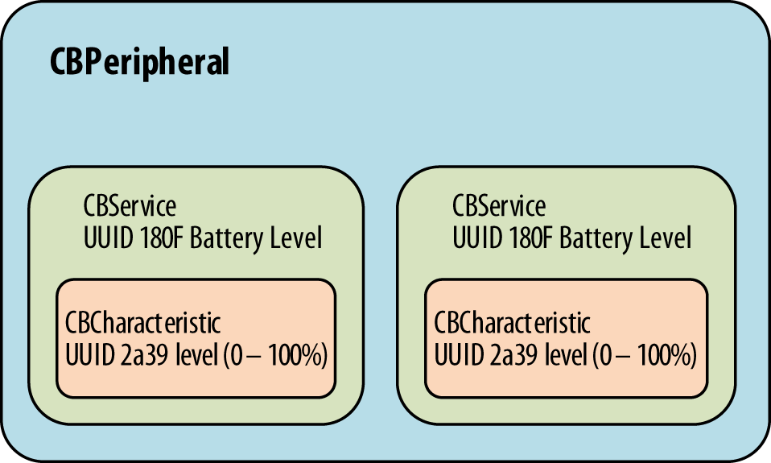
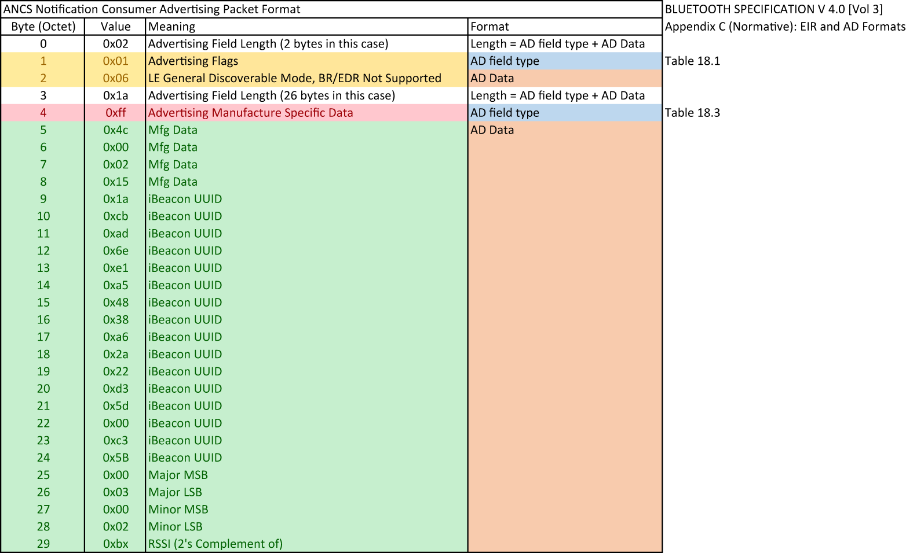
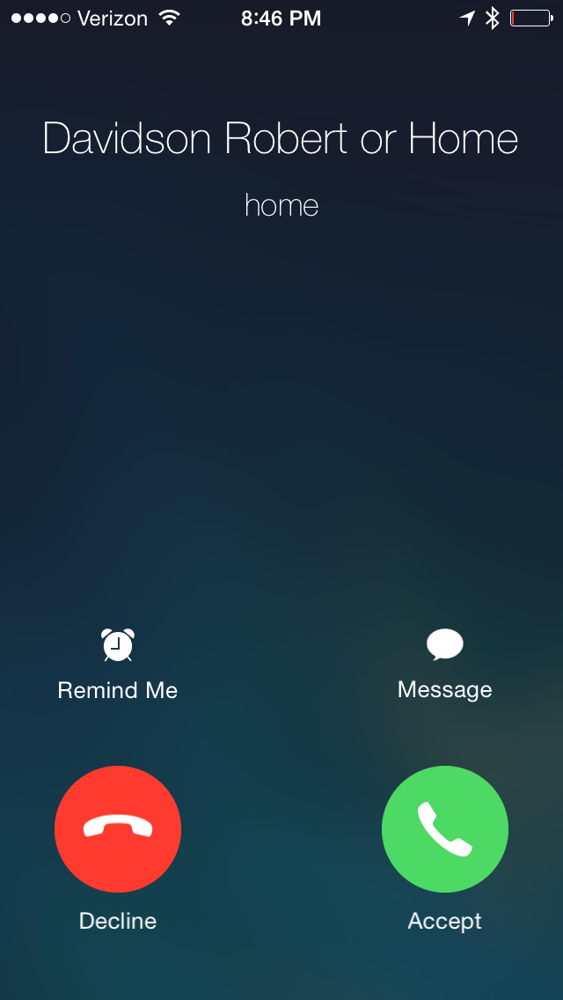
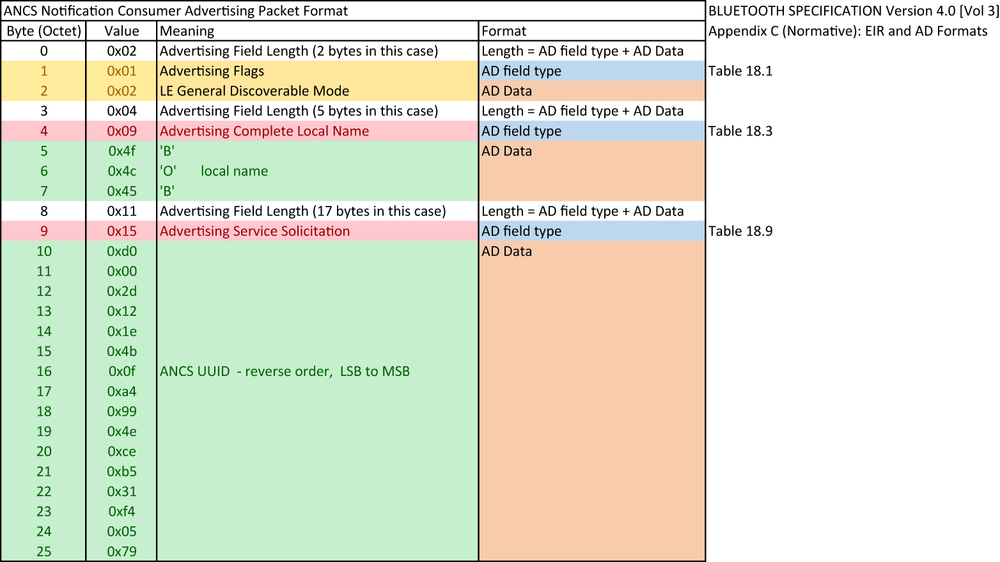
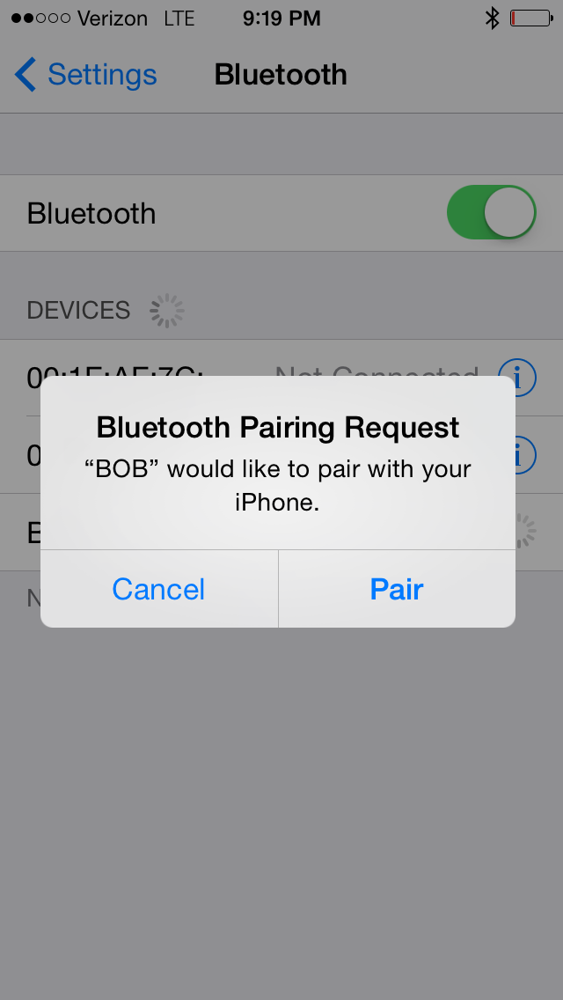
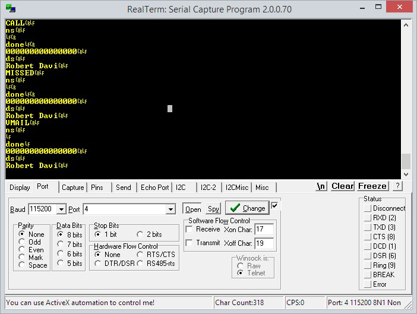

# 第九章，IOS编程

苹果是早期蓝牙4.0的一个支持方，作为结果，有大量的API和工具来支持BLE设备和使用iOS的应用的开发。文中的iOS的设备通常是一架iPhone（iPhone 4S或者以上），但是iOS也支持BLE运行在较新的iPad（iPad3及以上）和第五代iPod Touch设备上。

BLE也支持较新一代的Mac，包括iMac（2012之后出厂的），MacBook Pro（2012版及以上），MacBook Air（2011版及以上），Mac Pro（2013版及以上）。但本章将聚焦于iOS，特别是iOS 7及更新版本。

关乎iOS编程的BLE设备的类型和应用主要有三大块：

*带有iOS应用的外围设备*

​		在这个类别内，BLE外围设备和传感器通过相应的iOS应用匹配——比如，一个自行车功率计和节奏计使用iPhone来显示和记录数据。

*iBeacon设备*

​		iBeacon是一个只发送广播的设备，当在一个GPS信号和手机信号难渗透的地方，使用了BLE广播（参考第二章[广播与扫描](./chapter2.md#广播与扫描)）来增强室内导航，可以给iOS设备（以及安卓设备）提供定位服务。

*带有苹果通知中心服务的外围设备*

​		内置于iOS的苹果通知中心（Apple Notification Center）显示了提醒和通知，比如在iOS设备的屏幕上显示来电显示和来自新闻服务的更新。使用苹果通知中心服务（ANCS），iOS设备可以使用BLE在一个副屏上显示通知，比如带BLE功能的手表。

为传感器研发应用首要就是使用核心蓝牙框架（Core Bluetooth framework），相比于为iBeacon研发应用时首要是包含了核心定位框架（Core Location framework， ANCS不需要一个应用）。核心蓝牙框架（CoreBluetooth）是iOS应用程序接口（API， application programming interface）的一部分，用于处理BLE函数和设备相关。其CBCentralManager和CBPeripheral类允许你使用中心设备和外围设备工作，在[第三章](./chapter3.md)已具体描述。CBCentralManager提供扫描、发现和连接到远端外围设备的源代码，而CBPeripheral提供给使用远端外围设备的部分服务和特征的源代码。

本章通过研究关注BLE功能的代码示例来对这些框架加以熟悉，特别是实现BLE的应用所需要的关键的类和方法。这些实例描述了一个完整的可以编译的BLE应用的基本内容。虽然实例代码并不完整，不够完善，这也是在一个iOS设备上有着完整的功能，并可以了解到这是怎么运行的，对于编写自己的iOS的BLE应用是一个很好的开始。

 *所有示例的完整的Xcode项目请见[本书GitHub项目](http://bit.ly/1qoj8Ed)。所有的示例都需要iOS 7或者更新版本，以及Xcode 5或者更新版本。*

一般的说iOS应用开发和Xcode开发环境是一个广泛而复杂的内容，大多超脱了本章或者本书的范围。如果你要寻找更多信息，我们推荐Matt Neuburg编写的*iOS 7编程* 和*iOS 7编程基础* (O’Reilly)。当然，最有权威的源代码是苹果iOS研发库，首发于[核心蓝牙编译指南](http://bit.ly/1eh8soX)。本章的示例都将紧密跟随这本指南。

## 简单的电量外围设备

第一个示例程序是一个iOS中心设备，去搜寻并连接一个简单的远端外围设备。远端外围设备的角色为一个Bluegiga BLE112硬件模组（更多信息参见第五章[Bluegiga’s BLE112/BLE113 Modules](./chapter5.md#"Bluegiga's BLE112/BLE113 Modules)）。iOS设备将作为一个GATT客户端，外围设备作为一个GATT服务端（参见第三章[角色](./chapter3.md#角色)）。

 *这里使用的Bluegiga BLE112模组评估板可以作为BLE112模组家族(part #: DKBLE112)的一个开发套件的一部分从线上多家供应商获得。开发套件包含了许多预编译传感器和用于快速评估的输入资料。或者，[Jeff Rowberg的BLE112 BLE开发板](http://bit.ly/OQ3seE)更加便宜。这是一个开源硬件解决方案，因此所有的硬件设计详细资料都可以从同一个源获得。*

BLE112模组实现了BLE外围设备的功能，在这个例子中，使用了板子上的A/D转换器读取了由一个很小的电位器设置的电压值（在图9-1中的左上角被圈出），并通过BLE battery_level服务来保存该值作为BLE“电池电量”特征值（从0到100%数值划分）。iOS应用之后必须读取保存在BLE外围设备的“电池电量”并应用于应用程序。（更多关于服务和特征的信息，参见[第四章](./chapter4.md)）。


*图9-1. Bluegiga BLE112开发套件*

 *我们使用“电池电量”这个术语，而不是“电位器”，因为“电池电量”外围设备是预定义服务之一，并与在BLE中的特征相联系。尽管没有使用一个预定义配置文件的需求，对于这部分的讨论这么做是比较方便的。*

对于这个简单的应用，在核心蓝牙框架内提到的关键的类包含了CBCentralManager（iOS设备上，在BLE中的中心管理角色的一个抽象概念）。代码也包含了支持的类CBService和CBCharacteristic，因为你需要知道通过发现来确定哪一个服务和相关的特征在远端外围设备是可以使用的（参见第三章[服务和特征发现](./chapter3.md#服务和特征发现)）。

图9-2展示了写入BLE远端外围设备和CBPeripheral对象的服务和特征之间的关系。



*图9-2. CBPeripheral, CBServices, 和 CBCharacteristic objects的关系*

为了更方便，在示例中的代码包含了一些来自BLE规格书的预定义的服务和特征（比如，电池服务），使用了16bit的UUID而不是厂家定义的129bit的UUID（参见第三章[UUID](./chapter3.md#UUID)）。

 *对于更多SIG指定的服务和特征信息，蓝牙开发门户（Bluetooth Developer Portal）提供了一个完整的[预定义服务](http://bit.ly/1giCbMM)和[被采纳特征](http://bit.ly/1ggImgY)的列表。

### 扫描远端外围设备

开始前，你需要分配一个CBCentralManager实例，并为电量服务开启BLE扫描（参见第二章[广播和扫描](./chapter2.md#广播和扫描)）操作：

``` c++
// using the predefined BLE UUIDs for the battery level service
#define BATTERY_LEVEL_SERVICE_UUID 0x180f
#define BATTERY_DEVICE_INFO_SERVICE_UUID 0x180a
// build an array of services UUIDs of interest
NSArray *services = @[[CBUUID UUIDWithString:BATTERY_LEVEL_SERVICE_UUID],
[CBUUID UUIDWithString:BATTERY_DEVICE_INFO_SERVICE_UUID]];
// instantiate and start Central Manager object
CBCentralManager *centralManager = [[CBCentralManager alloc]
initWithDelegate:self queue:nil];
// scan for peripherals with services listed in services UUID array
[centralManager scanForPeripheralsWithServices:services options:nil];
self.centralManager = centralManager;
```

首先，使用核心蓝牙框架去创建一个你感兴趣的UUID服务的列表（NSarray），在这个例子中命名services。你将使用UUIDWithString方法去转换UUID字符串为UUID对应的[CBUUID](http://bit.ly/1qHI9bB)对象。

CBUUID也可以将预定义的16bit服务和特征UUID转换为完整128bit格式的相等的UUID（更多参见第三章[UUID](./chapter3.md#UUID)）。接下来，CBCentralManager对象进行实例化，UUID列表作为第一个参数提供给scanForPeripheralsWithServices方法。在这个例子中，应用仅扫描两个服务，设备信息服务（UUID16=0x180A）和电量服务（UUID16=0x180f）。只有所需要的包含在广播数据内（参见[表3-3](./chapter3.md#表3-3)）的UUID服务的外围设备将作为被找到而返回值。

注意到如果scanForPeripheralsWithSevices方法的第一个参数被赋值空，而不是感兴趣的CBUUID（服务）列表，这将返回范围内所有的BLE外围设备。这通常不是一个好的做法，除非你真的希望发现所有可能的带有服务的外围设备，因为这需要大量使用BLE无线模块硬件，导致减小电池使用时间。

### 连接到远端外围设备

当一个你感兴趣的外围设备在扫描过程中被发现，centralManager唤起didDiscoverPeripheral，后者是你存放connectPeripheral方法的函数。该方法返回相关联的外围对象的实例，这可以之后使用CBPeripheral方法时被检查到：

``` c++
- (void)centralManager:(CBCentralManager *)central
    didDiscoverPeripheral:(CBPeripheral *)peripheral
    advertisementData:(NSDictionary *) advertisementData
    RSSI:(NSNumber *)RSSI
{
    NSString *localName = [advertisementData objectForKey:
    CBAdvertisementDataLocalNameKey];
    if ([localName length] > 0)
    {
        NSLog(@"Found the battery level monitor: %@", localName);
        // found peripheral so stop scanning
        [self.centralManager stopScan];
        // return peripheral object
        self.batteryLevelPeripheral = peripheral;
        peripheral.delegate = self;
        // connect peripheral to centralManager
        [self.centralManager connectPeripheral:peripheral options:nil];
    }
}
```

在感兴趣的外围设备发现之后，很好的做法就是停止扫描（使用[self.centralManager stopScan]），因为这样可以节省电量。当然，如果你需要搜寻不止一个外围设备，修改代码示例的逻辑即可。

### 寻找与外围设备相关的服务

在外围设备被发现并且外围设备对象实例化后，你需要创建相关的服务对象和相联系的特征：

``` c++
- (void)centralManager:(CBCentralManager *)central
	didConnectPeripheral:(CBPeripheral *)peripheral
{
    // establish peripheral delegate
    [peripheral setDelegate:self];
    // discover available services
    [peripheral discoverServices:nil];
    // log results
    self.connected = [NSString stringWithFormat:@"Connected: %@",
    peripheral.state == CBPeripheralStateConnected ? @"YES" : @"NO"];
    NSLog(@"%@", self.connected);
}
```

在这段代码中，当连接建立后，centralManager调用didConnectPeripheral并将其实例化。外围设备的代理被设置，并在log中记录。

### 寻找与服务相关的特征

核心蓝牙通过调用didDiscoverServices给每一个发现服务创建了一个CBService对象。下面的代码为发现特征（参见第三章[服务和特征发现](./chapter3.md#服务和特征发现)），使用CBPeripheral类的discoverCharacteristics方法以数组方式保存进CBCharacteristic对象中：

``` c++
- (void)peripheral:(CBPeripheral *)peripheral
didDiscoverServices:(NSError *)error
{
    // sort through each service and discover chararacteristics
    // associated with each
    for (CBService *service in peripheral.services)
    {
        NSLog(@"Discovered service: %@", service.UUID);
        
        // discover characteristics associated with each service
        [peripheral discoverCharacteristics:nil forService:service];
    }
}
```

如果你传递nil作为一个参数到[peripheral discoverServices:nil]和[peripheral discoverCharacteristics:nil forService:service]中，请注意，因为iOS设备会在外围这边上尝试发现*所有* 的服务和*所有* 的特征。如果远程外围设备执行许多的服务和相关的特征，相比只执行一个你所需要的服务，这将导致电池损耗。在这个例子中没有什么问题，因为我们只执行我们在外围设备上感兴趣的部分。但是如果在你的应用中可能就是一个问题，请使用服务和特征列表。

一旦感兴趣的服务以及相关的特征被发现，你需要读取特征值并提供给应用。你可以直接使用readValueForCharacteristic:方法读取数值，如果远端外围特征是稳定状态下，这是一种很好的获取方式。

然而，如果特征一直改变，就比如电量，你应该使用BLE通知特性来解决，具体在第四章[服务启动更新](./chapter4.md#服务启动更新)阐述。当完成这个特性之后，仅当电量值改变，应用才被通知。这个可以避免了因数值改变而不断轮询远端外围设备，这对于iOS中心设备的电池生命是一个挑战，因为这产生了不必要的无线通信。

在远端外围设备上使用setNotifyValue:forCharacteristic:方法开启BLE通知（这方法在外围设备上写入对应的CCCD，如第三章[客户端特征配置描述符](./chapter3.md#客户端特征配置描述符)解释），如下面关于电量特征的代码（还是，因为厂商数据是固定的，这使得使用readValueForCharacteristic:方法是合理的）：

``` c++
- (void)peripheral:(CBPeripheral *)peripheral
didDiscoverCharacteristicsForService:(CBService *)service error:(NSError *)error
{
    // Retrieve Service for the Voltage Level
    if ([service.UUID isEqual:[CBUUID UUIDWithString:
    						BATTERY_LEVEL_SERVICE_UUID]])
    {
        for (CBCharacteristic *aChar in service.characteristics)
        {
            // Request level notifications
            if ([aChar.UUID isEqual:
                [CBUUID UUIDWithString:
            	BATTERY_LEVEL_MEASUREMENT_CHARACTERISTIC_UUID]])
            {
                [self.batteryPeripheral setNotifyValue:YES
                forCharacteristic:aChar];
                NSLog(@"Found battery level measurement characteristic");
            }
        }
    }
    
    if ([service.UUID isEqual:
		[CBUUID UUIDWithString:BATTERY_LEVEL_DEVICE_INFO_SERVICE_UUID]])
	{
        for (CBCharacteristic *aChar in service.characteristics)
        {
            if ([aChar.UUID isEqual:
            	[CBUUID UUIDWithString:
            	BATTERY_LEVEL_MANUFACTURER_NAME_CHARACTERISTIC_UUID]])
            {
                [self.batteryPeripheral readValueForCharacteristic:aChar];
                NSLog(@"Found a device manufacturer name characteristic");
            }
        }
    }
}
```

现在，无论何时外围设备发送一个通知，didUpdateValueForCharacteristic方法都将被唤醒，这让应用仅在电量特征改变时才读取其数值：

``` c++
- (void)peripheral:(CBPeripheral *)peripheral
didUpdateValueForCharacteristic:(CBCharacteristic *)characteristic
						error:(NSError *)error
{
    // Updated value for battery level measurement received
    if ([characteristic.UUID isEqual:[CBUUID
    UUIDWithString:BATTERY_LEVEL_MEASUREMENT_CHARACTERISTIC_UUID]])
    {
        // Get the battery level
        [self getBatteryLevelData:characteristic error:error];
    }
}
```

这时候，代码已经创建了与远端外围设备相关的服务和特征对象。下一小节使用这些对象来提供数据给剩余的应用。

### 读取和解码特征的方法

应用的任何位置使用下列代码可从特征对象获得电量的通知：

``` c++
- (void) getBatteryLevelData:(CBCharacteristic *)characteristic
					error:(NSError *)error
{
    // Get the Battery Level
    NSData *data = [characteristic value];
    const uint8_t *reportData = [data bytes];
    uint16_t level = 0;
                        
    if ((reportData[0] & 0x01) == 0)
    {
        // Retrieve the level value for the Battery
        level = reportData[1];
    }
    else
    {
    	level = CFSwapInt16LittleToHost(*(uint16_t *)(&reportData[1]));
    }
                        
    // Display the battery level value to the UI if no error occurred
    if( (characteristic.value) || !error )
    {
        self.batteryLevel = level;
        self.batteryLevel.text = [NSString stringWithFormat:@"%i %",
        batteryLevel];
    }
    return;
}
```

而下列代码为应用获取厂家信息：

``` c++
- (void) getManufacturerName:(CBCharacteristic *)characteristic
{
    NSString *manufacturerName = [[NSString alloc]
    initWithData:characteristic.value
    encoding:NSUTF8StringEncoding];
    self.manufacturer = [NSString stringWithFormat:@"Manufacturer: %@",
                         manufacturerName];
    return;
}
```

这时候，iOS API已经开启了由远端外围设备A/D转换器检测的电量，通过iOS设备上的BLE来进行传输，这使得应用可以进行图表、文字展示，或者保存在数据库中。

## iBeacon

iBeacon应用使用iOS的[核心定位框架](http://bit.ly/1giabJo)特性来给iOS和安卓设备在信号和GPS弱或根本没有的地方提供室内导航以及定位功能。

iBeacon模型提供了一系列连接设备和基于位置进行通讯的可能性，包括在零售业中的有趣的种种。比如，以权限为基本的市场中，销售商推送给客户特别优惠以及其他信息（客户在收集上有相对应的应用），就是基于他们在商场中的位置。在展馆内，iBeacon可以提供自我向导旅游，将关于附近展览品的详尽介绍（以文字、语音或者视频展现的方式）传递给参观者。

拥有iBeacon功能的设备使用下列四种类别值来发送BLE广播包：

*Proximity UUID*

​		一个128bit值的唯一识别值，作为一个特定的类型或者从一个特定的组织中来识别一个或者多个beacon。

*Major value（主要值）*

​		一个可选的16bit无符号整数，可以将拥有相同proximity UUID的beacon进行分组。

*Minor value（次要值）*

​		一个可选的16bit无符号整数，可以通过beacon的相同的proximity UUD和Major value，对beacon进行区分。

*RSSI 值*

​		该值被写入beacon内，用于根据信号质量来帮助计算与beacon的距离。

在展馆这个例子中，proximity UUID会与一个制定的博物馆进行捆绑，主要和次要数字会被用来对大量展馆内beacon分组或者区分。在这例子，主要值会在馆内指定一个房间，而次要值会在这个房间内与一个特定的展览品进行捆绑。

如果大量的beacon用这种方式安装，每一个都绑定了指定的房间和展览品，由接收设备上执行的iOS应用进行范围区分（参考第六章[范围](./chapter6.md#范围)），估算到每一个beacon的距离，以及计算接收设备的位置。iBeacon应用的其中一个可能使用点就是下发给拥有iOS设备的个人一些关于展览品相关的信息。

### 广播

通常，一个beacon只广播并且不提供其他服务或者连接功能（因为BLE设备一旦连接建立就停止广播）。广播包格式如图9-3所示，遵循标准的BLE广播包格式，并使用厂商指定数据AD类型（参见第三章[广播数据格式](./chapter3.md#广播数据格式)）。



*图9-3. iBeacon使用的广播包格式*

通常，iBeacon是一个简单为硬币大小自供电的BLE硬件（比如BLE112模组）。这也可以使用核心蓝牙框架来编程进iOS设备中，去执行iBeacon广播服务。这对于测试非常有用，但是没什么实用性，因为iBeacon应用必须在最前显示。

如果你想将iOS设备变为一个iBeacon发送器，你可以使用来自Radius Networks的[iBeacon定位应用](http://bit.ly/1hq5BJS)。Radius Networks的其他比较有用的应用有OS X上的MacBeacon，这个可以将你Mac作为一个iBeacon，省掉了你即将用作iBeacon应用的iOS设备。

### 范围

*范围(Ranging)*是一个运行在接收设备（比如iPhone）的iBeacon应用上的一个进程，根据接收来自附近的beacon的无线信号的强度来估算接收设备和beacon的距离。信号质量由RSSI（接收信号质量标识）测算，这是一个用dBm单位的数字，可以由iOS设备上的BLE应用发现的外围设备使用。特别是，RSSI跟踪每一个有运行iBeacon应用的iOS设备范围内的beacon。当iPhone在房间内移动的适合，从特定的beacon进行计算的RSSI就会改变。通常，当iPhone和iBeacon距离增加时，RSSI会变小。

Beacon也在广播包内广播RSSI数值。在这个例子中，RSSI数值是固定的，在出厂中已经被写入beacon中。RSSI通常使用iPhone来运行指定的软件，以固定一米距离来计算beacon的信号强度决定数值。比如，Radius Networks的[iBeacon定位应用](http://bit.ly/1hq5BJS)就可以使用。

RSSI数值实际被保存为一个有符号8bit的整形，在广播包中以dBm为单位，但你不需要知道这个，也不需要知道RSSI为一个对数的比例以及（通常）数值是以和beacon的距离的平方的倒数而变化使用，因为这些细节都已经由iOS进行处理了。因为在无线芯片的结构和性能的各自不同，导致需要校准来处理从一个beacon到另一个beacon信号输出不同的情况。

iBeacon应用将测量的RSSI值与beacon发出的广播包内的一米的RSSI期望值作对比，来测算beacon和iOS设备的距离。如果所有的beacon都经过校准，这种方法声称可得到距离beacon相当准确的估算值（尤其是在一米距离内）。

对于使用iBeacon测算范围，核心定位服务（Core Location service）提供了类和方法，如接下来的例子演示。你将使用CLBeaconRegion的实例类以及相关的方法。有了经过校准的beacon和CLBeaconRegion，你只需要考虑以米为单位的实际距离以及beacon范围（根据一个你设置的半径数值，围绕指定的iBeacon的一个圆形区域）。

比如，你可以使用iBeacon应用法骑一些与一个iBreacon区域相关的动作，比如当你进入或者离开一个指定的beacon的期望半径内的区域时，一个通知就会提醒你。告诉应用哪一个iBeacon最近的方法也有提供，也是依据范围数值。

### 实现一个iBeacon应用

为了实现一个iBeacon应用，我们需要的是核心定位框架（Core Location framework），这个是一个包含CLLocationManager,CLBeaconRegion,以及CLBeacon应用关键的类。没有部分核心蓝牙框架可以直接使用。iPhone应用检测附近beacon的存在，以及确定哪一个beacon是最近的。

为了测试应用，我们编写了几个BLE112模块（如图9-4所示），为了便于放置，由硬币单元的CR2032为供电。


*图9-4. BLE112模组，编写为一个iBeacon，并且由CR2032硬币单元供电*

 *为了测试，Bluegiga BLE112模组产生并传送被要求的iBeacon广播包。已完成的包括iPhone应用和BLE112模组的测试应用的代码都已在[本书的GitHub目录](http://bit.ly/1qoj8Ed)提供。

首先，你需要创建并注册beacon区域：

``` c++
@implementation BobsBeaconTracker
- (instancetype)init
{
    self = [super init];
    if (self == nil) return nil;
    
    self.locationManager = [[CLLocationManager alloc] init];
    self.locationManager.delegate = self;
    self.beaconRegion = [[CLBeaconRegion alloc]
    initWithProximityUUID: [[NSUUID alloc]
   						 initWithUUIDString:
                            @"E2C56DB5-DFFB-48D2-B060-D0F5A71096E0"]
                            identifier: @"Bobs Beacon default region"];
    self.beaconRegion.notifyEntryStateOnDisplay = YES;
    [self.locationManager startMonitoringForRegion:self.beaconRegion];
    return self;
}
```

因为每一个iBeacon应用都必须使用一个指定的proximity UUID，这个先前通过initWithProximityUUID进程被硬编码入应用中，即应用就只会对有这个UUID的beacon回应（当应用下载时，UUID就被注册入iOS）。这意味着用户要控制，因为他们必须下载应用去使用（尽管一旦下载，应用就可以及时在没有打开或者运行的时候接收通知信息）。没有下载应用，用户将不会被不需要的iBeacon通知信息和关联其他有着不同proximity UUID的beacon的通知所轰炸。

在iOS7.1上，在应用安装后，操作系统自身会注册该应用工作的beacon区域。之后，及时应用被挂起或者没有运行，系统都将唤醒iOS应用来处理进入或者离开一个beacon区域的时间，通常在10秒内。

在代码的下一个部分，CLBeacon类提供了方法和对象来开启、停止监控指定的iBeacon，和判断哪一个beacon和iOS设备最近的方法类似：

``` c++
// start ranging beacons
- (void)locationManager:(CLLocationManager *)manager
		didEnterRegion:(CLRegion *)region
{
    if (![region.identifier isEqualToString:self.beaconRegion.identifier])
    return;
            
    [self.locationManager startRangingBeaconsInRegion:self.beaconRegion];
    NSLog(@"entered region");
}

// stop ranging beacons
- (void)locationManager:(CLLocationManager *)manager
didExitRegion:(CLRegion *)region
{
if (![region.identifier isEqualToString:self.beaconRegion.identifier])
return;
[self.locationManager stopRangingBeaconsInRegion:self.beaconRegion];
NSLog(@"exited region");
}

// determine closest beacon
- (void)locationManager:(CLLocationManager *)manager
        didRangeBeacons:(NSArray *)beacons
        inRegion:(CLBeaconRegion *)region
{
    __block CLBeacon * closestBeacon;
            
    if (beacons.count < 1) {
    	closestBeacon = nil;
    }
    else
    {
        NSLog(@"locationManager didRangeBeacons: %@", beacons);
        [beacons enumerateObjectsUsingBlock:^(CLBeacon * beacon, NSUInteger idx, BOOL *stop)
        {
            if ((closestBeacon == nil) || (beacon.rssi > closestBeacon.rssi))
            {
            	closestBeacon = beacon;
            }
            NSLog(@"closest beacon: %@", closestBeacon);
         }];
     }
            
     if (![self beacon:self.closestBeacon isSameAsBeacon:closestBeacon]) {
         self.closestBeacon = closestBeacon;
         [[NSNotificationCenter defaultCenter]
         postNotificationName:BobsBeaconTracker_ClosestBeaconChanged
         object:self];
     }
}

// compare beacons
- (BOOL)beacon:(CLBeacon *)beacon isSameAsBeacon:(CLBeacon *)otherBeacon
{
    return ([beacon.proximityUUID isEqual:otherBeacon.proximityUUID] &&
            (beacon.major == otherBeacon.major) &&
            (beacon.minor == otherBeacon.minor));
}
```

如果代码被嵌入一个展馆应用，应用现在可以判断最近的beacon并采取合适的动作（比如，提供一些进一步解释展品的多媒体信息）。

通常，安卓设备也可以使用iBeacon或者BLE beacon。如果你对安卓上使用iBeacon感兴趣，请参阅Radius Network网站[与iBeacon交互的安卓标准API库](http://bit.ly/1jyl2PF)。

## 带外部显示的苹果通知中心服务

在iOS中的苹果通知中心服务（Apple Notification Center Service，ANCS）功能是通知的来源，作为一个横幅（banner）信息在活动界面（或占据整个活动屏幕）的最顶端适时显示（比如，当你收到一个短信，有一个未接电话，或者各种应用）。比如，当你接收到一个来电，ANCS就会暂时替换活动界面，如图9-5所示：



*图9-5. 在iPhone上的一个来电通知*

当iOS 7推出后，苹果包含了一个BLE界面到ANCS，可以将类似的提示发送到BLE连接的配件中，比如支持BLE的手表。

 *在ANCS内，iOS设备总是作为一个GATT服务端，显示通知的设备作为一个GATT客户端。为了提高效率，描述ANCS如何工作需要一些术语。对于本部分讨论的，我们将发送ANCS通知的iOS设备作为通知提供者（notification provider，NP），将等待接收通知的配件（比如支持BLE的手表）作为通知消耗者（notification consumer，NC）。*

*显示在iOS设备上的通知也称为iOS通知，通过BLE GATT特征发送的通知被称为GATT通知。*

使用ANCS不需要在iPhone上编码。相反，配件通过一个广播包发送其接收通知的需求，广播包包括了ANCS的服务UUID（7905F431-B5CE-4E99-A40F-4B1E122D00D0）。图9-6展示了这个包的结构。



*图9-6. NC使用的广播包格式*

当NP iOS设备使用ANCS UUID扫描来自NC的广播包，NP与NC配件设备进行连接。现在，一个奇怪的角色互换发生了（至少我们通常认为中心设备和外围设备间的数据流动是这样的）。NC（外围设备）成为一个GATT客户，在NP（ANCS服务）上订阅服务，并从NP（中心设备）iOS设备接收通知和数据。这个很正常，因为如第三章[角色](./chapter3.md#角色)提到的，GAP和GATT角色都彼此独立。

在NP（iOS中心设备）上，苹果通知中心服务UUID是7905F431-B5CE-4E99-A40F-4B1E122D00D0，以下为相关的特征/UUID：

*通知来源（Notification Source）*

​		UUID 9FBF120D-6301-42D9-8C58-25E699A21DBD (可通知)

*控制点（Control Point）*

​		UUID 69D1D8F3-45E1-49A8-9821-9BBDFDAAD9D9 (可写，并回应)

*数据源（Data Source）*

​		UUID 22EAC6E9-24D6-4BB5-BE44-B36ACE7C7BFB (可通知)

通知源（Notification Source）被强制为特征，其他则可选。通常，配件（NC）会订阅GATT服务的服务改变特征（Service Changed characteristic），以自动接收来自通知源的ANCS变更通知。在接收到来自ANCS的新的GATT通知之后，NC可以请求更多信息。为了了解更多，NC向控制点（Control Point）发送（写入）一条信息，包括感兴趣的通知ID和NC希望接收的相关属性列表。之后从数据源（Data Source）的回应中提供这些信息。

NC（外围设备）固件必须执行以下步骤：

1. 开始广播（通常，一秒一次），广播包包含了ANCS UUID以提示范围内任何的NP。
2. 当NP（iOS设备）连接，对NC设备进行匹配（如果未绑定）或者开启加密。
3. 列举iOS ANCS设备。
4. 为通知源设置客户端。
5. 在通知中，如果需要更多信息，写入一个消息给ANCS控制点。
6. 从数据源接收回应消息（包含通知ID和数据）。

NC（在这个例子中有个本地化名字BOB）和iOS设备匹配是很直接的。在NC（远端外围设备）开始广播时，你必须在NP（中心设备）iPhone上点击：设置→蓝牙，进行BLE设备的扫描，之后手动匹配设备（如图9-7所示）。这过程不需要pin码。



*图9-7. 匹配NP(中心设备)和NC(远端外设)*

图9-8展示了连接到NC（外设）上的终端仿真屏幕接收到的通知。在这个例子中，NP（iPhone 5）发送三条通知：一个来电、一个未接来电和一个语音邮件信息。

第一行，CALL（通知类别，意思来电）后跟一行是 *ns* ，表示了由NC接收到的通知字符串，并为了显示在终端模拟器上而写入到NC UART口。*done* 字符串表示整个通知的连接完成了。之后软件扫描这通知发送来的数据。

下一个片段的数据为一个UID（全0）和一个来电人名字的文本字符串（来电人ID）：*Davidson Ro*。下一行 *MISSED*，是第二个通知事件的开头（未接来电）。第三个通知（语音邮箱信息）由 *VMAIL* 作为开始。



*图9-8. 显示在远端仿真屏幕上的来电通知*

