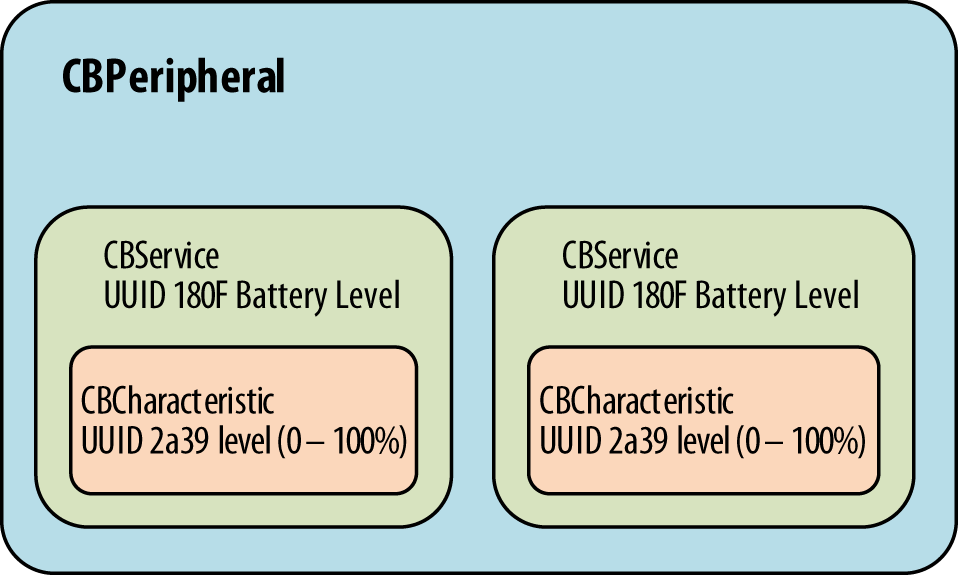
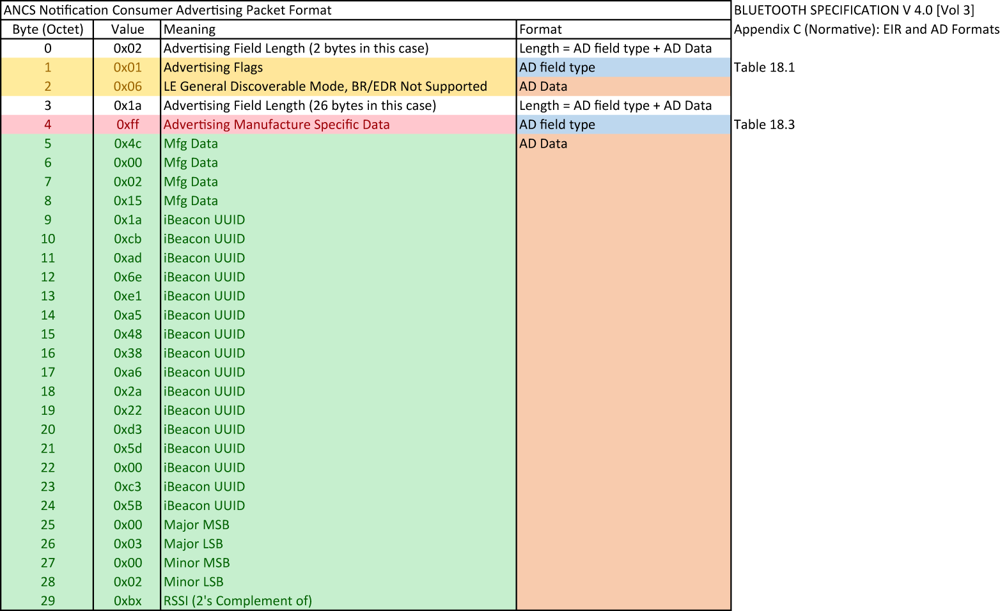
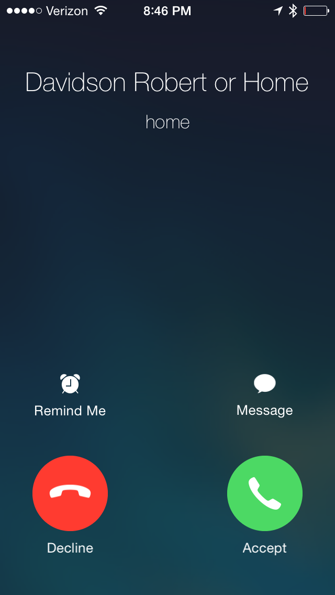
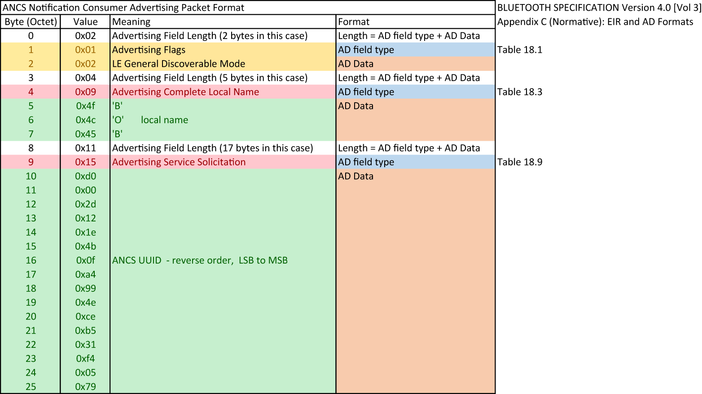
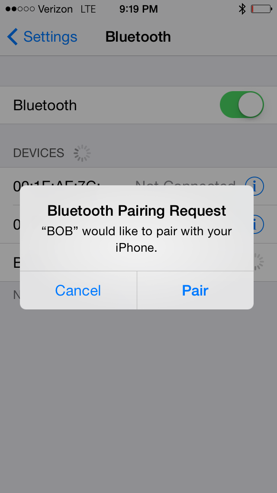
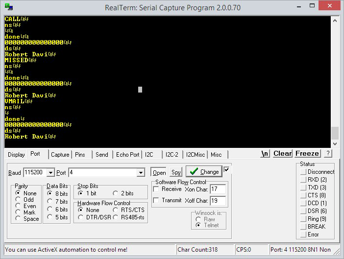

# 第九章 iOS 编程

Apple 是蓝牙 4.0 的早期支持者，因此有丰富的 API 和工具来支持使用 iOS 开发 BLE 设备和应用。相关的 iOS 设备通常是 iPhone（iPhone 4S 或更新版本），但 iOS 也在所有相对较新的 iPad（iPad 3 或更新版本，或任何 iPad mini）和第五代 iPod Touch 设备上支持 BLE。

BLE 也在较新一代的 Mac 上得到支持——包括 iMac（2012 年末之后制造）、MacBook Pro（2012 或更新版本）、MacBook Air（2011 或更新版本）和 Mac Pro（2013 或更新版本）——但本章将专注于 iOS，特别是 iOS 7 及更高版本。

与 iOS 编程最相关的 BLE 设备和应用类型主要分为三类：

*带有 iOS 应用的外围设备*

  在此类别中，BLE 外围设备和传感器与相应的 iOS 应用配对——例如，使用 iPhone 显示和记录数据的自行车功率和踏频计。

*iBeacon 设备*

  iBeacon 是仅广播的设备，使用 BLE 广播（见第二章[广播和扫描](./chapter2.md#广播和扫描)）在室内增强导航，在 GPS 信号和手机塔通常无法穿透的地方，为 iOS 设备（以及 Android 设备）提供位置服务。

*带有 Apple 通知中心服务的外围设备*

  内置于 iOS 的 Apple 通知中心在 iOS 设备屏幕上显示警报和通知，如来电显示和新闻服务更新。使用 Apple 通知中心服务（ANCS），iOS 设备可以使用 BLE 在辅助显示器（如支持 BLE 的手表）上显示通知。

为传感器开发应用主要涉及使用 Core Bluetooth 框架，而为 iBeacon 开发应用主要涉及 Core Location 框架（ANCS 不需要应用）。Core Bluetooth 框架（CoreBluetooth）是 iOS API（应用程序编程接口）中处理 BLE 功能和设备的部分。它的 CBCentralManager 和 CBPeripheral 类允许你使用第三章中描述的中心设备和外围设备。CBCentralManager 提供扫描、发现和连接到远程外围设备的资源，而 CBPeripheral 提供与远程外围设备相关的服务和特征工作的资源。

本章通过研究专注于 BLE 功能的代码示例，提供对这些框架的实际熟悉，特别是实现支持 BLE 的应用所需的关键类和方法。这些示例说明了可以构建完整 BLE 应用的基础。虽然示例不是完整和完善的应用，但它们在 iOS 设备上功能完整，了解它们的工作原理是为你自己的 iOS 编写支持 BLE 的应用的良好起点。

> 注意：所有示例的完整 Xcode 项目可在本书的 [GitHub 仓库](https://github.com/microbuilder/Getting-Started-with-Bluetooth-Low-Energy) 中获取。所有示例都需要 iOS 7 或更高版本以及 Xcode 5 或更高版本。

iOS 应用开发和 Xcode 开发环境的一般讨论本身就是一个广泛而复杂的主题，其中大部分超出了本章或本书的范围。如果你正在寻找更多信息，我们推荐 Matt Neuburg 编写的 Programming iOS 7 和 iOS 7 Programming Fundamentals（O'Reilly）。当然，最权威的来源是 Apple iOS Developer Library，从 Core Bluetooth Programming Guide 开始。本章的示例将密切遵循该指南中推荐的方法。

## 简单的电池电量外围设备

第一个示例将 iOS 中心设备编程为查找并连接到简单的远程外围设备。远程外围设备的角色由 Bluegiga BLE112 硬件模块扮演（有关此模块的更多信息，请参见第五章[Bluegiga 的 BLE112/BLE113 模块](./chapter5.md#bluegiga-的-ble112ble113-模块)）。iOS 设备将充当 GATT 客户端，外围设备充当 GATT 服务器（见第四章[角色](./chapter4.md#角色)）。

> 注意：此处使用的 Bluegiga BLE112 模块评估板可作为 BLE112 模块系列（部件号：DKBLE112）开发套件的一部分从许多在线供应商处获得。该套件包含许多预构建的传感器和输入，用于快速评估。或者，Jeff Rowberg 的 BLE112 Bluetooth Low Energy board 便宜得多。这是一个开源硬件解决方案，因此所有硬件设计详细信息都可从同一来源获得。

本例中充当 BLE 外围设备的 BLE112 模块使用板载 A/D 转换器读取通过调整小型电位器（图 9-1 左上角圆圈处）设置的电压，并将该值存储为 BLE"电池电量"特征（缩放为 0 到 100%），通过 BLE battery_level 服务。然后 iOS 应用必须读取存储在 BLE 外围设备上的"电池电量"并供应用使用。（有关服务和特征的更多信息，请参见第四章）。


*图 9-1. Bluegiga BLE112 开发面包板*

> 注意：我们使用术语电池电量而不是电位器，因为"电池电量"外围设备是 BLE 中预定义的服务和相关特征之一。虽然没有使用预定义配置文件的要求，但这样做对于本讨论很方便。

对于这个简单的应用，Core Bluetooth 框架中的关键类引用包括 CBCentralManager（iOS 设备上 BLE 中心管理器角色的抽象）和 CBPeripheral（iOS 设备上远程外围设备的抽象）。代码还包括支持类 CBService 和 CBCharacteristic，因为你需要通过发现来了解远程外围设备上有哪些服务和相关特征可用（见第四章[服务和特征发现](./chapter4.md#服务和特征发现)）。

图 9-2 显示了编程到 BLE 远程外围设备中的服务和特征与 CBPeripheral 对象之间的关系。



*图 9-2. CBPeripheral、CBServices 和 CBCharacteristic 对象的关系*

为方便起见，本示例中的代码包含 BLE 规范中的一些预定义服务和特征（例如电池服务），它们使用 16 位 UUID 而不是供应商特定的 128 位 UUID（见第四章[UUID](./chapter4.md#uuid)）。

> 注意：有关 SIG 指定的服务和特征的更多信息，蓝牙开发者门户提供了所有预定义服务和采纳特征的完整列表。

### 扫描远程外围设备

首先，你需要分配 CBCentralManager 的实例并启动 BLE 扫描（见第二章[广播和扫描](./chapter2.md#广播和扫描)）操作以查找电池电量服务：

```objc
// using the predefined BLE UUIDs for the battery level service
#define BATTERY_LEVEL_SERVICE_UUID 0x180f
#define BATTERY_DEVICE_INFO_SERVICE_UUID 0x180a

// build an array of services UUIDs of interest
NSArray *services = @[[CBUUID UUIDWithString:BATTERY_LEVEL_SERVICE_UUID],
               [CBUUID UUIDWithString:BATTERY_DEVICE_INFO_SERVICE_UUID]];

// instantiate and start Central Manager object
CBCentralManager *centralManager = [[CBCentralManager alloc]
                                    initWithDelegate:self queue:nil];

// scan for peripherals with services listed in services UUID array
[centralManager scanForPeripheralsWithServices:services options:nil];
self.centralManager = centralManager;
```

首先，你使用 Core Bluetooth 框架创建感兴趣的服务 UUID 列表（NSArray），在本例中命名为 services。你需要使用 UUIDWithString 方法将 UUID 字符串转换为对应于 UUID 的 CBUUID 对象。

CBUUID 还将预定义的 16 位服务和特征 UUID 转换为其完整的 128 位等效值（有关更多信息，请参见第四章[UUID](./chapter4.md#uuid)）。接下来，实例化 CBCentralManager 对象并将 UUID 对象列表作为其 scanForPeripheralsWithServices 方法的第一个参数提供。在这种情况下，应用仅扫描两个服务，设备信息服务（UUID16=0x180A）和电池电量服务（UUID16=0x180f）。只有在其广播数据中包含所需服务 UUID 的外围设备才会被返回为已找到（见表 3-3）。

> 注意：如果 scanForPeripheralsWithServices 方法的第一个参数给定 nil 而不是感兴趣的 CBUUID 列表（services），它将返回范围内所有 BLE 外围设备。这通常不是好的做法，除非你真的想探索所有可能的具有服务的外围设备，因为它会更频繁地使用 BLE 射频硬件，从而降低电池寿命。

### 连接到远程外围设备

当在扫描过程中发现感兴趣的外围设备时，centralManager 调用 didDiscoverPeripheral，这是你包含委托方法 connectPeripheral 的地方。此方法返回相关的外围设备对象实例，稍后可以使用 CBPeripheral 方法进行检查：

```objc
- (void)centralManager:(CBCentralManager *)central
 didDiscoverPeripheral:(CBPeripheral *)peripheral
     advertisementData:(NSDictionary *)advertisementData
                  RSSI:(NSNumber *)RSSI
{
    NSString *localName = [advertisementData objectForKey:
                           CBAdvertisementDataLocalNameKey];
    if ([localName length] > 0)
    {
        NSLog(@"Found the battery level monitor: %@", localName);
        // found peripheral so stop scanning
        [self.centralManager stopScan];
        // return peripheral object
        self.batteryLevelPeripheral = peripheral;
        peripheral.delegate = self;
        // connect peripheral to centralManager
        [self.centralManager connectPeripheral:peripheral options:nil];
    }
}
```

在找到感兴趣的外围设备后停止扫描（使用 [self.centralManager stopScan]）是好的做法，同样因为它节省电池电量。当然，如果你需要找到多个外围设备，请修改此示例中的逻辑。

### 查找与远程外围设备关联的服务

发现外围设备并实例化外围设备对象后，你需要创建相关的服务对象和相关特征：

```objc
- (void)centralManager:(CBCentralManager *)central
  didConnectPeripheral:(CBPeripheral *)peripheral
{
    // establish peripheral delegate
    [peripheral setDelegate:self];
    // discover available services
    [peripheral discoverServices:nil];
    // log results
    self.connected = [NSString stringWithFormat:@"Connected: %@",
      peripheral.state == CBPeripheralStateConnected ? @"YES" : @"NO"];
    NSLog(@"%@", self.connected);
}
```

在此代码中，建立连接后 centralManager 调用 didConnectPeripheral 并实例化它。为外围设备设置委托并记录在日志中。

### 查找与服务关联的特征

Core Bluetooth 通过调用 didDiscoverServices 为每个发现的服务创建 CBService 对象。以下代码发现特征（见第四章[服务和特征发现](./chapter4.md#服务和特征发现)）并使用 CBPeripheral 类的 discoverCharacteristics 方法将它们存储在 CBCharacteristic 对象数组中：

```objc
- (void)peripheral:(CBPeripheral *)peripheral
didDiscoverServices:(NSError *)error
{
    // sort through each service and discover characteristics
    // associated with each
    for (CBService *service in peripheral.services)
    {
        NSLog(@"Discovered service: %@", service.UUID);
        // discover characteristics associated with each service
        [peripheral discoverCharacteristics:nil forService:service];
    }
}
```

> 注意：如果你将 nil 作为参数传递给 [peripheral discoverServices:nil] 和 [peripheral discoverCharacteristics:nil forService:service] 要小心，因为 iOS 设备将尝试发现外围设备上的所有服务和所有特征。如果远程外围设备实现的服务和相关特征比你正在寻找的多得多，这可能会浪费电池电量和时间。在这种情况下这不是问题，因为我们只在外围设备端实现感兴趣的那些。但如果这在你特定的应用中可能是问题，请使用服务和特征列表。

一旦发现感兴趣的服务和相关特征，你需要读取特征的值并使其对应用可用。你可以使用 readValueForCharacteristic: 方法直接获取值，如果远程外围设备特征是静态的，这是一个好方法。

但是，如果特征随时间变化（如电池电量），你应该使用 BLE 通知功能，如第四章[服务器发起的更新](./chapter4.md#服务器发起的更新)中所述。对电池电量特征执行此操作时，应用仅在电池电量值变化时收到通知。这避免了定期轮询远程外围设备以查找变化，这会对中心 iOS 设备的电池寿命造成压力，因为它会产生不必要的射频流量。

你使用 setNotifyValue:forCharacteristic: 方法（如第四章[客户端特征配置描述符](./chapter4.md#客户端特征配置描述符)中所述，这会写入外围设备上的相应 CCCD）为远程外围设备上的特定特征启用 BLE 通知，如以下电池电量特征的代码所示（同样，因为制造数据是静态的，对其使用 readValueForCharacteristic: 是有意义的）：

```objc
- (void)peripheral:(CBPeripheral *)peripheral
didDiscoverCharacteristicsForService:(CBService *)service error:(NSError *)error
{
    // Retrieve Service for the Voltage Level
    if ([service.UUID isEqual:[CBUUID UUIDWithString:
                               BATTERY_LEVEL_SERVICE_UUID]])
    {
        for (CBCharacteristic *aChar in service.characteristics)
        {
            // Request level notifications
            if ([aChar.UUID isEqual:
                [CBUUID UUIDWithString:
                 BATTERY_LEVEL_MEASUREMENT_CHARACTERISTIC_UUID]])
            {
                [self.batteryPeripheral setNotifyValue:YES
                 forCharacteristic:aChar];
                NSLog(@"Found battery level measurement characteristic");
            }
        }
    }
    if ([service.UUID isEqual:
         [CBUUID UUIDWithString:BATTERY_LEVEL_DEVICE_INFO_SERVICE_UUID]])
    {
        for (CBCharacteristic *aChar in service.characteristics)
        {
            if ([aChar.UUID isEqual:
                [CBUUID UUIDWithString:
                 BATTERY_LEVEL_MANUFACTURER_NAME_CHARACTERISTIC_UUID]])
            {
                [self.batteryPeripheral readValueForCharacteristic:aChar];
                NSLog(@"Found a device manufacturer name characteristic");
            }
        }
    }
}
```

现在，每当外围设备发送通知时，都会调用 didUpdateValueForCharacteristic 方法，允许应用仅在电池电量特征值变化时读取它：

```objc
- (void)peripheral:(CBPeripheral *)peripheral
didUpdateValueForCharacteristic:(CBCharacteristic *)characteristic
                          error:(NSError *)error
{
    // Updated value for battery level measurement received
    if ([characteristic.UUID isEqual:[CBUUID
         UUIDWithString:BATTERY_LEVEL_MEASUREMENT_CHARACTERISTIC_UUID]])
    {
        // Get the battery level
        [self getBatteryLevelData:characteristic error:error];
    }
}
```

到目前为止，代码已创建了与远程外围设备关联的服务和特征对象。下一部分使用这些对象为应用的其余部分提供数据。

### 读取和解码特征的方法

下一部分代码从特征对象中检索通知的电池电量值，以供应用的其他部分使用：

```objc
- (void) getBatteryLevelData:(CBCharacteristic *)characteristic
                             error:(NSError *)error
{
    // Get the Battery Level
    NSData *data = [characteristic value];
    const uint8_t *reportData = [data bytes];
    uint16_t level = 0;
    if ((reportData[0] & 0x01) == 0)
    {
        // Retrieve the level value for the Battery
        level = reportData[1];
    }
    else
    {
        level = CFSwapInt16LittleToHost(*(uint16_t *)(&reportData[1]));
    }
    // Display the battery level value to the UI if no error occurred
    if ((characteristic.value) || !error)
    {
        self.batteryLevel = level;
        self.batteryLevel.text = [NSString stringWithFormat:@"%i %%",
                                  batteryLevel];
    }
    return;
}
```

此代码检索制造数据以供应用使用：

```objc
- (void) getManufacturerName:(CBCharacteristic *)characteristic
{
    NSString *manufacturerName = [[NSString alloc]
                                   initWithData:characteristic.value
                                                encoding:NSUTF8StringEncoding];
    self.manufacturer = [NSString stringWithFormat:@"Manufacturer: %@",
                         manufacturerName];
    return;
}
```

此时，iOS API 已使远程外围设备 A/D 转换器测量的电池电平电压能够通过 BLE 传输到 iOS 设备，使其可用于显示为图形、呈现为文本或存储在数据库中。

## iBeacon

iBeacon 应用使用 iOS 的 Core Location 框架功能，在室内为 iOS 和 Android 设备提供导航和基于位置的功能，在室内访问手机塔信号和 GPS 可能无法正常工作或根本无法工作。

iBeacon 模型提供了连接设备和基于位置通信的各种新可能性，包括零售环境中的有趣变体。例如，基于许可的营销将允许零售商根据客户在商店中的位置向客户（手机上有相应应用的客户）推送特价优惠和其他信息。在博物馆中，iBeacon 可以提供自助导览，向游客提供有关附近展品的详细信息（以文本、音频或视频演示的形式）。

实现 iBeacon 功能的设备广播（见第三章[广播和观察](./chapter3.md#广播和观察)）包含以下四个值的 BLE 广播数据包：

*Proximity UUID*

  128 位值，唯一标识一个或多个信标为特定类型或来自特定组织。

*Major value*

  可选的 16 位无符号整数，可以对具有相同 proximity UUID 的相关信标进行分组。

*Minor value*

  可选的 16 位无符号整数，用于区分具有相同 proximity UUID 和 major value 的信标。

*RSSI value*

  编程到信标中，便于根据信号强度确定与信标的距离。

在博物馆示例中，proximity UUID 将与一个特定博物馆关联，major 和 minor 数字可用于对博物馆内的多个信标进行分组或区分。在这种情况下，major value 可能指定博物馆中的一个房间，而 minor number 可能与该房间中的特定展品关联。

如果以这种方式安装多个信标，每个信标与特定房间和展品关联，接收设备上运行的 iOS 应用执行的范围测定（见[范围测定](#范围测定)）可以区分它们，估计到每个信标的距离，并确定接收设备的位置。iBeacon 应用使用此信息的一种可能方式是传递与持有接收 iOS 设备的人最近的展品相关的信息。

### 广播

通常，信标仅广播，不提供其他服务或可连接性（因为 BLE 设备一旦建立连接就停止广播）。图 9-3 中显示的广播数据包格式遵循标准的 BLE 广播数据包格式，并使用制造商特定数据 AD 类型（见第三章[广播数据格式](./chapter3.md#广播数据格式)）。



*图 9-3. iBeacon 使用的广播数据包格式*

典型的 iBeacon 是由纽扣电池供电的简单 BLE 硬件（例如 BLE112 模块）。也可以使用 Core Bluetooth 框架将 iOS 设备编程为执行 iBeacon 广播服务。这对于测试很有用，但不太实用，因为 iBeacon 应用必须始终在前台。

如果你确实想将 iOS 设备变成 iBeacon 发射器，你可以使用 Radius Networks 的 Locate for iBeacon 应用。Radius Networks 的另一个有用应用是适用于 OS X 的 MacBeacon，它允许你的 Mac 充当 iBeacon，节省你的 iOS 设备用于测试你的 iBeacon 应用。

### 范围测定

范围测定是运行在接收设备（如 iPhone）上的 iBeacon 应用使用来自附近信标的接收无线电信号强度来估计接收设备和信标之间距离的过程。信号强度以 RSSI（接收信号强度指示）测量，这是运行在 iOS 设备上的 BLE 应用发现的每个外围设备可用的 dBm 数字。特别是，运行 iBeacon 应用的 iOS 设备范围内的每个信标都会跟踪 RSSI。

来自特定信标的测量 RSSI 会随着 iPhone 在房间内移动而变化。通常，随着 iPhone 和 iBeacon 之间距离的增加，RSSI 会变小。

信标还在广播数据包中广播 RSSI 值。此情况下 RSSI 数字的值是固定的，并在制造期间编程到信标中。RSSI 是通过在固定距离一米处测量信标的信号强度来确定的，通常使用运行专用软件的 iPhone。例如，Radius Networks 的 Locate for iBeacon 应用可用于此目的。

RSSI 值实际上存储为表示 dBm 单位的有符号八位整数在广播数据包中，但你不需要知道这一点或处理 RSSI 是对数刻度并（通常）随与信标距离的平方反比变化，因为这些细节由 iOS 处理。此校准的主要目的是处理信标之间信号输出的变化，由于射频芯片的构造和性能的个体差异。

iBeacon 应用将测量的 RSSI 与信标在广播数据包中广播的一米距离的预期 RSSI 值进行比较，以估计信标和 iOS 设备之间的距离。如果所有信标都经过校准，此方法可以相当好地估计到信标的距离（通常在一米以内）。

Core Location 服务提供使用 iBeacon 进行范围测定的类和方法，如以下示例所示。你将需要使用 CLBeaconRegion 类的实例和相关方法。使用校准的信标和 CLBeaconRegion，你只需考虑以米为单位的实际距离和信标区域（围绕特定 iBeacon 的圆形区域，半径由你设置）。

例如，你可以让 iBeacon 应用触发相对于 iBeacon 区域的某些操作，例如当你进入或离开距离特定信标所需半径的特定区域时告诉你的警报。还提供方法告诉应用哪个 iBeacon 最近，同样基于范围测定值。

### 实现 iBeacon 应用

要实现以下 iBeacon 应用，你只需要 Core Location 框架，其中应用的关键类引用包括 CLLocationManager、CLBeaconRegion 和 CLBeacon。不直接使用 Core Bluetooth 框架的任何部分。此 iPhone 应用检测附近信标的存在并确定哪个最近。

为了测试应用，我们编程了几个 BLE112 模块（如图 9-4 所示），由 CR2032 纽扣电池供电，便于放置。


*图 9-4. 编程为 iBeacon 并由 CR2032 纽扣电池供电的 BLE112 模块*

> 注意：为了测试，Bluegiga BLE112 模块生成并传输所需的 iBeacon 广播数据包。iPhone 应用和 BLE112 模块测试程序的完整代码都在本书的 GitHub 仓库中提供。

首先，你需要创建并注册信标区域：

```objc
@implementation BobsBeaconTracker
- (instancetype)init
{
    self = [super init];
    if (self == nil) return nil;
    self.locationManager = [[CLLocationManager alloc] init];
    self.locationManager.delegate = self;
    self.beaconRegion = [[CLBeaconRegion alloc]
    initWithProximityUUID: [[NSUUID alloc]
                            initWithUUIDString:
                             @"E2C56DB5-DFFB-48D2-B060-D0F5A71096E0"]
                            identifier: @"Bobs Beacon default region"];
    self.beaconRegion.notifyEntryStateOnDisplay = YES;
    [self.locationManager startMonitoringForRegion:self.beaconRegion];
    return self;
}
```

由于每个 iBeacon 应用必须使用通过前面的 initWithProximityUUID 过程硬编码到应用中的特定 proximity UUID，它只会响应该 UUID 的信标（下载应用时在 iOS 中注册的 UUID）。这意味着用户有控制权，因为他们必须下载应用才能使用它（尽管安装后，即使应用未打开或运行，应用仍可接收警报）。如果没有明确下载应用，他们不会被具有不同 proximity UUID 的其他信标的不需要的 iBeacon 警报和通知轰炸。

从 iOS 7.1 开始，操作系统本身在应用安装时注册与应用配合使用的信标区域。然后，即使应用暂停或未运行，系统也会唤醒 iOS 应用以处理进入或退出信标区域，通常在约 10 秒内。

在接下来的代码部分中，CLBeacon 类提供方法和对象来启动和停止监控特定 iBeacon，以及确定哪个信标离 iOS 设备最近的方法：

```objc
// start ranging beacons
- (void)locationManager:(CLLocationManager *)manager
         didEnterRegion:(CLRegion *)region
{
    if (![region.identifier isEqualToString:self.beaconRegion.identifier])
    return;
    [self.locationManager startRangingBeaconsInRegion:self.beaconRegion];
    NSLog(@"entered region");
}

// stop ranging beacons
- (void)locationManager:(CLLocationManager *)manager
          didExitRegion:(CLRegion *)region
{
    if (![region.identifier isEqualToString:self.beaconRegion.identifier])
    return;
    [self.locationManager stopRangingBeaconsInRegion:self.beaconRegion];
    NSLog(@"exited region");
}

// determine closest beacon
- (void)locationManager:(CLLocationManager *)manager
         didRangeBeacons:(NSArray *)beacons
                inRegion:(CLBeaconRegion *)region
{
    __block CLBeacon *closestBeacon;
    if (beacons.count < 1) {
        closestBeacon = nil;
    }
    else
    {
        NSLog(@"locationManager didRangeBeacons: %@", beacons);
        [beacons enumerateObjectsUsingBlock:^(CLBeacon *beacon, NSUInteger idx,
                                              BOOL *stop)
        {
            if ((closestBeacon == nil) || (beacon.rssi > closestBeacon.rssi))
            {
                closestBeacon = beacon;
            }
            NSLog(@"closest beacon: %@", closestBeacon);
        }];
    }
    if (![self beacon:self.closestBeacon isSameAsBeacon:closestBeacon]) {
        self.closestBeacon = closestBeacon;
        [[NSNotificationCenter defaultCenter]
          postNotificationName:BobsBeaconTracker_ClosestBeaconChanged
          object:self];
    }
}

// compare beacons
- (BOOL)beacon:(CLBeacon *)beacon isSameAsBeacon:(CLBeacon *)otherBeacon
{
    return ([beacon.proximityUUID isEqual:otherBeacon.proximityUUID] &&
            (beacon.major == otherBeacon.major) &&
            (beacon.minor == otherBeacon.minor));
}
```

如果此代码嵌入在博物馆应用中，应用现在可以确定最近的信标，然后采取适当的操作（例如，提供进一步解释展品的多媒体内容）。

> 注意：Android 设备也可以使用 iBeacon 或一般的 BLE 信标。如果你有兴趣在 Android 上使用 iBeacon，请参阅 Radius Networks Android API 库以与 iBeacon 交互。

## 带有外部显示器的 Apple 通知中心服务

iOS 中的 Apple 通知中心服务（ANCS）功能是显示为活动屏幕顶部（或代替整个活动屏幕）的横幅消息的通知来源，用于及时警报（例如，当你收到短信、未接来电或各种其他应用时）。例如，当你接到来电时，ANCS 会暂时用图 9-5 中显示的屏幕替换活动屏幕。



*图 9-5. iPhone 上的电话通知*

引入 iOS 7 时，Apple 包含了 ANCS 的 BLE 接口，以将类似的警报路由到 BLE 连接的配件——例如，支持 BLE 的手表。

> 注意：在 ANCS 上下文中，iOS 设备始终充当 GATT 服务器，显示通知的设备充当 GATT 客户端。

> 注意：为了效率，描述 ANCS 如何工作需要一些术语。为了本讨论的目的，我们将发送 ANCS 通知的 iOS 设备称为通知提供者（NP），等待接收通知的配件（例如支持 BLE 的手表）称为通知消费者（NC）。

> 注意：显示在 iOS 设备上的通知也称为 iOS 通知，而通过 BLE GATT 特征发送的通知称为 GATT 通知。

使用 ANCS 不需要在 iPhone 上编程应用。相反，配件通过广播数据包广播其接收通知的请求，其中包括 ANCS 的服务 UUID（7905F431-B5CE-4E99-A40F-4B1E122D00D0）。图 9-6 显示了数据包的结构。



*图 9-6. NC 使用的广播数据包格式*

当 NP iOS 设备扫描来自 NC 的带有 ANCS UUID 的广播数据包时，它会连接到 NC 配件设备。现在，发生了一个奇怪的角色反转（至少在我们通常认为中心和外围之间数据流的方式中）。NC（外围设备）成为 GATT 客户端，订阅 NP（ANCS 服务）上的服务，并从 NP（中心）iOS 设备接收通知和数据。这完全正常，因为如第四章[角色](./chapter4.md#角色)中所述，GAP 和 GATT 角色彼此独立。

在 NP（iOS 中心设备）上，Apple 通知中心服务 UUID 是 7905F431-B5CE-4E99-A40F-4B1E122D00D0，具有以下相关特征/UUID：

*Notification Source*

  UUID 9FBF120D-6301-42D9-8C58-25E699A21DBD（可通知）

*Control Point*

  UUID 69D1D8F3-45E1-49A8-9821-9BBDFDAAD9D9（可写入带响应）

*Data Source*

  UUID 22EAC6E9-24D6-4BB5-BE44-B36ACE7C7BFB（可通知）

Notification Source 是必需的特征，而其他是可选的。通常，配件（NC）将订阅 GATT 服务的 Service Changed 特征，以自动从 Notification Source 接收 ANCS 的更改通知。收到来自 ANCS 的新 GATT 通知后，NC 可以请求更多信息。要了解更多信息，NC 向 Control Point 发送（写入）消息，包括感兴趣的通知 ID 和 NC 希望接收的相关属性列表。然后这些作为来自 Data Source 的响应提供。

NC（外围设备）固件必须执行以下步骤：

1. 开始广播（通常每秒一次），在广播数据包中包含 ANCS UUID 以提醒范围内的任何 NP。
2. 当 NP（iOS 设备）连接时，配对（如果尚未绑定）或启用与 NC 设备的加密。
3. 枚举 iOS ANCS 服务。
4. 为通知源设置客户端。
5. 收到通知时，如果需要更多信息，向 ANCS Control Point 写入消息。
6. 从 Data Source 接收响应（包含通知 ID 和数据）。

NC（在本例中本地名称为 BOB）与 iOS 设备的配对很简单。NC（远程外围设备）开始广播后，你必须在 NP（中心）iPhone 上打开设置→蓝牙以触发 BLE 设备扫描，然后手动配对设备（如图 9-7 所示）。不需要 PIN。



*图 9-7. 将 NP（中心）与 NC（远程外围设备）配对*

图 9-8 显示了在连接到 NC（外围设备）的终端仿真屏幕上收到的通知。在这种情况下，NP（iPhone 5）发送了三个通知：来电、未接来电和新语音邮件消息。

第一行 CALL（通知类型），后跟 ns 行，表示 NC 接收并写入 NC UART 以在终端仿真器上显示的通知字符串。字符串 done 表示通知的连接已完成。然后软件扫描与通知一起发送的数据。

接下来的数据是 UID（全零）和带有呼叫者姓名（来电显示）的文本字符串：Davidson Ro。下一行 MISSED 是第二个通知事件（未接来电）的开始。第三个通知（新语音邮件消息）以 VMAIL 行开始。



*图 9-8. 终端仿真器屏幕上显示的电话通知*
